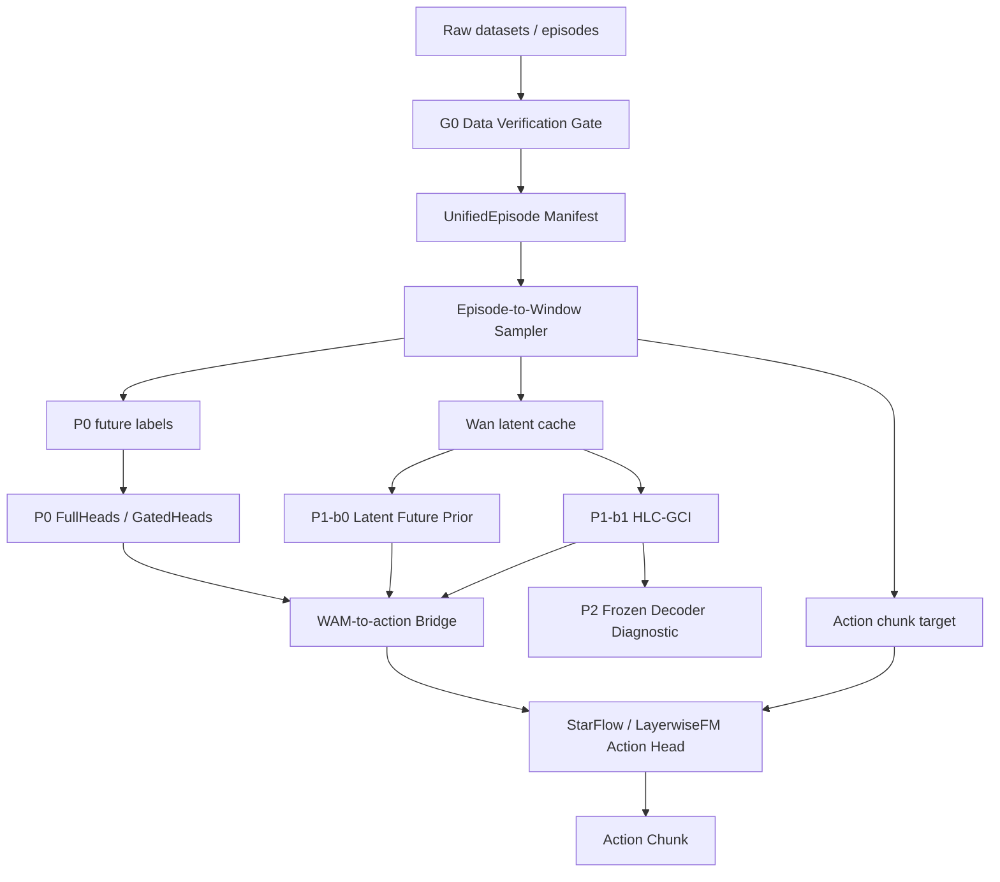

# 《MoWA：面向移动操作的 World Action Model 构建与评测研究》详细设计文档 v1.4-mowa-naming

> 文档类型：工程详细设计说明书（交付版）  
> 项目名称：面向移动操作的 World Action Model 构建与评测研究  
> 项目简称：**MoWA（Mobile World Action Model，面向移动操作的世界动作模型）**  
> 关联项目：《基于 Vision-Language Model 与 Flow Matching 的语言条件机器人操作策略研究》（以下简称“VLA 策略项目”）  
> 继承来源：《面向移动操作的 WAM 技术调研报告 v2.11（Rec-HLC 与 Episode 采样增强版）》与《面向移动操作的 WAM 详细设计文档 Prompt 体系 v1.10（分发执行加固版）》  
> 参考代码仓：`https://github.com/wxwy/starVLA.git`，分支 `merge-official-starvla-dev`  
> 文档基线：严格继承调研报告 v2.11 与 Prompt 体系 v1.10；在 v1.3-delivery 基础上冻结 MoWA 项目短名与工程命名口径；不重新设计主路线  
> 资源约束：单人三个月，最高 8×A100 80G  
> 实验预算：E-001 至 E-020 预分配；计入预算的算法训练实验 ≤20；不得出现 E-021  
> 交付日期：2026-06-29

---

# 交付摘要页：执行摘要 + 实验矩阵速查表

## A. 执行摘要

本项目简称 **MoWA（Mobile World Action Model）**，面向 long-horizon household mobile manipulation 场景，构建可与动作策略耦合的 **World Action Model（WAM）**。MoWA 目标不是替代 VLA 策略项目，也不是训练通用视频生成模型，而是学习能够被下游策略、诊断流程和评测体系消费的 **action-relevant future representation**。项目在 VLA 策略项目既有 StarVLA / QwenPI_v3 / LayerwiseFM 工程基础上，验证未来表征是否能提升任务推进、可操作性判断、失败风险识别、视角选择、子目标可达性以及 action-side coupling。

技术路线采用严格递进的四阶段设计：**G0 Data Verification Gate → P0 Video-Generation-Free WAM → P1-b0 Latent-Only future prior → P1-b1 HLC-GCI robot-history-conditioned latent WAM → P2 Render-and-Decode diagnostic**。其中，G0 只作为工程门禁，不计入算法实验；P0 用冻结的 future heads 建立低成本闭环；P1-b0 验证 latent-only future prior 是否值得进入；P1-b1 通过 History Latent Compressor + Gated Condition Injection（HLC-GCI）把 visual history latent、text condition tokens 与 robot history latent 压缩并注入 Wan DiT condition path；P2 只对 P1 predicted clean future latent 做 frozen decoder 诊断，不作为主训练闭环。

MoWA 的项目边界保持收敛：不重复训练完整 VLA baseline，不做上层 planner/FSM/RL/Scene Graph，不做 continuous video generation，不把 action head 内部重写作为默认主变量，不输入 future action label 到 WAM。所有未实测的 fps、Hz、window、batch、显存、训练时长与阈值均按 `target` / `TBD` / `Data Gate` 标注，禁止伪造 measured 数字。

最低成功口径是：G0 能筛出可用数据域；P0 能跑通并产生可解释 WAM-specific 指标；P0 或 P1 至少一个阶段能证明 WAM-to-action coupling 对 downstream / handoff / substage 有正向或可解释影响；所有失败路径均有诊断报告和降级方案。推荐成功口径是：P1-b1-HLC-GCI 相比 P1-b0 在 downstream / coupling 指标上有可量化收益，且 E-005 shuffled-robot sanity 能证明 robot history latent 的真实贡献。

## B. 实验矩阵速查表

| 编号 | 类型 | 阶段 | 实验 / 门禁 | 是否训练 | 是否计入≤20 | 决策作用 |
|---|---|---|---|---|---|---|
| G0 | Gate | 前置 | Data Verification Gate | 否 | 否 | 决定哪些数据域可进入 P0/P1/P2；失败则降级数据域或阻断训练 |
| E-001 | R1 | P0 | P0-FullHeads vs VLA baseline | 是 | 是 | 验证 Video-Generation-Free WAM 是否具备 action-relevant future supervision 收益 |
| E-002 | O4 | P0 | P0-GatedHeads vs P0-FullHeads | 是 | 是 | 验证 learnable gates 是否能替代 per-head sweep，作为 P0 可选增强 |
| E-003 | R2 | P1-b0 | P1-b0 latent future prior vs P0 | 是 | 是 | 判断 latent-only future prior 是否值得进入 P1-b1 |
| E-004 | R3/O1 | P1-b1 | P1-b1-HLC-GCI vs P1-b0 | 是 | 是 | 验证 history latent 压缩与 gated injection 是否带来额外收益 |
| E-005 | R3 sanity | P1-b1 | P1-b1 shuffled-robot sanity | 是 | 是 | 证明 robot history latent 的真实贡献，排查泄漏或无效 projector |
| E-006 | O2 | P0/P1 | WAM-to-action coupling | 是 | 是 | 验证 WAM features 是否真正进入 action path；失败则降级为诊断信号 |
| E-007 | O3 | Data mix | proxy learned α vs uniform α | 是 | 是 | 小规模 P0 proxy 学数据域权重 α，正式 P0/P1 固定使用 |
| E-008 | D1 | P2 | P2 frozen decoder diagnostic | 否 | 否 | 解释 P1 predicted latent 与失败模式；不作为性能收益来源 |
| E-009 | Conditional | P1-b2 | Rec-HLC conditional enhancement | 是 | 触发时计入 | 仅当 short-window HLC 覆盖不足时验证固定长度 recurrent memory |
| E-010 | Eval | P0/P1 | multi-benchmark eval tracking | 否 | 否 | 同一 checkpoint 的跨域评测追踪，不新增训练实验 |
| E-011–E-020 | Reserve | — | UNALLOCATED | — | — | 预留槽位；新增训练实验必须占用预留槽位，不得新增 E-021 |

## C. 多角色速读建议

| 角色 | 首读章节 | 重点问题 | 直接产出 |
|---|---|---|---|
| 技术负责人 / 评审专家 | 摘要页、第1章、第3章、第8章、第12章、第15章 | 路线是否收敛、实验是否足够、失败能否降级 | Go/No-Go 判断、评审意见 |
| 数据工程师 | 第4章、附录B、附录F | 数据是否可下载、字段是否齐全、是否能构造 WindowSample 与 P0/P1 targets | DataGateReport、schema adapter、latent cache |
| 算法工程师 | 第5章、第6章、第8章、第10章 | P0/P1-b0/P1-b1 的输入输出、loss、bridge 和消融是否清楚 | 模型实现、训练配置、实验记录 |
| 训练 / 平台工程师 | 第9章、第11章、附录A | 资源、checkpoint、profile、恢复和日志是否可执行 | 训练脚本、checkpoint manifest、profile report |
| 评测工程师 | 第8章、第10章、附录C、附录D | WAM-specific、downstream、coupling、cost 指标是否可复现 | eval scripts、metric report、coupling analysis |
| 项目管理 / 交付负责人 | 第12章、第13章、第14章 | 里程碑、风险、TBD、交付物是否可追踪 | 周计划、风险表、交付验收清单 |


## 第 0 章 文档信息、版本记录与阅读说明

### 0.1 文档定位

本文件是面向研发执行、技术评审、工程实现与阶段验收的详细设计说明书，用于将调研报告 v2.11 与 Prompt 体系 v1.10 中已经冻结的路线转化为可执行、可审计、可交付的工程方案。本文档重点说明本项目如何落到数据、模型、训练、评测、工程模块、风险降级和三个月执行计划上；不重新讨论路线必要性，不新增主路线，也不把任何未冻结数据集、benchmark 或模型结构写成默认结论。

本项目的研究对象是 action-relevant future representation：模型显式学习与未来任务推进、可操作性、失败风险、视角、子目标和动作结果相关的未来表征，并使该表征能够被下游动作策略、诊断流程或评测体系消费。本项目不属于普通 VLA action head 优化，也不等同于通用视频生成模型。

### 0.2 代码核对锚点

本设计基于 `merge-official-starvla-dev` 分支进行接口级核对，核对结论只作为工程接入边界，不把未经实测的配置、显存、batch 或 shape 写成 measured。

| 类别 | 仓库文件 / 模块 | 核对结论 | 本文使用方式 |
|---|---|---|---|
| StarVLA 总体框架 | README.md | StarVLA 采用 top-down separation、高内聚低耦合和 plug-and-play 设计；WM4A 已集成 | 本项目应以隔离 WAM 模块方式接入，而非复制或重写框架 |
| WM4A | docs/WM4A.md | WM4A 将 pretrained video-generation world model 作为视觉编码器，提供 Cosmos/Wan + OFT/GR00T/PI action head 组合 | P1-b0/P1-b1 可复用 WanPI/WM4A 的 DiT hidden-state hook、VAE/T5/DiT 组织方式作为工程参考 |
| VLA 策略项目设计 | docs_zh/starflow_vla/DESIGN.md | StarFlow-VLA 路线基于 Qwen3-VL + StarVLA + Flow Matching，强调 StarVLA-native 最小接入 | 本项目 action-side 默认对齐 VLA 策略项目，不重写 action head 主干 |
| QwenPI_v3 | starVLA/model/framework/VLM4A/QwenPI_v3.py | QwenPI_v3 提供 Qwen2.5/Qwen3-VL、layer-wise hidden states、project_layers、state-to-instruction 与 LayerwiseFM 调用接口 | P0 / action bridge 复用其 layerwise feature 组织与 action_model 调用模式 |
| LayerwiseFM | starVLA/model/modules/action_model/LayerwiseFM_ActionHeader.py | LayerwiseFM 是纯 action head consumer，包含 state_encoder、action_encoder、future_tokens、layerwise cross-attention 和 Euler predict_action | WAM features 通过 bridge 映射为 action head 可消费的 layerwise condition features；不改内部层作为默认主变量 |

### 0.3 版本记录

| 版本 | 日期 | 说明 | 状态 |
|---|---|---|---|
| v1.1-strict | 2026-06-29 | 严格按调研报告 v2.11 与 Prompt v1.10 重新生成；修正 G0 不占 E 槽位；预锁定 E-001 至 E-020；补全 15 章 + 附录 A-F；强化 StarVLA / QwenPI_v3 / LayerwiseFM 接口边界 | 历史版本 |
| v1.2-multirole | 2026-06-29 | 在 v1.1-strict 基础上吸收多角色阅读路径、章节角色标注、TBD/风险/接口治理、交付物分工、评审检查点；保持 Source-of-Truth、E-001 至 E-020、G0 口径和主路线不变 | 历史版本 |
| v1.3-delivery | 2026-06-29 | 完成交付版文字润色；新增“执行摘要 + 实验矩阵速查表”；统一文档口吻为正式交付说明书；保留 v1.2 的多角色协同增强和 v1.1 的实验编号口径 | 历史版本 |
| v1.4-mowa-naming | 2026-06-29 | 冻结项目短名 MoWA（Mobile World Action Model）；新增工程命名口径、代码目录/类名/配置/实验前缀规范，确保 Codex/Claude 实现阶段不发生命名漂移 | 本版 |

### 0.4 章节结构冻结

| 章节 | 标题 | 类型 | 核心输出 |
|---|---|---|---|
| 第1章 | 项目目标、范围、术语与边界 | 正文 | 接口 / 风险 / 实验 / 待确认项 |
| 第2章 | 从技术调研到详细设计的输入继承 | 正文 | 接口 / 风险 / 实验 / 待确认项 |
| 第3章 | 总体技术路线、章节依赖与系统架构 | 正文 | 接口 / 风险 / 实验 / 待确认项 |
| 第4章 | 数据体系与 Data Verification Gate 设计 | 正文 | 接口 / 风险 / 实验 / 待确认项 |
| 第5章 | P0：Video-Generation-Free WAM 详细设计 | 正文 | 接口 / 风险 / 实验 / 待确认项 |
| 第6章 | P1：Latent-Only WAM 详细设计 | 正文 | 接口 / 风险 / 实验 / 待确认项 |
| 第7章 | P2：Render-and-Decode WAM 详细设计 | 正文 | 接口 / 风险 / 实验 / 待确认项 |
| 第8章 | 路线演化验证、优化项验证与实验 Registry | 正文 | 接口 / 风险 / 实验 / 待确认项 |
| 第9章 | 训练流程、资源配置与 checkpoint 策略 | 正文 | 接口 / 风险 / 实验 / 待确认项 |
| 第10章 | 评测指标、耦合分析与消融设计 | 正文 | 接口 / 风险 / 实验 / 待确认项 |
| 第11章 | 工程实现、模块划分与代码接入边界 | 正文 | 接口 / 风险 / 实验 / 待确认项 |
| 第12章 | 风险控制、降级路径与验收标准 | 正文 | 接口 / 风险 / 实验 / 待确认项 |
| 第13章 | 三个月执行计划与交付物 | 正文 | 接口 / 风险 / 实验 / 待确认项 |
| 第14章 | 详细设计待确认项清单 | 正文 | 接口 / 风险 / 实验 / 待确认项 |
| 第15章 | 结论与路线收敛 | 正文 | 接口 / 风险 / 实验 / 待确认项 |
| 附录 A | 配置文件建议 | 模板 | YAML 草案 |
| 附录 B | 数据 schema 草案 | 模板 | UnifiedEpisode / WindowSample / Targets |
| 附录 C | 指标定义草案 | 模板 | Metric Registry |
| 附录 D | 实验 Registry 总表 | 追踪 | E-001 至 E-020 |
| 附录 E | Traceability Matrix | 追踪 | 调研结论到设计和实验 |
| 附录 F | 跨章节接口契约 | 追踪 | JSON-like interface schema |


### 0.5 多角色阅读路径与责任矩阵

本文件同时服务于研究负责人、算法工程师、数据工程师、训练/系统工程师、评测工程师、代码执行 Agent、项目管理与技术评审。不同角色不需要线性通读全文，但必须遵守第 1 章 Source-of-Truth 与第 8 章实验 Registry。

| 角色 | 主要阅读章节 | 必须关注的决策点 | 主要交付物 |
|---|---|---|---|
| 技术负责人 / PI | 第1、2、3、8、12、13、15章，附录E | 主路线是否收敛、实验数是否≤20、失败后是否有降级路径 | 路线评审结论、Go/No-Go 决策、最终验收意见 |
| 算法 / 模型工程师 | 第3、5、6、7、8、10、11章，附录A/F | P0 heads、P1-b0 latent prior、P1-b1 HLC-GCI、WAM-to-action bridge 是否定义清楚 | 模型模块、训练配置、shape/profile、ablation report |
| 数据工程师 | 第4、5、6、9、14章，附录B | 数据是否通过 G0、episode-to-window 是否无泄漏、P0/P1 监督信号是否可构造 | DataGateReport、UnifiedEpisode/WindowSample、latent cache |
| 训练 / 系统工程师 | 第8、9、11、12、13章，附录A/D | checkpoint、显存、batch、吞吐、恢复策略是否可执行 | 训练脚本、checkpoint manifest、profile report、恢复记录 |
| 评测工程师 | 第8、10、12、13章，附录C/D/E | WAM-specific、downstream、coupling、cost 四类指标是否可复现 | Eval report、coupling analysis、failure case report |
| 代码执行 Agent / Codex / Claude | 第0、1、4、6、8、11、14章，附录A/B/F | 只能实现已冻结接口，不得新增实验编号或改写 Source-of-Truth | patch manifest、unit tests、implementation log |
| 项目管理 / 技术评审 | 第0、1、8、12、13、14、15章 | 里程碑、风险、待确认项、交付物是否可追踪 | 周报、评审记录、TBD/Risk closure report |
| 论文 / 汇报撰写者 | 第2、3、8、10、12、15章，附录E | 哪些结果可作为贡献，哪些只是诊断或失败分析 | 摘要、方法图、实验表、限制与未来工作 |

#### 0.5.1 阅读顺序建议

- 想判断“路线是否正确”：读第1章、第2章、第3章、第8章、第15章。
- 想开始写代码：读第4章、第5章、第6章、第11章、附录A/B/F。
- 想开始跑实验：读第8章、第9章、第10章、第12章、第13章。
- 想做项目管理或评审：读第0章、第8章、第12章、第13章、第14章。
- 想写论文/汇报：读第2章、第3章、第8章、第10章、第15章，并引用附录E。

#### 0.5.2 多角色协作原则

1. 数据工程师对 G0 负责；G0 未通过时，算法工程师不得启动 P0/P1 主训练。
2. 算法工程师对 P0/P1 模型实现负责，但不得修改实验编号、阶段命名或 Source-of-Truth。
3. 训练工程师对 checkpoint、profile、恢复和资源记录负责，不得把 target/TBD 数值写成 measured。
4. 评测工程师对四类指标可复现负责；若 WAM-specific 提升但 downstream/coupling 不提升，必须触发诊断或降级。
5. 项目负责人对 Go/No-Go 决策负责；任何新增训练实验必须占用 E-011 至 E-020 预留槽位，且不得出现 E-021。


### 0.6 MoWA 工程命名口径

为避免后续代码实现、配置、日志、实验记录和汇报材料在名称上发散，本项目自 v1.4 起冻结统一短名：**MoWA（Mobile World Action Model）**。MoWA 是方法/系统短名，不替代正式项目标题；正式标题仍为“面向移动操作的 World Action Model 构建与评测研究”。

| 场景 | 统一写法 | 禁止或不推荐写法 |
|---|---|---|
| 项目短名 | `MoWA` | `StarWAM`、`MobileWAM`、`WAMo`、`WAM-Project2` |
| 英文全称 | `Mobile World Action Model` | `Mobile World Model`、`Action World Model` |
| 中文全称 | 面向移动操作的世界动作模型 | 项目二、移动 WAM 项目 |
| Python namespace | `mowa` | `wam_project2`、`starwam` |
| 文档目录 | `docs_zh/mowa/` | 新增临时目录名；若历史已有 `docs_zh/wam/`，仅作为兼容别名 |
| 配置目录 | `configs/mowa/` | `configs/wam_project2/` |
| 测试目录 | `tests/mowa/` | `tests/project2/` |
| 工具脚本目录 | `tools/mowa/` | `tools/wam_exp_tmp/` |
| 输出目录 | `outputs/mowa/` 或 `playground/Checkpoints/mowa_*` | 不带 `mowa` 前缀的临时实验名 |
| 实验显示名 | `MoWA-E-001`, `MoWA-P0-FullHeads` | 改写 E 编号或新增 E-021 |

代码实现中，类名、配置名和日志名应保持 MoWA 前缀。建议类名包括 `MoWADataGate`、`MoWAEpisodeToWindowSampler`、`MoWAP0FullHeads`、`MoWAP0GatedHeads`、`MoWALatentCacheBuilder`、`MoWAHLCGCI`、`MoWAActionBridge`、`MoWAP2DiagnosticRunner`。实验编号仍沿用 E-001 至 E-020，MoWA 只作为显示前缀，不改变实验 Registry 的编号体系。

Codex / Claude 在生成 patch 时必须遵守以下命名规则：

1. 新增文件、类、配置、日志、checkpoint、wandb run name 优先使用 `mowa` / `MoWA` 前缀。
2. 不得把项目命名为 `StarWAM`，避免误导为 StarVLA 官方子模块或仅依赖 StarVLA 的插件。
3. 不得把阶段名改成 `MoWA-P0` 之外的新研究阶段；P0/P1/P2 的正式阶段定义保持不变。
4. 不得因为引入 MoWA 名称而改动 Source-of-Truth、实验编号、G0 口径、P0 heads 或 HLC-GCI 接口。
5. 若仓库中历史文档仍位于 `docs_zh/wam/`，执行阶段可保留兼容路径，但新增执行文件推荐迁移或镜像到 `docs_zh/mowa/`。

---

# 第一章 项目目标、范围、术语与边界

> **本章面向角色**：技术负责人 / 项目评审 / 所有角色  
> **本章关注点**：冻结项目边界、术语、资源约束、负面清单和 Source-of-Truth。  
> **本章输出物**：所有后续章节必须继承，不得局部覆盖。


## 1.1 本章定位

本章冻结项目称谓、目标、范围、术语、资源约束和最高优先级 Source-of-Truth。后续所有章节、配置模板、实验 Registry 和工程任务均不得覆盖本章冻结结论。若执行阶段发现某个冻结结论与真实代码或数据冲突，应在第十四章待确认项中记录，并通过设计评审修订，而不是在局部章节自行改写。

## 1.2 项目目标

MoWA 的目标是在移动操作任务链中构建一套可训练、可评测、可与动作策略耦合的 World Action Model 系统。它需要在不引入上层 planner/FSM/RL/Scene Graph 作为默认路线的前提下，验证 future representation 对移动操作策略是否有可量化收益。项目按 P0 → P1-b0 → P1-b1 → P2 递进：

1. P0 验证低成本 future supervision 是否足以带来 progress、readiness、failure-risk、NBV、subgoal feasibility、visibility 和 action outcome 等收益；
2. P1-b0 验证 latent-only future prior 是否相比 P0 增加可消费的未来表征能力；
3. P1-b1 验证 HLC-GCI 是否能把 visual history latent、text condition tokens 与 robot history latent 稳定压缩并注入 Wan DiT condition path；
4. P2 只对 P1 predicted clean future latent 做 frozen decoder 诊断，不作为主训练闭环。

最终交付物包括 MoWA 数据 schema、MoWA Data Gate、MoWA Episode-to-Window Sampler、MoWA P0 FullHeads/GatedHeads、MoWA P1-b0 latent prior、MoWA P1-b1 HLC-GCI、MoWA P2 diagnostic、MoWA-to-action bridge、实验 Registry、指标体系、风险降级和三个月执行计划。

## 1.3 Source-of-Truth 总表

| 项 | 冻结结论 | 状态 |
|---|---|---|
| 本项目正式名称 | 面向移动操作的 World Action Model 构建与评测研究 | 已冻结 |
| 本项目短名 | **MoWA** | 已冻结 |
| 本项目英文全称 | **Mobile World Action Model** | 已冻结 |
| 本项目中文全称 | 面向移动操作的世界动作模型 | 已冻结 |
| 工程 namespace | `mowa`；推荐目录 `docs_zh/mowa/`、`configs/mowa/`、`tests/mowa/`、`tools/mowa/` | 已冻结 |
| 实验显示前缀 | `MoWA-E-001` 至 `MoWA-E-020`；显示名前缀不改变 Registry 中 E-001 至 E-020 的编号体系 | 已冻结 |
| 本项目称谓 | 全文使用“本项目”，不得写“项目二”或其他临时编号称谓 | 已冻结 |
| 关联项目 | 《基于 Vision-Language Model 与 Flow Matching 的语言条件机器人操作策略研究》（以下简称 VLA 策略项目） | 已冻结 |
| 关联项目称谓 | 首次出现写完整名称和简称，之后统一写“VLA 策略项目”，不得写“项目一” | 已冻结 |
| VLA baseline | 继承 VLA 策略项目已有实验结果，本项目不重复训练完整 VLA baseline | 已冻结 |
| P0 正式名称 | Video-Generation-Free WAM | 已冻结 |
| P1 正式名称 | Latent-Only WAM | 已冻结 |
| P2 正式名称 | Render-and-Decode WAM | 已冻结 |
| Qwen3VL / Wan2.2 定位 | 只能作为候选实现、推荐底座或工程参考，不能写进阶段正式名称 | 已冻结 |
| Data Verification Gate | 工程前置门禁 G0，不是研究假说，不计入算法实验槽位 | 已冻结 |
| P0 定位 | 独立 WAM 分支，不是 VLA action head 改装 | 已冻结 |
| P1-b0 定位 | 视觉/语言 future latent prior 基线 | 已冻结 |
| P1-b1 定位 | history-latent-conditioned / robot-history-conditioned latent WAM | 已冻结 |
| P1-b1 默认方法 | History Latent Compressor + Gated Condition Injection，简称 HLC-GCI；本项目建议组合方案，不是已有论文标准方法名，也不是对单一工作的直接复现 | 已冻结 |
| HLC-GCI 输出接口 | 必须输出 C_hist、h_hist、g_hist，分别用于 Wan DiT condition path、gate/modulation、action-side coupling | 已冻结 |
| Wan DiT 注入默认方案 | condition-path injection：C_wan_cond = concat(C_text, C_current, g_hist · Project(C_hist)) | 已冻结 |
| Wan DiT 注入备选方案 | condition-path + mid/late modulation；early/all-layer 主干注入暂缓 | 已冻结 |
| Action head 注入默认方案 | 与 VLA 策略项目 StarFlow / LayerwiseFM 对齐，不改 action head 内部层，只替换或增强 layerwise condition features 来源 | 已冻结 |
| Action head 注入备选方案 | WAM global token；layerwise action modulation 暂缓 | 已冻结 |
| 历史时间尺度默认策略 | 短中期 sliding window + learned-query compression；窗口长度由 Data Gate / Profiling 决定 | 已冻结 |
| 历史时间尺度可选增强 | event-aware keyframes / low-frequency episode summary | 已冻结 |
| 历史时间尺度暂缓路线 | 递归压缩全部历史、retrieval memory、Mamba-style streaming memory 默认暂缓 | 已冻结 |
| Episode-to-window 采样 | 完整 episode 是采样容器，不是默认模型输入；训练采样 anchor timestep 并构造局部 window | 已冻结 |
| Rec-HLC 条件增强 | M_k = Update(stopgrad(M_{k-1}), x_k)；覆盖 episode 前缀但非无损全历史；作为 P1-b2 / Conditional | 已冻结 |
| SparseVideoNav profile baseline | Wan2.1 T2V-1.3B full FT，256×256，4Hz，16 history，28 future，chunk=4，direct concat，T5 offload，batch=2，约70G；只作 profile baseline，不是本项目实测 | 已冻结 |
| P1-b1 工程 invariant | P1-b1 输入 history latent / condition tokens；future action label 防泄漏由 dataset slicing、batch assert、unit test 保证，不进入实验 Registry | 已冻结 |
| P2 定位 | 诊断、可解释性、demo，不作为主训练闭环 | 已冻结 |
| P2 训练策略 | 默认不训练新模型，不微调 Wan2.2-VAE decoder，只调用 frozen Wan2.2-VAE decoder 解码 P1 clean future latent | 已冻结 |
| 多数据集融合权重 α | 待验证优化项，不作为默认主线结论 | 已冻结 |
| WAM-specific/downstream coupling | 必做验证项，不包装成算法创新 | 已冻结 |
| future action label 防泄漏 | 工程必备 invariant，不进入实验 Registry，不包装成算法创新 | 已冻结 |
| 实验总数 | 计入预算的算法训练实验不超过 20；E-001 至 E-020 预分配；不得新增 E-021 | 已冻结 |
| 资源约束 | 单人三个月，最高 8×A100 80G；默认先以最小闭环降低风险 | 已冻结 |
| 完整章节要求 | 覆盖 15 章 + 附录 A-F；第 9-15 章和附录必须继承主路线，不得自由发挥 | 已冻结 |
| Profiling 数字 | 任何 fps、Hz、history window、future window、batch、显存、训练时长数字必须标注 measured / target / TBD / Data Gate，不得伪造实测值 | 已冻结 |
| 数据集状态标注 | 涉及数据集时必须标注已核验 / 待核验 / coming soon / 不可用，并给出字段依赖与 Data Gate 降级路径 | 已冻结 |
| P0 future heads 来源 | 必须以调研报告 v2.11 第六章 6.5 节 P0 future representation 候选清单为准，不得新增未冻结 head | 已冻结 |
| History sampling 一致性 | 必须定义训练 random anchor + local history window 与推理 fixed-step sliding window 一致性；window size、WAM Hz、future horizon 不得训练/推理漂移 | 已冻结 |
| HLC-GCI 工程核验 | 公式、shape、伪代码、LoRA 注入位置、memory/latency 估算均为 detailed design draft，必须绑定代码核验点和单元测试 | 已冻结 |
| P0 Head Gating | 只允许 P0-FullHeads 默认与可选 P0-GatedHeads；禁止 per-head / leave-one-out / selected heads sweep | 已冻结 |


## 1.3.1 MoWA 命名与工程实现约束

MoWA 是本项目在论文、汇报、代码实现、配置文件、实验记录和 Agent 执行任务中的统一短名。引入 MoWA 的目的不是改变技术路线，而是提供稳定的工程识别符，确保多轮 Codex / Claude 实现、训练脚本、评测报告和 checkpoint 命名保持一致。

| 对象 | 推荐命名 | 说明 |
|---|---|---|
| 代码模块 | `starVLA/model/modules/mowa/` | 存放 MoWA-specific heads、HLC-GCI、bridge 等模块；若实际仓库结构不适配，可在第十一章实现阶段微调，但必须保留 `mowa` namespace |
| 数据模块 | `starVLA/dataloader/mowa/` 或现有 dataloader 下 `mowa_*` 文件 | 存放 UnifiedEpisode、WindowSample、EpisodeToWindowSampler、Data Gate adapter |
| 工具脚本 | `tools/mowa/` | 存放 G0、latent cache、profile、diagnostic decode 等脚本 |
| 配置文件 | `configs/mowa/mowa_full_heads_interface.yaml` 等 | 配置文件必须携带 `mowa_` 前缀和 `experiment_id` 字段 |
| 测试文件 | `tests/mowa/test_*.py` | 覆盖 schema、leakage、shape、bridge compatibility、registry consistency |
| 文档目录 | `docs_zh/mowa/` | 新增 Agent pack、日志、DataGateReport、ProfileReport；历史 `docs_zh/wam/` 可保留兼容 |
| checkpoint / run name | `mowa_e001_p0_fullheads_*` | 必须包含 `mowa`、E 编号、阶段、核心变量 |
| 类名 | `MoWA*` | 对外类名使用 PascalCase，例如 `MoWAHLCGCI`；内部函数可使用 `mowa_*` |

工程实现中，`MoWA` 与 `WAM` 的关系如下：`WAM` 是研究对象与模型类别，`MoWA` 是本项目提出和实现的具体系统短名。文档正文可继续使用 “WAM” 描述通用概念；涉及代码、配置、实验、日志、报告和方法名时优先使用 “MoWA”。


## 1.4 范围边界

| 层级 | 本项目负责 | 本项目依赖 | 本项目不负责 |
|---|---|---|---|
| 数据层 | 数据可用性核验、schema 对齐、temporal profile、episode-to-window sampling、P0 标签、Wan latent cache、domain sampler | RoboCasa/RoboCasa365、AIRoA MoMa、EBench、MoMa-Kitchen、LIBERO/RoboTwin 等候选数据 | 新数据采集、人工大规模标注平台 |
| P0 | 独立 WAM 分支、P0-FullHeads、可选 P0-GatedHeads、future features action-side fusion | VLA 策略项目的 VLM/StarVLA 基础设施 | 把 Qwen3VL + action head 直接改名为 WAM |
| P1 | P1-b0 latent future prior、P1-b1 HLC-GCI、Wan DiT condition-path injection、LoRA/adapter 训练边界 | Wan2.2 候选底座、WM4A/WanPI 工程参考 | Wan DiT full fine-tune 默认路线、通用视频生成闭环 |
| Action coupling | 默认与 StarFlow / LayerwiseFM 对齐，通过 bridge 替换或增强 layerwise condition features 来源 | QwenPI_v3 / LayerwiseFM 接口 | 重写 action head 主干或把 action modulation 大改作为默认主变量 |
| P2 | frozen decoder 诊断式 keyframe/short clip decode | P1 predicted clean future latent、Wan2.2-VAE decoder | 训练新 decoder、连续 rollout 视频生成 |
| 评测 | WAM-specific、downstream、coupling、cost 四类指标 | StarVLA benchmark adapter 与候选移动操作评测 | 改写 benchmark 规则 |

## 1.5 本项目范围外事项

1. 不重复训练完整 VLA baseline；仅继承 VLA 策略项目已有结果或做必要 sanity check。  
2. 不做普通 VLA action head 优化；action head 内部层不作为默认研究变量。  
3. 不做 full continuous video generation；P2 只触发式诊断。  
4. 不把固定桌面 benchmark 当移动操作主证据；LIBERO/RoboTwin 只能作辅助 sanity / action schema 验证。  
5. 不输入 future action label 到 WAM；future action 只作为 action target 或切片 invariant 检查对象。  
6. 不引入上层 planner、FSM、RL 或 Scene Graph 作为默认实现。  
7. 不新增未冻结 dataset、benchmark、head 或实验编号；新增内容必须走 G0 与 E-011..E-020 预留槽位。

## 1.6 本章输出接口

| 接口名 | 内容 | 消费章节 |
|---|---|---|
| `project_scope` | 项目目标、边界、不做事项 | 全部章节 |
| `source_of_truth` | 冻结约束总表 | 全部章节 |
| `stage_definitions` | P0/P1/P2、P1-b0/P1-b1/P1-b2/P2 定义 | 第三至第十五章 |
| `budget_constraints` | 单人三个月、最高 8×A100 80G、E-001..E-020、≤20 | 第八至第十三章 |


---

# 第二章 从技术调研到详细设计的输入继承

> **本章面向角色**：技术负责人 / 论文撰写者 / 算法负责人  
> **本章关注点**：把调研报告结论映射成详细设计动作，说明为什么采用 P0→P1-b0→P1-b1→P2。  
> **本章输出物**：Traceability、路线继承、数据策略输入。


## 2.1 本章定位

本章把调研报告 v2.11 的路线结论转化为详细设计输入。本文不重新评估调研判断，不引入新的主路线，而是将“为什么采用 P0 → P1-b0 → P1-b1 → P2”的结论映射到数据、模型、实验和工程任务。

## 2.2 调研结论到设计动作映射

| 调研结论 | 详细设计承接章节 | 设计动作 | 状态 |
|---|---|---|---|
| P0 是最低风险 WAM 闭环，使用 lightweight future heads，不生成未来视频 | 第五章、第八章、第十章 | 设计 P0-FullHeads 和可选 P0-GatedHeads，验证 R1/O4 | 已冻结 |
| P0 heads 来源固定为 progress/readiness/risk/NBV/subgoal/visibility/outcome | 第五章、附录 B/C/D | 冻结 head 清单、标签构造、指标和 action-side fusion；禁止新增 head | 已冻结 |
| P1 是 latent-only future modeling，不以视频生成质量作为主指标 | 第六章、第十章 | 定义 P1-b0、future latent target、latent loss 与 downstream coupling | 已冻结 |
| P1-b1 必须是 history-latent-conditioned / robot-history-conditioned WAM | 第六章、第十一章 | 定义 visual history latent、text condition tokens、robot history latent、HLC-GCI | 已冻结 |
| HLC-GCI 是本项目建议组合方案，不是已有论文方法名 | 第一章、第六章、第十五章 | 在设计与论文表达中声明来源边界；收益必须通过最小消融验证 | 已冻结 |
| Rec-HLC 只作为 P1-b2 / Conditional，不是 P1-b1 默认 | 第六章、第八章、第十三章 | 定义触发条件，不默认进入主线 | 条件触发 |
| P2 是 frozen decoder diagnostic，不训练新模型 | 第七章、第八章、第十章 | 只解码高价值样本，用于 failure analysis / demo | 已冻结 |
| Data Verification Gate 是 G0 工程门禁 | 第四章、第九章、第十二章 | 先核验数据、schema、temporal profile、标签、latent cache，再启动主实验 | 已冻结 |
| 多数据集融合权重 α 是待验证优化项 | 第四章、第八章 | 先 uniform，若资源允许用 P0 proxy 学 α 并固定到正式 P0/P1 | 待验证 |
| SparseVideoNav profile baseline 只能作成本参考 | 第六章、第九章 | 保留 4Hz/16/28/chunk=4/约70G 起点，但标注 target/baseline，不伪造 measured | 已冻结 |

## 2.3 路线继承链

```text
G0 Data Verification Gate
  ↓
P0 Video-Generation-Free WAM
  ↓ R1
P1-b0 Latent Future Prior
  ↓ R2
P1-b1 HLC-GCI Robot-History-Conditioned Latent WAM
  ↓ R3 / O1 / E-005 sanity
P2 Render-and-Decode Diagnostic
```

P0 是低成本可解释闭环；P1-b0 是 latent foundation 基线；P1-b1 是默认增强路线；P2 是诊断出口。若前一阶段不通过 gate，后一阶段不得强行启动，只能进入预定义降级路径。

## 2.4 G/R/O/D 验证体系初版

| 编号 | 类型 | 内容 | 是否计入算法训练实验 | 对应实验 |
|---|---|---|---|---|
| G0 | Gate | Data Verification Gate：数据下载、schema、profile、标签、latent cache smoke、leakage test | 否 | 工程门禁，不占 E 槽位 |
| R1 | Route | P0 vs VLA 策略项目 baseline | 是 | E-001 |
| R2 | Route | P1-b0 vs P0 | 是 | E-003 |
| R3 | Route | P1-b1-HLC-GCI vs P1-b0 | 是 | E-004 |
| O1 | Optimization | HLC-GCI history compression and gated injection | 是 | E-004/E-005 |
| O2 | Optimization | WAM-to-action coupling / WAM global token | 是 | E-006 |
| O3 | Optimization | 多数据集融合权重 α | 是 | E-007 |
| O4 | Optimization | P0-FullHeads vs P0-GatedHeads | 是 | E-002 |
| D1 | Diagnostic | P2 frozen decoder diagnostic | 否 | E-008 tracking |

## 2.5 Traceability Matrix 初版

| 调研输入 | 设计模块 | 实验编号 | 验收方向 | 风险 |
|---|---|---|---|---|
| P0 future supervision | P0FullHeads | E-001 | WAM-specific 与 downstream 至少一类目标有收益 | 标签噪声导致 downstream 无收益 |
| P0 head gating | P0GatedHeads | E-002 | gate 可解释且不低于 FullHeads | gate 学到捷径或长期全开/全关 |
| Latent future prior | P1B0FutureLatentPrior | E-003 | latent quality 与 downstream gain 不脱钩 | Wan latent 与动作无关 |
| HLC-GCI | HLCGCI / WanConditionInjection | E-004/E-005 | P1-b1 优于 P1-b0，shuffled-robot 明显下降 | history 注入不稳定或泄漏 |
| Action coupling | WAMActionBridge | E-006 | feature removal / shuffle 后 action 指标下降 | WAM 只作为旁路诊断信号 |
| 数据混合 α | DomainSampler | E-007 | learned α 不低于 uniform 且可迁移 | proxy α 不稳定 |
| P2 诊断 | P2Diagnostic | E-008 | 能解释典型失败，不进入主闭环 | 成本膨胀 |

## 2.6 本章输出接口

| 接口名 | 内容 | 消费章节 |
|---|---|---|
| `inherited_routes` | P0/P1-b0/P1-b1/P2 继承链 | 第三至第八章 |
| `validation_taxonomy` | G/R/O/D 定义 | 第八至第十五章 |
| `traceability_initial` | 调研输入到设计和实验映射 | 附录 E |


---

# 第三章 总体技术路线、章节依赖与系统架构

> **本章面向角色**：算法架构师 / 工程负责人 / 评审专家  
> **本章关注点**：理解系统总图、模块关系、训练/推理数据流和章节依赖。  
> **本章输出物**：system architecture、module dependency、training/inference invariant。


## 3.1 本章定位

本章定义系统总架构、训练/推理数据流、章节依赖和 StarVLA / StarFlow / LayerwiseFM 的工程关系。本文档采用“抽象设计层 + StarVLA-native 实现层”的双层表达：抽象设计层讲清楚 P0/P1/P2 与 WAM-to-action 逻辑；实现层约束最小改动、接口复用和单元测试。

## 3.2 总体系统架构



## 3.3 与 StarVLA / StarFlow / LayerwiseFM 的关系

本项目不另起训练框架。StarVLA 提供模型 registry、配置、trainer、checkpoint、benchmark adapter 和多 benchmark 生态；VLA 策略项目提供 QwenPI_v3 / StarFlow / LayerwiseFM 相关经验；WM4A 提供 Wan/Cosmos world-model backbone 与 action head 组合的工程参考。

QwenPI_v3 当前具备 layer-wise hidden states、per-layer projectors、state-to-instruction 和 LayerwiseFM action_model 调用模式。LayerwiseFM 当前具备 state_encoder、action_encoder、future_tokens、layerwise cross-attention transformer blocks 和 Euler predict_action。由此，本项目的默认 action-side coupling 是：不修改 LayerwiseFM 内部层；新增 WAM-to-action bridge，把 P0/P1 产生的 WAM features 映射到 LayerwiseFM 可消费的 layerwise condition features 或可选 global token。

## 3.4 抽象模块分层

| 层级 | 模块 | 输入 | 输出 | 默认实现策略 |
|---|---|---|---|---|
| 数据层 | Data Gate / UnifiedEpisode / WindowSampler | raw dataset | WindowSample、DataGateReport | 新增 WAM 数据模块，避免污染 VLA 策略项目主线 |
| P0 表征层 | P0 FullHeads / GatedHeads | current/history obs、state、lang | P0FutureFeatures、P0 logits | 可复用 VLA features，但 WAM head 独立 |
| P1 latent 层 | Wan VAE / text encoder / DiT-LoRA | current/future/history RGB、text | predicted clean future latent | frozen VAE/text，LoRA/adapters trainable |
| HLC-GCI 层 | History Latent Compressor + Gated Condition Injection | visual history latent、text tokens、robot history latent | C_hist、h_hist、g_hist、C_wan_cond | learned-query compression + zero/near-zero gate |
| 耦合层 | WAMActionBridge | P0/P1 WAM features | WAMLayerwiseFeatures / WAMGlobalToken | 默认 layerwise feature bridge |
| 动作层 | StarFlow / LayerwiseFM | WAMLayerwiseFeatures、state、action target | action loss / normalized action chunk | 复用，不重构主干 |
| 诊断层 | P2Diagnostic | predicted clean future latent | keyframe / short clip / report | frozen decoder only |

## 3.5 训练数据流

```text
domain sampling
→ episode sampling
→ anchor timestep sampling
→ local history window slicing
→ current observation extraction
→ future label / future latent target slicing
→ action chunk target slicing
→ leakage assert / boundary mask
→ P0/P1 WAM forward
→ WAM-to-action bridge
→ action head loss + WAM-specific loss
→ metric logging / checkpoint manifest
```

训练阶段允许 random anchor；推理阶段使用 fixed-step rolling buffer。两者必须使用相同 WAM Hz、history window、future horizon 和 action chunk alignment。所有这些数值若未实测，必须标注 Data Gate / target / TBD。

## 3.6 推理数据流

```text
online observation stream
→ rolling history buffer
→ fixed-step local history window
→ P0/P1 WAM feature extraction
→ WAM-to-action bridge
→ StarFlow / LayerwiseFM predict_action
→ normalized action chunk
→ unnormalize / safety gate / execution
→ optional P2 offline diagnostic for selected cases
```

## 3.7 章节依赖图

| 上游章节 | 输出 | 下游章节 |
|---|---|---|
| 第一章 | SOT、术语、边界 | 全部 |
| 第二章 | 路线继承、G/R/O/D、Traceability 初版 | 第三至第十五章 |
| 第三章 | 系统架构、StarVLA 关系、训练/推理数据流 | 第四至第十三章 |
| 第四章 | Data Gate、schema、WindowSample、domain sampler | 第五至第十一章 |
| 第五章 | P0 heads、P0 losses、P0 fusion | 第八至第十二章 |
| 第六章 | P1-b0/P1-b1、HLC-GCI、Rec-HLC、leakage invariant | 第七至第十二章 |
| 第七章 | P2 triggers、diagnostics、fallback | 第八、第十至第十三章 |
| 第八章 | Experiment Registry | 第九至第十五章、附录 D |
| 第九章 | TrainingPlan、ResourceProfilePlan、CheckpointManifest | 第十至第十三章 |
| 第十章 | MetricRegistry、AblationPolicy | 第十一至第十三章、附录 C |
| 第十一章 | 工程模块、测试、代码接入边界 | 第十二、十三章 |
| 第十二章 | 风险矩阵、验收标准、降级路径 | 第十三至第十五章 |
| 第十三章 | 12 周计划、交付物 | 第十四、十五章 |
| 第十四章 | 待确认项总表 | 第十五章 |

## 3.8 本章输出接口

| 接口名 | 类型 | 内容 | 消费章节 |
|---|---|---|---|
| `system_architecture` | 架构约束 | G0/P0/P1/P2/action coupling 总体链路 | 第四至第十三章 |
| `wam_to_action_default` | 设计约束 | 默认 layerwise condition feature bridge，不改 action head 内部层 | 第五、第六、第八、第十一章 |
| `training_inference_consistency` | invariant | random anchor 与 sliding window 参数一致 | 第四、第六、第九、第十一章 |
| `starvla_native_boundary` | 工程约束 | 新增 WAM 模块，复用 registry/trainer/checkpoint/action head | 第十一章 |


---

# 第四章 数据体系与 Data Verification Gate 设计

> **本章面向角色**：数据工程师 / 训练工程师 / 算法工程师  
> **本章关注点**：先核验数据、schema、temporal profile、P0 labels、latent cache，再决定能否训练。  
> **本章输出物**：DataGateReport、UnifiedEpisode、WindowSample、latent cache smoke report。


## 4.1 本章定位

数据体系的目标是让 P0/P1/P2 与 action head 面对一致的 episode / window schema。完整 episode 是采样容器，不是默认模型 forward 输入。训练时从 episode 中采样 anchor timestep，再围绕 anchor 切出 history window、current observation、future target 与 action chunk target。

## 4.2 数据资源优先级表

| 数据域 | 候选数据 | 状态标注 | 默认用途 | G0 关注点 | 降级动作 |
|---|---|---|---|---|---|
| household manipulation strong loop | RoboCasa / RoboCasa365 | 待核验 | 第一闭环、P0/P1 主训练候选 | mobile base 强度、language、success、state/action、episode length | 若移动性不足，降级为 household manipulation 辅助集 |
| real mobile manipulation | AIRoA MoMa | 待核验 | 真实移动操作关键候选 | 数据开放、Base/EEF/Success/Lang、Hz、任务长度、force/contact | 不通过则保留为论文参考或后期真实数据候选 |
| diagnostic mobile / VLA eval | EBench | 待核验 | readiness / handoff / failure 诊断 | 任务字段、可执行评测、移动操作覆盖 | 降级为诊断集，不进训练主闭环 |
| last-mile / readiness | MoMa-Kitchen | 已知视觉真实感弱 / 待核验 | P0 final-pose readiness 诊断 | 视觉质量、任务字段、success 标签、affordance | 不作主 benchmark，只作 P0 诊断 |
| operation auxiliary | LIBERO / RoboTwin | 已有工程经验 / 待本项目 schema 复核 | action schema sanity、操作泛化辅助 | 固定桌面属性、action 维度、success、language | 只能作辅助证据，不能作为移动操作主证据 |
| future candidate | MobileManiBench / Kitchen-R | coming soon / 未开放 | 开放后优先核验 | 开放状态、license、可复现性、sim asset | 不进入近期主矩阵 |


### 4.2.1 面向多角色的数据资源分层

为避免不同角色对数据集用途产生误解，本项目将候选数据按功能分成四层。数据工程师负责核验字段，算法工程师负责确认是否能构造监督信号，评测工程师负责判断是否能作为主证据，项目负责人负责 Go/No-Go。

| 分层 | 定义 | 进入训练/评测闭环的方式 | 典型代表 | 核心约束 |
|---|---|---|---|---|
| 主训练与评测数据 | 可直接构造 P0/P1 监督信号，并能支撑路线验证 | 通过 G0 后进入 E-001/E-003/E-004 | RoboCasa365、RoboCasa、AIRoA MoMa | 必须通过 schema、temporal profile、action/state、success/stage、leakage 检查 |
| 诊断数据 | 能支持 readiness、handoff、failure、visibility 等诊断，但不一定能主训练 | 进入 P0 诊断、P2 failure analysis 或 eval-only | EBench、MoMa-Kitchen | 不得被写成移动操作主证据 |
| 操作辅助数据 | 有利于 action schema、操作泛化或 sanity check，但不是移动操作主证据 | 可作为独立域进入 α 策略或 sanity | LIBERO、RoboTwin、DROID、Open X-Embodiment | 需明确固定桌面/非移动操作属性 |
| 后期高难验证数据 | 有长期价值，但三个月内存在复现、开放或评测门槛 | 标记 Deferred / Future Work | HomeRobot/OVMM、BEHAVIOR-1K/OmniGibson、MobileManiBench、Kitchen-R | coming soon / 未开放 / 高复杂度时不得进入主矩阵 |

## 4.3 Data Verification Gate（G0）

G0 是工程前置门禁，不是研究假说，也不占用 E-001 至 E-020 槽位。G0 通过前不得启动 P0/P1 主训练。G0 必须输出 `DataGateReport`，其中所有数值字段的状态必须是 measured / target / TBD / Data Gate 之一。

| 核验项 | 检查内容 | 输出字段 | 通过条件 | 不通过降级 |
|---|---|---|---|---|
| Download / license | 数据是否可下载、license 是否允许研究使用 | `download_status`, `license_status` | 可下载且 license 明确 | 不进入主闭环，仅文献参考 |
| Schema parse | RGB、language、state、action、success/stage、timestamps 是否可解析 | `schema_field_coverage` | 必需字段覆盖率达到 target | 缺字段数据域降级或仅用于单项标签 |
| Temporal profile | obs fps、action Hz、episode length、history/future coverage | `obs_fps`, `action_hz`, `episode_seconds` | measured 或明确 target | 不得设置 history/future window |
| P0 label constructability | 七类 P0 heads 标签能否构造 | `p0_label_coverage` | 至少满足 target 数量 | 只训练可构造 heads，缺失 head mask 掉 |
| Action schema | action_dim、control_mode、single/bimanual mask | `logical_action_dim`, `action_mask` | 可转统一 max_action_dim | 降级为 action-side sanity |
| Latent cache smoke | Wan VAE 对 current/future/history RGB 小样本编码成功 | `latent_shape`, `cache_hash`, `latency` | 成功且 shape 可追踪 | P1 阻断，保留 P0 |
| Leakage tests | history/current/future/action 边界断言 | `leakage_test_pass` | 必须全部通过 | 阻断训练 |
| Eval adapter smoke | benchmark/eval 能跑通小样本 | `eval_adapter_status` | 能输出基础指标 | 降级为离线指标或等待适配 |

## 4.4 Episode Temporal Statistics Gate 表

以下表格是 G0 必填模板。详细设计阶段不得伪造数值；未实测单元格必须保留 `Data Gate` 或 `TBD`。

| 数据集 | obs fps | action Hz | episode frames | episode seconds | recommended WAM Hz | history window | future horizon | action chunk | 状态 |
|---|---|---|---|---|---|---|---|---|---|
| RoboCasa / RoboCasa365 | Data Gate | Data Gate | Data Gate | Data Gate | target / Data Gate | target: 16 frames 起步 | target: 28 frames 起步 | Data Gate | 待核验 |
| AIRoA MoMa | Data Gate | Data Gate | Data Gate | Data Gate | target / Data Gate | Data Gate | Data Gate | Data Gate | 待核验 |
| EBench | Data Gate | Data Gate | Data Gate | Data Gate | target / Data Gate | Data Gate | Data Gate | Data Gate | 待核验 |
| MoMa-Kitchen | Data Gate | Data Gate | Data Gate | Data Gate | target / Data Gate | Data Gate | Data Gate | Data Gate | 待核验 |
| LIBERO / RoboTwin | Data Gate | Data Gate | Data Gate | Data Gate | target / Data Gate | Data Gate | Data Gate | Data Gate | 辅助复核 |

SparseVideoNav profile baseline 可作为初始 profile 参考：4Hz、16 history、28 future、chunk=4、约70G，但这些不是本项目 measured 数字。

## 4.5 UnifiedEpisode Schema

```python
UnifiedEpisode = {
    "episode_id": str,
    "dataset_source": "robocasa | robocasa365 | airoa_moma | ebench | moma_kitchen | libero | robotwin | other_verified",
    "split": "train | val | test",
    "task": {
        "task_id": str,
        "instruction": str,
        "stage_labels": "optional | Data Gate",
        "success": "bool | Data Gate",
        "failure_type": "optional | Data Gate",
    },
    "observations": {
        "rgb_front": "path_or_tensor_ref",
        "rgb_wrist": "path_or_tensor_ref | None",
        "rgb_side": "path_or_tensor_ref | None",
        "depth": "optional | Data Gate",
        "camera_intrinsics": "optional | Data Gate",
        "camera_extrinsics": "optional | Data Gate",
        "robot_state": "path_or_tensor_ref",
        "base_pose": "optional | Data Gate",
        "timestamps": "path_or_tensor_ref",
    },
    "actions": {
        "canonical_action": "path_or_tensor_ref",
        "executed_history_action": "derived_by_window_sampler",
        "action_chunk_target": "derived_by_window_sampler",
        "logical_action_dim": "7 | 14 | Data Gate",
        "max_action_dim": 14,
        "action_mask": "path_or_tensor_ref",
        "control_mode": "ee_delta_euler | joint_delta | Data Gate",
    },
    "wam_targets": {
        "p0_labels": "computed_or_masked_by_head",
        "future_rgb_window": "only_for_target_encoding",
        "future_wan_latent": "cache_ref | Data Gate",
        "boundary_mask": "path_or_tensor_ref",
    },
    "metadata": {
        "obs_fps": "Data Gate",
        "action_hz": "Data Gate",
        "episode_frames": "Data Gate",
        "license": "Data Gate",
        "checksum": str,
    }
}
```

## 4.6 Episode-to-Window Sampling

```text
domain sampling with α
→ episode sampling within selected domain
→ anchor timestep t sampling
→ history window [t - T_hist, t]
→ current observation at t
→ future target window [t+1, t+T_future]
→ action chunk target [t, t+H_action)
→ boundary mask and leakage assert
→ WindowSample
```

训练 random anchor 和推理 fixed-step sliding window 必须共享同一 `WAMHzConfig`、`HistoryWindowConfig`、`FutureHorizonConfig` 和 `ActionChunkConfig`。若 G0 发现某数据域 action Hz 与 obs fps 不一致，必须显式做 resampling / alignment，并记录到 `DataGateReport`。

## 4.7 数据域混合策略

| 策略 | 用途 | 状态 | 说明 |
|---|---|---|---|
| uniform α | 默认起点 | Required | 每个 G0 通过的数据域等权或按人工规则权重采样 |
| field-aware α | 工程降级 | Conditional | 某数据域只提供 P0 标签或只提供 action sanity 时，仅参与对应 loss |
| proxy learned α | O3 | Optional | 使用小规模 P0 proxy 学习数据域权重，固定 α 训练正式 P0/P1 |
| DRO / full adaptive reweighting | 暂缓 | Deferred | 实验预算和工程复杂度较高，不作为三个月默认主线 |

## 4.8 本章输出接口

| 接口名 | 内容 | 状态 | 消费章节 |
|---|---|---|---|
| `DataGateReport` | 数据下载、schema、temporal profile、标签、latent cache、leakage 结果 | Required | 第五至第十三章 |
| `UnifiedEpisode` | episode 级统一数据结构 | Implementation Task | 第五、第六、第十一章 |
| `WindowSample` | 模型 forward 级样本结构 | Implementation Task | 第五至第十一章 |
| `DomainSamplerConfig` | uniform / proxy learned α | Ablation Task | 第八、第九章 |
| `WAMHzConfig` | WAM Hz、history、future、chunk 对齐 | Data Gate | 第六、第九、第十一章 |


---

# 第五章 P0：Video-Generation-Free WAM 详细设计

> **本章面向角色**：算法工程师 / 评测工程师 / 技术负责人  
> **本章关注点**：用冻结的 P0 heads 验证低成本 future supervision，不做 per-head/leave-one-out。  
> **本章输出物**：P0-FullHeads、P0-GatedHeads、P0 feature bridge、R1 report。


## 5.1 本章定位

P0 是最低风险、最快可验证的 WAM 闭环。它在不生成未来像素的前提下，通过 frozen 或轻量微调的视觉语言/视觉状态 backbone、独立 WAM heads 和 action-side fusion，引入 action-relevant future supervision。P0 不是把 VLA action head 改名为 WAM；它必须有独立 WAM branch、独立 head loss、独立指标和可被 action path 消费的 future features。

## 5.2 P0 输入与输出

| 类别 | 输入 / 输出 | 说明 | 状态 |
|---|---|---|---|
| 输入 | current RGB / multi-view RGB | 来自 WindowSample current/history，可复用 VLA 图像处理 | Data Gate |
| 输入 | language instruction | 任务语言 | Required |
| 输入 | current robot state | 当前 proprioception / EEF / gripper / base，字段由 G0 决定 | Data Gate |
| 输入 | executed history action | 仅包含 anchor_t 之前或等于 anchor_t 的已执行动作，不含 future action | Data Gate |
| 输出 | P0 head logits / scalars | 七类冻结 future heads | Required |
| 输出 | P0FutureFeatures | action-side fusion / WAMActionBridge 输入 | Required |
| 输出 | P0 loss dict | head loss + action loss 记录分离 | Required |

## 5.3 P0 future heads 冻结清单

P0 candidate future heads 必须以调研报告 v2.11 第六章 6.5 节冻结候选清单为准，不得新增未冻结 head。

| Head 名称 | 输出 | 标签构造 | 下游用途 | 指标 |
|---|---|---|---|---|
| task_progress | scalar / class | step index、stage、subtask、success 条件或 primitive 序列切分 | 判断任务是否推进 | progress error / AURC |
| manipulation_readiness | scalar | 目标可见性、距离、朝向、final-pose affordance、可达性 | 判断导航—操作切换 | AUC / ECE |
| failure_risk | scalar | 失败、timeout、接触异常、动作后状态未变、force/contact 异常 | 失败恢复和安全约束 | AUROC / F1 |
| next_best_view_score | candidate score | 未来可见性、遮挡减少、目标区域占比变化 | 视角选择 | NDCG@k / top-k hit |
| subgoal_feasibility | score | 候选 subgoal 是否推动 stage / success | 候选子目标可行性 | success / feasibility AUC |
| object_visibility_future | class / score | 未来窗口目标可见性、遮挡变化、目标区域比例 | 找物与接近 | visibility F1 / IoU proxy |
| action_outcome_class | class | 动作后物体状态、夹爪状态、目标可见性变化 | 动作结果诊断 | accuracy / macro-F1 |

## 5.4 P0-FullHeads 默认方案

P0-FullHeads 是默认主线。所有可构造且通过 mask 的 P0 heads 同时参与监督和 feature fusion。若某数据域缺少某 head 标签，该 head 对该样本的 loss 置 mask，不得以缺失标签为理由新增替代 head。

```text
visual/lang/state/history action features
→ shared P0 WAM trunk
→ seven frozen candidate heads with masks
→ P0FutureFeatures = Fuse(head embeddings, shared trunk feature, masks)
→ WAMActionBridge
→ StarFlow / LayerwiseFM action head
```

总损失为：

```text
L_P0 = L_action
     + λ_progress L_progress
     + λ_readiness L_readiness
     + λ_failure L_failure
     + λ_nbv L_nbv
     + λ_subgoal L_subgoal
     + λ_visibility L_visibility
     + λ_outcome L_outcome
```

所有 λ 在详细设计阶段标注 TBD / Ablation Task。若某 head mask 为 false，则该项不计入样本 loss。P0 head loss 与 action loss 必须分开记录，避免 downstream gain 和 head accuracy 混淆。

## 5.5 P0-GatedHeads 可选方案

P0-GatedHeads 是 O4 可选优化项，只允许与 P0-FullHeads 做一次对照。它使用 learnable gates 自动调节 head features 在 action-side fusion 中的权重，禁止手工 selected-head、per-head ablation、leave-one-out 或 selected-head retrain。

```text
g_i = sigmoid(MLP(head_feature_i))
P0FutureFeatures = Σ_i g_i · Project(head_feature_i)
```

Gate 初始化应避免一开始强压所有 head；可使用 near-uniform 或 near-zero residual gate，具体由 P0 sanity profile 决定。Gate 日志必须记录均值、方差、稀疏度和随阶段变化趋势。如果 P0-GatedHeads 不低于 FullHeads 且 gate 分布可解释，可作为正式 P0 fusion；否则保持 FullHeads。

## 5.6 P0 与 action-side coupling

P0 输出必须进入 action path，否则它只是诊断模型。默认 coupling 是 `P0FutureFeatures → WAMActionBridge → LayerwiseFM layerwise condition features`。实现上不修改 LayerwiseFM 内部 transformer block，只在 framework/bridge 层提供与 `vl_embs_list` 对齐的 features 或附加 condition features。

若 P0 head metrics 提升但 downstream 不提升，应触发 O2 coupling 分析：feature removal、gate usage、attention/gradient attribution、latency-cost 评估。若 coupling 仍无收益，P0 降级为 readiness/risk/progress 诊断模型。

## 5.7 P0 数据与标签风险

| 风险 | 触发条件 | 降级路径 |
|---|---|---|
| P0 标签噪声大 | progress/readiness/risk 与人工或 eval 不一致 | 保留高置信标签，低置信样本 mask |
| head 之间冲突 | readiness 高但 action 失败、risk 低但 failure 高 | 增加 conflict report，不新增 head |
| P0 对 downstream 无收益 | WAM-specific 提升但 action success 不提升 | 强化 coupling 或降级为诊断 |
| 数据域偏桌面 | RoboCasa/LIBERO 移动属性不足 | 明确只作第一闭环和辅助证据，不作为移动操作主结论 |

## 5.8 P0 本章输出接口

| 接口名 | 输入 | 输出 | 状态 | 消费章节 |
|---|---|---|---|---|
| `P0FullHeads` | WindowSample | head logits/scalars + embeddings | Required | 第八至第十一章 |
| `P0GatedHeads` | P0 head features | gated P0FutureFeatures | Optional | 第八、第十章 |
| `P0HeadTargets` | WindowSample + DataGateReport | masked labels | Implementation Task | 附录 B/C |
| `P0FutureFeatures` | P0 trunk + heads | action bridge features | Required | 第八、第十一章 |


---

# 第六章 P1：Latent-Only WAM 详细设计

> **本章面向角色**：算法工程师 / 训练工程师 / 代码执行 Agent  
> **本章关注点**：实现 P1-b0 latent prior 与 P1-b1 HLC-GCI，保证 history/future/action 防泄漏。  
> **本章输出物**：P1-b0、HLC-GCI、WanConditionInjection、FutureLatentActionBridge。


## 6.1 本章定位

P1 在 latent space 建模未来，不默认解码像素。P1 的目标不是训练一个通用视频生成模型，而是验证 future latent 是否能成为动作策略可消费的 action-relevant future representation。P1 分为 P1-b0 与 P1-b1：P1-b0 是视觉/语言 future latent prior 基线；P1-b1 是 history-latent-conditioned / robot-history-conditioned latent WAM，默认方法为 HLC-GCI。

本章所有 shape、token 数、latent patch 组织、LoRA rank、batch、显存和训练时间若未实测，必须标注 TBD / target / Data Gate。所有公式和伪代码均为 detailed design draft，需在第十一章绑定代码核验点和单元测试。

## 6.2 P1-b0：Latent Future Prior 基线

P1-b0 不注入 robot history latent 到 WAM future prediction，因此它是视觉/语言 future prior baseline。它可以在 action head 侧继续使用当前 robot state，但 WAM 本身不利用历史 robot state/action。

```text
current/history RGB selected by WindowSample
→ frozen Wan2.2-VAE encoder
→ current Wan latent / short visual latent

language instruction
→ frozen Wan2.2 text encoder
→ text condition tokens

current Wan latent + text condition tokens
→ Wan DiT-LoRA / adapter future latent prior
→ predicted clean future Wan latent

predicted clean future Wan latent
→ FutureLatentActionBridge
→ LayerwiseFM action head
```

P1-b0 loss：

```text
L_P1b0 = L_action + λ_latent L_future_latent + λ_align L_action_relevance_align
```

其中 `L_future_latent` 可为 MSE / cosine / masked latent loss，具体选择为 Ablation Task；`L_action_relevance_align` 只在实现确认后启用，避免为不稳定 latent alignment 增加额外复杂度。

## 6.3 P1-b1：HLC-GCI 总体数据流

P1-b1 的输入必须是 history latent / condition tokens，而不是 future action label。它包含三类历史信息：

| 模态 | 编码方式 | 是否 Wan-VAE latent | 推荐名称 | 进入 HLC-GCI 的形式 |
|---|---|---|---|---|
| history RGB / short video | frozen Wan2.2-VAE encoder | 是 | visual history latent | visual tokens / latent patches |
| language instruction | frozen Wan2.2 text encoder | 否 | text condition tokens | condition tokens |
| history robot state + executed history action | trainable projector / adapter | 否 | robot history latent / robot condition tokens | temporal tokens |

默认数据流：

```text
history RGB / short video
→ frozen Wan2.2-VAE encoder
→ visual history latent

language instruction
→ frozen Wan2.2 text encoder
→ text condition tokens

history robot state + executed history action
→ trainable state-action projector / adapter
→ robot history latent / robot condition tokens

visual history latent + text condition tokens + robot history latent
→ History Latent Compressor
→ C_hist, h_hist, g_hist

C_wan_cond = concat(C_text, C_current, g_hist · Project(C_hist))
→ Wan2.2 DiT-LoRA condition-path injection
→ predicted clean future Wan latent

predicted clean future latent + h_hist/g_hist
→ WAM-to-action bridge
→ StarFlow / LayerwiseFM action head
```

## 6.4 HLC-GCI 子模块设计

| HLC-GCI 子模块 | 输入 | 输出 | 压缩/注入方式 | 参数状态 | 作用 | 风险 | 待确认项 |
|---|---|---|---|---|---|---|---|
| Visual History Adapter | Wan VAE visual latent patches | visual tokens | linear / MLP projection | trainable | 对齐 condition dim | latent shape 未 profile | VAE latent shape |
| Robot History Projector | state/action history | robot history latent | MLP + temporal position | trainable | 注入机器人运动历史 | 与视觉尺度不匹配 | state/action Hz |
| History Latent Compressor | visual tokens + text tokens + robot tokens | `C_hist` | learned-query / Perceiver-style compression | trainable | 固定 token budget | token 数不足或过多 | `K_hist` |
| History Pooler | `C_hist` | `h_hist` | attention pooling / mean pooling | trainable | gate/global condition | 信息过度压缩 | pooling 方式 |
| Gate Predictor | `h_hist` | `g_hist` | sigmoid gate，初始化接近 0 | trainable | 控制历史注入强度 | gate 不打开或过强 | 初始化与正则 |
| Gated Condition Injection | `C_text,C_current,C_hist,g_hist` | `C_wan_cond` | condition-path concat / cross-attn KV | LoRA/adapters trainable | 稳定注入 Wan DiT | 破坏 prior | LoRA 位置 |
| Action-side Bridge | predicted future latent + `h_hist/g_hist` | WAM layerwise features | projection / layerwise mapping | trainable | 进入 action path | 只提升 latent 不提升 action | coupling ablation |

## 6.5 HLC-GCI 伪代码（detailed design draft）

```python
class HistoryLatentCompressor(nn.Module):
    def __init__(self, d_wan, d_robot, d_model, k_hist):
        super().__init__()
        self.visual_proj = nn.Linear(d_wan, d_model)
        self.robot_proj = nn.Sequential(
            nn.Linear(d_robot, d_model), nn.SiLU(), nn.Linear(d_model, d_model)
        )
        self.query = nn.Parameter(torch.randn(k_hist, d_model) * 0.02)
        self.cross_attn = CrossAttention(d_model)
        self.pooler = AttentionPooler(d_model)
        self.gate = nn.Sequential(nn.Linear(d_model, d_model), nn.SiLU(), nn.Linear(d_model, 1))
        init_last_layer_near_zero(self.gate)

    def forward(self, visual_history_latent, text_condition_tokens,
                robot_state_hist, robot_action_hist, masks):
        v_tokens = self.visual_proj(flatten_patches(visual_history_latent))
        r_tokens = self.robot_proj(concat_state_action(robot_state_hist, robot_action_hist))
        x = concat_with_type_and_time_embed([v_tokens, text_condition_tokens, r_tokens], masks)
        q = repeat(self.query, batch=x.shape[0])
        C_hist = self.cross_attn(query=q, key=x, value=x, mask=masks)
        h_hist = self.pooler(C_hist)
        g_hist = torch.sigmoid(self.gate(h_hist))
        return C_hist, h_hist, g_hist
```

所有 shape 在代码 profile 前标注为 TBD / Data Gate。上述伪代码只定义接口和计算意图，不代表当前仓库已有实现。

## 6.6 Wan DiT 注入策略

默认注入公式：

```text
C_wan_cond = concat(C_text, C_current, g_hist · Project(C_hist))
```

LoRA / adapter 原则：

1. 优先 condition / cross-attention 相关路径；
2. 其次考虑中后层 temporal / self-attention modulation；
3. MLP LoRA 谨慎启用；
4. VAE encoder、VAE decoder、text encoder 默认冻结；
5. 三个月主线不做 Wan DiT full fine-tune；
6. mid/late modulation 是备选增强，不是 P1-b1 默认。

## 6.7 Action-side 对齐

LayerwiseFM 的输入是 `vl_embs_list`、actions、state 和 attention mask；内部会构造 state_features、future_tokens、action_features，再逐层以 `vl_embs_list[layer_idx]` 作为 encoder_hidden_states 做 cross-attention。P1-b1 action-side 默认不改 LayerwiseFM，而是新增 `WAMActionBridge`：

```text
predicted clean future latent + h_hist + optional g_hist
→ ProjectToLayerwiseFeatures(num_layers, D_action_dit)
→ WAMLayerwiseFeatures
→ merge_or_replace selected layerwise condition features
→ LayerwiseFM forward / predict_action
```

bridge 策略必须做 E-006 coupling 验证。若 feature removal 不影响 action 指标，则 WAM 没有真正进入 action path，应降级为诊断或重新设计 bridge。

## 6.8 History 时间尺度与训练/推理一致性

| 参数 | 含义 | 初始状态 | 决定依据 |
|---|---|---|---|
| `T_hist_seconds` | 历史覆盖真实时间 | Data Gate | episode phase duration、遮挡、导航—操作间隔 |
| `L_hist` | 历史帧 / latent 片段数 | target: 16 frames 起步 | 显存、Wan latent shape、coverage@4s/8s |
| `stride` | 历史采样间隔 | Data Gate | 原始 fps、动作频率 |
| `K_hist` | 压缩后 history condition token 数 | target / profiling | DiT condition budget |
| `N_event` | 事件关键帧数量 | Conditional | stage/contact/visibility 标签可用性 |
| `future_horizon` | future latent target 时间 | target: 28 frames 起步 | SparseVideoNav profile baseline 与任务阶段 |
| `action_chunk` | action head 预测步数 | Data Gate / inherited | LayerwiseFM action_horizon 与数据 action Hz |

训练使用 random anchor + local history window；推理使用 fixed-step rolling sliding window。二者必须使用相同的 WAM Hz、history window、future horizon 和 action chunk alignment。

## 6.9 Rec-HLC 条件增强边界

Rec-HLC 不是 P1-b1 默认主线，作为 P1-b2 / Conditional：

```text
M_0 = zeros or learnable memory tokens
M_k = Update(stopgrad(M_{k-1}), x_k)
C_hist = Fuse(HLC_recent(x_recent), M_k)
```

触发条件：

1. Data Gate 显示 recent window coverage 不足；
2. 任务存在长遮挡、目标回访、导航—操作长间隔或失败恢复；
3. P1-b1 sliding-window HLC 的 R3 指标失败且诊断显示历史不足；
4. 显存和训练时间允许。

Rec-HLC 只能覆盖 episode 前缀的固定长度 memory，不是无损全历史输入，也不能替代默认 HLC-GCI。

## 6.10 SparseVideoNav profile baseline 与显存拆分

参考 baseline：Wan2.1 T2V-1.3B full fine-tune，256×256，4Hz，16 history，28 future，chunk=4，direct concat，T5 offload，per-device batch size=2，约70G。该数字只作为 profile baseline，不是本项目实测。

显存来源必须拆分为：模型参数、LoRA/adapters、optimizer states、batch-dependent video DiT activation、history condition token 成本、future prediction activation、VAE/T5 transient memory、attention workspace、fragmentation。约70G 不能单独归因于 direct concat，而是 full fine-tune + video activation + history concat + future prediction + workspace 的组合结果。

## 6.11 防泄漏 invariant

| invariant | 规则 | 单元测试 |
|---|---|---|
| history action | 只包含 `<= anchor_t` 已执行动作 | `assert max(history_action_t) <= anchor_t` |
| future frames | 只进入 future latent target，不进入 WAM input | batch keys whitelist |
| future action label | 只作为 action chunk target，不进入 WAM branch | batch assert + gradient path check |
| shuffled robot | shuffled robot history 应降低 P1-b1 收益 | E-005 sanity |
| boundary mask | episode 边界不能跨样本泄漏 | window sampler test |

## 6.12 本章输出接口

| 接口名 | 输入 | 输出 | 状态 | 消费章节 |
|---|---|---|---|---|
| `P1B0FutureLatentPrior` | current latent + text condition | predicted clean future latent | Implementation Task | 第八至第十一章 |
| `HLCGCI` | visual history latent + text tokens + robot history latent | `C_hist,h_hist,g_hist` | Implementation Task | 第八至第十一章 |
| `WanConditionInjection` | `C_text,C_current,C_hist,g_hist` | `C_wan_cond` | Implementation Task | 第十一章 |
| `FutureLatentActionBridge` | predicted future latent + optional history embedding | WAM layerwise features | Ablation Task | 第八、第十章 |
| `RecHLC` | recent HLC + recurrent memory | long-history condition | Conditional | 第八、第十三章 |


---

# 第七章 P2：Render-and-Decode WAM 详细设计

> **本章面向角色**：算法工程师 / 评测工程师 / 汇报撰写者  
> **本章关注点**：只做 frozen decoder 诊断，不进入主训练闭环，不扩展为 continuous video generation。  
> **本章输出物**：P2DecodeRequest、P2DiagnosticReport、fallback latent diagnostic。


## 7.1 本章定位

P2 只用于将 P1 predicted clean future latent 解码为 keyframe 或 short clip，用于可解释性、误差分析、debug 和 demo。P2 不训练新模型，不微调 Wan2.2-VAE decoder，不进入主训练闭环，不作为性能收益来源，也不作为连续视频 rollout 方案。

## 7.2 解码路径

```text
P1 predicted clean future Wan latent
→ optional latent normalization / shape restore
→ frozen Wan2.2-VAE decoder
→ keyframe / short clip
→ diagnostic report
```

若 P1 输出 denoising 中间量，必须先由 P1 内部转换为 clean latent 后再交给 P2。P2 的输入必须是 clean future latent 或可恢复到 clean latent 的标准接口。

## 7.3 触发式 decode 条件

| 触发条件 | 输入 | 解码方式 | 输出 | 诊断用途 | 是否进入主闭环 |
|---|---|---|---|---|---|
| P1 latent loss 高 | predicted latent + target latent | frozen decoder | keyframe pair | 看未来目标偏移 | 否 |
| downstream 失败但 latent loss 低 | failed episode latent | frozen decoder | short clip | 判断 latent/action 脱钩 | 否 |
| readiness/risk 判断冲突 | selected windows | frozen decoder | keyframe | 解释 P0/P1 冲突 | 否 |
| demo 展示 | curated samples | frozen decoder | short clip | 论文/汇报展示 | 否 |

## 7.4 P2 指标

| 指标 | 定义 | 用途 | 状态 |
|---|---|---|---|
| decoded_future_plausibility | 解码结果是否保持物体、相机和场景一致 | 人工/半自动诊断 | target |
| target_pred_decoded_similarity | predicted / target decode 的视觉差异 | latent 质量诊断 | target |
| failure_explainability | 是否能解释失败原因 | debug / 报告 | target |
| decode_latency | 每个样本解码耗时 | 成本控制 | measured after profile |
| demo_success_rate | curated demo 中可解释样本比例 | 汇报材料 | target |


## 7.5 P2 扩展评审检查点

任何 P2 功能扩展必须先回答一个问题：它是否服务于 P0/P1 诊断，而不是把本项目拖回 continuous video generation。默认评审规则如下：

| 检查项 | 规则 | 未通过动作 |
|---|---|---|
| decode 范围 | 必须限制 `max_decode_frames`、`max_decode_per_episode`、`max_total_decode_samples` | 超出即停止 decode 并记录风险 |
| 资源隔离 | P2 GPU 预算单独核算，不占用 P0/P1 训练资源 | 延后到离线诊断 |
| 训练边界 | 不训练新 decoder，不微调 Wan2.2-VAE decoder | 标记为项目外长期方向 |
| 结果用途 | 只用于 failure explanation、debug、demo 和汇报 | 不进入主训练闭环 |
| 文档约束 | 所有扩展必须写入 P2DiagnosticReport 与 RiskMatrix | 未记录则不得合入主分支 |

## 7.6 降级路径

若 frozen decoder 解码质量不稳定，则 P2 降级为 latent nearest-neighbor retrieval、latent PCA、attention map 或 latent distance report。若 decode 成本过高，则只对失败案例离线 decode。若 P1 不通过 R2/R3，则 P2 不启动。

## 7.7 本章输出接口

| 接口名 | 输入 | 输出 | 状态 | 消费章节 |
|---|---|---|---|---|
| `P2DecodeRequest` | predicted clean future latent | keyframe/clip | Conditional | 第十、第十一章 |
| `P2DiagnosticReport` | decoded output + metrics | failure explanation | Diagnostic | 第十二、第十三章 |
| `P2FallbackReport` | latent retrieval/PCA/attention | non-decode diagnostic | Conditional | 第十二章 |


---

# 第八章 路线演化验证、优化项验证与实验 Registry

> **本章面向角色**：技术负责人 / 实验负责人 / 项目管理  
> **本章关注点**：唯一实验编号入口，锁定 G/R/O/D、E-001 至 E-020、Go/No-Go 逻辑。  
> **本章输出物**：ExperimentRegistry、StageGatePolicy、BudgetStatus。


## 8.1 本章定位

本章是实验预算和路线验证的唯一入口。所有算法训练实验必须占用 E-001 至 E-020 槽位；不得新增 E-021。G0 是工程门禁，不占 E 槽位；P2 diagnostic、multi-benchmark eval 和 profile 可被追踪，但不计入算法训练实验数。

## 8.2 实验设计原则

1. R1/R2/R3 是路线演化验证，后阶段以前阶段为主要对照。  
2. O1/O2/O3/O4 是待验证优化项，不能写成已成立结论。  
3. D1 是诊断验证，不作为主性能收益来源。  
4. 计入预算的算法训练实验总数不超过 20。  
5. 不做 per-head、leave-one-out、selected-head sweep。  
6. 同一训练 run 的多个 checkpoint eval 不重复计数。  
7. 不同 benchmark 评测不自动计为新训练实验，除非产生新的训练 run。  
8. Conditional / Deferred 实验未触发时不计入实际执行数，但保留槽位状态。

## 8.3 G/R/O/D 总表

| 编号 | 类型 | 内容 | 对照组 | 是否计入训练实验 | 成功后动作 | 失败后动作 |
|---|---|---|---|---|---|---|
| G0 | Gate | Data Verification Gate | 无 | 否 | 进入 P0 | 降级数据域或阻断训练 |
| R1 | Route | P0 是否优于 VLA baseline | VLA baseline | 是 | 进入 P1-b0 | P0 诊断化 |
| R2 | Route | P1-b0 是否优于 P0 | P0 | 是 | 进入 P1-b1 | 延后 P1 / 检查 latent cache |
| R3 | Route | P1-b1-HLC-GCI 是否优于 P1-b0 | P1-b0 | 是 | 固化 HLC-GCI | 回退 P1-b0 |
| O1 | Optimization | HLC-GCI 具体实现有效性 | P1-b0 / shuffled | 是 | 保留默认实现 | 降低 history 注入强度 |
| O2 | Optimization | WAM-to-action coupling | diagnostic-only / feature removal | 是 | 纳入 bridge 增强 | WAM 降级诊断 |
| O3 | Optimization | proxy learned α | uniform α | 是 | 固定 learned α | 使用 uniform α |
| O4 | Optimization | P0-GatedHeads | P0-FullHeads | 是/可选 | 纳入 P0 fusion | 保留 FullHeads |
| D1 | Diagnostic | P2 frozen decoder | 无 | 否 | 回流失败分析 | 降级 latent diagnostic |

## 8.4 实验 Registry 预分配

| 实验编号 | 类型 | 阶段 | 实验名称 | 目标 | 变量 | 对照组 | 数据集/任务 | 是否训练 | 是否计入≤20 | 状态 | 通过/失败动作 |
|---|---|---|---|---|---|---|---|---|---|---|---|
| E-001 | R1 | P0 | P0-FullHeads vs VLA baseline | 验证 Video-Generation-Free WAM 是否通过冻结的 P0 future heads 带来 action-relevant future supervision 收益 | P0-FullHeads | VLA 策略项目已有 baseline | G0 通过的数据域 | 是 | 是 | Required | 通过→进入 P1-b0；失败→P0 降级为诊断模型 |
| E-002 | O4 | P0 | P0-GatedHeads vs P0-FullHeads | 验证 learnable gates 是否能在不做 per-head sweep 的前提下自动选择 action-relevant heads | P0-GatedHeads | E-001 P0-FullHeads | 同 E-001 | 是 | 是 | Optional | 通过→可作为默认 P0 fusion；失败→保留 FullHeads |
| E-003 | R2 | P1-b0 | P1-b0 latent future prior vs P0 | 验证视觉/语言 future latent prior 是否相比 P0 提供额外 downstream gain | Wan latent future prior | E-001 P0 | G0 通过且 latent cache smoke 通过的数据域 | 是 | 是 | Required | 通过→进入 P1-b1；失败→检查 VAE/cache/action bridge，延后 P1 |
| E-004 | R3/O1 | P1-b1 | P1-b1-HLC-GCI vs P1-b0 | 验证 HLC-GCI history latent 压缩与 gated injection 是否带来额外收益 | C_hist/h_hist/g_hist + condition-path injection | E-003 P1-b0 | 同 E-003，必要时加入真实候选数据域 | 是 | 是 | Required | 通过→固化 HLC-GCI；失败→回退 P1-b0 或缩短/弱化 history 注入 |
| E-005 | R3 sanity | P1-b1 | P1-b1-shuffled-robot sanity | 证明 robot history latent 的真实贡献，排查泄漏或视觉历史独占收益 | shuffle robot history tokens | E-004 unshuffled | 同 E-004 | 是 | 是 | Required-light | shuffled 明显下降→证明有效；不下降→检查泄漏或 robot projector 无效 |
| E-006 | O2 | P0/P1 | WAM global token / action-side coupling | 验证 WAM feature 进入 action path 的方式，默认 layerwise bridge，global token 为备选增强 | coupling path | 默认 layerwise feature bridge / diagnostic-only | 同主线最佳 checkpoint | 是 | 是 | Optional | 通过→纳入增强；失败→保持默认对齐 |
| E-007 | O3 | Data mix | proxy learned α vs uniform α | 验证多数据域融合权重 α 是否比 uniform 更稳定；小规模 P0 proxy 学 α，正式 P0/P1 固定 α | domain α | uniform α | G0 通过的数据域 | 是 | 是 | Optional | 通过→固定 learned α；失败→使用 uniform α |
| E-008 | D1 | P2 | P2 frozen decoder diagnostic | 验证 frozen decoder 是否能解释 P1 predicted latent 的质量和失败模式 | decode trigger / clean latent | 无 | P1 failure / high-uncertainty samples | 否 | 否 | Diagnostic | 可解释→进入报告；不可解释→降级为 latent retrieval/PCA/attention 可视化 |
| E-009 | Conditional | P1-b2 | Rec-HLC conditional enhancement | 仅当 Data Gate 和 R3 诊断显示 short window coverage 不足时触发，验证固定长度 recurrent memory 是否提升长历史场景 | Rec-HLC memory | sliding-window HLC | 长遮挡/回访/恢复任务 | 是 | 是（仅触发时） | Conditional | 通过→作为长时增强；失败或未触发→保持 P1-b1 |
| E-010 | Eval | P0/P1 | multi-benchmark eval tracking | 同一训练 run 的不同 benchmark / checkpoint 评测追踪，不新增训练实验 | benchmark set | same checkpoint | G0 通过 eval set | 否 | 否 | Eval-only | 输出跨域评测报告；不作为新训练实验 |
| E-011 | UNALLOCATED | — | UNALLOCATED | 预留槽位；分章或执行阶段若需新增训练实验，必须先占用该槽位并说明理由 | — | — | — | — | — | UNALLOCATED | 未使用保持预留；不得新增 E-021 |
| E-012 | UNALLOCATED | — | UNALLOCATED | 预留槽位；分章或执行阶段若需新增训练实验，必须先占用该槽位并说明理由 | — | — | — | — | — | UNALLOCATED | 未使用保持预留；不得新增 E-021 |
| E-013 | UNALLOCATED | — | UNALLOCATED | 预留槽位；分章或执行阶段若需新增训练实验，必须先占用该槽位并说明理由 | — | — | — | — | — | UNALLOCATED | 未使用保持预留；不得新增 E-021 |
| E-014 | UNALLOCATED | — | UNALLOCATED | 预留槽位；分章或执行阶段若需新增训练实验，必须先占用该槽位并说明理由 | — | — | — | — | — | UNALLOCATED | 未使用保持预留；不得新增 E-021 |
| E-015 | UNALLOCATED | — | UNALLOCATED | 预留槽位；分章或执行阶段若需新增训练实验，必须先占用该槽位并说明理由 | — | — | — | — | — | UNALLOCATED | 未使用保持预留；不得新增 E-021 |
| E-016 | UNALLOCATED | — | UNALLOCATED | 预留槽位；分章或执行阶段若需新增训练实验，必须先占用该槽位并说明理由 | — | — | — | — | — | UNALLOCATED | 未使用保持预留；不得新增 E-021 |
| E-017 | UNALLOCATED | — | UNALLOCATED | 预留槽位；分章或执行阶段若需新增训练实验，必须先占用该槽位并说明理由 | — | — | — | — | — | UNALLOCATED | 未使用保持预留；不得新增 E-021 |
| E-018 | UNALLOCATED | — | UNALLOCATED | 预留槽位；分章或执行阶段若需新增训练实验，必须先占用该槽位并说明理由 | — | — | — | — | — | UNALLOCATED | 未使用保持预留；不得新增 E-021 |
| E-019 | UNALLOCATED | — | UNALLOCATED | 预留槽位；分章或执行阶段若需新增训练实验，必须先占用该槽位并说明理由 | — | — | — | — | — | UNALLOCATED | 未使用保持预留；不得新增 E-021 |
| E-020 | UNALLOCATED | — | UNALLOCATED | 预留槽位；分章或执行阶段若需新增训练实验，必须先占用该槽位并说明理由 | — | — | — | — | — | UNALLOCATED | 未使用保持预留；不得新增 E-021 |

当前计入≤20的训练实验数：7 个 Required/Optional 主实验 + E-009 Conditional 若触发则最多 8 个；E-011 至 E-020 预留。G0、E-008、E-010 不计入训练实验数。是否满足预算：是。

## 8.5 阶段转换条件

| 转换 | Go 条件 | No-Go 条件 | 动作 |
|---|---|---|---|
| G0 → P0 | 至少一个训练域 schema/profile/labels/leakage 通过 | 所有候选域字段不足或泄漏测试失败 | 修数据或缩小数据域 |
| P0 → P1-b0 | E-001 R1 至少在 WAM-specific 与 downstream/handoff 一类指标上达到 target | P0 head 只提升 loss 不提升 action 或标签不可用 | P0 诊断化，延后 P1 |
| P1-b0 → P1-b1 | E-003 R2 latent cache 稳定且 downstream 不劣于 P0 | latent/action 脱钩或显存不可控 | 检查 VAE/cache/bridge，回退 P0 |
| P1-b1 → P2 | P1 能输出 predicted clean future latent | 只有 denoising 中间量且无法恢复 clean latent | 暂缓 P2 |
| P1-b1 → P1-b2 | Data Gate 和 R3 诊断显示 short window coverage 不足 | 近期窗口足够或资源不足 | 不触发 Rec-HLC |

## 8.6 本章输出接口

| 接口名 | 内容 | 消费章节 |
|---|---|---|
| `ExperimentRegistry` | E-001 至 E-020 预分配 | 第九至第十四章、附录 D |
| `ValidationPlan` | G/R/O/D 验证逻辑 | 第十、第十二章 |
| `StageGatePolicy` | 阶段转换 Go/No-Go | 第九、第十二、第十三章 |
| `BudgetStatus` | 训练实验≤20 | 第十二、第十三章 |


---

# 第九章 训练流程、资源配置与 checkpoint 策略

> **本章面向角色**：训练工程师 / 系统工程师 / 算法工程师  
> **本章关注点**：把实验 Registry 转成训练流程、资源 profile、checkpoint 和恢复策略。  
> **本章输出物**：TrainingPlan、CheckpointManifest、ResourceProfileReport。


## 9.1 本章定位

本章把 G0 → P0 → P1-b0 → P1-b1 → P2 链路落成可执行训练流程、资源 profile 计划和 checkpoint 策略。本章不伪造已验证训练时长、batch、显存或吞吐；所有数值状态必须写成 measured / target / TBD / Data Gate。

## 9.2 训练阶段总览

| 阶段 | 输入 | 模型 | 输出 | 启动条件 | 失败后动作 |
|---|---|---|---|---|---|
| G0 | raw data | data/profile scripts | DataGateReport | 项目启动 | 降级数据域或阻断训练 |
| P0 | WindowSample + P0 labels | P0-FullHeads / GatedHeads | P0 checkpoint + eval | G0 至少一个数据域通过 | P0 诊断化 |
| P1-b0 | latent cache + text | Wan latent prior + action bridge | P1-b0 checkpoint | latent cache smoke 通过，P0 可对照 | 检查 VAE/cache/bridge |
| P1-b1 | history latent + robot history | HLC-GCI + Wan DiT-LoRA | P1-b1 checkpoint | P1-b0 通过 R2 | 回退 P1-b0 |
| P2 | predicted clean future latent | frozen decoder | diagnostic outputs | P1 clean latent 可用 | latent diagnostic fallback |

## 9.3 G0 执行流程

```text
check download / license
→ parse raw files
→ build UnifiedEpisode
→ compute episode temporal statistics
→ construct P0 labels
→ run leakage unit tests
→ run Wan VAE latent cache smoke test
→ run minimal eval adapter smoke test
→ write DataGateReport
```

G0 结果必须包括 data hash、script version、schema coverage、temporal profile、P0 label coverage、latent shape、latency、leakage test 和降级建议。

## 9.4 P0 训练流程

1. 使用 G0 通过的数据域构造 `WindowSample`；  
2. 加载 VLA 策略项目 baseline checkpoint 或引用已有 results 作为对照；  
3. 训练 P0-FullHeads（E-001）；  
4. 使用同一 action head、同一数据域权重和同一 eval adapter 评测 downstream；  
5. 可选训练 P0-GatedHeads（E-002）；  
6. 输出 `p0_checkpoint_manifest.json`、`p0_eval_report.json`、`p0_head_metrics.json`、`p0_coupling_report.json`。

## 9.5 P1-b0 训练流程

1. frozen Wan2.2-VAE 编码 current/future latent cache；  
2. frozen Wan2.2 text encoder 编码 text condition；  
3. 训练轻量 DiT-LoRA / adapter future latent prior；  
4. 将 predicted clean future latent 投影到 action-side bridge；  
5. 与 P0 在相同 downstream 指标上比较；  
6. 输出 latent loss、cache report、P1-b0 action gain 和 resource profile。

## 9.6 P1-b1-HLC-GCI 训练流程

1. 构造 visual history latent、text condition tokens、robot history latent；  
2. 通过 HLC 输出 `C_hist/h_hist/g_hist`；  
3. 使用 condition-path injection 构造 `C_wan_cond`；  
4. 训练 Wan DiT-LoRA / adapters 与 WAMActionBridge；  
5. 执行 E-005 shuffled-robot sanity；  
6. 输出 HLC shape、gate 分布、latent loss、downstream gain、memory/latency profile。

## 9.7 资源配置与 profile 表

| 资源项 | P0 | P1-b0 | P1-b1 | P2 | 状态 |
|---|---|---|---|---|---|
| GPU | 1×A100 40G 起步；正式可 4-8×A100 80G | 1-4×A100 80G target | 4-8×A100 80G target | 离线单卡 target | target |
| batch size | Data Gate / profile | TBD | TBD | 不训练 | TBD |
| history window | P0 labels Data Gate | target 16 frames 起步 | target 16 frames 起步 | 同 P1 | target |
| future window | P0 label horizon Data Gate | target 28 frames 起步 | target 28 frames 起步 | 同 P1 | target |
| precision | bf16 / fp32 heads | bf16 + fp32 stable heads | bf16 + grad checkpoint | fp16/bf16 decode | target |
| checkpoint interval | TBD | TBD | TBD | N/A | TBD |
| peak memory | measured after profile | measured after profile | measured after profile | measured after profile | Data Gate |
| throughput | measured after profile | measured after profile | measured after profile | measured after profile | Data Gate |

## 9.8 Checkpoint 策略

| 类型 | 内容 | 使用场景 | 备注 |
|---|---|---|---|
| lightweight | model safetensors + optimizer_rank + scheduler + rng | 常规恢复 | 与 VLA 策略项目经验对齐 |
| deepspeed_state | ZeRO 原生状态 | 同 GPU 数恢复 | 快速训练恢复 |
| universal | DeepSpeed Universal Checkpoint | 切换 GPU 数 | 需要离线转换 |
| hf_safetensors | 导出模型权重 | 推理 / 发布 | 不保留 optimizer |
| wam_manifest | WAM-specific config、DataGateReport hash、latent cache hash | 可追溯 | 必须新增 |

每个 checkpoint 必须记录：`config_hash`、`data_gate_hash`、`domain_alpha`、`window_config`、`latent_cache_version`、`action_head_bridge_version`、`git_commit`、`experiment_id`、`code_patch_manifest`。

## 9.9 本章输出接口

| 接口名 | 内容 | 消费章节 |
|---|---|---|
| `TrainingPlan` | G0/P0/P1/P2 训练流程 | 第十至第十三章 |
| `ResourceProfilePlan` | 显存、吞吐、window、batch profile | 第十二章 |
| `CheckpointManifest` | checkpoint 与可追溯字段 | 第十一、第十三章 |
| `PatchManifest` | 工程改动清单 | 第十一、附录 F |


---

# 第十章 评测指标、耦合分析与消融设计

> **本章面向角色**：评测工程师 / 算法工程师 / 技术负责人  
> **本章关注点**：保证 WAM-specific、downstream、coupling、cost 指标可复现，证明 WAM 真进入 action path。  
> **本章输出物**：MetricRegistry、AblationPolicy、EvalReport。


## 10.1 本章定位

本项目评测不是只看 WAM loss 或 latent loss，而是同时看 WAM-specific 指标、downstream task/substage/handoff 指标、WAM-to-action coupling 和资源成本。若 WAM-specific 指标提升但 downstream 不提升，则 WAM 输出降级为诊断信号，不能包装成策略收益。

## 10.2 指标分类

| 类别 | 指标 | 适用阶段 | 说明 |
|---|---|---|---|
| G0 | schema_field_coverage、temporal_profile_complete、latent_cache_smoke、leakage_test_pass | G0 | 工程门禁 |
| P0 | readiness_auc、failure_risk_auc、progress_error、NBV_NDCG、visibility_F1、outcome_F1 | P0 | WAM-specific |
| P1 | latent_prediction_loss、latent_target_similarity、gate_usage、shuffled_robot_drop | P1-b0/P1-b1 | latent quality + history value |
| Downstream | task_success、substage_success、handoff_success、recovery_success | P0/P1 | 主证据 |
| Coupling | wam_feature_removal_drop、feature_action_correlation、attention/gradient attribution | P0/P1 | 证明 WAM 进入 action path |
| Cost | peak_memory、latency、throughput、cache_size、decode_latency | 全部 | 工程可行性 |
| P2 | failure_explainability、decoded_similarity、demo_success_rate | P2 | 诊断，不作主性能收益 |

## 10.3 R1/R2/R3 路线验证指标

| 路线 | 主指标 | 辅指标 | 对照 | 通过动作 | 失败动作 |
|---|---|---|---|---|---|
| R1 P0 vs VLA baseline | downstream success / substage success / handoff | P0 head metrics | VLA 策略项目 baseline | 进入 P1-b0 | P0 诊断化 |
| R2 P1-b0 vs P0 | downstream gain + latent quality | latent loss、feature-action correlation | P0 | 进入 P1-b1 | 延后 P1 |
| R3 P1-b1 vs P1-b0 | downstream gain + robot-history sanity | gate distribution、shuffled drop | P1-b0 | 固化 HLC-GCI | 回退 P1-b0 |

## 10.4 最小消融边界

允许的核心消融：

1. P0-FullHeads vs VLA baseline（E-001）；  
2. P0-GatedHeads vs P0-FullHeads（E-002，可选）；  
3. P1-b0 vs P0（E-003）；  
4. P1-b1-HLC-GCI vs P1-b0（E-004）；  
5. P1-b1-shuffled-robot sanity（E-005）；  
6. WAM-to-action coupling / global token（E-006，可选）；  
7. proxy learned α vs uniform α（E-007，可选）；  
8. Rec-HLC（E-009，仅条件触发）。

禁止的消融：per-head ablation、leave-one-out、selected-head retrain、大规模 encoder sweep、action head 主干重写、Wan DiT full fine-tune 默认对照、planner/FSM/RL/Scene Graph 对照。

## 10.5 WAM-to-action coupling 分析

WAM-to-action coupling 必须证明 WAM feature 不是只提升 latent loss 的旁路。分析包括：

1. feature removal：推理时去掉 WAM future features，观察 action performance drop；  
2. shuffle test：打乱 robot history 或 future latent，对 action 输出产生显著变化；  
3. gate usage：P0/P1 gate 不是长期全 0 或全 1；  
4. correlation：WAM-specific 指标改善与 downstream 改善存在正相关；  
5. latency-cost：增益相对额外延迟和显存可接受。

## 10.6 本章输出接口

| 接口名 | 内容 | 消费章节 |
|---|---|---|
| `MetricRegistry` | WAM-specific/downstream/coupling/cost 指标 | 附录 C |
| `AblationPolicy` | 消融边界与禁止项 | 附录 D/E |
| `AcceptanceMetrics` | 验收指标和失败动作 | 第十二章 |


---

# 第十一章 工程实现、模块划分与代码接入边界

> **本章面向角色**：代码执行 Agent / 工程负责人 / 算法工程师  
> **本章关注点**：给出最小修改目录、接口、单测与 StarVLA-native 接入边界。  
> **本章输出物**：PatchManifest、module skeleton、unit tests、integration tests。


## 11.0 MoWA 工程命名规范

后续 Codex / Claude 实现必须先建立 MoWA 命名一致性，再进入具体模块开发。默认新增文件应落在以下命名空间；如真实仓库结构与建议路径冲突，应保留 `mowa` 前缀并在 `IMPLEMENTATION_LOG.md` 说明调整原因。

| 类型 | 推荐路径 / 命名 | 最小内容 |
|---|---|---|
| 文档 | `docs_zh/mowa/AGENTS.md`、`docs_zh/mowa/TASK_BREAKDOWN.md`、`docs_zh/mowa/IMPLEMENTATION_LOG.md` | Agent 规则、任务拆解、修改日志 |
| 配置 | `configs/mowa/mowa_g0_data_gate.yaml`、`mowa_full_heads_interface.yaml`、`mowa_hlc_gci_interface.yaml` | stage、experiment_id、invariants、Data Gate 字段 |
| 数据 | `starVLA/dataloader/mowa/` 或 `starVLA/dataloader/mowa_*.py` | `MoWAUnifiedEpisodeBuilder`、`MoWAEpisodeToWindowSampler` |
| 模型 | `starVLA/model/modules/mowa/` | `MoWAP0FullHeads`、`MoWAHLCGCI`、`MoWAActionBridge` |
| 工具 | `tools/mowa/` | G0、latent cache、profile、P2 diagnostic runner |
| 测试 | `tests/mowa/` | leakage、shape、registry、bridge compatibility tests |
| 输出 | `outputs/mowa/`、`playground/Checkpoints/mowa_*` | DataGateReport、ProfileReport、checkpoint manifest |

Agent 生成 patch 时，提交摘要应使用 `[MoWA]` 前缀，例如 `[MoWA] add G0 data gate skeleton`。实验运行名应使用 `mowa_e{编号}_{阶段}_{变量}` 风格，例如 `mowa_e001_p0_fullheads`。该命名规范只约束工程识别符，不改变第八章实验 Registry 的编号和计数规则。

## 11.1 本章定位

本章将已冻结路线落成为工程模块、代码接口和单元测试体系。所有涉及 Wan2.2 DiT condition path、LoRA 注入位置、gradient checkpointing、latent shape、memory/latency 的内容，均标注为 detailed design draft 并绑定代码核验点；未经过代码实测的参数和 shape，不得写成已验证事实。

## 11.2 工程隔离原则

1. 不污染 VLA 策略项目主线：StarVLA / StarFlow / LayerwiseFM 默认行为保持不变。  
2. 新增 WAM-specific 模块、配置、训练脚本和评测脚本，优先放在隔离目录。  
3. 与 QwenPI_v3 / LayerwiseFM / WM4A 的交互必须通过显式 bridge、config 和 interface schema。  
4. 若必须修改共享模块，必须保持默认路径向下兼容，并在 `PATCH_MANIFEST.md` 中记录。  
5. 所有实现必须配套单元测试、smoke test 和接口 shape test。

## 11.3 推荐目录结构（draft）

```text
starVLA/
  model/
    framework/
      WAM4A/
        WAM_P0.py
        WAM_P1_B0.py
        WAM_P1_HLCGCI.py
        WAM_StarFlowBridge.py
    modules/
      wam/
        p0_heads.py
        p0_gated_heads.py
        wan_latent_cache.py
        hlc_gci.py
        wan_condition_injection.py
        wam_action_bridge.py
        p2_decoder_diagnostic.py
        leakage_assert.py
  dataloader/
    wam/
      unified_episode.py
      episode_to_window_sampler.py
      temporal_profile.py
      domain_sampler.py
      p0_label_builder.py
  configs/
    wam/
      g0_data_gate.yaml
      p0_fullheads.yaml
      p0_gatedheads.yaml
      p1_b0_latent_prior.yaml
      p1_b1_hlc_gci.yaml
      p2_diagnostic.yaml
  docs_zh/
    wam/
      DESIGN.md
      EXPERIMENT_REGISTRY.md
      DATA_GATE_REPORT.md
      PATCH_MANIFEST.md
      TRACEABILITY_MATRIX.md
  tests/
    wam/
      test_episode_to_window.py
      test_future_action_leakage.py
      test_hlc_gci_shapes.py
      test_wam_action_bridge.py
      test_p2_decoder_contract.py
```

该目录结构是建议，不代表当前仓库已有这些文件。实现前必须与 StarVLA 当前目录规范对齐；若 StarVLA 已有更合适的 registry 或 example 组织方式，应优先遵循上游风格。

## 11.4 代码接入映射

| 现有路径 / 模块 | 当前能力 | 本项目复用方式 | 修改边界 |
|---|---|---|---|
| `README.md` | 插件化、高内聚低耦合、WM4A 支持 | 采用隔离 WAM 模块接入 | 不修改 |
| `docs/WM4A.md` | Wan/Cosmos world model backbone + action head 组合 | P1-b0/P1-b1 参考 WanPI / DiT hooks / VAE/T5/hidden states | 不直接依赖未核验内部 shape |
| `docs_zh/starflow_vla/DESIGN.md` | VLA 策略项目 StarFlow / LayerwiseFM 设计口径 | action-side 默认对齐 | 不重写 action head 主干 |
| `QwenPI_v3.py` | layerwise hidden states、project_layers、state-to-instruction、action_model 调用 | P0/bridge 可参考其 `vl_embs_list` 组织 | 默认不改；必要时新增 wrapper |
| `LayerwiseFM_ActionHeader.py` | state_encoder、action_encoder、future_tokens、layerwise cross-attention、Euler predict_action | WAMActionBridge 输出与 action head 消费接口对齐 | 默认不改内部层 |
| `WM4A/WanPI.py` | Wan + PI action head 参考路径 | P1-b0/P1-b1 backbone 接入模板 | 需代码核验 |
| `modules/world_model/Wan2.py` | Wan wrapper / hidden states | latent cache 与 hidden hook 参考 | 需代码核验 |

## 11.5 数据与缓存模块

| 模块 | 职责 | 输入 | 输出 | 单元测试 |
|---|---|---|---|---|
| `UnifiedEpisodeBuilder` | 原始数据到统一 schema | raw dataset | manifest + tensor refs | schema required fields |
| `EpisodeToWindowSampler` | anchor/history/future/action 切片 | UnifiedEpisode | WindowSample | boundary / leakage |
| `TemporalProfiler` | fps/Hz/length/coverage | UnifiedEpisode | DataGateReport | measured 标注 |
| `P0LabelBuilder` | 构造 P0 heads 标签 | WindowSample | P0HeadTargets | target/input separation |
| `WanLatentCacheBuilder` | VAE encode latent target | future/current/history RGB | WanLatentCache | shape/hash/version |
| `DomainSampler` | uniform / learned α | domain manifests | sampled windows | α sum / replay |

## 11.6 模型模块

| 模块 | 职责 | 关键接口 | 单元测试 |
|---|---|---|---|
| `P0FullHeads` | 七类 frozen candidate heads | `forward(WindowSample)->P0FutureFeatures` | head list frozen、mask loss |
| `P0GatedHeads` | learnable gate fusion | `forward(head_features)->gated_features` | no selected-head retrain、gate stats |
| `P1B0FutureLatentPrior` | latent-only baseline | `forward(current_latent,text)->pred_clean_latent` | target-only future latent |
| `HLCGCI` | history latent 压缩与注入 | `forward(visual,text,robot)->C_hist,h_hist,g_hist` | shape、near-zero gate、mask |
| `WanConditionInjection` | condition-path concat | `build(C_text,C_current,C_hist,g_hist)->C_wan_cond` | concat dim、gate effect |
| `WAMActionBridge` | WAM feature 到 LayerwiseFM | `forward(wam_features)->vl_embs_list_like` | LayerwiseFM compatibility |
| `P2DecoderDiagnostic` | frozen decoder 诊断 | `decode(P2DecodeRequest)->report` | clean latent contract |

## 11.7 单元测试清单

| 测试 | 目的 | 阻断级别 |
|---|---|---|
| `test_episode_to_window_boundary` | history/current/future 不跨 episode | 必须阻断 |
| `test_future_action_leakage` | future action 不进入 WAM input | 必须阻断 |
| `test_p0_head_list_frozen` | P0 heads 未新增未冻结项 | 必须阻断 |
| `test_latent_cache_shape_hash` | latent cache shape/hash 可追踪 | 必须阻断 P1 |
| `test_hlc_gci_shapes` | C_hist/h_hist/g_hist 输出稳定 | 必须阻断 P1-b1 |
| `test_gate_near_zero_init` | g_hist 初始不过强破坏 prior | 必须阻断 P1-b1 |
| `test_wan_condition_injection_contract` | C_wan_cond 维度与 mask 正确 | 必须阻断 P1 |
| `test_wam_action_bridge_compat` | bridge 输出可被 LayerwiseFM 消费 | 必须阻断 coupling |
| `test_p2_decoder_contract` | P2 只接 clean latent | 必须阻断 P2 |

## 11.8 本章输出接口

| 接口名 | 内容 | 消费章节 |
|---|---|---|
| `EngineeringModuleMap` | 数据、模型、bridge、诊断模块映射 | 第十二、十三章 |
| `UnitTestPlan` | 必须测试与阻断等级 | 第十二章 |
| `PatchManifest` | 修改/新增文件清单 | 第十三章 |
| `CodeVerificationPoints` | HLC-GCI / Wan DiT / LayerwiseFM 核验点 | 第十四章 |


---

# 第十二章 风险控制、降级路径与验收标准

> **本章面向角色**：技术负责人 / 项目管理 / 评测工程师  
> **本章关注点**：定义失败触发条件、降级路径、最低/推荐验收与全局回退策略。  
> **本章输出物**：RiskMatrix、AcceptanceChecklist、DowngradeReport。


## 12.1 本章定位

本章定义风险矩阵、降级路径和验收标准。项目的默认策略不是“所有路线都做完”，而是按 G0 → R1 → R2 → R3 的 gate 逐级推进。若某阶段失败，应保留可解释交付物，并阻断高成本后续路线。

## 12.2 风险矩阵

| 风险编号 | 风险 | 触发条件 | 影响 | 降级路径 |
|---|---|---|---|---|
| RISK-DATA-01 | 数据不可用或字段缺失 | G0 下载/license/schema 不通过 | 阻断训练 | 缩小到 RoboCasa/RoboCasa365 + LIBERO/RoboTwin sanity |
| RISK-DATA-02 | temporal profile 不完整 | fps/Hz/window 无法 measured | history/future 无法定义 | 只做 P0 标签或离线诊断 |
| RISK-P0-01 | P0 标签噪声大 | head 指标不稳定 | R1 失败 | mask 低置信标签，P0 诊断化 |
| RISK-P0-02 | P0 downstream 无收益 | head 提升但 action 不提升 | P0 只能诊断 | 执行 coupling 分析，失败则停止 P1 |
| RISK-P1-01 | Wan latent 与动作脱钩 | latent loss 降但 action 不升 | R2 失败 | 回退 P0，检查 bridge/target |
| RISK-P1-02 | HLC-GCI 注入不稳定 | gate 全开/全关、loss 爆炸 | R3 失败 | near-zero gate、缩短 history、降低 LoRA rank |
| RISK-LEAK-01 | future action 泄漏 | batch assert / gradient path fail | 结果无效 | 必须阻断训练并修 sampler |
| RISK-COST-01 | 显存/延迟不可接受 | profile 超 target | 训练不可持续 | 降 batch、缩短 window、冻结更多模块 |
| RISK-P2-01 | P2 范围膨胀 | 解码样本过多或进入闭环 | 偏离主线 | 只做 curated failure samples |
| RISK-SCOPE-01 | 新路线膨胀 | 新 planner/RL/Scene Graph/新 head | 超预算 | 标记 DEFERRED，不进入本期 |


## 12.3 全局降级策略

若多个关键实验连续失败，本项目不得继续堆叠新实验，而应按最小可行交付物原则收敛。全局降级策略如下：

| 失败场景 | 降级路径 | 交付物调整 |
|---|---|---|
| G0 不通过 | 缩小到最小数据集 sanity check，例如 RoboCasa/RoboCasa365 + LIBERO/RoboTwin schema 验证 | 交付 DataGateReport 与替代数据方案，不启动主训练 |
| R1 不通过（E-001 失败） | P0 降级为诊断模型，保留 readiness/risk/NBV/visibility 等可解释输出 | 交付 P0 diagnostic toolkit 与失败分析报告 |
| R2 不通过（E-003 失败）但 R1 通过 | 保留 P0 为最终路线，P1-b0 作为分析基线，不进入 P1-b1 | 交付 P0 成果 + P1-b0 失败分析 |
| R3 不通过（E-004/E-005 失败）但 R2 通过 | 回退 P1-b0 为最终路线，HLC-GCI 转入风险与未来工作 | 交付 P1-b0 成果 + HLC-GCI 诊断报告 |
| O2/O3/O4 不通过 | 保持默认配置，不把优化项写成项目贡献 | 报告优化项尝试与负结果 |
| P2 不可解释或成本过高 | 降级为 latent nearest-neighbor/PCA/attention map | 交付诊断失败分析，不影响 P0/P1 主线 |
| 多个 Required 实验失败 | 固化最稳定阶段成果，停止新增训练实验 | 交付阶段成果报告、风险复盘与后续建议 |

## 12.4 分阶段验收标准

| 阶段 | 最低验收 | 推荐验收 | 失败处理 |
|---|---|---|---|
| G0 | 至少一个训练域 schema/profile/leakage 通过 | 多域可用且 latent cache smoke 成功 | 缩小数据域或仅保留调研结论 |
| P0 | P0-FullHeads 可训练，head metrics 可解释 | downstream/handoff 至少一类提升 | 降级为诊断，暂缓 P1 |
| P1-b0 | latent cache 稳定，P1-b0 可训练 | latent quality 与 downstream 不脱钩 | 检查 VAE/cache/bridge，回退 P0 |
| P1-b1 | C_hist/h_hist/g_hist shape 稳定，gate 可控 | 优于 P1-b0 且 shuffled drop 明显 | 回退 P1-b0，弱化 HLC |
| P2 | 能离线解码少量 curated cases | 能解释典型失败 | 降级 latent retrieval/PCA |
| Final | E registry、metric、risk、report 完整 | 形成论文/汇报/简历可描述贡献 | 输出失败分析和后续计划 |

## 12.5 Go/No-Go 规则

| Gate | Go | No-Go |
|---|---|---|
| G0 | DataGateReport 通过且 leakage test pass | 数据不可解析或泄漏测试失败 |
| R1 | P0 有可解释 WAM-specific 与 downstream/handoff 证据 | P0 只拟合标签不服务 action |
| R2 | P1-b0 latent prior 增益可解释且成本可接受 | latent/action 脱钩或显存不可控 |
| R3 | HLC-GCI 优于 P1-b0，shuffled sanity 合理 | history 注入无效或疑似泄漏 |
| D1 | P2 可解释典型失败 | decode 质量差或成本过高 |

## 12.6 本章输出接口

| 接口名 | 内容 | 消费章节 |
|---|---|---|
| `RiskRegister` | 风险、触发、影响、降级 | 第十三、十四章 |
| `AcceptanceCriteria` | 分阶段验收 | 第十三、十五章 |
| `GoNoGoPolicy` | 阶段推进规则 | 第十三章 |


---
# 第十三章 三个月执行计划与交付物

> **本章面向角色**：项目管理 / 技术负责人 / 所有执行角色  
> **本章关注点**：把 G0→P0→P1-b0→P1-b1→P2 编排为 12 周计划和可验收交付物。  
> **本章输出物**：MilestonePlan、weekly deliverables、final package。


## 13.1 本章定位

本章将详细设计转化为 12 周执行计划。计划遵循先 G0、再 P0、再 P1-b0、再 P1-b1、最后 P2 诊断与总结的顺序。若某阶段未通过 gate，后续高成本阶段不启动，转为降级路径和分析报告。

## 13.2 12 周计划

| 周次 | 主目标 | 主要任务 | 交付物 | Gate |
|---|---|---|---|---|
| W1 | 环境与数据入口 | StarVLA 分支确认、依赖安装、候选数据下载脚本、G0 schema 草案 | env notes、data inventory | G0-start |
| W2 | Data Gate | UnifiedEpisode、TemporalProfiler、P0 label builder、leakage tests | DataGateReport v0.1 | G0-pass/fail |
| W3 | WindowSampler 与 P0 | Episode-to-Window、P0 targets、P0FullHeads skeleton | WindowSample tests、P0 smoke | P0-start |
| W4 | P0-FullHeads | E-001 训练/评测、P0 head metrics、baseline 对照 | P0 eval report | R1-prelim |
| W5 | P0-GatedHeads / coupling | E-002 可选、WAMActionBridge 初版、feature removal | P0 coupling report | R1-final |
| W6 | Wan latent cache | Wan VAE smoke、latent cache、P1-b0 config、resource profile | LatentCacheReport | P1-b0-start |
| W7 | P1-b0 | E-003 训练、latent loss、downstream eval | P1-b0 report | R2 |
| W8 | HLC-GCI 实现 | HLCGCI、WanConditionInjection、shape/gate tests | HLC-GCI unit tests | P1-b1-start |
| W9 | P1-b1 | E-004 训练、gate logging、memory profile | P1-b1 report | R3-prelim |
| W10 | Shuffled sanity / optional coupling | E-005、E-006 可选、failure cases | sanity/coupling report | R3-final |
| W11 | P2 诊断与收敛 | E-008 curated decode、latent fallback、风险复盘 | P2 diagnostic report | D1 |
| W12 | 文档与交付 | 实验 Registry、Traceability、final report、slides/materials | final package | Final |

## 13.3 交付物清单

| 编号 | 交付物 | 路径建议 | 验收标准 |
|---|---|---|---|
| D-01 | DataGateReport | `docs_zh/wam/DATA_GATE_REPORT.md` | 所有数值标注 measured/target/TBD/Data Gate |
| D-02 | UnifiedEpisode schema | `dataloader/wam/unified_episode.py` | schema test pass |
| D-03 | EpisodeToWindowSampler | `dataloader/wam/episode_to_window_sampler.py` | boundary/leakage tests pass |
| D-04 | P0 heads | `model/modules/wam/p0_heads.py` | frozen head list test pass |
| D-05 | P0 eval report | `docs_zh/wam/P0_EVAL_REPORT.md` | R1 结论明确 |
| D-06 | Wan latent cache | `model/modules/wam/wan_latent_cache.py` | cache shape/hash report |
| D-07 | P1-b0 report | `docs_zh/wam/P1_B0_REPORT.md` | R2 结论明确 |
| D-08 | HLC-GCI module | `model/modules/wam/hlc_gci.py` | shape/gate tests pass |
| D-09 | P1-b1 report | `docs_zh/wam/P1_B1_REPORT.md` | R3 结论明确 |
| D-10 | P2 diagnostic report | `docs_zh/wam/P2_DIAGNOSTIC_REPORT.md` | curated failure analysis |
| D-11 | Experiment Registry | `docs_zh/wam/EXPERIMENT_REGISTRY.md` | E-001..E-020 无 E-021 |
| D-12 | Traceability Matrix | `docs_zh/wam/TRACEABILITY_MATRIX.md` | 调研→设计→实验→指标闭环 |
| D-13 | Patch Manifest | `docs_zh/wam/PATCH_MANIFEST.md` | 所有代码改动可追踪 |
| D-14 | Final Report | `docs_zh/wam/FINAL_REPORT.md` | 成功/失败均可解释 |


## 13.4 面向角色的交付物与验收责任

交付物不仅按阶段管理，也按责任角色管理，避免三个月结束时只有实验结果而缺少可复现工程资产。

| 角色 | 阶段性交付物 | 最低验收标准 | 目标验收标准 |
|---|---|---|---|
| 数据工程师 | DataGateReport、UnifiedEpisode manifest、WindowSample schema、latent cache report | 至少一个训练域通过 schema/profile/leakage | 多域字段覆盖、latent cache 可复现、cache hash 可追踪 |
| 算法工程师 | P0-FullHeads、P1-b0、P1-b1-HLC-GCI、WAMActionBridge | E-001/E-003/E-004 可启动并输出日志 | P1-b1 相比 P1-b0 有可量化收益，E-005 sanity 成立 |
| 训练工程师 | 训练脚本、checkpoint manifest、profile report、恢复记录 | P0/P1 至少一种 checkpoint 可加载 | lightweight/deepspeed_state/universal/hf_safetensors 路径清晰 |
| 评测工程师 | MetricRegistry、EvalReport、CouplingAnalysis、FailureCaseReport | 四类指标可离线复现 | 自动化评测脚本与图表输出完整 |
| 代码执行 Agent | patch manifest、unit tests、implementation log | 所有新增模块有最小单测 | 可按章节接口独立实施，不修改 Source-of-Truth |
| 技术负责人 | Go/No-Go 记录、风险关闭记录、最终验收意见 | 每个阶段有通过/失败结论 | 失败路径有解释，贡献边界清楚 |
| 汇报/论文撰写者 | 方法图、实验表、限制说明、demo case | 能讲清 P0/P1/P2 与实验编号 | 能区分核心贡献、诊断结论和未来工作 |

## 13.5 可选增强触发条件

| 增强 | 触发条件 | 默认状态 |
|---|---|---|
| P0-GatedHeads | E-001 稳定，且 head feature 之间存在冲突或冗余 | Optional |
| WAM global token | layerwise bridge 有初步收益但不足 | Optional |
| proxy learned α | G0 通过 ≥2 数据域且 uniform α 不稳定 | Optional |
| Rec-HLC | recent window coverage 不足且 R3 诊断显示历史不足 | Conditional |
| mid/late modulation | condition-path injection 稳定但收益不足 | Deferred / Optional after R3 |
| P0 extra heads | 不允许 | Forbidden |

## 13.6 本章输出接口

| 接口名 | 内容 | 消费章节 |
|---|---|---|
| `TwelveWeekPlan` | 周计划与 gate | 第十四、十五章 |
| `DeliverableList` | 交付物、路径、验收 | 第十四章 |
| `OptionalTriggerPolicy` | 可选增强触发规则 | 第十二、十四章 |


---
# 第十四章 详细设计待确认项清单

> **本章面向角色**：项目收敛工程师 / 项目管理 / 代码执行 Agent  
> **本章关注点**：汇总 TBD/Data Gate/Ablation/Risk/Implementation，定义关闭条件和责任阶段。  
> **本章输出物**：TBDRegistry、RiskClosure、ImplementationTaskList。


## 14.1 本章定位

本章汇总全文所有 TBD / Data Gate / Ablation Task / Risk Item / Implementation Task。它不是新增设计内容，而是执行阶段的追踪清单。任何未实测数值不得在本章之外被改写成 measured。

## 14.2 分类标准

| 分类 | 定义 | 核心特征 | 典型示例 | 关闭条件 |
|---|---|---|---|---|
| TBD | 需要项目启动后评审确定的非核心参数 | 不影响主路线选择，可在执行阶段根据资源或 profile 调整；若超期未关闭，采用保守默认值继续推进 | P0 loss 权重、checkpoint interval、gate sparsity 系数 | 配置冻结或评审记录确认 |
| Data Gate | 必须通过数据核验或 profiling 才能确定的参数 | 有明确实测判定标准；未通过必须触发降级；不得写成 measured | fps/action Hz、episode length、latent shape、cache size、batch/profile | DataGateReport 或 ProfileReport 输出 measured |
| Ablation Task | 需要实验验证后才能固定的优化项 | 必须占用已预分配 E 槽位；有对照组、成功标准和失败后动作 | P0-GatedHeads、WAM global token、proxy learned α、Rec-HLC Conditional | 对应实验报告完成并写入 Registry |
| Risk Item | 可能导致延期、降级或阻断的风险 | 有触发条件、监控指标和降级路径；需持续跟踪而非一次性关闭 | 数据不可用、P1-b1 注入不稳、显存超预算、P2 膨胀 | 风险关闭、降级执行或技术负责人签字接受 |
| Implementation Task | 需要代码实现或工程验证的任务 | 通常不计入算法实验数，但计入工程工作量；必须有文件路径、接口和单元测试 | G0 门禁、防泄漏 unit test、latent cache、HLC-GCI、checkpoint 恢复 | 代码合入、单测通过、运行记录可追踪 |

## 14.3 待确认项总表

| 编号 | 分类 | 描述 | 所属章节 | 关闭条件 | 优先级 |
|---|---|---|---|---|---|
| DG-001 | Data Gate | 各数据集 obs fps / action Hz / episode length | 第四章 | DataGateReport measured | P0 |
| DG-002 | Data Gate | P0 七类 head 标签覆盖率 | 第四/五章 | P0LabelCoverage report | P0 |
| DG-003 | Data Gate | Wan VAE latent shape、cache size、cache latency | 第四/六章 | LatentCacheReport measured | P1 |
| DG-004 | Data Gate | history/future/action chunk 对齐策略 | 第四/六章 | WindowConfig measured/target | P1 |
| TBD-001 | TBD | P0 loss weights λ | 第五章 | P0 sanity 后冻结 | P0 |
| TBD-002 | TBD | HLC token 数 K_hist | 第六章 | HLC profile 后冻结 | P1 |
| TBD-003 | TBD | LoRA rank / target modules | 第六/十一章 | P1 profile 后冻结 | P1 |
| TBD-004 | TBD | checkpoint interval | 第九章 | 训练稳定性 profile | P0/P1 |
| AB-001 | Ablation Task | P0-GatedHeads 是否启用 | 第五/八章 | E-002 report | Optional |
| AB-002 | Ablation Task | WAM global token 是否启用 | 第八/十章 | E-006 report | Optional |
| AB-003 | Ablation Task | proxy learned α 是否启用 | 第四/八章 | E-007 report | Optional |
| AB-004 | Ablation Task | Rec-HLC 是否触发 | 第六/八章 | coverage + E-009 report | Conditional |
| IMPL-001 | Implementation Task | UnifiedEpisodeBuilder | 第四/十一章 | schema tests pass | P0 |
| IMPL-002 | Implementation Task | EpisodeToWindowSampler + leakage tests | 第四/十一章 | boundary/leakage pass | P0 |
| IMPL-003 | Implementation Task | P0FullHeads / P0GatedHeads | 第五/十一章 | head list/mask tests pass | P0 |
| IMPL-004 | Implementation Task | WanLatentCacheBuilder | 第六/十一章 | cache smoke pass | P1 |
| IMPL-005 | Implementation Task | HLCGCI | 第六/十一章 | shape/gate tests pass | P1 |
| IMPL-006 | Implementation Task | WAMActionBridge | 第三/十一章 | LayerwiseFM compatibility pass | P0/P1 |
| RISK-001 | Risk Item | future action leakage | 第四/六/十一章 | tests pass; otherwise block | Critical |
| RISK-002 | Risk Item | P1 显存超 target | 第六/九/十二章 | profile + fallback | High |
| RISK-003 | Risk Item | 数据域移动属性不足 | 第四/十二章 | 明确降级为辅助证据 | Medium |

## 14.4 收敛规则

1. Critical 和 High 项必须在最终报告中有关闭状态或降级说明。  
2. Data Gate 项不能由主观判断关闭，必须有脚本输出或人工复核记录。  
3. Ablation Task 必须对应 E-001 至 E-020 中已有槽位。  
4. Implementation Task 必须有代码路径、测试和 patch manifest。  
5. 未关闭项不得阻止文档交付，但必须进入 Final Report 的 “Known Limitations”。

## 14.5 本章输出接口

| 接口名 | 内容 | 消费章节 |
|---|---|---|
| `TBDRegistry` | 全文待确认项 | 第十五章 |
| `CloseConditionPolicy` | 关闭条件 | 第十三、十五章 |
| `KnownLimitationsInput` | 未关闭项 | 第十五章 / final report |


---

# 第十五章 结论与路线收敛

> **本章面向角色**：技术负责人 / 评审专家 / 汇报撰写者  
> **本章关注点**：总结最终路线、技术取舍、最低成功口径与后续执行原则。  
> **本章输出物**：Final route conclusion、acceptance summary、presentation inputs。


## 15.1 路线收敛结论

本项目采用 P0 → P1-b0 → P1-b1 → P2 的严格递进路线。P0 作为低成本 WAM 闭环，验证 future supervision 是否能带来 action-relevant 判断和 downstream gain；P1-b0 验证 latent-only future prior 是否值得引入；P1-b1 通过 HLC-GCI 验证 robot-history-conditioned future latent 是否提供额外收益；P2 只对 P1 predicted clean future latent 做 frozen decoder 诊断。

这一路线满足三项约束：第一，避免一开始进入 full continuous video generation；第二，避免把 WAM 退化为普通 VLA action head 优化；第三，保持单人三个月、最高 8×A100 80G、算法训练实验 ≤20 的可执行性。

## 15.2 关键技术取舍

| 取舍 | 采用 | 不采用 | 原因 |
|---|---|---|---|
| WAM 入口 | P0 lightweight future heads | 直接 P1 full latent route | 降低风险，先验证 future supervision |
| Latent modeling | P1-b0 / P1-b1 latent-only | 连续视频生成闭环 | 避免计算膨胀 |
| 历史注入 | HLC-GCI | 大量 history encoder sweep | 控制变量与实验数 |
| 长历史 | sliding window default + Rec-HLC conditional | 无损全历史 / retrieval memory / Mamba streaming | 三个月内风险过高 |
| action-side | StarFlow / LayerwiseFM 对齐 | action head 主干重写 | 继承 VLA 策略项目，减少变量 |
| P2 | frozen decoder diagnostic | 训练新 decoder | 保持诊断定位 |
| 数据混合 | uniform α 起步 + proxy learned α 可选 | full DRO 复现 | 降低实现复杂度 |

## 15.3 最终验收口径

本项目成功不要求 P2 生成连续视频，也不要求所有候选数据集全部进入训练。最低成功口径是：G0 能筛出可用数据域；P0 能跑通并产生可解释 WAM-specific 指标；P0 或 P1 至少一个阶段能证明 WAM-to-action coupling 对 downstream/handoff/substage 有正向或可解释影响；所有失败路径有诊断和降级报告。

推荐成功口径是：P1-b1-HLC-GCI 相比 P1-b0 在 downstream/coupling 指标上有可量化收益，E-005 shuffled-robot sanity 显示 robot history latent 真实贡献，P2 能解释若干典型失败样本。

## 15.4 文档一致性自检

| 检查项 | 结果 |
|---|---|
| 是否覆盖 15 章 + 附录 A-F | 是 |
| 是否保留 Source-of-Truth | 是 |
| 是否把 G0 写成工程门禁而非研究假说 | 是 |
| 是否 E-001 至 E-020 预分配且无 E-021 | 是 |
| 是否 P0 heads 未新增未冻结项 | 是 |
| 是否 P0 只包含 FullHeads / GatedHeads | 是 |
| 是否 P1-b1 默认 HLC-GCI | 是 |
| 是否声明 HLC-GCI 不是已有标准方法名 | 是 |
| 是否 future action 防泄漏为 invariant 且不进实验 Registry | 是 |
| 是否 Rec-HLC 仅 Conditional | 是 |
| 是否 P2 frozen decoder diagnostic | 是 |
| 是否所有未实测数值标注 target/TBD/Data Gate | 是 |
| 是否 StarVLA / LayerwiseFM 默认不重构内部层 | 是 |
| 是否增加多角色阅读路径与责任矩阵 | 是 |
| 是否强化 TBD/Data Gate/Risk/Implementation 多角色治理 | 是 |
| 是否冻结 MoWA 项目短名与工程 namespace | 是 |
| 是否给出 Codex/Claude 命名约束、目录建议和配置前缀 | 是 |

## 15.5 后续执行原则

1. 先执行 G0，再决定 P0/P1 数据域，不用调研假设替代数据核验。  
2. 先做 P0-FullHeads，再决定是否做 P0-GatedHeads。  
3. P1-b0 必须证明 latent prior 价值，不能跳到 P1-b1。  
4. P1-b1 必须做 shuffled-robot sanity，否则无法证明 robot history latent 价值。  
5. P2 不得进入主训练闭环。  
6. 所有新增实验必须占用 E-011 至 E-020 预留槽位，且不得新增 E-021。  
7. 若资源不足，优先保证 G0、P0、P1-b0、P1-b1-HLC-GCI、shuffled sanity 和 final report；放弃可选增强。
8. 所有新增代码、配置、测试、日志、checkpoint 和 Agent 任务卡必须使用 MoWA / `mowa` 命名口径，避免 StarWAM、项目二或临时 WAM 命名。


---

# 附录 A 配置文件建议

以下 YAML 是配置模板草案，不是最终训练配置。所有路径、batch、window、fps、checkpoint 间隔需由 Data Gate / profiling 确认。

## A.1 `mowa_g0_data_gate.yaml`

```yaml
project_short_name: MoWA
namespace: mowa
stage: G0
counted_in_experiment_budget: false
data:
  candidates:
    - robocasa
    - robocasa365
    - airoa_moma
    - ebench
    - moma_kitchen
    - libero
    - robotwin
profile:
  obs_fps: Data Gate
  action_hz: Data Gate
  episode_length: Data Gate
  coverage_seconds: [4, 8]
  wam_video_hz_starting_point: 4   # target, not measured
checks:
  require_language: true
  require_action: true
  require_robot_state: true
  require_success_or_stage: false
  require_leakage_tests: true
outputs:
  data_gate_report: docs_zh/wam/DATA_GATE_REPORT.md
```

## A.2 `mowa_full_heads_interface.yaml`

```yaml
project_short_name: MoWA
namespace: mowa
stage: P0
experiment_id: E-001
model:
  type: P0FullHeads
  backbone_source: StarFlow_or_Qwen3VL_candidate
  heads:
    - task_progress
    - manipulation_readiness
    - failure_risk
    - next_best_view_score
    - subgoal_feasibility
    - object_visibility_future
    - action_outcome_class
  fusion: full_heads_fusion
bridge:
  type: layerwise_feature_bridge
  action_head: LayerwiseFM
loss:
  action_loss: enabled
  head_weights: TBD
invariants:
  no_future_action_in_wam_input: true
  p0_head_list_frozen: true
```

## A.3 `mowa_e002_future_gated_heads_candidate.yaml`

```yaml
project_short_name: MoWA
namespace: mowa
stage: P0
experiment_id: E-002
model:
  type: P0GatedHeads
  base: P0FullHeads
  gate_init: target
  sparsity_regularization: TBD
forbidden:
  per_head_ablation: true
  leave_one_out: true
  selected_head_retrain: true
```

## A.4 `mowa_future_latent_prior_interface.yaml`

```yaml
project_short_name: MoWA
namespace: mowa
stage: P1-b0
experiment_id: E-003
model:
  latent_foundation_candidate: Wan2.2_TI2V_5B
  vae_encoder: frozen
  text_encoder: frozen
  dit:
    trainable: lora_or_adapter
    condition: current_latent_plus_text
history:
  robot_history_latent: disabled
outputs:
  predicted_clean_future_latent: true
bridge:
  type: FutureLatentActionBridge
```

## A.5 `mowa_hlc_gci_interface.yaml`

```yaml
project_short_name: MoWA
namespace: mowa
stage: P1-b1
experiment_id: E-004
model:
  latent_foundation_candidate: Wan2.2_TI2V_5B
  vae_encoder: frozen
  text_encoder: frozen
  dit:
    trainable: lora_adapters
    injection: condition_path
  hlc_gci:
    compressor: learned_query
    k_hist: Data Gate
    gate_init: near_zero
    outputs: [C_hist, h_hist, g_hist]
history_sampling:
  wam_video_hz: target_or_measured
  history_frames: target_or_measured
  future_frames: target_or_measured
  training: random_anchor_local_window
  inference: fixed_step_sliding_window
invariants:
  no_future_action_in_wam_input: true
  no_future_frame_in_wam_input: true
```

## A.6 `mowa_frozen_decoder_diagnostic_plan.yaml`

```yaml
project_short_name: MoWA
namespace: mowa
stage: P2
experiment_id: E-008
counted_in_experiment_budget: false
model:
  decoder: frozen_wan_vae_decoder
inputs:
  clean_future_latent_only: true
triggers:
  - high_latent_loss
  - downstream_fail_low_latent_loss
  - readiness_risk_conflict
  - curated_demo
fallback:
  - latent_nearest_neighbor
  - latent_pca
  - attention_map
```

---

# 附录 B 数据 Schema 草案

## B.1 WindowSample Schema

```python
WindowSample = {
    "sample_id": str,
    "episode_id": str,
    "dataset_source": str,
    "anchor_t": int,
    "history": {
        "rgb_refs": list,
        "robot_state": "tensor[L_state, D_state]",
        "executed_actions": "tensor[L_action_hist, D_action]",
        "timestamps": list,
        "mask": list,
    },
    "current": {
        "rgb_ref": str,
        "robot_state": "tensor[D_state]",
        "language": str,
    },
    "future_targets": {
        "p0_labels": dict,
        "future_rgb_refs": list,
        "future_wan_latent_ref": str,
        "target_mask": list,
    },
    "action_target": {
        "action_chunk": "tensor[H_action, max_action_dim]",
        "action_mask": "tensor[H_action, max_action_dim]",
    },
    "invariants": {
        "history_max_t_lte_anchor": True,
        "future_min_t_gt_anchor": True,
        "no_future_action_in_wam_input": True,
    },
}
```

## B.2 P0HeadTargets Schema

```python
P0HeadTargets = {
    "task_progress": {"value": float, "mask": bool, "source": "Data Gate"},
    "manipulation_readiness": {"value": float, "mask": bool, "source": "Data Gate"},
    "failure_risk": {"value": float, "mask": bool, "source": "Data Gate"},
    "next_best_view_score": {"value": "tensor or None", "mask": bool, "source": "Data Gate"},
    "subgoal_feasibility": {"value": float, "mask": bool, "source": "Data Gate"},
    "object_visibility_future": {"value": int, "mask": bool, "source": "Data Gate"},
    "action_outcome_class": {"value": int, "mask": bool, "source": "Data Gate"},
}
```

## B.3 WanLatentCache Schema

```python
WanLatentCache = {
    "cache_id": str,
    "dataset_source": str,
    "window_config_hash": str,
    "vae_model_id": str,
    "latent_shape": "Data Gate / measured",
    "current_latent_ref": str,
    "history_latent_ref": "optional",
    "future_latent_ref": str,
    "checksum": str,
    "created_by_commit": str,
}
```

---

# 附录 C 指标定义草案

| 指标编号 | 指标名称 | 定义 | 输入 | 计算方式 | 计算时机 | 适用实验 | 阈值状态 | 风险 |
|---|---|---|---|---|---|---|---|---|
| M-G0-001 | schema_field_coverage | 关键字段覆盖率 | manifest | fields_present / fields_required | G0 | G0 | Data Gate | 字段定义不一致 |
| M-G0-002 | leakage_test_pass | 防泄漏测试是否通过 | WindowSample | unit test bool | G0 / train | all | measured | 不通过必须阻断 |
| M-P0-001 | readiness_auc | 可操作状态预测 AUC | P0 logits + labels | ROC-AUC | eval | E-001/E-002 | target | 标签噪声 |
| M-P0-002 | failure_risk_auc | 失败风险预测 AUC | P0 logits + labels | ROC-AUC | eval | E-001/E-002 | target | failure 过少 |
| M-P0-003 | progress_error | 任务进度预测误差 | P0 pred + label | MAE / CE | eval | E-001/E-002 | target | stage 粗糙 |
| M-DOWN-001 | substage_success | 子阶段成功率 | env/eval logs | success count / total | eval | R1/R2/R3 | target | benchmark 不稳定 |
| M-DOWN-002 | handoff_success | navigation-to-manipulation handoff 成功率 | eval logs | handoff success / attempts | eval | R1/R2/R3 | Data Gate | 数据无 handoff |
| M-P1-001 | latent_prediction_loss | future latent prediction loss | pred/target latent | MSE/cosine | train/eval | E-003/E-004 | target | 与 action 脱钩 |
| M-P1-002 | shuffled_robot_drop | shuffle robot history 后性能下降 | eval pair | metric_original - metric_shuffled | eval | E-005 | target | 不下降表示无效或泄漏 |
| M-CPL-001 | wam_feature_removal_drop | 去掉 WAM feature 后 action 指标下降 | eval pair | metric_full - metric_removed | eval | E-006 | target | 方差大 |
| M-COST-001 | peak_memory | 峰值显存 | profiler | GB | profile | all | measured | fragmentation |
| M-P2-001 | failure_explainability | P2 对失败样本解释比例 | decoded cases | human/heuristic score | diagnostic | E-008 | target | 主观性 |

---

# 附录 D 实验 Registry 总表

附录 D 以第八章 E-001 至 E-020 为唯一实验编号来源。任何新增算法训练实验必须先占用 UNALLOCATED 槽位；不得出现 E-021。G0 不占 E 槽位；E-008 与 E-010 为诊断/评测追踪，不计入算法训练实验数。

| 实验编号 | 类型 | 阶段 | 实验名称 | 变量 | 对照组 | 是否训练 | 是否计入≤20 | 状态 |
|---|---|---|---|---|---|---|---|---|
| E-001 | R1 | P0 | P0-FullHeads vs VLA baseline | P0-FullHeads | VLA 策略项目已有 baseline | 是 | 是 | Required |
| E-002 | O4 | P0 | P0-GatedHeads vs P0-FullHeads | P0-GatedHeads | E-001 P0-FullHeads | 是 | 是 | Optional |
| E-003 | R2 | P1-b0 | P1-b0 latent future prior vs P0 | Wan latent future prior | E-001 P0 | 是 | 是 | Required |
| E-004 | R3/O1 | P1-b1 | P1-b1-HLC-GCI vs P1-b0 | C_hist/h_hist/g_hist + condition-path injection | E-003 P1-b0 | 是 | 是 | Required |
| E-005 | R3 sanity | P1-b1 | P1-b1-shuffled-robot sanity | shuffle robot history tokens | E-004 unshuffled | 是 | 是 | Required-light |
| E-006 | O2 | P0/P1 | WAM global token / action-side coupling | coupling path | 默认 layerwise feature bridge / diagnostic-only | 是 | 是 | Optional |
| E-007 | O3 | Data mix | proxy learned α vs uniform α | domain α | uniform α | 是 | 是 | Optional |
| E-008 | D1 | P2 | P2 frozen decoder diagnostic | decode trigger / clean latent | 无 | 否 | 否 | Diagnostic |
| E-009 | Conditional | P1-b2 | Rec-HLC conditional enhancement | Rec-HLC memory | sliding-window HLC | 是 | 是（仅触发时） | Conditional |
| E-010 | Eval | P0/P1 | multi-benchmark eval tracking | benchmark set | same checkpoint | 否 | 否 | Eval-only |
| E-011 | UNALLOCATED | — | UNALLOCATED | — | — | — | — | UNALLOCATED |
| E-012 | UNALLOCATED | — | UNALLOCATED | — | — | — | — | UNALLOCATED |
| E-013 | UNALLOCATED | — | UNALLOCATED | — | — | — | — | UNALLOCATED |
| E-014 | UNALLOCATED | — | UNALLOCATED | — | — | — | — | UNALLOCATED |
| E-015 | UNALLOCATED | — | UNALLOCATED | — | — | — | — | UNALLOCATED |
| E-016 | UNALLOCATED | — | UNALLOCATED | — | — | — | — | UNALLOCATED |
| E-017 | UNALLOCATED | — | UNALLOCATED | — | — | — | — | UNALLOCATED |
| E-018 | UNALLOCATED | — | UNALLOCATED | — | — | — | — | UNALLOCATED |
| E-019 | UNALLOCATED | — | UNALLOCATED | — | — | — | — | UNALLOCATED |
| E-020 | UNALLOCATED | — | UNALLOCATED | — | — | — | — | UNALLOCATED |

计入≤20的训练实验数：Required/Optional 主实验 7 个，E-009 触发后最多 8 个，E-011 至 E-020 预留。是否满足预算：是。

---

# 附录 E Traceability Matrix

| 调研结论编号 | 调研结论 | 设计章节 | 设计模块 | 实验编号 | 指标 | 验收标准 | 风险项 | 状态 |
|---|---|---|---|---|---|---|---|---|
| T-001 | VLA baseline 继承，不重复训练 | 1/2/8 | baseline policy | E-001 对照 | downstream | baseline 可引用或 sanity 通过 | baseline 不可比 | 已冻结 |
| T-002 | P0 Video-Generation-Free WAM | 5 | P0FullHeads | E-001 | P0 + downstream | R1 通过 | 标签噪声 | 已冻结 |
| T-003 | P0-FullHeads / GatedHeads | 5/8 | P0GatedHeads | E-002 | gate + success | 不低于 FullHeads | gate 无效 | 可选 |
| T-004 | P1-b0 latent future prior | 6 | P1B0 | E-003 | latent/downstream | R2 通过 | latent 脱钩 | 已冻结 |
| T-005 | P1-b1 HLC-GCI | 6 | HLC-GCI | E-004/E-005 | R3/shuffle | R3 通过且 shuffle 下降 | 注入不稳 | 已冻结 |
| T-006 | Wan DiT condition-path injection | 6/11 | WanConditionInjection | E-004 | latent/action | 稳定训练 | 破坏 prior | 已冻结 |
| T-007 | StarFlow / LayerwiseFM 对齐 | 3/11 | WAMActionBridge | E-006 | coupling | removal drop | WAM 未被用 | 已冻结 |
| T-008 | proxy learned α | 4/8 | DomainSampler | E-007 | robustness | 不低于 uniform | proxy 不迁移 | 可选 |
| T-009 | P2 frozen decoder diagnostic | 7 | P2Diagnostic | E-008 | explainability | demo/debug 可用 | 范围膨胀 | 已冻结 |
| T-010 | Data Gate | 4/9/12 | DataGateReport | G0 | schema/profile | measured report | 数据不可用 | 已冻结 |
| T-011 | future action 防泄漏 | 4/6/11 | leakage_assert | all | unit test | 必须通过 | 泄漏 | 已冻结 |
| T-012 | 实验总数≤20 | 8/13 | ExperimentRegistry | E-001~020 | count | ≤20 且无 E-021 | 实验膨胀 | 已冻结 |

---

# 附录 F 跨章节接口契约

## F.0 面向多角色的接口使用原则

跨章节接口不仅服务于模型生成，也服务于人类协作和代码执行 Agent。所有角色在引用接口时必须保留 `name`、`producer`、`consumer`、`shape_or_type`、`status`、`invariants`、`unit_tests` 七类信息。

| 使用者 | 使用方式 | 禁止行为 |
|---|---|---|
| 数据工程师 | 生产 `UnifiedEpisode`、`WindowSample`、`WanLatentCache` 等输入接口 | 不得在未通过 G0 时填 measured |
| 算法工程师 | 消费数据接口并生产 `P0FutureFeatures`、`C_hist/h_hist/g_hist`、`WAMLayerwiseFeatures` | 不得修改实验编号或把 future action 输入 WAM |
| 训练工程师 | 消费模型接口并记录 checkpoint/profile/manifest | 不得省略 config_hash、data_gate_hash、latent_cache_version |
| 评测工程师 | 消费 checkpoint 和输出接口，生成指标报告 | 不得只报告 WAM loss 而忽略 downstream/coupling |
| 代码执行 Agent | 按接口实现最小模块和单测 | 不得自行新增未冻结模块、实验槽位或路线 |
| 技术负责人 | 审核接口状态是否从 TBD/Data Gate 正确转为 measured | 不得跳过关闭条件直接进入下一阶段 |


## F.1 统一接口 Schema

```json
{
  "chapter": "第X章",
  "chapter_title": "",
  "frozen_assumptions_inherited": [
    {"id": "SOT-xx", "statement": "", "source": "Source-of-Truth / 技术调研报告 v2.11 / Prompt v1.10 / 上游章节"}
  ],
  "interfaces_produced": [
    {
      "name": "",
      "producer": "",
      "consumer": "",
      "inputs": "",
      "outputs": "",
      "shape_or_type": "TBD | Data Gate | target | measured",
      "invariants": [],
      "status": "TBD | Data Gate | Ablation Task | Risk Item | Implementation Task | measured",
      "unit_tests": []
    }
  ],
  "experiments_added": [
    {
      "slot_id": "E-xxx",
      "type": "G | R | O | D | Conditional | Eval",
      "stage": "",
      "name": "",
      "counted_in_budget": true,
      "status": "Required | Optional | Conditional | Deferred | UNALLOCATED"
    }
  ],
  "risks_added": [],
  "tbd_added": []
}
```

## F.2 核心接口契约

| 接口 | Producer | Consumer | Shape / Type 状态 | Invariant | Unit Tests |
|---|---|---|---|---|---|
| `DataGateReport` | G0 scripts | 全部训练/评测 | measured / Data Gate | 数值不得伪造 | report schema test |
| `UnifiedEpisode` | Data module | Sampler / Data Gate | Data Gate | episode 内时间单调 | schema test |
| `WindowSample` | EpisodeToWindowSampler | P0/P1/action head | Data Gate | history <= anchor < future | leakage test |
| `P0HeadTargets` | P0LabelBuilder | P0FullHeads | Data Gate | head 清单冻结 | label mask test |
| `P0FutureFeatures` | P0 heads | Action bridge | target / TBD | heads 来源冻结 | head list test |
| `WanLatentCache` | VAE cache builder | P1-b0/P1-b1 | measured after profile | future latent target only | cache shape test |
| `C_hist` | HLC | WanConditionInjection / ActionBridge | TBD | fixed token budget | shape test |
| `h_hist` | HLC | Gate / ActionBridge | TBD | pooled history only | shape test |
| `g_hist` | HLC | GatedInjection | TBD | near-zero init | gate init test |
| `C_wan_cond` | GatedInjection | Wan DiT-LoRA | TBD | condition-path default | injection test |
| `WAMLayerwiseFeatures` | WAMActionBridge | LayerwiseFM | TBD | no action head rewrite | interface test |
| `P2DecodeRequest` | P1 | P2 | TBD | clean latent only | decoder contract test |
| `CheckpointManifest` | Trainer | Resume / analysis | measured | config/data/code hash complete | manifest test |
| `PatchManifest` | Developer | Reviewer / executor | text | all modified files tracked | review checklist |

---

**文档结束**
