# 《基于 Vision-Language-Action 统一训练与泛化评测框架的机器人基础模型研究》最终详细设计文档

**模型/项目名称**：StarFlow-VLA  
**技术路线**：Qwen3-VL + StarVLA + Flow Matching  
**数据范围**：LIBERO、RoboCasa、RoboTwin  
**训练/验证环境**：Stage A 与 Stage B 默认均使用 1×A100 40G；Stage A 用于轻量构建验证，Stage B 用于目标模型 smoke 验证；8×A100 / Virtaicloud / Bita 作为正式训练候选环境，不代表当前已完成正式长训。  
**文档版本**：V4.6.2 Implementation Trace Patch  
**生成日期**：2026-06-14  
**文档定位**：面向代码适配、模型训练、推理部署、效果验证和技术专家评审的工程详细设计文档

## 0 封面、修订记录与文档控制

### 0.1 修订记录
| 版本 | 日期 | 修订内容 | 状态 |
| --- | --- | --- | --- |
| V1.0.0 | 2026-06-09 | 基于提示词生成初稿，完成目录和基础章节 | 素材 |
| V2.0.0 | 2026-06-09 | 补充评审整改、风险闭环、部署安全与配置模板 | 素材 |
| V3.0.0 | 2026-06-10 | 重新整合为 Qwen3-VL + StarVLA + Flow Matching 项目最终详细设计 | 历史版本 |
| V3.1.0 | 2026-06-10 | 按 TRR/Design Review 意见补强模型内部结构、StarVLA 价值、Cross Benchmark 方法学、实验矩阵、Sim2Real 和工程成本指标 | 历史版本 |
| V4.0.0 | 2026-06-10 | 补充 Research Hypothesis、Baseline 体系、Inference Scaling、Sim2Real 细化、资源预算与遗漏风险闭环，作为开发与论文实验冻结候选稿 | 历史版本 |
| V4.1.0 | 2026-06-10 | 确定 StarFlow-VLA 模型名，标注研究假设优先级，调整 Cross Benchmark 分级目标，冻结为开发与论文实验执行基线 | 历史版本 |
| V4.2.0 | 2026-06-10 | 按行业共识重新审查研究假设，删除已证明或过宽假设，冻结 H1-H8 的 P0/P1/P2 分层研究体系 | 历史版本 |
| V4.3.0 | 2026-06-12 | 补强动作表示、状态维度、Action Token 初始化、Perceiver Adapter、Condition Injection、Bimanual-ready 接口和 Flow Head 实现级细节 | 历史版本 |
| V4.4.0 | 2026-06-13 | 重写第 4 章模型设计，将模块罗列重构为 Observation 到 Action Chunk 的前向数据流，并明确 StateEncoder、Adapter、FlowCondition、Flow Head、ODE Solver 与控制策略边界 | 历史版本 |
| V4.5.0 | 2026-06-13 | 全文统一为 StarVLA-native framework 集成路线，明确抽象设计层与 StarVLA-native 实现层映射，补充 facade/hook、patch manifest、starflow_mapping 和 P0/P1/P2 实现边界 | 历史版本 |
| V4.6.0 | 2026-06-14 | 统一 P0/P1/P2 实现边界，删除旧独立工程目录，补充 FlowCondition 抽象层提示，分级最终验收清单，并将 H2 改为 StarVLA-native future_tokens + cross-DiT 口径 | 历史版本 |
| V4.6.1 | 2026-06-14 | 统一交付物路径与模块职责 StarVLA-native 口径，新增 StarVLA 上游更新与兼容策略，作为 V4.6.0 Implementation Freeze 的小修冻结补丁 | 历史版本 |
| V4.6.2 | 2026-06-14 | 补充 Codex 本地执行环境、两段式服务器策略与 IMPLEMENTATION_LOG 实施记录机制 | 本版 |

### 0.2 文档使用原则

本文件不是立项书、技术调研报告或论文综述，而是工程团队后续开发的执行基线。文档中的接口、目录、配置、训练阶段、Checkpoint 结构、评测矩阵和风险预案应直接转化为代码任务、配置文件、测试用例和验收脚本。任何实现偏离本设计时，需要在评审记录中说明偏离原因、影响范围、回滚方案和验证结果。

StarFlow-VLA 的工程定位不是从零实现 VLA 训练框架，而是在 StarVLA 框架内新增一条面向 Flow Matching VLA 研究的 framework 路线。项目遵循 StarVLA 的 framework registry、action head plugin、config schema、benchmark adapter 和实验管理方式，最大化复用 StarVLA 已有基础设施，仅在研究实验必须的位置新增薄封装、配置化 hook、advanced adapter、mapping manifest 或 masked loss 扩展。全文采用“双层架构”表达：抽象设计层用于讲清模型逻辑和实验变量；StarVLA-native 实现层用于最小修改落地。二者不冲突，所有实现任务以 StarVLA-native 映射为准。

本设计继承原始 Prompt 的章节约束，吸收 Gemini 版本的企业研发结构、Kimi 版本的系统性展开、豆包版本的评审整改与风险闭环，并针对 ChatGPT 评审意见重写核心工程章节。重写重点是 Data Schema、Action Space Mapping、Flow Matching Head、Checkpoint 结构、Benchmark Pipeline、训练配置、推理部署和故障处理。

### 0.3 关键约束
| 类别 | 允许 | 禁止 | 说明 |
| --- | --- | --- | --- |
| Backbone | 接入 Qwen3-VL、冻结或 LoRA 微调顶层模块 | 替换 Qwen3-VL 为其他 Backbone | 模型主干是项目既定路线 |
| 框架 | 新增 `StarFlowVLA` framework，继承/委托 QwenPI_v3、LayerwiseFM、GR00T action head 等原生模块 | 把 StarFlowVLA 写成外部脚本或复制 QwenPI_v3 后大改 | 保持独立 framework 入口，同时避免重复构建主体逻辑 |
| 策略头 | 优化 Flow Matching Head 的结构、积分步数和后处理 | 改为 RL、World Model 或非 Flow Matching 主策略 | 保持研究对象一致 |
| 数据 | 接入 LIBERO、RoboCasa、RoboTwin 并统一 Schema | 新增未评审数据源作为主训练数据 | 新增数据必须走变更流程 |
| 具身形态 | Single-Arm First, Bimanual-Ready；默认单臂 7DoF，接口兼容双臂 14DoF | 把本项目改写为纯双臂协同研究 | 双臂只作为接口兼容与后续扩展，不作为本项目主问题 |
| 部署 | 使用 PyTorch、ONNX、TensorRT、CUDA Graph、服务化部署 | 绕过安全门直接下发动作 | 真实机器人必须安全左移 |

### 0.4 StarVLA 适配版本锚点

本设计的 StarVLA 适配结论基于 StarVLA 官方代码仓库源码审计，而不是抽象假设。若 StarVLA 后续升级，必须重新审计 2.9、4.2.1、4.2.2 和 8.7 中的能力矩阵。

| 字段 | 取值 | 说明 |
| --- | --- | --- |
| 代码仓库 | [starVLA/starVLA.git](https://github.com/starVLA/starVLA.git) | StarVLA 官方代码仓链接 |
| Python package version | starVLA 1.0.1 | 来自 pyproject.toml |
| Git branch | starVLA_dev | 通过 git rev-parse 获取 |
| Git commit | 42170b2a4df3877ccf6581948e2198d37c363c7f | 文档适配基线 commit |
| Latest commit | 42170b2 2026-06-12 11:40:16 +0800 [fix eval] (Robocasa_tabletop): make state input and unnorm_key configurable in eval client (#374) | 用于后续追溯 |
| Config schema | version_id == 0.21 | 来自 train_starvla_cotrain.py / share_tools.py 兼容层 |
| 审计日期 | 2026-06-12 | 后续更新需重新生成能力矩阵 |

# 1 总览

## 1.1 项目目标

本项目要构建一套面向机器人基础模型研究的统一训练与泛化评测系统，项目与模型统一命名为 **StarFlow-VLA**。系统以 Qwen3-VL 提供视觉语言理解能力，以 StarVLA 提供训练、日志、分布式和评测基础设施，以 Flow Matching Policy Head 生成连续动作块。项目不是泛泛实现一个 VLA Demo，也不是独立于 StarVLA 的外部训练脚本集合，而是在 StarVLA 体系中新增与 QwenPI_v3、QwenGR00T、QwenOFT 同级的 `StarFlowVLA` framework 路线。它对外提供独立 framework 入口，对内继承/委托 QwenPI_v3、LayerwiseFM / GR00T action head、future_tokens、cross-DiT、state handling 和 Euler solver，使后续 Data Scaling、Data Mixture、Cross Benchmark Generalization、Flow Matching Policy 对比和真实机器人迁移能够在同一套代码与配置体系下完成。

项目最终交付五类成果：第一，三数据集统一转换与加载系统；第二，Qwen3-VL + Adapter/LoRA + Flow Matching 的可训练模型；第三，三阶段训练与断点恢复流水线；第四，LIBERO、RoboCasa、RoboTwin 的同域和跨 Benchmark 自动化评测；第五，面向仿真和真实机器人的推理部署与安全控制方案。

## 1.2 范围边界
| 层级 | 本项目负责 | 本项目依赖 | 本项目不负责 |
| --- | --- | --- | --- |
| 数据层 | 下载校验、格式转换、统一 Schema、质量过滤、缓存索引、混训采样 | 官方数据集、共享存储、校验清单 | 新数据采集、人工标注平台建设 |
| 模型层 | Qwen3-VL 接入、Adapter/LoRA、Flow Matching Head、动作后处理 | Qwen3-VL 权重、StarVLA 抽象接口 | Qwen3-VL 从零预训练、替换主干 |
| 训练层 | 多阶段训练、FSDP/DDP、Checkpoint、W&B、本地日志、失败恢复 | A100/5090/Virtaicloud/Bita、NCCL、PyTorch | 云资源采购与硬件维修 |
| 评测层 | 三 Benchmark 适配、跨 Benchmark 矩阵、数据隔离、报告生成 | 仿真环境与官方任务定义 | 改变 Benchmark 规则 |
| 部署层 | 导出、推理服务、热加载、安全限位、监控告警 | 机器人控制器、ROS/gRPC/UDP 通信 | 机械臂硬件设计与底层驱动开发 |

### 1.2.1 StarVLA-native 范围边界

| 类别 | 本项目做 | 本项目不做 |
| --- | --- | --- |
| Framework | 新增 `StarFlowVLA` framework，继承/复用 QwenPI_v3 主体实现 | 不复制一份 QwenPI_v3 后大改 |
| Action Head | 复用 LayerwiseFM / GR00T Flow Matching head | 不重写 Flow Matching 主干 |
| Adapter 实验 | 用 MLP/OFT/VLA_AdapterHeader 作为 MLP baseline，用 future_tokens + cross-DiT 作为 Action Token 路线 | 不强制所有 adapter 都实现为独立 FlowCondition producer |
| Perceiver | 作为 Stage3 advanced 可选新增 | 不作为 P0 最小实现承诺 |
| FlowCondition | 作为抽象设计、日志协议和未来扩展接口 | P0 不强制 runtime dataclass |
| StarVLA 修改 | 少量 hook / bridge / manifest / mask patch | 不进行 hard fork 式大规模改造 |

核心一句话：StarFlow-VLA 采用“独立 framework 入口 + StarVLA-native 继承复用 + 最小新增模块”的设计：对外形成与 QwenPI_v3、QwenGR00T、QwenOFT 同级的 StarVLA 研究路线，对内复用 StarVLA 已有 Qwen3-VL、LayerwiseFM、future_tokens、cross-DiT、state handling 和 Euler solver，仅在 Perceiver advanced、7/14DoF mask、mapping manifest 和必要 hook 处进行集中扩展。

### 1.2.2 VGGT / RGB-3D Geometry Fusion 边界说明

VGGT 本来就不属于本项目 P0/P1 主线。本节不是路线调整，而是边界固化：本项目的 P0/P1 聚焦 Qwen3-VL + StarVLA + Flow Matching 策略学习闭环，优先完成 RGB / language / state 到 action chunk 的训练、评测与可追溯实验体系。

VGGT 在本项目中仅作为 P2 optional extension，并作为《基于世界模型的移动操作规划与决策框架研究》的接口预留。本项目可以预留 `observation_geometry` 配置、`GeometryAdapter` 抽象说明和 `geometry_fusion` hook，但不实现完整 VGGT 训练闭环，不把 VGGT 作为 P0/P1 验收项。

《基于世界模型的移动操作规划与决策框架研究》将把 VGGT 作为 geometric world state encoder，用于从 RGB / multi-view observation 中提取 depth、point map、camera pose 和 point tracks，并进一步构建可预测的 3D world representation。

## 1.3 目标读者与阅读路径
| 角色 | 关注内容 | 建议阅读路径 |
| --- | --- | --- |
| 算法工程师 | 模型结构、损失、Adapter、Flow Matching、实验矩阵 | 1→2→3→4→5→6 |
| 数据工程师 | 数据 Schema、转换、缓存、DataLoader、数据隔离 | 1→3→8→9 |
| 训练平台工程师 | 分布式、Checkpoint、OOM、W&B、资源配置 | 1→2→5→8→9 |
| 评测工程师 | Benchmark Adapter、指标、自动报告、数据泄露防护 | 1→3→6→9 |
| 部署工程师 | 导出、ONNX/TensorRT、服务接口、安全门、热加载 | 1→4→7→8→9 |
| 项目经理/评审专家 | 边界、KPI、交付物、风险、里程碑 | 1→2→6→9 |

## 1.4 KPI 与验收基线
| 类别 | 指标 | 目标值 | 验收方式 | 优先级 |
| --- | --- | --- | --- | --- |
| 数据 | 三数据集转换通过率 | Schema 通过率 100%，清洗后有效样本 ≥95% | 转换报告 + 抽样复核 | P0 |
| 训练 | 断点恢复成功率 | 最近有效 Checkpoint 恢复后 100 step 内 loss 偏差 <1% | 故障注入测试 | P0 |
| 模型 | 可训练参数规模 | ≤300M，默认仅 Adapter/LoRA/Flow Head 训练 | 参数统计脚本 | P0 |
| 评测 | LIBERO 同域成功率 | 阶段性目标 ≥70% | 固定种子多任务评测 | P0 |
| 评测 | Cross Benchmark 成功率 | Minimum ≥45%；Target 50-60%；Stretch >60% | 跨数据集评测矩阵 + 失败归因 | P0 |
| 模型接口 | StarFlowVLA framework registry smoke test | 通过率 100% | `StarFlowVLA` 可注册、可 import、config parse 与 build_framework dry-run 通过；forward/backward 进入 Stage B 复验 | P0 |
| 模型接口 | QwenPI_v3 reuse 与 LayerwiseFM 单臂闭环 | loss finite，单 batch overfit 通过 | 复用 QwenPI_v3 / LayerwiseFM 的 7DoF smoke test | P0 |
| 模型接口 | starflow_mapping manifest 完整性 | 字段完整且可序列化 | manifest schema test + checkpoint 写入检查 | P0 |
| 模型接口 | 7DoF/14DoF action_mask 兼容 | 通过率 100% | `max_action_dim=14 + action_mask + masked loss` 单元测试 | P1 |
| 实验 | H2 future_tokens / num_target_vision_tokens 消融 | 0/16/32/64 配置均可 dry-run | 配置解析 + 单 batch overfit + cross-DiT planning slot 检查 | P0 |
| 实验 | PerceiverAdapter / 显式 FlowCondition runtime | advanced 配置可 dry-run | P2 扩展测试，不阻断 P0 训练闭环 | P2 |
| 推理 | 单次动作块生成延迟 | A100 ≤200ms；优化路径目标 ≤100ms | profiling 报告 | P1 |
| 部署 | 安全门拦截率 | 越界动作 100% 拦截 | 仿真故障注入 | P0 |
| 运维 | 训练异常可观测性 | NaN/OOM/通信/W&B 断连均有日志和恢复路径 | 告警演练 | P0 |

## 1.5 交付物清单
| 交付物 | 路径建议 | 内容 | 验收标准 |
| --- | --- | --- | --- |
| StarFlowVLA framework 入口 | `starVLA/model/framework/VLM4A/StarFlowVLA.py` | 新增 StarVLA-native framework，继承/委托 QwenPI_v3 主体逻辑 | `framework.name=StarFlowVLA` 可注册、可 import、config parse 与 build_framework dry-run 通过；single batch forward/backward 由 P0-M4/P0-M5 在 Stage B 复验 |
| StarFlow-VLA 映射模块 | `starVLA/model/modules/starflow_vla/mapping.py` | 维护抽象设计到 StarVLA-native 实现的映射关系 | 可生成 `starflow_mapping.json`，字段完整、可序列化 |
| StarFlow-VLA 可选扩展模块 | `starVLA/model/modules/starflow_vla/` | `state_bridge.py`、`perceiver_adapter.py`、`masked_loss.py`、`action_mask_utils.py` 等 | P1/P2 配置启用时 dry-run 通过；默认不阻断 P0 |
| 数据转换代码 | `data/converters/` 或 StarVLA 既有 dataset adapter 路径 | LIBERO、RoboCasa、RoboTwin 转 UnifiedEpisode / StarVLA-compatible batch | 一键转换、可复跑、生成 manifest |
| 统一数据缓存 | `data/processed/vX.Y.Z/` | JSONL 索引、tensor store、stats、quality report | 哈希可追踪，训练可读取 |
| 训练配置 | `configs/starflow_vla/*.yaml` | Stage1 QwenPI_v3 native、Stage2 MLP baseline、Stage3 future token ablation、Stage3 advanced Perceiver、Stage4 action mask | 配置解析通过，P0 配置可 single batch overfit |
| Checkpoint 与 manifest | `outputs/starflow_vla/*/checkpoints/` | model、optimizer、scaler、config、starflow_mapping、patch_manifest_hash | 可恢复、可评测、可导出 |
| 评测脚本与报告 | StarVLA 既有 eval 入口 + `outputs/eval/*` | 同域和跨域评测、metrics、failure category、latency profile | 评测矩阵完整，报告可追溯到 checkpoint/config/data version |
| 工程文档 | `docs/starflow_vla/` | `MODULE_MAPPING.md`、`PATCH_MANIFEST.md`、`EXPERIMENT_MATRIX.md`、`UPSTREAM_COMPATIBILITY.md` | 说明抽象模块、实际实现、patch、实验和上游版本兼容关系 |
| 实施记录文档 | `docs/starflow_vla/IMPLEMENTATION_LOG.md` | 记录 StarFlow-VLA 从设计到代码实现的 step-by-step 过程，并标注 Stage A / Stage B 环境边界 | 每个 P0/P1/P2 issue 均有实施记录 |
| 部署脚本 | `deployment/` 或 StarVLA 既有 deployment 路径 | 导出、推理服务、热加载、安全门、真实机器人 adapter | 仿真 smoke test 和安全门测试通过 |
| 最终设计文档 | `docs/design/` | 本文档与配置附录 | 评审确认，所有 P0/P1/P2 边界一致 |

## 1.6 Research Hypothesis

V4.3 将研究假设和工程验证项分层管理。后续论文实验不能只证明“系统跑通”，也不能把已成共识的工程事实包装成研究问题；每个保留假设都必须对应 Baseline、实验矩阵、指标和失败归因。如果实验不支持假设，也要形成负结果分析，而不是临时调整叙事。工程验证项不作为论文主贡献单独宣称，但必须进入部署、验收和风险闭环。

| 优先级 | 假设 | 行业状态 | 已有证据/待补引用 | 尚未证明的空白 | 验证实验 | 论文主贡献 |
| --- | --- | --- | --- | --- | --- | --- |
| 背景/后续扩展 | H1 Flow Matching vs ACT 长时序泛化假设 | Background Assumption / Optional Baseline | π0/π0.5/GR00T 等路线显示 FM 潜力，当前项目采用 StarVLA 已有 LayerwiseFM 路线作为主策略 | 完整 FM vs ACT 公平对照需要额外 ACT 训练、同预算评测和跨 Benchmark 复验，不进入当前 P0/P1 执行矩阵 | Optional-H1-ACT / Future Work | 否 |
| 核心 P0 | H2 StarVLA-native future_tokens + cross-DiT vs MLP/OFT/VLA_AdapterHeader 泛化假设 | Emerging Consensus | OpenVLA-OFT、π 系列、VIMA 等趋势偏向 token/action query，StarVLA 已具备 future_tokens + cross-DiT 条件机制 | 缺少 future_tokens + cross-DiT 与 MLP/OFT/VLA_AdapterHeader baseline 的受控跨 Benchmark 对比 | E11/E13/E13-a/E40 | 是 |
| 核心 P0 | H2-a future_tokens 规划槽位优化假设 | Open Question | StarVLA LayerwiseFM/GR00T 已暴露 num_target_vision_tokens，但公开工作较少把它作为规划容量变量系统研究 | future_tokens 是否只是冗余视觉 token，还是承载目标、时序抽象和动作规划容量，仍缺少受控实验 | E-H2a-01 至 E-H2a-04 | 候选 |
| 增强 P1 | H2-b 状态条件注入路径优化假设 | Open Question | StarVLA 已同时存在 state-to-instruction 与 action_head.state_encoder 路径，具备低成本对照基础 | 本体状态通过语言 token、连续 state encoder 或 hybrid gated path 注入时，对控制精度和跨 Benchmark 泛化的影响尚未系统验证 | E-H2b-01 至 E-H2b-04 | 候选 |
| 核心 P0 | H3 Data Mixture 最优比例假设 | Open Question | OpenX/RT-X/Octo 证明混训价值，比例规律仍需系统验证 | 缺少 LIBERO/RoboCasa/RoboTwin 混合比例、负迁移和 Pareto 研究 | E08-E12/E29-E31 | 是 |
| 增强 P1 | H4 Curriculum Mixing vs Random Mixing 假设 | Open Question | NLP/多任务学习有间接证据，机器人 VLA 需补引用 | 机器人 BC/VLA 中 curriculum mixture 是否提升泛化尚未明确 | E12/E38 | 候选 |
| 增强 P1 | H5 Hard Example Replay vs Uniform Sampling 假设 | Open Question | RL replay 有证据，VLA 行为克隆场景需验证 | Failure replay 对短板任务族是否有效缺少系统研究 | E12/E39 | 候选 |
| 增强 P1 | H6 Embodiment Token vs No Embodiment Token 假设 | Open Question | RT-X/OpenX/π0.5 等有隐式 embodiment 建模趋势，需补引用 | Canonical Action 之外加入 embodiment token 是否提升迁移仍缺少对照 | E13/E40 | 候选 |
| 补充 P2 | H7 Cross Benchmark Validation vs In-Benchmark Validation 假设 | Open Question | 评测方法学方向有价值，需补引用 | Cross Benchmark validation 是否更能预测未见分布仍需统计检验 | E26-E31 | 否 |
| 补充 P2 | H8 Flow Matching Optimal Horizon 假设 | Partial Consensus | ACT/DP 已证明 horizon 重要，FM 下规律未定 | FM 下 horizon-success-drift Pareto 是否不同于 ACT/DP | E02/E20/E21/E34 | 否 |

### 1.6.1 工程验证项与未来扩展项

以下内容不再作为核心研究假设，但不得从文档中消失。它们被归档为工程验证项 EV 或未来扩展项 FX：EV 用于部署、验收、风险闭环和工程简历；FX 用于后续项目或论文扩展，不进入本项目主线。

| ID | 类型 | 名称 | 行业状态 | 本项目处理方式 | 是否论文主贡献 |
| --- | --- | --- | --- | --- | --- |
| EV1 | 工程验证 | Flow Matching 推理速度 / latency-success Pareto | Consensus / Engineering Assumption | 进入 6.10 Inference Scaling 和部署 profiling | 否 |
| EV2 | 工程验证 | Scaling Transfer 与负迁移分析 | Partial Consensus | E22-E25 不证明 Scaling Law，只分析 transfer gap 与 negative transfer | 否 |
| EV3 | 工程验证 | Sim2Real Safety-left-shift | Engineering Assumption | 进入 Stage4、SafetyGate、低速真实机器人 shadow/回放验证 | 否 |
| EV4 | 工程验证 | Euler vs Quaternion / SE(3) Action Representation 预研 | Future Work | 作为 Action Representation 预留接口和消融候选 | 否 |
| EV5 | 工程验证 | Single-arm vs Bimanual-ready 接口验证 | Engineering Assumption | 通过 max_action_dim=14 + action_mask + 7/14DoF shape test 验收 | 否 |
| FX1 | 未来扩展 | World Model / RL / 长程规划 | Future Work | 服务后续项目，不进入本项目实现范围 | 否 |
| FX2 | P2 / 世界模型规划框架桥接 | H2-c RGB-Geometry Observation Fusion with VGGT | Future Work / World Model Planning Bridge | StarFlow-VLA 仅预留 observation_geometry adapter / geometry_fusion hook，完整 VGGT world model 验证进入《基于世界模型的移动操作规划与决策框架研究》 | 否 |

### 1.6.2 假设到实验的追踪规则

所有主线实验报告必须包含 `hypothesis_id` 字段。论文长期主线固定为 H1、H2、H3（H1 当前阶段降级为后续完整论文扩展 / optional baseline）；当前 P0/P1 执行聚焦 H2 及其 H2-a/H2-b 子问题；H4、H5、H6 作为高价值增强研究，H7、H8 作为资源允许时的补充研究。一个实验可以服务多个假设，但每个 P0 假设至少需要一个 P0 实验和一个 Baseline 对照。评审时不接受只给最终模型分数的报告，必须给出“假设 → 实验 → 指标 → 结论 → 失败分析”的完整链路。

### 当前 P0/P1 执行覆盖率说明

当前 `docs/starflow_vla` 下的 P0/P1 文档与 `EXPERIMENT_MATRIX.md` 主要覆盖 StarFlow-VLA framework、QwenPI_v3 reuse、LayerwiseFM 7DoF、MLP baseline（H2 总 baseline）、H2-a future_tokens 消融（`0/16/32/64`）、H2-b state conditioning 的 P1 入口（`continuous_head`）、starflow_mapping、checkpoint 与 LIBERO eval smoke。

当前矩阵不等价于完整覆盖本文档 H1-H8 的全部研究版图。当前项目不重复证明 Flow Matching 相对 ACT 的通用优势，而是基于 StarVLA 已有 LayerwiseFM 路线，聚焦研究 H2：future_tokens / cross-DiT 条件路径及其 H2-a/H2-b 消融。尚未完整覆盖的内容包括：H1 Flow Matching vs ACT 正式对照（已降级为后续完整论文扩展 / optional baseline，不进入当前 P0/P1 执行矩阵）、H3 Data Mixture 最优比例、RoboCasa/RoboTwin 完整 cross benchmark、Data Scaling 25/50/75/100、Leave-One-Benchmark-Out、Sim2Real 和真实机器人部署结果。

因此，当前实验矩阵支撑的是 V4.6.2 的 P0/P1 执行基线和 H2-a/H2-b 局部算法优化，不应被表述为完整论文级全量实验矩阵。

当前 P0/P1 执行矩阵不包含 ACT baseline。ACT / H1 Flow Matching vs ACT 作为后续完整论文扩展或 optional baseline 保留，不作为当前 P0/P1 阻断项，也不进入当前训练次数统计。

H2-a/H2-b 是 H2 的算法优化子问题。MLP/OFT/VLA_AdapterHeader baseline 服务于 H2 总假设对照，不属于 H2-a/H2-b 子变量消融；其中当前 P0 优先使用 MLP baseline，OFT/VLA_AdapterHeader 可作为后续 baseline 扩展。

H2-a 和 H2-b 是 H2 的算法优化子问题，不替代 H2 主线。H2-a 将 `future_tokens` / `num_target_vision_tokens` 从工程参数提升为动作规划槽位容量变量，默认比较 `0/16/32/64`；H2-b 将状态注入路径从默认 `state-to-instruction` 扩展为 `continuous state encoder` 与 `hybrid gated state conditioning` 对照。两者都必须先形成配置、日志和 manifest 字段，再进入 Stage B A100 的 single batch overfit、LIBERO eval smoke 和跨 Benchmark 复验。

### H2-c RGB-Geometry Observation Fusion：P2 预留与《基于世界模型的移动操作规划与决策框架研究》衔接

RGB token 提供语义、外观和任务相关区域信息，VGGT geometry token 提供深度、空间关系、多视角几何一致性和潜在可达性信息。本项目不将该方向纳入 P0/P1 主线，仅在 P2 中预留 observation geometry adapter 和 geometry fusion hook。

该方向的完整算法验证放入《基于世界模型的移动操作规划与决策框架研究》：使用 VGGT 作为 geometric world state encoder，将 depth、point map、camera pose 和 point tracks token 化为 world tokens，再由 world model 预测未来几何状态、可交互区域或策略所需空间表征。

### 1.6.3 Hypothesis / EV Traceability Matrix

| ID | 类型 | 对应实验 | 核心指标 | 通过标准 | 失败归因 | 主贡献 |
| --- | --- | --- | --- | --- | --- | --- |
| H1 | Background / FX | Optional-H1-ACT / Future Work | success_rate、smoothness、cross_drop | 当前不作为 P0/P1 通过标准；后续完整论文如补 ACT，需要同数据、同预算、同评测协议 | ACT 实现成本、公平预算、跨 Benchmark 复验成本 | 否 |
| H2 | P0 | E11/E13/E15/E40 | cross_success_rate、worst_family | ActionToken 优于 MLP 且最差任务族不明显下降 | attention、state 注入、token 初始化 | 是 |
| H2-a | P0/P1 | E-H2a-01 至 E-H2a-04 | overfit_steps、loss_finite、peak_memory、latency、success_rate、cross_drop | 得到 future_tokens 容量与收敛、稳定性、泛化之间的可解释边界 | token 数过小、slot 冗余、显存/延迟瓶颈 | 候选 |
| H2-b | P1/P2 | E-H2b-01 至 E-H2b-04 | state_sensitive_success、noise_robustness、smoothness、cross_drop | 识别 state-to-instruction、continuous_head、hybrid_gated 的适用边界 | 状态编码弱、语言化状态噪声、门控退化 | 候选 |
| H3 | P0 | E08-E12/E29-E31 | mixture_pareto、negative_transfer | 非均匀比例优于均匀或单源 | 数据偏置、任务族冲突 | 是 |
| H4 | P1 | E12/E38 | 收敛速度、cross_success_rate | 同预算下 curriculum 更优 | 课程顺序、采样权重 | 候选 |
| H5 | P1 | E12/E39 | short-tail success、replay_gain | 短板任务提升且主任务不回退 | replay 噪声、过拟合失败样例 | 候选 |
| H6 | P1 | E13/E40 | 7/14DoF 分组成功率 | 双臂/跨 embodiment 提升且单臂不明显下降 | token 语义弱、mask 错误 | 候选 |
| H7 | P2 | E26-E31 | rank correlation | cross validation 更能预测 held-out | 统计样本不足 | 否 |
| H8 | P2 | E02/E20/E21/E34 | horizon-success-drift | 得到可解释 Pareto 边界 | solver、execute_steps、漂移 | 否 |
| EV1 | EV | E16-E19/6.10 | latency_p95、success_rate | 形成部署 Pareto | 硬件/solver 差异 | 否 |
| EV5 | EV | shape tests/E40 | 7DoF/14DoF test pass | 接口测试 100% 通过 | padding/mask/schema 错误 | 否 |


# 2 系统总体架构

## 2.1 架构设计原则

系统采用分层解耦架构，原因是数据格式、模型训练、评测环境和真实机器人部署的变化速度不同。数据层经常变动，模型层需要稳定，训练层需要可恢复，部署层必须安全。将这些职责拆开后，后续新增 Pi 系列、OpenVLA 对比、StarVLA 新版本或真实机器人适配时，可以沿扩展点演进，而不是重写主链路。

## 2.2 核心架构图
**图2-1 系统上下文图**

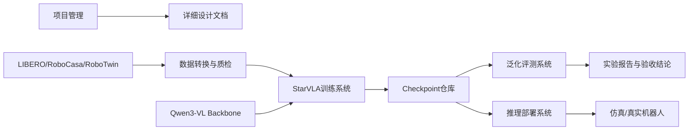

**图2-2 四层模型架构**

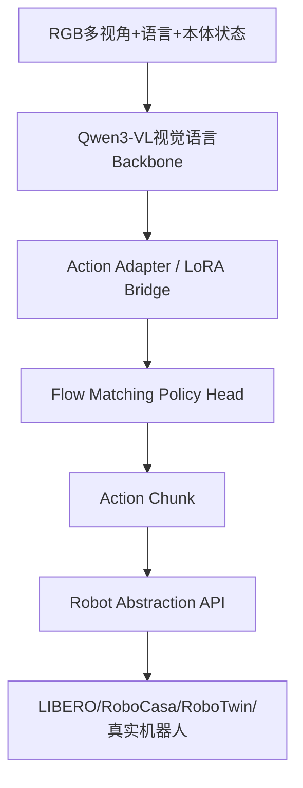

**图2-3 数据主链路**

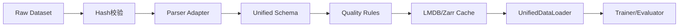

**图2-4 训练主链路**

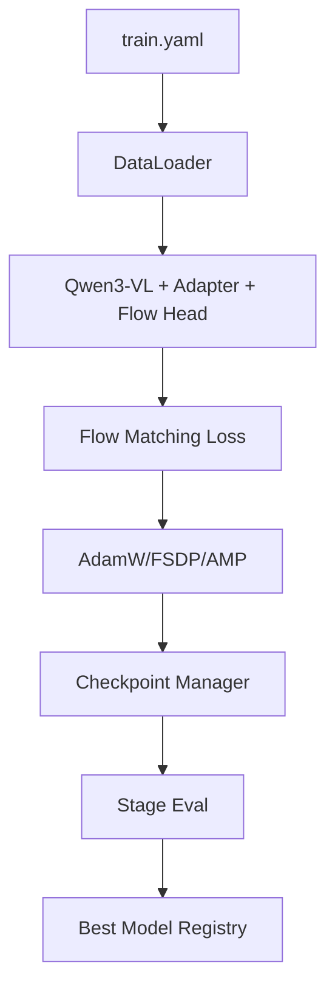

**图2-5 推理主链路**

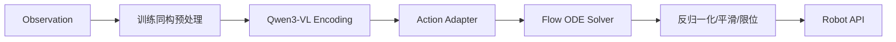

**图2-6 Checkpoint 生命周期**

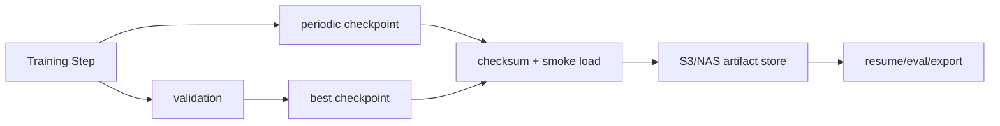

## 2.3 StarFlow-VLA 在 StarVLA 体系中的集成方式

StarFlow-VLA 作为 StarVLA framework registry 中的新增 framework 接入，工程形态与 QwenPI_v3、QwenGR00T、QwenOFT 等 StarVLA 已有路线一致。它不是外部脚本集合，而是一个可通过配置 `framework.name=StarFlowVLA` 启动的正式 framework。对外，StarFlowVLA 是独立 framework；对内，它不重复构建 Qwen3-VL 和 Flow Matching，而是继承和委托 StarVLA 现有成熟模块。

```text
StarVLA Framework Registry
├── QwenPI
├── QwenPI_v3
├── QwenGR00T
├── QwenOFT
└── StarFlowVLA
    ├── reuse QwenPI_v3 qwen_vl_interface
    ├── reuse project_layers
    ├── reuse LayerwiseFM / GR00T Action Head
    ├── reuse future_tokens + cross-DiT
    ├── optional PerceiverAdapter
    ├── optional masked loss / action_mask
    └── mapping / manifest / experiment config
```

双层架构在系统层的含义如下：抽象设计层用于解释 StarFlow-VLA 的模型逻辑，包括 `Qwen3-VL Backbone → State Encoding → Adapter Design → FlowCondition → Flow Transformer Head → ODE Solver → Action Chunk`；StarVLA-native 实现层用于最小修改落地，包括 `StarFlowVLA framework → 继承/复用 QwenPI_v3 → 复用 qwen_vl_interface/project_layers → 复用 LayerwiseFM/GR00T action head → 复用 future_tokens + cross-DiT → 必要时新增 Perceiver advanced、masked loss、mapping manifest`。抽象链路服务于“讲清楚设计”，StarVLA-native 映射服务于“最小改动落地”，二者不冲突。

## 2.4 关键时序
**时序图2-1 数据转换与质检**

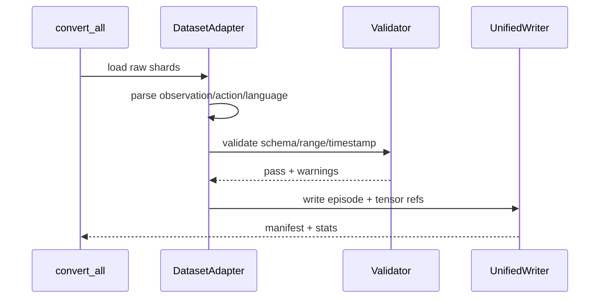

**时序图2-2 单步训练**

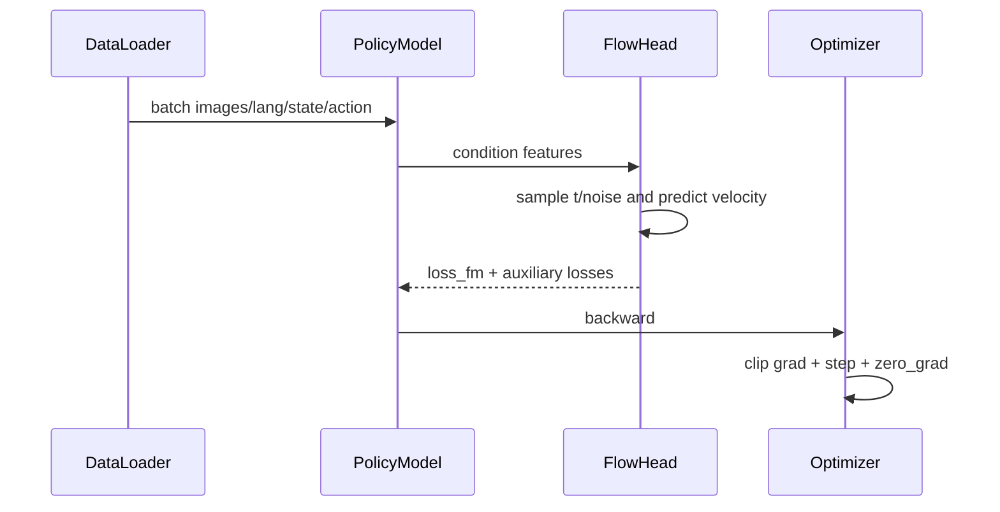

**时序图2-3 推理执行**

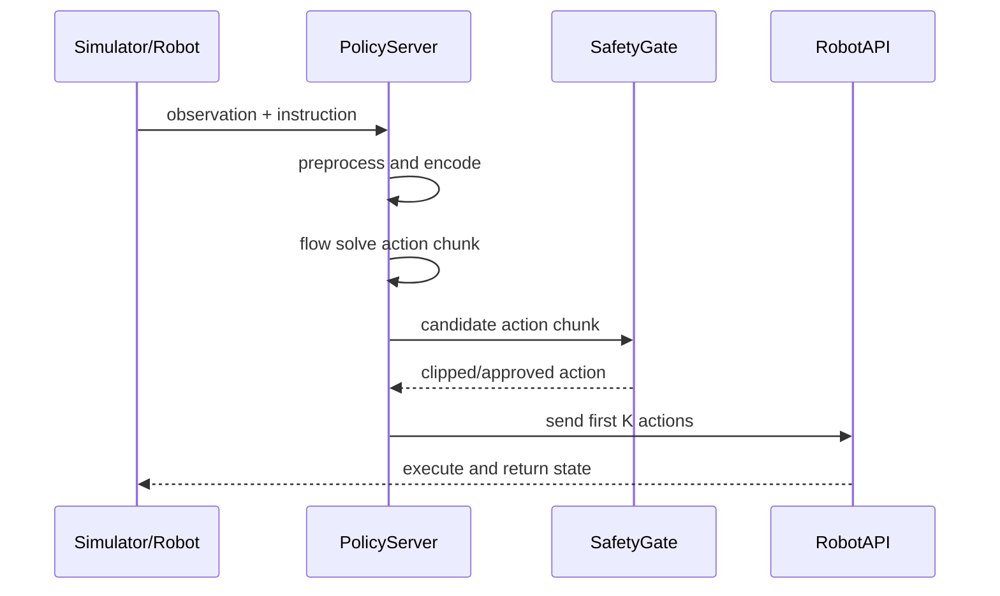

## 2.5 模块职责
| 模块 | 输入 | 输出 | 关键接口 | StarVLA-native 实现位置建议 |
| --- | --- | --- | --- | --- |
| Dataset Adapter | 官方原始数据 | UnifiedEpisode / StarVLA-compatible batch | convert(), validate(), write() | `data/converters/` 或 StarVLA 既有 dataset adapter |
| UnifiedDataLoader / Collator | manifest + tensor store | 训练 Batch | `__iter__()`、`collate_fn()` | StarVLA 既有 dataloader + 本项目 schema / mask 扩展 |
| Qwen3-VL Backbone | images + instruction | layer-wise VLM hidden states | `_encode_vl_hidden_states()` | 复用 `QwenPI_v3.qwen_vl_interface` 与 `project_layers` |
| State Encoding | robot_state | state token / state_features | `state_mode` | P0：`state-to-instruction`；P1：`action_head.state_encoder` / `state_bridge.py` |
| MLP Baseline / MLPAdapter 抽象 | VLM features / hidden states | action 或 baseline condition | baseline forward / loss | MLP/OFT/VLA_AdapterHeader baseline |
| ActionTokenAdapter 抽象 | VLM hidden states + action trajectory | planning-slot conditioned hidden states | `num_target_vision_tokens` | LayerwiseFM / GR00T 内部 `future_tokens + cross-DiT` |
| PerceiverAdapter advanced | long visual-language tokens | compressed tokens / latents | `perceiver_enabled` | `starVLA/model/modules/starflow_vla/perceiver_adapter.py`，P2 可选 |
| FlowCondition 抽象 | VLM/state/action-related tensors | abstract condition object / manifest | dataclass or implicit mapping | P0 隐式：`vl_embs_list + state_features + future_tokens + action_features`；P2 显式 dataclass |
| Flow Matching Head | VLM hidden states、actions、state | loss 或 action chunk | `forward()`、`predict_action()` | 复用 `LayerwiseFlowmatchingActionHead` / `GR00T_ActionHeader` |
| ODE Solver | velocity prediction | action_chunk | Euler integration | 复用 action head `predict_action()` 中的 Euler loop |
| StarFlow Mapping | config + runtime components | `starflow_mapping.json` | `describe_starflow_mapping()` | `starflow_vla/mapping.py` |
| StageTrainer | model + dataloader + config | checkpoint + logs | train(), validate() | StarVLA 既有 Trainer |
| BenchmarkAdapter | policy + task config | metrics | reset(), step(), evaluate() | StarVLA 既有 benchmark adapter + RoboCasa/RoboTwin 扩展 |
| SafetyGate | action chunk | approved action | check(), clip(), stop() | `deployment/safety.py` 或 StarVLA deployment 插件 |

本表采用“双层命名”：左侧模块名对应详细设计抽象，右侧实现位置对应 StarVLA-native 实际代码路径。P0 以复用 StarVLA 原生模块为主，不以是否存在同名 runtime 类作为验收标准。

## 2.6 数据流、模型流、反馈流

数据流从 raw dataset 开始，经过哈希校验、解析、统一 Schema、动作映射、质量过滤、缓存写入和 DataLoader 采样后进入训练。模型流从视觉、语言、本体状态编码开始，经 Qwen3-VL、Action Adapter、Flow Matching Head 输出动作块。反馈流从评测指标回到训练与数据策略，用于选择最佳 Checkpoint、调整 Data Mixture、定位失败任务和更新风险规则。

## 2.7 代码仓库建议结构
```text
starVLA/
  model/
    framework/
      VLM4A/
        QwenPI_v3.py
        StarFlowVLA.py              # 新增：继承 Qwen_PI_v3，不复制主体逻辑

    modules/
      starflow_vla/
        __init__.py
        mapping.py                  # P0：抽象设计到 StarVLA-native 的映射
        flow_condition.py            # P2：可选显式 dataclass / 诊断协议
        state_bridge.py              # P1：continuous_head state path 管理
        perceiver_adapter.py         # P2：advanced token compressor
        masked_loss.py               # P1：action_mask / 7DoF-14DoF mixed loss
        action_mask_utils.py         # P1：mask 构造与校验

configs/
  starflow_vla/
    stage1_starflow_qwenpi_v3_native.yaml
    stage2_mlp_baseline.yaml
    stage3_future_token_ablation.yaml
    stage3_perceiver_advanced.yaml
    stage4_action_mask_14d.yaml

docs/
  starflow_vla/
    MODULE_MAPPING.md
    PATCH_MANIFEST.md
    EXPERIMENT_MATRIX.md
```

第 2.7 与第 8.2 使用同一目录口径；本项目不再新建独立外部项目，而是在 [starVLA/starVLA.git](https://github.com/starVLA/starVLA.git) 的 framework、module、config 和 docs 目录下做 StarVLA-native 模块化接入。

## 2.8 StarVLA 价值与不可替代性

本项目不是把 Qwen3-VL、Flow Matching 和若干训练脚本简单拼在一起，而是利用 StarVLA 的插件化训练和评测能力，把不同动作头、不同 Benchmark、不同训练阶段纳入统一接口。若只使用通用 OpenVLA 风格框架，也可以完成一个 VLA 训练 Demo，但很难在同一套系统里稳定支撑 Cross Benchmark、Data Mixture、Flow Head 消融、Checkpoint 恢复和真实机器人部署。

| StarVLA 能力 | 本项目使用方式 | 若不用 StarVLA 的代价 | 验收点 |
| --- | --- | --- | --- |
| Action Head Plugin | 通过统一 ActionHead 接口接入 ACT、Diffusion Policy、Flow Matching、PI 系列候选头 | 每个策略头都要重写 trainer/evaluator/exporter | FlowMatchingHead 可在不改 Trainer 的前提下替换为 baseline head |
| Cross Benchmark Adapter | LIBERO/RoboCasa/RoboTwin 均实现 reset/step/success/report 接口 | 评测代码按 Benchmark 分裂，无法形成统一矩阵 | eval_matrix.py 一次产出三 Benchmark 报告 |
| Experiment Manager | 训练配置、数据版本、Checkpoint manifest、W&B run 和评测报告统一关联 | 实验不可追溯，难以复现论文结果 | 任意报告可追溯到 config_hash/data_version/checkpoint |
| Trainer Abstraction | 复用 AMP/FSDP/梯度累积/断点恢复/日志系统 | 10-16 周训练基础设施重建成本 | Stage1/2/3 共用同一 Trainer |
| Robot Abstraction | 仿真、Piper、MOZ1 和未来真实机器人共享动作安全门与适配器 | 真实机器人部署会变成独立项目 | Sim2Real 章节中的 adapter 可直接落到部署接口 |

### 2.8.1 Action Head 插件边界

StarVLA 的关键价值是把 Policy Head 变成插件，而不是把动作生成策略写死在模型主体中。本项目默认启用 Flow Matching，但保留 ACT、Diffusion Policy 和 PI 系列作为受控 baseline 或后续方向。所有头必须实现 `loss(condition, action, mask)`、`sample(condition, solver_cfg)`、`export(export_cfg)` 三个接口；训练系统只关心损失和可导出的推理图，不关心头内部是自回归、扩散还是流匹配。

```python
class StandardActionHead(Protocol):
    def loss(self, condition: Tensor, action: Tensor, mask: Tensor) -> dict[str, Tensor]: ...
    def sample(self, condition: Tensor, solver_cfg: dict) -> Tensor: ...
    def export(self, export_cfg: dict) -> ExportArtifact: ...
```

### 2.8.2 Cross Benchmark 插件边界

StarVLA 的 Benchmark Adapter 将任务重置、环境步进、成功判定、视频渲染和指标上报封装在统一接口下。这样 Train-A/Test-B、Leave-One-Benchmark-Out 和 Mixture Transfer 不需要分别写三套评测程序，研究结论也能在同一个报告 schema 下比较。

## 2.9 StarVLA 1.0.1 能力边界与模块化替代计划

本节基于 StarVLA 官方代码仓库 [starVLA/starVLA.git](https://github.com/starVLA/starVLA.git) 的源码审计，适配基线为 StarVLA `1.0.1`、branch `starVLA_dev`、commit `42170b2a4df3877ccf6581948e2198d37c363c7f`，配置兼容层为 `version_id == 0.21`。StarVLA 当前已具备 Qwen3-VL、Flow Matching、future tokens、cross-DiT、state-to-instruction、action head 内部 state_encoder、Euler sampling 和 MLP/OFT/VLA_AdapterHeader baseline 等相近能力。本文抽象设计中的 StateEncoder、Adapter、FlowCondition、ActionTokenAdapter、PerceiverAdapter 等概念用于解释模型数据流、实验变量和模块边界；具体实现采用 StarVLA-native 最小修改策略，不要求所有抽象概念都以同名 runtime 模块存在。

| 抽象模块 | StarVLA 当前已有能力 | 与本文抽象差异 | 最小实现策略 |
| --- | --- | --- | --- |
| Qwen3-VL Backbone | QwenPI_v3 已接入 Qwen-VL interface，并输出 layer-wise hidden states | 本文命名为 fusion_features / visual_language_tokens | 直接复用，必要时在 StarFlowVLA 中做输出命名映射 |
| State Encoding | QwenPI_v3 支持 state-to-instruction；LayerwiseFM/GR00T action head 内部有 state_encoder | 不是独立 4.4 StateEncoder runtime 模块 | 作为两种 state_mode：`discretized_instruction` 与 `continuous_head` |
| MLPAdapter | StarVLA 有 MLP/OFT/VLA_AdapterHeader baseline | 不一定输出 FlowCondition.global_cond | 作为 MLP baseline，用于 H2 对照 |
| ActionTokenAdapter | StarVLA 有 future_tokens + cross-DiT planning slots | 不显式输出 chunk_cond | 映射为 `future_token_cross_dit`，用于 Action Token 消融 |
| PerceiverAdapter | 当前未见等价 token compressor | project_layers 只是 hidden dim 压缩，不是 token 数压缩 | Stage3 advanced / E14 可选新增 |
| FlowCondition | 当前无显式 runtime dataclass | StarVLA 原生接口直接传 vl_embs/state/actions | P0 作为抽象和日志协议，P1/P2 视需求新增 |
| Flow Transformer Head | 已有 LayerwiseFM / GR00T Action Head | 接口不是 `x_t + t + FlowCondition` 显式形式 | 直接复用，文档映射为 condition consumer |
| ODE Solver | predict_action 已有 Euler integration | 未显式 solver manifest | 复用，实现 manifest 记录 |
| 7/14DoF mask | 当前默认路径更偏固定 action_dim | 混 batch masked loss 尚未作为本项目默认路径启用 | P1 增加 `max_action_dim=14 + action_mask` |

模块化替代原则如下：第一，优先复用 `QwenPI_v3`、`QwenGR00T`、`QwenOFT` 和现有 action head；第二，新增模块必须挂到 StarVLA registry 或配置入口，不直接修改训练主循环；第三，默认保留 StarVLA 原版 `QwenGR00T/QwenPI_v3/QwenOFT` 作为 E37/E34/E35 相关 baseline；第四，ActionTokenAdapter、StateEncoder、FlowCondition 等术语在 P0 中首先作为抽象映射和实验变量管理，不强制新增同名 runtime；第五，若需要修改 StarVLA 内部接口，必须形成 `PATCH_MANIFEST.md`，说明修改点、替代方案、兼容性和回滚方式。


# 3 数据设计

## 3.1 数据设计目标

数据设计的核心目标是让训练和评测系统只面对一种样本格式。LIBERO、RoboCasa、RoboTwin 的底层文件组织、动作表示、语言格式和控制频率不同，如果训练代码直接理解这些差异，后续所有模型实验都会被数据条件分支污染。因此本项目必须先将三类数据转换为 UnifiedEpisode，再由统一 DataLoader 输出 Batch。

**图3-1 数据转换适配器**

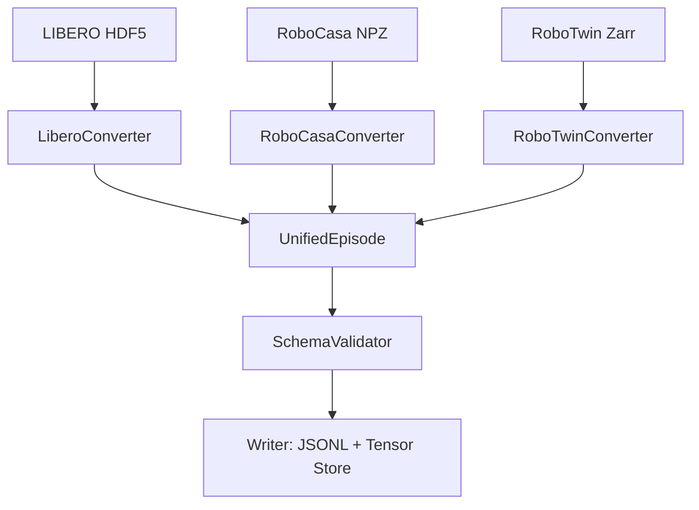

**图3-2 动作空间映射**

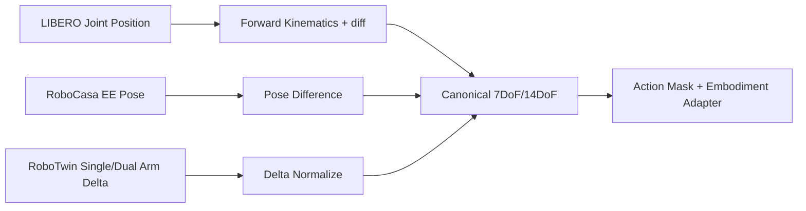

**图3-3 Data Mixture 调度**

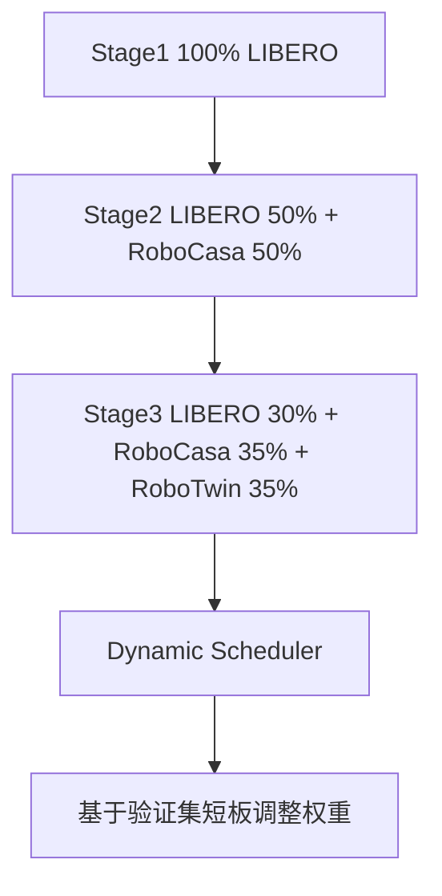

## 3.2 数据源定义
| 数据集 | 项目定位 | 原始格式 | 主要能力 | 默认用途 | 风险 |
| --- | --- | --- | --- | --- | --- |
| LIBERO | 基础操作能力 | HDF5 / episode files | 物体、目标、空间、长程任务 | Stage1 主训练，所有阶段保留回放 | 任务较规整，泛化分布不足 |
| RoboCasa | 复杂家庭/厨房场景扩展 | NPZ / scene-task files | 多物体、多容器、厨房语义 | Stage2 起加入 | 语言和场景描述更复杂 |
| RoboTwin | 跨环境/双臂泛化验证 | Zarr / chunked arrays | 环境变体、视角扰动、可能含单臂或双臂 | Stage3 和跨 Benchmark 评测 | 动作维度可能从 7DoF 扩展到 14DoF |

## 3.3 统一目录结构
```text
data/
├── raw/
│   ├── libero/
│   ├── robocasa/
│   └── robotwin/
├── processed/
│   └── v1.0.0/
│       ├── episodes_train.jsonl
│       ├── episodes_val.jsonl
│       ├── tensors/
│       │   ├── images/
│       │   ├── states/
│       │   └── actions/
│       ├── manifests/
│       │   ├── libero_manifest.json
│       │   ├── robocasa_manifest.json
│       │   └── robotwin_manifest.json
│       └── stats/
│           ├── action_stats.json
│           ├── state_stats.json
│           └── quality_report.json
├── cache/
│   ├── lmdb/
│   └── memory_maps/
└── versions.yaml
```

## 3.4 UnifiedEpisode Schema

训练样本以 episode 为组织单位，DataLoader 再按时间窗口切成 observation-action chunk。Schema 中所有路径均为相对 processed root 的路径，便于迁移到 NAS、S3 或本地 SSD。

```python
UnifiedEpisode = {
    "episode_id": "libero_object_000001",
    "dataset_source": "libero | robocasa | robotwin",
    "task_id": "pick_place_red_cube",
    "split": "train | val | test",
    "language": {
        "instruction": "pick up the red cube and place it on the blue plate",
        "template_id": "pick_place_v1",
        "raw_instruction": "original text"
    },
    "observations": {
        "rgb_front": "tensors/images/front/000001.zarr",
        "rgb_wrist": "tensors/images/wrist/000001.zarr",
        "rgb_side": None,
        "robot_state": "tensors/states/000001.npy",
        "timestamps": "tensors/states/000001_ts.npy"
    },
    "actions": {
        "canonical_action": "tensors/actions/000001.npy",
        "logical_action_dim": 7,
        "max_action_dim": 14,
        "action_mask": "tensors/actions/000001_mask.npy",
        "control_mode": "ee_delta_euler",
        "action_frame": "robot_base",
        "rotation_unit": "rad",
        "gripper_mode": "normalized_continuous"
    },
    "metadata": {
        "robot_type": "franka_panda",
        "fps_observation": 10,
        "fps_action": 10,
        "scene": "tabletop",
        "success": True,
        "source_file": "raw path",
        "checksum": "sha256..."
    }
}
```

### 3.4.1 Batch Schema
| 字段 | 维度 | 类型 | 说明 |
| --- | --- | --- | --- |
| rgb_front | [B,T,3,H,W] | bf16/float32 | 必填主视角，默认 H=W=224 或 336 |
| rgb_wrist | [B,T,3,H,W] or None | bf16/float32 | 手腕视角，可缺省并由 view_mask 标记 |
| language_tokens | [B,L] | int64 | Qwen3-VL tokenizer 输出 |
| robot_state | [B,T,N_state] | float32 | 可变状态维度，按 state_schema 和统计量归一化 |
| action_chunk | [B,H,max_action_dim] | float32 | 工程实现默认 max_action_dim=14；逻辑维度用 N_action 表示 |
| action_mask | [B,H,max_action_dim] | float32 | 单臂样本前 7 维有效、后 7 维 mask=0；双臂样本 14 维有效 |
| dataset_id | [B] | int64 | 用于混训、分数据集统计和 loss 分组 |
| timestamps | [B,T] | float64 | 时序对齐与真实机器人安全使用 |

## 3.5 动作空间映射

Canonical Action Space 采用“末端执行器增量位姿 + 夹爪”的表示。逻辑上，单臂任务 `N_action=7`，双臂任务 `N_action=14`；工程实现上，为支持 7DoF/14DoF 混训，batch 内统一使用 `max_action_dim=14` 与 `action_mask`。单臂样本写入前 7 维，后 7 维置 0 且 mask=0；双臂样本 14 维均有效。这样既满足 LIBERO/RoboCasa 的 7DoF 训练效率，又给 RoboTwin 和未来真实双臂机器人保留接口。

`Single-Arm First, Bimanual-Ready` 是本项目的边界：当前主实验仍以 LIBERO、RoboCasa 等单臂任务为主；RoboTwin 和真实机器人阶段必须预留 7DoF/14DoF、单臂/双臂、不同 embodiment 的统一接口；文档不得把“双臂协同”改写成本项目主研究问题。

| 数据集 | 原始动作 | Canonical | 转换方法 | 反向执行 |
| --- | --- | --- | --- | --- |
| LIBERO | 关节位置或控制器动作 | N_action=7，batch 存 14 masked | FK(q_t) 与 FK(q_{t-1}) 差分；夹爪阈值化 | 通过环境控制器或 IK 转回关节/EE 控制 |
| RoboCasa | 绝对 EE pose + gripper | N_action=7，batch 存 14 masked | pose_t - pose_{t-1}，四元数转欧拉增量 | 累积到当前 EE pose 后下发 |
| RoboTwin 单臂 | EE delta 或 joint delta | N_action=7，batch 存 14 masked | 直接归一化；非活动臂 mask=0 | 按任务 embodiment adapter 转换 |
| RoboTwin 双臂 | left/right action | N_action=14 | 左右臂分别归一化并拼接 | 左右控制器分别执行 |

动作表示选择 delta Euler 不是因为它理论最优，而是因为它在当前数据、控制器和工程工具链之间兼容性最好。位置增量默认使用 robot base/world frame，单位为 meter；旋转增量默认使用 Euler delta，单位为 rad；gripper 默认归一化到连续区间，具体为 `[-1,1]` 或 `[0,1]` 由 dataset adapter 在 manifest 中声明。Euler 存在万向锁和 SO(3) 非欧氏空间问题，因此不得宣称为理论最优；Quaternion、6D rotation 和 Lie algebra se(3) 作为 EV4 预研接口保留。

动作归一化公式：

```text
position_norm = clip(delta_position / position_scale, -1, 1)
rotation_norm = clip(delta_rotation / rotation_scale, -1, 1)
gripper_norm  = {-1 close, 0 keep, 1 open}
canonical_7d  = [position_norm(3), rotation_norm(3), gripper_norm(1)]
canonical_14d = concat(left_7d, right_7d)
batch_action  = pad_to_max_dim(canonical_7d_or_14d, max_action_dim=14)
```

| 参数 | 默认值 | 配置项 | 说明 |
| --- | --- | --- | --- |
| position_scale | 0.05 m | data.action.position_scale | 单步位置归一化分母 |
| rotation_scale | 0.25 rad | data.action.rotation_scale | 单步旋转归一化分母 |
| gripper_close_threshold | 0.3 | data.action.gripper.close | 连续夹爪值低于该值视为关闭 |
| gripper_open_threshold | 0.7 | data.action.gripper.open | 连续夹爪值高于该值视为打开 |
| max_action_norm | 1.0 | data.action.clip | 归一化后裁剪范围 |
| dual_arm_mode | auto | data.action.dual_arm_mode | auto/force_7d/force_14d |
| action_frame | robot_base | data.action.frame | delta 的坐标系，必须写入 manifest |
| rotation_unit | rad | data.action.rotation_unit | 禁止混用 degree/rad |

## 3.6 时序对齐

多模态时序对齐按三个等级执行。Level 1 在转换阶段检查 timestamp 单调性；Level 2 将不同频率重采样到训练控制频率，默认 10Hz；Level 3 在真实机器人部署阶段使用控制器时间戳拒绝过期动作。RoboCasa 20Hz 数据默认按任务需求降采样到 10Hz，也可保留 20Hz 并在训练配置中设置 control_freq=20。

## 3.7 Data Mixture
| Stage | 训练目标 | LIBERO | RoboCasa | RoboTwin | 训练步数建议 | 可训练模块 |
| --- | --- | --- | --- | --- | --- | --- |
| Stage1 | 基础动作能力与 Flow Head 热身 | 100% | 0% | 0% | 50k | Adapter + Flow Head |
| Stage2 | 复杂场景扩展 | 50% | 50% | 0% | 50k | Adapter + Flow Head + 顶层 LoRA |
| Stage3 | 跨 Benchmark 泛化 | 30% | 35% | 35% | 50k-100k | Adapter + Flow Head + LoRA |
| Stage4 可选 | 真实机器人少量示范适配 | 回放 20% | 回放 20% | 回放 20% | 5k-20k | Adapter + 少量 LoRA，强回放 |

动态混合权重以验证短板为输入。若某数据集验证成功率低于全局均值，下一窗口提升该数据集采样权重，但单次调整不超过 5%，避免训练分布剧烈摆动。

## 3.8 Data Scaling 实验
| 实验组 | 数据比例 | 采样策略 | 训练步数 | 评测 | 目的 |
| --- | --- | --- | --- | --- | --- |
| S25 | 25% | 按 task_id 分层采样 | 25k | LIBERO/RoboCasa/RoboTwin 同域 | 建立低数据基线 |
| S50 | 50% | 按 task_id 分层采样 | 40k | 同域 + 关键跨域 | 观察早期 Scaling 增益 |
| S75 | 75% | 按 task_id 分层采样 | 45k | 完整矩阵 | 观察收益递减 |
| S100 | 100% | 全量 | 50k+ | 完整矩阵 | 最终规模基线 |

## 3.9 DataLoader 设计
```python
class UnifiedDataLoader:
    def __init__(self, manifest, tensor_store, sampler, tokenizer, image_processor, config):
        self.manifest = manifest
        self.tensor_store = tensor_store
        self.sampler = sampler
        self.tokenizer = tokenizer
        self.image_processor = image_processor
        self.config = config

    def __iter__(self):
        for indices in self.sampler:
            examples = [self.load_window(i) for i in indices]
            yield self.collate(examples)

    def load_window(self, index):
        # 读取 episode，随机或顺序切出 observation window 与 action chunk
        # 所有输出必须符合 Batch Schema
        ...

    def collate(self, examples):
        # 处理视角缺失、动作维度 7/14、padding、mask、dataset_id
        ...
```

## 3.10 数据质量与数据泄露防护
动作数值阈值不得写成固定 magic number。正式转换阶段先按 dataset、robot、action scale 分组统计归一化动作的 P95、P99、P99.9 和 max，再设置：

```text
action_threshold = 1.1 * max(P99.9(|a_norm|), 1.0)
fallback_threshold = 1.2  # 仅在统计量缺失时使用
```

该规则的目标是拦截严重异常，而不是误杀正常尾部分布样本。所有超阈值样本必须进入异常列表，并按数据集、任务族、机器人类型和动作维度统计。

| 检查项 | 规则 | 失败处理 | 阻断级别 |
| --- | --- | --- | --- |
| Schema | 必填字段存在、类型正确 | 丢弃并记录 | P0 |
| 动作数值 | 无 NaN/Inf，|a_norm| ≤ action_threshold；缺统计量时 fallback=1.2 | 进入异常列表，按任务族复核后截断或丢弃 | P0 |
| 图像 | 可解码、非纯色、尺寸可处理 | 丢弃该窗口 | P0 |
| 时间戳 | 单调递增，跨模态偏差 ≤10ms | 过滤或重采样 | P0 |
| 语言 | 非空，长度 ≤512 字符 | 模板修复或丢弃 | P1 |
| 任务分布 | 最大/最小任务样本数比例 ≤10 | 采样器重加权 | P1 |
| 评测隔离 | 训练 manifest 与 eval manifest 哈希无重叠 | 停止评测 | P0 |
| 质量报告 | 输出 P95/P99/P99.9/max/异常比例 | 报告缺失则转换失败 | P0 |

# 4 模型设计

## 4.1 模型总体数据流

本节位于 StarFlow-VLA 前向链路的总体编排阶段，承接第 2 章的系统架构和第 3 章的数据 schema，目标是先定义从 observation 到 action chunk 的完整模型数据流，并向第 4.2 节交付统一张量命名和接口边界。本节不展开单个模块的内部结构，Qwen3-VL、StateEncoder、Adapter、Flow Transformer Head、ODE Solver 和控制策略分别在第 4.3 至第 4.8 节展开。

StarFlow-VLA 的模型主线固定为 `Qwen3-VL + StarVLA + Flow Matching`。模型不是 World Model，不引入 RL 主训练目标，也不把本项目改写为纯双臂协同项目。本项目默认单臂 7DoF，工程接口兼容双臂 14DoF；实现层统一建议使用 `max_action_dim=14 + action_mask`，使 LIBERO、RoboCasa、RoboTwin 和后续真实机器人适配能够在同一套 batch、loss 与 checkpoint 结构下运行。

完整前向链路如下：

```text
Images + Language + Robot State
↓
Qwen3-VL Backbone
↓
fusion_features / visual_language_tokens
↓
StateEncoder
↓
state_emb
↓
Adapter Design
↓
FlowCondition
↓
Flow Transformer Head
↓
velocity
↓
ODE Solver
↓
action_chunk
↓
SafetyPostProcessor
↓
safe_action_chunk
```

| 阶段 | 章节 | 输入 | 输出 | 角色 |
| --- | --- | --- | --- | --- |
| 视觉语言编码 | 4.3 | images + language | fusion_features / visual_language_tokens | 提供语义特征 |
| 状态编码 | 4.4 | robot_state | state_emb | 提供机器人本体状态 |
| 条件构建 | 4.5 | Qwen features + state_emb | FlowCondition | condition producer |
| 速度场建模 | 4.6 | x_t + t + FlowCondition | velocity | condition consumer |
| ODE 采样 | 4.7 | velocity field + solver config | action_chunk | 动作生成 |
| 控制执行 | 4.8 | action_chunk | executable actions | receding horizon control |

核心边界必须保持稳定：4.4 和 4.5 生成条件；4.6 使用条件；4.7 根据速度场采样动作；4.8 将动作块转为可执行控制。这样拆分后，StateEncoder 和 Adapter 不再混写，ActionTokenAdapter 和 FlowTransformerHead 也不会混为一谈。

## 4.2 统一张量协议与 FlowCondition

本节位于 StarFlow-VLA 前向链路的接口协议阶段，承接第 4.1 节的数据流，目标是统一第 4 章所有核心张量、动作维度和条件对象，并向第 4.3 至第 4.8 节提供可直接落地的输入输出约束。本节不讨论模块内部如何实现，只定义模块之间必须遵守的协议。

| 张量 | 维度 | 生产者 | 消费者 | 说明 |
| --- | --- | --- | --- | --- |
| `fusion_features` | `[B, D_feat]` | Qwen3VLBackbone | MLPAdapter / DirectProjection | 全局视觉语言融合特征 |
| `visual_language_tokens` | `[B, N_token, D_feat]` | Qwen3VLBackbone | ActionTokenAdapter / PerceiverAdapter | token 级视觉语言特征 |
| `robot_state` | `[B, T, N_state]` 或 `[B, N_state]` | Dataset / Batch collator | StateEncoder | 可变状态字段 |
| `state_emb` | `[B, D_state_emb]` | StateEncoder | Adapter | 统一机器人状态 embedding |
| `global_cond` | `[B, D_cond]` | Adapter | FlowTransformerHead | 任务级条件 |
| `chunk_cond` | `[B, H, D_cond]` optional | ActionTokenAdapter / PerceiverAdapter | FlowTransformerHead | 未来每步条件 |
| `x_t` | `[B, H, N_action]` | Flow Matching sampler | FlowTransformerHead | noisy action chunk |
| `velocity` | `[B, H, N_action]` | FlowTransformerHead | ODE Solver / loss | 速度场预测 |
| `action_chunk` | `[B, H, max_action_dim]` | ODE Solver | SafetyPostProcessor | 未后处理动作 |
| `action_mask` | `[B, H, max_action_dim]` | Dataset / Collator | loss / sampler | 有效动作维度 |

动作维度规则固定如下：

```text
N_action = 7  for single-arm logical action
N_action = 14 for bimanual logical action
max_action_dim = 14 for mixed batching
```

单臂样本进入 batch 时仍填充为 14 维，前 7 维有效、后 7 维通过 `action_mask=0` 屏蔽；双臂样本 14 维有效。该设计保证本项目单臂优先，同时为 RoboTwin 和真实双臂机器人保留接口。

以下 `FlowCondition` 为抽象设计层接口，不代表 P0 runtime 必须新增同名 dataclass。

统一条件对象定义如下：

```python
@dataclass
class FlowCondition:
    global_cond: torch.Tensor                  # [B, D_cond]
    chunk_cond: Optional[torch.Tensor] = None  # [B, H, D_cond]
    state_cond: Optional[torch.Tensor] = None
    embodiment_cond: Optional[torch.Tensor] = None
    dataset_cond: Optional[torch.Tensor] = None
    vl_token_mask: Optional[torch.Tensor] = None
    chunk_mask: Optional[torch.Tensor] = None
```

`FlowCondition` 是 Adapter 输出给 Flow Transformer Head 的统一条件对象。Adapter 是 condition producer，负责把视觉语言特征和状态特征整理成条件；Flow Transformer Head 是 condition consumer，负责消费 `x_t`、`t` 和 `FlowCondition` 预测 `velocity`。`FlowCondition` 不包含 noisy action，也不包含 solver 逻辑。

### 4.2.1 StarVLA 模型模块接入边界

本节位于 StarFlow-VLA 与 StarVLA 代码库对齐阶段，承接第 4.2 节的接口协议，目标是明确本文抽象设计如何映射到 StarVLA-native 实现，并向第 8 章工程实现提供 patch plan。本节不重新评估是否使用 StarVLA，也不把 StarFlowVLA 写成外部脚本集合；项目边界是作为 StarVLA framework registry 中的新 framework 路线，最大化继承和委托既有模块。

本设计适配的 StarVLA 版本为：

```text
repository_url: https://github.com/starVLA/starVLA.git
package_version: starVLA 1.0.1
branch: starVLA_dev
commit: 42170b2a4df3877ccf6581948e2198d37c363c7f
config_schema: version_id == 0.21
```

| 文档抽象 | StarVLA-native 实现 | 是否重复构建 | 是否 P0 |
| --- | --- | ---: | ---: |
| `Qwen3VLBackbone` | 复用 `QwenPI_v3.qwen_vl_interface` / Qwen-VL wrapper | 否 | 是 |
| `StateEncoder` | `state-to-instruction` 或 `action_head.state_encoder` | 否 | 是 |
| `MLPAdapter` | MLP/OFT/VLA_AdapterHeader baseline | 否 | 是 |
| `ActionTokenAdapter` | `future_tokens + cross-DiT` | 否 | 是 |
| `PerceiverAdapter` | 新增 `starflow_vla/perceiver_adapter.py` | 是，但仅 advanced | 否 |
| `FlowCondition` | P0 隐式映射；P1/P2 可显式 dataclass | 否 | 可选 |
| `FlowTransformerHead` | `LayerwiseFlowmatchingActionHead` / `GR00T_ActionHeader` | 否 | 是 |
| `ODE Solver` | `predict_action()` Euler loop | 否 | 是 |

处理方式定义：`直接复用` 表示不改 StarVLA 原模块；`薄封装` 表示项目侧增加 wrapper 统一输入输出；`扩展` 表示保持原接口兼容并新增配置字段；`新增模块` 仅用于 Perceiver advanced、masked loss、mapping manifest 等必要增量。禁止 hard fork 覆盖 StarVLA 原版 Trainer、Dataloader 或 Framework 基础能力。

### 4.2.2 抽象设计与 StarVLA-native 实现映射

本节位于抽象设计到代码实现的映射阶段，承接第 4.2 节的张量协议和第 4.2.1 节的 StarVLA 能力边界，目标是说明第 4 章为何可以使用 StateEncoder、Adapter、FlowCondition、FlowTransformerHead 等抽象概念，同时又不要求 StarVLA 代码中全部存在同名 runtime 模块。本节向第 4.4 至第 4.7 节提供实现解释规则。

第 4 章使用 StateEncoder、Adapter、FlowCondition、FlowTransformerHead 等抽象概念描述 StarFlow-VLA 的前向数据流。这些概念用于统一解释模型结构、实验变量和消融设计，并不要求在 StarVLA 代码中全部以同名 runtime 模块存在。

在最小实现中，StarFlow-VLA 优先复用 StarVLA 现有 QwenPI_v3、LayerwiseFlowmatchingActionHead、GR00T_ActionHeader、VLA_AdapterHeader、future_tokens 和 cross-DiT 机制。FlowCondition 在实现层可由 `vl_embs_list`、`state_features`、`future_tokens`、`action_features`、`encoder_attention_mask` 等 StarVLA-native 张量隐式表示；只有当需要新增独立 Adapter 消融、Perceiver advanced 或跨 head 统一日志诊断时，才引入显式 FlowCondition dataclass。

| 抽象链路 | StarVLA-native 映射 | P0 实现要求 |
| --- | --- | --- |
| Observation -> Qwen3-VL Feature | QwenPI_v3 `qwen_vl_interface` 与 project_layers | 复用 |
| State Encoding | `discretized_instruction` 或 action head 内部 `state_encoder` | 复用，两种 `state_mode` 配置化 |
| Adapter / FlowCondition Construction | MLP/OFT/VLA_AdapterHeader baseline 或 future_tokens + cross-DiT | 用配置表达实验变量 |
| Flow Transformer / Velocity Field | LayerwiseFM / GR00T action head | 复用 |
| ODE Solver | `predict_action()` Euler loop | 复用，补 manifest |
| Action Mask | 固定 action_dim 路径 + 可选 masked loss patch | P1 启用 |

抽象链路服务于“讲清楚设计”；StarVLA-native 映射服务于“最小改动落地”；二者不冲突。评审和实现时以 `MODULE_MAPPING.md`、`PATCH_MANIFEST.md` 和 checkpoint 中的 `starflow_mapping` 为最终追踪依据。

### 4.2.3 Observation Geometry Adapter：P2 Optional Interface

StarFlow-VLA 默认不启用 VGGT。为后续《基于世界模型的移动操作规划与决策框架研究》衔接，StarFlow-VLA 预留 observation geometry adapter 接口：

```yaml
observation_geometry:
  enabled: false
  encoder: vggt
  fusion_mode: cross_attention
  geo_token_num: 128
  coordinate_frame: camera
```

当 `enabled=false` 时，StarFlow-VLA 完全使用原始 RGB / language / state policy pathway，不影响 P0/P1。P0/P1 不新增 VGGT 依赖，不实现 RGB-3D fusion 训练闭环，也不修改 QwenPI_v3、LayerwiseFM 或 GR00T 主逻辑。

当未来 P2 或《基于世界模型的移动操作规划与决策框架研究》启用时，VGGT 输出的 depth、point map、camera pose 或 point tracks 可以通过 `GeometryAdapter` 转换为 geometry tokens，再通过 additive bias、cross-attention 或 gated fusion 与 RGB/VLM tokens 交互。本接口只是预留，不作为 StarFlow-VLA P0/P1 验收条件。

## 4.3 Qwen3-VL Backbone

本节位于 StarFlow-VLA 前向链路的视觉语言编码阶段，承接第 3 章的图像、语言和多视角输入 schema，以及第 4.2 节的张量协议，目标是通过 Qwen3-VL 输出 `fusion_features` 和 `visual_language_tokens`，供第 4.5 节 Adapter Design 使用。本节不生成 `state_emb`，不生成 `FlowCondition`，也不讨论动作噪声 `x_t`。

Qwen3-VL Backbone 的职责包括：加载 Qwen3-VL 模型；封装 image processor 与 tokenizer；按照固定 view order 组织多视角图像；返回全局融合特征和 token 级视觉语言特征；提供 `vl_token_mask` 屏蔽 padding、缺失视角和无效 token。StarVLA 1.0.1 已有 Qwen3-VL 相关 wrapper，本项目只增加标准返回接口，不重写底层 VLM 加载。

| 输出 | 维度 | 用途 |
| --- | --- | --- |
| `fusion_features` | `[B, D_feat]` | 主要给 DirectProjection / MLPAdapter 使用 |
| `visual_language_tokens` | `[B, N_token, D_feat]` | 主要给 ActionTokenAdapter / PerceiverAdapter 使用 |
| `vl_token_mask` | `[B, N_token]` | 屏蔽 padding 和缺失视角 token |

推荐接口如下：

```python
class Qwen3VLBackboneWrapper(nn.Module):
    def forward_features(self, images, language_tokens, view_mask=None):
        """
        images:          multi-view images
        language_tokens: [B, L]
        view_mask:       optional

        returns:
            fusion_features:        [B, D_feat]
            visual_language_tokens: [B, N_token, D_feat]
            vl_token_mask:          [B, N_token]
        """
        ...
```

多视角输入必须按固定顺序组织，例如 `front`、`wrist`、`side`。缺失视角不能用静默零图像冒充有效输入，必须通过 `view_mask` 传入，并最终体现在 `vl_token_mask` 中。语言 token 由 Qwen3-VL tokenizer 生成，数据侧负责模板化语言清洗，模型侧不再重写任务文本。

训练策略分四档：

| 策略 | 可训练参数 | 默认阶段 | 优点 | 风险 |
| --- | --- | --- | --- | --- |
| Frozen Backbone | Adapter + Flow Head | Stage1 | 显存低、稳定、快速验证数据和动作链路 | 语义到动作映射能力可能不足 |
| Top LoRA | 顶层 attention/MLP LoRA | Stage2/3 默认 | 成本可控，适应机器人任务 | 需控制过拟合 |
| Partial LoRA | 中高层多模块 LoRA | 消融 | 表达力更强 | 显存和灾难性遗忘风险上升 |
| Full Fine-tune | 全量参数 | 非默认 | 理论上上限高 | 数据规模不足时容易破坏通用视觉语言对齐 |

不默认 full fine-tune 的原因是 LIBERO、RoboCasa、RoboTwin 的机器人轨迹规模远小于 Qwen3-VL 通用预训练数据，全量更新容易导致视觉语言能力退化，也会显著提高 8×A100 长训成本。默认路线是先冻结 backbone 训练 Adapter + Flow Head，再逐步开启 Top LoRA。

验收测试包括：多视角 shape test、缺失视角 mask test、语言 token batch 对齐 test、`fusion_features` finite test、`visual_language_tokens` finite test、冻结参数检查、LoRA target module 检查。任何 batch 维度不一致、token mask 与 token 数不一致、输出出现 NaN/Inf，均为 P0 阻断。

## 4.4 State Encoding

本节位于 StarFlow-VLA 前向链路的机器人状态编码阶段，承接第 3 章定义的 `robot_state` schema 和第 4.2 节的张量协议，目标是将可变维度 `robot_state` 编码为统一 `state_emb`，供第 4.5 节 Adapter Design 使用。本节不生成 `FlowCondition`，也不讨论 MLPAdapter、ActionTokenAdapter 或 PerceiverAdapter，相关内容在第 4.5 节展开。

State Encoding 是抽象设计层的概念，用于描述 `robot_state` 如何进入模型并影响动作生成。它与 Adapter 分开，是为了让状态 schema、状态归一化、状态缺失 mask 和动作条件构建在文档和实验设计中保持清晰边界；但在 StarVLA-native P0 实现中，不强制新增独立 `StateEncoder` runtime 模块。

StarVLA-native 最小实现提供两条 state path：第一，`discretized_instruction`，沿用 QwenPI_v3 方式，将连续 state 离散化为文本 token 后拼入 instruction，让 Qwen3-VL 通过语言 token 通道感知状态；第二，`continuous_head`，保留连续 state 张量，将其传入 LayerwiseFM / GR00T action head 内部的 `state_encoder`，由 action head 编码为 `state_features` 后与 `future_tokens`、`action_features` 拼接进入 DiT。若后续需要统一 state schema、mask、日志和部署检查，可在 `starflow_vla/state_bridge.py` 中新增 state bridge，把上述两种 state path 包装成统一接口。

### 4.4.1 Robot State Schema

本节位于 State Encoding 的输入定义阶段，承接第 3 章数据 schema，目标是明确状态字段优先级和单臂/双臂维度范围，并向第 4.4.2 节交付可归一化的状态字段集合。本节不讨论状态如何融合视觉语言特征。

| 优先级 | 字段 | 是否默认进入本项目 | 说明 |
| --- | --- | --- | --- |
| P0 必选 | `joint_position` | 是 | 单臂通常 7 维，双臂通常 14 维 |
| P0 必选 | `tcp_position` | 是 | 末端位置，单位 meter |
| P0 必选 | `tcp_orientation` | 是 | Euler 或 quaternion，manifest 必须记录格式 |
| P0 必选 | `gripper_state` | 是 | 连续开合或离散夹爪状态 |
| P1 可选 | `joint_velocity` | Stage2/3 可启用 | 动态任务和真实机器人推荐 |
| P1 可选 | `tcp_linear_velocity` | Stage2/3 可启用 | 末端线速度 |
| P1 可选 | `tcp_angular_velocity` | Stage2/3 可启用 | 末端角速度 |
| P2 可选 | `force_torque` | 预留 | 真实机器人接触任务可用 |
| P2 可选 | `contact_flag` | 预留 | 接触事件或夹爪接触 |
| P2 可选 | `proprioceptive_history` | 预留 | 历史状态窗口 |

维度示例：

```text
单臂基础状态：
joint_pos 7 + tcp_pos 3 + tcp_rot 3 + gripper 1 = 14

双臂基础状态：
left_joint_pos 7 + right_joint_pos 7
+ left_tcp_pose 6 + right_tcp_pose 6
+ left_gripper 1 + right_gripper 1
= 28

双臂扩展速度状态：
基础 28
+ left/right joint_vel 14
+ left/right tcp linear/angular velocity 12
≈ 54
```

因此禁止在模型内部假设固定 `state_dim=14`。`state_dim` 必须来自 `state_schema` 和 batch collator，缺失字段通过 `state_mask` 标记。

### 4.4.2 State Normalization

本节位于 State Encoding 的数值标准化阶段，承接第 4.4.1 节状态字段，目标是保证不同数据集、机器人和字段的数值尺度可控，并向第 4.4.3 节交付归一化后的 `robot_state` 与 `state_mask`。本节不处理动作归一化，动作归一化在第 3 章和第 4.6.5 节使用。

`robot_state` 必须按 `dataset`、`robot_type`、`state_field` 分组统计 mean/std。所有状态字段必须写入 `state_schema`，包括单位、坐标系、角度表示、是否 delta、是否归一化和缺失策略。缺失字段不得填入看似有效的常数后不加说明，必须通过 `state_mask` 标记。

归一化规则：

| 项目 | 规则 | 失败判据 |
| --- | --- | --- |
| mean/std | 按 dataset + robot_type + state_field 分组 | 共用全局统计导致分布漂移 |
| std 下限 | `std = max(std, eps)` | std 为 0 导致 Inf/NaN |
| 缺失字段 | 使用 mask 标记，默认值只作占位 | 模型无法区分真实 0 和缺失 |
| 单位 | meter/radian/normalized gripper 写入 manifest | 单位不明导致真实机器人风险 |
| 检查 | 归一化后 P99 绝对值应在阈值内 | 大量状态异常未进入报告 |

### 4.4.3 StateEncoder 结构

本节位于 State Encoding 的模型结构阶段，承接归一化后的 `robot_state` 和 `state_mask`，目标是在抽象设计层说明 `state_emb` 的结构含义，并在 StarVLA-native 实现层映射为 `discretized_instruction` 或 action head 内部 `state_encoder`。本节不生成 `global_cond` 或 `chunk_cond`。

默认配置：

```text
D_state_emb = 128
state_encoder_layers = 2
activation = GELU
normalization = LayerNorm
dropout = 0.0 或 0.1
```

选择 128 而不是 64 的原因是：单臂基础状态可为 14-28 维；双臂扩展状态可达约 54 维；64 对双臂和速度状态偏紧；128 仍然是低成本结构化 embedding，且不会相对 Qwen3-VL 高维特征过强。若启用历史状态或力矩字段，可把内部 hidden 扩展到 256，但输出仍建议保持 128，避免 Adapter 输入维度频繁变化。

若采用显式 `state_bridge.py` 或 `continuous_head` 包装层，可参考如下结构；该结构是 P1/P2 的统一接口建议，不是 P0 必须新增模块：

```python
class StateEncoder(nn.Module):
    def __init__(self, state_dim: int, d_state_emb: int = 128):
        super().__init__()
        self.net = nn.Sequential(
            nn.Linear(state_dim, d_state_emb),
            nn.GELU(),
            nn.LayerNorm(d_state_emb),
            nn.Linear(d_state_emb, d_state_emb),
            nn.GELU(),
            nn.LayerNorm(d_state_emb),
        )

    def forward(self, robot_state, state_mask=None):
        if state_mask is not None:
            robot_state = robot_state * state_mask
        state_emb = self.net(robot_state)
        return state_emb  # [B, D_state_emb]
```

风险包括：状态 mask 未生效、角度表示混乱、不同机器人共用错误统计量、状态维度在训练和部署不一致。规避方式是把 `state_schema_hash`、`normalization_stats_hash`、`state_dim`、`state_mode` 和 `D_state_emb` 写入 checkpoint manifest。若使用 `discretized_instruction`，还必须记录离散化桶、文本模板和 instruction 拼接规则；若使用 `continuous_head`，必须记录 action head 内部 state_encoder 的配置。

### 4.4.4 输出与验收

本节位于 State Encoding 的模块验收阶段，承接第 4.4.3 节输出，目标是确认状态路径可追踪，并向第 4.5 节提供稳定输入。本节不允许输出 `FlowCondition`。

抽象设计层中，4.4 的标准输出可记为：

```text
state_emb: [B, D_state_emb]
```

StarVLA-native P0 中，该输出可以是显式 `state_emb`，也可以是隐式进入 instruction 或 action head 的 `state_features`；验收重点是状态路径可追踪，而不是同名 runtime 对象必须存在。

测试清单：

| 测试项 | 输入 | 期望输出 | 阻断级别 |
| --- | --- | --- | --- |
| single-arm state shape test | `[B,14]` | `[B,128]` | P0 |
| bimanual state shape test | `[B,28]` 或 `[B,54]` | `[B,128]` | P0 |
| missing field mask test | 缺失字段 + mask | 输出 finite，缺失字段不污染统计 | P0 |
| state normalization finite test | 全量训练 batch | 无 NaN/Inf | P0 |
| state_emb deterministic test | 固定输入重复 forward | 输出一致 | P1 |

## 4.5 Adapter Design：MLP、Action Token 与 Perceiver

本节位于 StarFlow-VLA 前向链路的条件构建阶段，承接第 4.3 节 Qwen3-VL 输出的 `fusion_features` / `visual_language_tokens`，以及第 4.4 节的 state path，目标是定义 MLP baseline、future-token/action-token 路线、Perceiver advanced 和 FlowCondition 抽象之间的关系。本节不接触 Flow Matching 中的 noisy action `x_t`，也不预测 `velocity`；`x_t`、`t` 与条件信息的使用方式在第 4.6 节展开。

在抽象设计层，4.5 是 condition producer；在 StarVLA-native P0 实现层，4.5 不强制所有 Adapter 都实现为独立 `FlowCondition` producer。MLPAdapter 可映射为 StarVLA 已有 MLP/OFT/VLA_AdapterHeader baseline；ActionTokenAdapter 可映射为 LayerwiseFM / GR00T action head 内部的 `future_tokens + cross-DiT`；PerceiverAdapter 是 Stage3 advanced 可选新增模块；FlowCondition 是文档抽象、日志协议和未来扩展接口。

### 4.5.1 Adapter Family Overview

本节位于 Adapter Design 的方案总览阶段，承接第 4.3 和第 4.4 节输出，目标是统一 Adapter 研究变量、StarVLA-native 实现路径和 P0/P1/P2 边界，并向第 6 章实验矩阵交付可执行配置。本节不讨论 `x_t`。

| 文档抽象 | 研究变量 | StarVLA-native 实现 | 是否 P0 |
| --- | --- | --- | --- |
| MLPAdapter | global-only 条件路径 | MLP/OFT/VLA_AdapterHeader baseline | 是 |
| ActionTokenAdapter | chunk-aware / future-token 条件机制 | LayerwiseFM/GR00T `future_tokens + cross-DiT` | 是 |
| PerceiverAdapter | 长 token / 多视角压缩 | 新增 `starflow_vla/perceiver_adapter.py` | 否，advanced |
| Dataset / Embodiment Token | 分布与具身条件 | config + optional embedding / instruction tag | P1 |
| FlowCondition | 统一条件抽象 | P0 隐式映射，P1/P2 可显式 dataclass | 可选 |

P0 研究主线不以是否实现同名 Adapter 类为验收标准，而以是否能够形成有效受控实验为标准。MLP baseline 与 future-token/cross-DiT 机制即可支撑 H2 的核心实验；PerceiverAdapter 属于 advanced 扩展，不影响 P0 闭环。

### 4.5.2 MLPAdapter：MLP/OFT/VLA_AdapterHeader Baseline

本节位于 Adapter Design 的低成本 baseline 阶段，承接 Qwen3-VL 的全局特征和状态路径，目标是建立与 future-token/action-token 路线对照的 MLP baseline。本节不生成 `chunk_cond`，不处理 token-level planning slots。

在抽象设计中，MLPAdapter 表示最低成本的 global-only 条件路径，用于与 future-token/action-token 路线形成对照。在 StarVLA-native 最小实现中，MLPAdapter 不强制实现为独立 FlowCondition producer，而是映射为 StarVLA 已有 MLP/OFT/VLA_AdapterHeader baseline。该 baseline 可作为直接 action head 或轻量 action adapter，用于 H2 中的 MLP baseline 对照。

| 配置 | 作用 | 默认阶段 |
| --- | --- | --- |
| `adapter_mode=mlp_baseline` | 启用 MLP/OFT/VLA_AdapterHeader baseline | Stage2 / E11 |
| `state_mode=discretized_instruction` | 状态通过 instruction 进入 Qwen3-VL | 默认 |
| `state_mode=continuous_head` | 状态通过 action head 内部 state_encoder 进入 head | 对照 |

如果 MLP baseline 与 future-token 路线表现接近，说明 chunk-aware planning slots 的收益不足，需要回查任务 horizon、state path、future token 数量和 Cross Benchmark 任务族。

### 4.5.3 ActionTokenAdapter：future_tokens + cross-DiT 映射

本节位于 Adapter Design 的 chunk-aware 条件机制阶段，承接 token-level VLM embeddings、state path 和 action head 内部 future planning slots，目标是验证 H2：Action Token / future token 机制是否优于 MLP baseline。本节不新增独立 ActionTokenAdapter 作为 P0 承诺。

在抽象设计中，ActionTokenAdapter 表示 chunk-aware 条件构建器，目标是让模型显式建模未来 action chunk 中不同时间步所需的条件信息。在 StarVLA-native 最小实现中，ActionTokenAdapter 映射为 LayerwiseFM / GR00T action head 内部已有的 `future_tokens + cross-DiT` 机制。`future_tokens` 是 learnable planning slots，会与 `state_features`、`action_features` 拼接后进入 DiT，并通过 cross-attention 访问 VLM embeddings。

因此，P0 不新增独立 ActionTokenAdapter，而是通过以下配置完成 Action Token 相关消融：

```yaml
framework:
  starflow:
    adapter_mode: future_token_cross_dit
action_model:
  action_model_type: LayerwiseFM
  num_target_vision_tokens: 32
```

消融变量：

| 变量 | 候选值 | 目的 |
| --- | --- | --- |
| `num_target_vision_tokens` | `0/16/32/64` | 分析 planning slot 数量影响 |
| `action_model_type` | `LayerwiseFM / GR00T / MLP baseline` | 对比 action head 路线 |
| `state_mode` | `discretized_instruction / continuous_head / none` | 分析状态进入路径 |

本文可以把 future_tokens 解释为 ActionTokenAdapter 的 P0 映射实现，但不得写成“future_tokens 与独立 ActionTokenAdapter 完全等同”。二者语义对应，代码形态不同。

#### 4.5.3.1 Future Tokens Planning Slot Optimization

`future_tokens` / `num_target_vision_tokens` 在本项目中不再只被视为 StarVLA action head 的工程超参，而被定义为动作条件 token 预算和规划槽位容量。每个 future token 表示一个可被 DiT/cross-attention 消费的 latent planning slot，用于承载任务目标、局部子目标、接触阶段、动作节奏或未来 chunk 的时序抽象。该方向对应 H2-a：验证 future token 数量是否影响 Flow Matching VLA 的收敛速度、稳定性、动作平滑性、推理成本和跨 Benchmark 泛化。

默认消融变量固定为：

```text
num_target_vision_tokens = 0 / 16 / 32 / 64
```

其中 `0` 表示移除 future planning slots，只保留 VLM token、state path 与 action trajectory token，用于判断 future tokens 是否真的参与规划；`8` 和 `16` 用于低预算条件；`32` 对齐 StarVLA 当前常用默认；`64` 用于验证额外 planning capacity 是否带来收益或只增加显存与延迟。所有配置必须写入 `starflow_mapping` 和 checkpoint manifest，至少包含 `num_target_vision_tokens`、`adapter_mode=future_token_cross_dit`、`state_mode`、`action_dim`、`action_horizon`、StarVLA upstream commit 和 config hash。

P0 只要求完成配置层和最小训练层验证：`0/16/32/64` 配置可解析，`build_framework(cfg)` dry-run 不触发完整大模型加载边界错误，至少一个 token 数在 Stage B A100 完成 single batch overfit 对照记录。P0 不要求声明完整 LIBERO success rate。P1 才执行 LIBERO full split 的 success/loss/memory/latency 对照；P2 才进入 RoboCasa、RoboTwin 和 Cross Benchmark drop 分析。

验收指标包括：single batch overfit 收敛速度、loss finite/NaN 稳定性、LIBERO eval smoke success、action chunk smoothness、peak memory、inference latency、cross benchmark drop、按任务长度分组的 success。任何未完成 Stage B 验证的指标必须写为 `[待 Stage B A100 复验]`、`[待 LIBERO eval]` 或 `[待 RoboCasa / RoboTwin eval]`，不得用本地 dry-run 或 mock 结果替代。

#### 4.5.3.2 State Conditioning Path Optimization

状态条件注入路径优化对应 H2-b，目标是比较本体状态通过语言 token、连续 state encoder 或混合门控路径进入动作生成模型时的效果差异。StarVLA 当前已经具备 `add_discretized_state_to_instruction` 和 action head 内部 `state_encoder` 的基础，因此该方向应优先采用模块化替代和配置开关，而不是改写 QwenPI_v3 / LayerwiseFM / GR00T 主体。

三条路径定义如下：

| state_mode | 路径 | StarVLA-native 映射 | 优先级 |
| --- | --- | --- | --- |
| `discretized_instruction` | state-to-instruction | 复用 QwenPI_v3 将离散化状态拼入 instruction 的路径 | P0 默认 |
| `continuous_head` | continuous state encoder | 复用或包装 action head 的 `state_encoder`，将连续状态作为 action head 条件 | P1 对照 |
| `hybrid_gated` | hybrid gated state conditioning | 同时保留 instruction state 与 continuous state，通过门控融合 | P2 advanced |

P0 默认保留 `state-to-instruction`，因为它最贴近当前 QwenPI_v3 路线，改动小、可追踪、容易与 StarVLA 原始行为对齐。P1 新增 `continuous_head` 对照，用于判断连续状态是否改善 state-sensitive task、长 horizon 控制和动作平滑性。P2 才做 `hybrid_gated`，通过可学习 gate 在语义对齐和控制精度之间取平衡；该路径必须可关闭，并且不能成为 P0/P1 的隐式依赖。

验收指标包括：LIBERO success、state-sensitive task success、long-horizon success、loss curve、single batch overfit speed、action smoothness、cross benchmark drop、latency、state noise robustness 和 missing state robustness。所有状态路径实验必须记录 `state_mode`、状态归一化统计、缺失状态处理方式、是否进入 instruction、是否进入 action head、是否启用 gate，以及对应 checkpoint manifest。

### 4.5.4 PerceiverAdapter：Stage3 Advanced 可选模块

本节位于 Adapter Design 的 advanced token compression 阶段，承接长 `visual_language_tokens` 和多视角输入，目标是在 token 数过长、cross-DiT 显存或延迟过高时提供可选压缩模块。本节不是 P0 最小实现。

PerceiverAdapter 当前不属于 StarVLA-native 最小实现。StarVLA 现有 project_layers 主要做 VLM hidden dimension compression，并不等价于 Perceiver latent array 对 token 数进行压缩。本文中的 PerceiverAdapter 需要新增 learnable latent array、latent-to-token cross-attention 和 latent self-attention，因此仅作为 Stage3 advanced / E14 可选新增模块，不作为 P0 最小修改承诺。

启用条件：

```text
N_token > 512
多视角数量 > 2
future_tokens + cross-DiT 对全量 token 显存/延迟过高
RoboCasa/RoboTwin 中出现明显局部目标定位失败
```

新增路径建议集中在 `starflow_vla/perceiver_adapter.py`，并通过 `perceiver_enabled=true` 配置启用，不修改 QwenPI_v3 主体 forward。

### 4.5.5 FlowCondition：抽象接口、日志协议与未来扩展

本节位于 Adapter Design 的接口抽象阶段，承接 MLP baseline、future-token/cross-DiT 和 Perceiver advanced 三类路径，目标是说明 FlowCondition 的文档角色和 runtime 边界。本节不要求 P0 新增 runtime dataclass。

FlowCondition 是文档层的统一条件抽象，用于解释 Adapter 与 Flow Head 的接口关系。在 StarVLA-native P0 实现中，不强制新增 runtime `FlowCondition` dataclass；其语义由 `vl_embs_list`、`state_features`、`future_tokens`、`action_features` 和 `encoder_attention_mask` 隐式承载。只有当新增独立 Adapter、PerceiverAdapter 或需要跨 head 统一日志与诊断时，才引入显式 FlowCondition dataclass。

| FlowCondition 字段 | StarVLA-native 隐式来源 | 是否 P0 runtime |
| --- | --- | --- |
| `global_cond` | VLM pooled / projected hidden / instruction state | 否 |
| `chunk_cond` | future_tokens / DiT hidden planning slots | 否 |
| `state_cond` | state-to-instruction 或 action_head.state_encoder | 否 |
| `vl_token_mask` | encoder attention mask | 是，已有等价 |
| `chunk_mask` | action horizon / padding mask | P1 |

### 4.5.6 Adapter 选择规则与消融

本节位于 Adapter Design 的实验治理阶段，承接第 4.5.1 至第 4.5.5 节的双层映射，目标是给出默认选择规则和消融矩阵，并向第 6 章实验设计提供可执行配置。本节不改变第 4.6 节 action head 接口。

默认选择：

```text
Stage1: StarFlowVLA + QwenPI_v3 reuse + LayerwiseFM
Stage2: adapter_mode=mlp_baseline
Stage3: adapter_mode=future_token_cross_dit
Stage3 advanced: perceiver_enabled=true
```

消融表：

| 编号 | 抽象变量 | StarVLA-native 配置 | 目的 |
| --- | --- | --- | --- |
| A1 | MLPAdapter | MLP/OFT/VLA_AdapterHeader baseline | 最小可运行 baseline |
| A2 | ActionTokenAdapter | future_tokens + cross-DiT | 验证 H2 |
| A3 | PerceiverAdapter | perceiver_enabled=true | 长 token 压缩 advanced |
| A4 | Action token 数量 | `num_target_vision_tokens=0/16/32/64` | planning slot 数量影响 |
| A5 | State path | `discretized_instruction` vs `continuous_head` | 状态进入路径对照 |
| A6 | Embodiment token | embodiment tag / token on-off | 验证 H6 |

### 4.5.7 与 4.6 的接口边界

本节位于 Adapter Design 到 Flow Head 的接口交付阶段，承接第 4.5 各 Adapter 映射，目标是明确 4.5 和 4.6 的职责分界，避免 Action Token 与 trajectory token、Adapter Cross Attention 与 Flow Head Cross Attention 混淆。本节不展开 Flow Head 内部结构。

边界规则：

```text
4.5 定义条件来源与实验变量；
4.6 消费 StarVLA-native 条件张量并预测 velocity；
4.5 不接触 x_t；
4.6 才接触 x_t；
4.5 不预测 velocity；
4.6 才预测 velocity。
```

| 对比项 | 4.5 抽象 ActionTokenAdapter | StarVLA-native future_tokens + cross-DiT | 4.6 Flow Head |
| --- | --- | --- | --- |
| 角色 | 条件构建抽象 | P0 映射实现 | velocity predictor |
| 是否独立 runtime | P0 不要求 | 已在 action head 内部 | 是，已有 head |
| 是否接触 `x_t` | 否 | action head 内部训练时会与 noisy action 同图计算 | 是 |
| 输出语义 | FlowCondition / chunk condition | DiT hidden planning slots | pred_velocity / pred_actions |

4.5 的 Action Token 是条件查询抽象；4.6 的 trajectory token 是 noisy action 经过 action encoder 后的隐藏状态。二者语义相关但不等同，代码中以 StarVLA action head 的实际张量命名为准。

## 4.6 Velocity Field Model：StarVLA-native LayerwiseFM / GR00T Flow Head

本节位于 StarFlow-VLA 前向链路的速度场建模阶段，承接第 4.5 节定义的 StarVLA-native 条件来源，并接收 Flow Matching 过程中的 noisy action chunk `x_t` 与 flow time `t`，目标是预测速度场 `v_theta(x_t,t,c)`。抽象设计中，4.6 表示 condition consumer，即接收 `x_t`、`t` 和条件信息后预测 velocity；在 StarVLA-native 实现中，该过程由 `LayerwiseFlowmatchingActionHead` 或 `GR00T_ActionHeader` 承担。

StarVLA action head 在 forward 内部采样 noise 和 `t`，构造 noisy trajectory 与 velocity target，将 noisy action 通过 action encoder 编码为 `action_features`，再与 `state_features`、`future_tokens` 拼接为 DiT hidden sequence，并通过 cross-attention 访问 VLM embeddings，最终由 action decoder 输出 `pred_velocity` / `pred_actions`。因此，P0 直接复用 StarVLA action head；P1 只在需要 7/14DoF mixed action 时新增 masked loss；P2 才考虑显式 FlowCondition consumer 重构。

输入输出固定为：

```text
x_t:        [B,H,N_action]
t:          [B]
condition:  FlowCondition
velocity:   [B,H,N_action]
```

实现层默认保持 StarVLA 原生 action head 路径，单臂实验使用原生 `action_dim=7`；当进入 7/14DoF mixed action 扩展时，再统一使用 `max_action_dim=14`，通过 `action_mask` 控制有效维度。训练阶段 action head 用于 loss；推理阶段 action head 被 Euler solver / `predict_action()` 多次调用。

### 4.6.1 Flow Transformer Skeleton

本节位于 Velocity Field Model 的结构骨架阶段，承接 `x_t`、`t` 和 StarVLA-native 条件张量，目标是在抽象层定义 velocity field 的主干计算图，并在实现层映射到 LayerwiseFM / GR00T action head。本节只讲结构骨架，不展开 Condition Injection 细节。

结构链路：

```text
x_t
↓
action_proj
↓
trajectory hidden [B,H,D_model]
+
chunk_pos_embed
+
time embedding
+
condition gateway
↓
trajectory_blocks
↓
out_proj
↓
velocity [B,H,N_action]
```

`Condition Gateway` 的职责是将 `FlowCondition` 中的 `global_cond` / `chunk_cond` 对齐到 `D_model`，具体注入方式在第 4.6.2 节定义。4.6.1 不详细写 Additive Injection、AdaLN、Cross Attention，避免和 4.6.2 重复。

默认配置：

| 项目 | 默认值 | 说明 |
| --- | --- | --- |
| `hidden_dim` | 1024 | 与 `D_cond` 对齐 |
| `layers` | 4 | Stage1/2 足够，Stage3 可做 6 层消融 |
| `heads` | 8 | 平衡速度和表达力 |
| `max_horizon` | 16 | 覆盖 H=4/8/16 |
| `max_action_dim` | 14 | 单臂/双臂混 batch |

抽象伪代码如下；实现时优先复用 StarVLA action head 内部已有 action encoder、future_tokens、cross-DiT 和 action decoder，不要求新增同名 `FlowTransformerHead` 类：

```python
class AbstractVelocityField(nn.Module):
    def velocity(self, x_t, t, condition: FlowCondition, action_mask=None):
        B, H, _ = x_t.shape
        hidden = self.action_proj(x_t)
        hidden = hidden + self.chunk_pos_embed[:, :H, :]
        hidden = self.condition_gateway(hidden, t, condition)
        for block in self.trajectory_blocks:
            hidden = block(hidden, condition)
        velocity = self.out_proj(hidden)
        return velocity if action_mask is None else velocity * action_mask
```

风险是 hidden 只学习动作先验而忽略 condition。该风险通过第 4.6.2 的 condition ablation、第 4.6.6 的单元测试和第 6 章 future-token 消融发现。P0 验收不检查是否存在 `FlowTransformerHead.py`，而检查 StarVLA action head 是否能够完成 finite loss、single batch overfit、future token 数量消融和 Euler sampling。

### 4.6.2 Condition Injection

本节位于 Velocity Field Model 的条件消费阶段，承接第 4.6.1 节的 trajectory hidden 和第 4.5 节定义的抽象 FlowCondition / StarVLA-native 条件张量，目标是定义这些条件信息如何进入 LayerwiseFM / GR00T action head hidden。本节不重新解释 future_tokens + cross-DiT 或 ActionTokenAdapter 抽象如何形成条件。

Condition Injection 分三层。

第一层：Additive Injection。

```python
hidden = action_proj(x_t) + chunk_pos_embed
hidden = hidden + time_cond + global_cond_proj
```

这是输入级条件注入，让每个 noisy action token 在进入 Transformer 前获得 flow time 和 global task condition。

第二层：AdaLN。

```text
AdaLN(h,c) = LN(h) * (1 + scale(c)) + shift(c)
```

AdaLN 使用 `global_cond` 生成 scale/shift，使每个 TrajectoryBlock 的 self-attention 和 FFN 都受到任务条件调制。scale/shift 的最后一层建议零初始化或小尺度初始化，避免训练初期破坏 hidden 分布。

第三层：Optional Cross Attention。

```python
hidden = hidden + cross_attn(
    query = hidden,
    key   = condition.chunk_cond,
    value = condition.chunk_cond,
)
```

该 Cross Attention 发生在 Flow Head 内部，是 noisy action hidden attend 到 Adapter 输出的 chunk-level condition。默认关闭，作为 Stage3 advanced 或 E14/E16 消融项开启。

| 项目 | 4.5 Adapter Cross Attention | 4.6 Flow Head Cross Attention |
| --- | --- | --- |
| Query | learnable action queries | noisy action hidden |
| Key/Value | visual_language_tokens | condition.chunk_cond |
| 作用 | 生成 FlowCondition | 使用 FlowCondition 调制 velocity prediction |
| 是否接触 `x_t` | 否 | 是 |
| 输出 | global_cond / chunk_cond | hidden update |

验收时必须做 condition ablation：`full condition`、`no chunk_cond`、`shuffled condition`。如果打乱 condition 后 loss 或成功率几乎不变，说明 Flow Head 没有有效利用条件，需要回查 Adapter、condition projection、AdaLN 或数据标签。

### 4.6.3 Time Embedding

本节位于 Velocity Field Model 的时间条件建模阶段，承接 Flow Matching 的时间变量 `t`，目标是把连续 flow time 编码为可被 Flow Transformer 使用的条件，并向第 4.6.1/4.6.2 的 hidden 和 AdaLN 提供时间信息。本节不定义 solver 步数，solver 在第 4.7 节展开。

Flow Matching 中 `t=0` 接近噪声，`t=1` 接近真实动作。模型必须知道当前 `t` 才能预测正确速度场：靠近噪声端时需要建立动作方向，靠近真实动作端时需要细粒度校正。

`t` 的进入方式：

```text
input additive injection
optional AdaLN condition
solver fixed grid
```

默认使用 sinusoidal embedding + 两层 MLP：

```python
class TimeEmbedding(nn.Module):
    def __init__(self, d_model, hidden=256):
        super().__init__()
        self.mlp = nn.Sequential(
            nn.Linear(d_model, hidden),
            nn.SiLU(),
            nn.Linear(hidden, d_model),
        )

    def forward(self, t):
        emb = sinusoidal_embedding(t, dim=self.mlp[0].in_features)
        return self.mlp(emb)  # [B, D_model]
```

| 阶段 | `t` 来源 | 说明 |
| --- | --- | --- |
| 训练 | `Uniform(0,1)` | 学习连续 velocity field |
| Euler 推理 | `linspace(0,1,steps)` | 默认在线部署路径 |
| RK2/RK4 推理 | solver 内部中点/子步 | 质量对照 |
| 导出 | 固定离散 step | 便于 CUDA Graph/TensorRT 固定图 |

Time Embedding 的类型、hidden dim、训练采样分布和推理离散策略必须进入 checkpoint manifest。

### 4.6.4 Chunk Embedding

本节位于 Velocity Field Model 的动作序列位置编码阶段，承接 `x_t` 经 `action_proj` 得到的 trajectory hidden，目标是区分未来第 1 到第 H 步动作，并向 Flow Transformer Skeleton 提供动作步顺序信息。本节不讨论 4.5 的 ActionTokenAdapter 如何生成 `chunk_cond`。

必须区分：

```text
4.5 的 chunk_action_tokens 是 Adapter 侧的条件查询 token；
4.6 的 chunk_pos_embed 是 Flow Head 侧 noisy action sequence 的位置编码。
二者不是同一个模块。
```

`chunk_pos_embed` 用于区分未来第 1...H 步动作。没有 `chunk_pos_embed` 时，Trajectory Transformer 对动作步顺序感知不足，容易生成平滑但缺乏推进性的轨迹，或混淆接触前、接触中、接触后的动作模式。

默认配置：

```yaml
flow_head:
  chunk_embedding:
    type: learnable
    max_horizon: 16
    init: trunc_normal_0.02
    interpolation: linear
    share_with_action_token: false
```

不默认共享 ActionTokenAdapter 的 chunk position embedding，因为条件端位置编码用于生成 `chunk_cond`，Flow Head 位置编码用于建模 noisy action trajectory。二者语义相关但作用阶段不同，默认解耦便于做消融。

Horizon 变化规则：

| 场景 | 处理方式 | manifest 记录 |
| --- | --- | --- |
| checkpoint H >= 当前 H | 直接截取前 H 个位置 | `resize_method=null` |
| checkpoint H < 当前 H | 线性插值到目标 H | `resize_method=linear_interpolation` |
| checkpoint 无 chunk embedding | 重新初始化 | `position_embedding_reinit=true` |
| H > max_horizon | 阻断运行 | 要求显式修改配置并重训或插值 |

消融包括 C0 no chunk embedding、C1 sinusoidal chunk embedding、C2 learnable chunk embedding、C3 shared with ActionToken chunk embedding、C4 horizon interpolation。所有 horizon 消融必须记录 `horizon`、`execute_steps`、`chunk_embedding_type`、`success_rate`、`smoothness`、`drift` 和 `latency`。

### 4.6.5 Loss、Mask 与 7DoF/14DoF

本节位于 Velocity Field Model 的训练目标阶段，承接第 4.6.1 至第 4.6.4 节的 velocity prediction，目标是定义 Flow Matching loss、动作 mask 和单臂/双臂兼容规则，并向训练系统交付可实现的 loss dict。本节不定义评测指标，评测在第 6 章展开。

Flow Matching 目标：

```text
x_t = (1 - t) * x0 + t * x1
v* = x1 - x0
L_fm = masked_mse(v_theta(x_t,t,c), v*)
```

动作 mask：

```text
action_mask: [B,H,max_action_dim]
single-arm sample: 前 7 维 mask=1，后 7 维 mask=0
bimanual sample: 14 维 mask=1
```

必须支持：

```text
loss_by_dataset
loss_by_arm
valid_arm_mask
padding_mask
```

masked MSE 必须以有效 mask 数量作为分母，避免单臂样本后 7 维 padding 稀释 loss。双臂 coordination loss 只作为预留接口，不作为本项目默认损失。若启用双臂样本，默认先训练独立 14DoF mask loss，再在 Stage4/后续项目评估 coordination loss。

### 4.6.6 Flow Head 单元测试

本节位于 Velocity Field Model 的模块验收阶段，承接第 4.6.5 节 loss 与 mask 定义，目标是确保 Flow Head 在训练、采样、mask、solver 和 StarVLA 集成路径中都可稳定工作。本节不替代第 4.9 的整体验收。

测试项：

```text
shape test
loss finite test
single batch overfit
fixed noise deterministic sample
solver consistency
mask correctness
7DoF sample test
14DoF sample test
condition injection ablation test
adapter compatibility test
```

Mask correctness 是 P0。单臂样本在工程实现中仍存为 14 维，前 7 维有效，后 7 维 mask=0。测试必须证明修改后 7 维 target 不影响 loss：

```python
def test_single_arm_mask_loss():
    B, H, D = 2, 8, 14
    target = torch.randn(B, H, D)
    pred = torch.randn(B, H, D)
    mask = torch.zeros(B, H, D)
    mask[:, :, :7] = 1.0

    loss = masked_mse(pred, target, mask)
    target_modified = target.clone()
    target_modified[:, :, 7:] += 1000.0
    loss_modified = masked_mse(pred, target_modified, mask)

    assert torch.allclose(loss, loss_modified, atol=1e-6)
```

Flow Head 进入 Stage1 长训前必须完成 single batch overfit：固定 32 条样本、冻结 backbone、训练 Adapter + Flow Head，500 step 内 loss 下降至少 50% 或持续稳定下降且无 NaN/Inf。若无法 overfit，优先排查 action normalization、action_mask、condition 是否为空、time embedding 是否注入、target_action 与 horizon 是否对齐、optimizer 是否包含 Flow Head 参数。

## 4.7 ODE Solver 与推理采样

本节位于 StarFlow-VLA 前向链路的动作采样阶段，承接第 4.6 节预测的 velocity field，目标是从噪声积分得到 `action_chunk`，并向第 4.8 节交付可后处理的动作块。本节不改变 Flow Head 结构，也不讨论机器人控制限位。

StarVLA-native LayerwiseFM / GR00T action head 预测的是 `velocity` 或等价的 flow action output；ODE Solver 使用 velocity field 从噪声积分到 action chunk。训练目标与 solver 解耦：训练阶段采样连续 `t` 学习速度场，推理阶段才选择 Euler、RK2、RK4 或 Adaptive solver。

| Solver | Steps | Forward 次数 | latency | success | 使用场景 |
| --- | --- | --- | --- | --- | --- |
| Euler | 1/4/8/10 | N | 最低 | 需实验确认 | 默认在线推理 |
| RK2 | 4/6/8 | 2N | 中 | 通常优于同 steps Euler | 离线评测或质量优先 |
| RK4 | 2/4 | 4N | 高 | 少步质量较稳 | 对照实验 |
| Adaptive solver | 自适应 | 不固定 | 不可控 | 离线分析 | 禁止在线默认 |

默认 Euler 10 步。部署目标不是盲目减少步数，而是在 success rate 下降不超过阈值的前提下降低延迟。建议阈值为成功率下降不超过 2 个百分点，且安全门拦截率不升高。solver config 必须进入 checkpoint manifest：

```json
{
  "solver": {
    "type": "euler",
    "inference_steps": 10,
    "time_grid": "linear_0_to_1",
    "noise_seed_policy": "runtime_random_or_fixed_eval"
  }
}
```

## 4.8 Action Chunk 与控制策略

本节位于 StarFlow-VLA 前向链路的控制执行准备阶段，承接第 4.7 节输出的 `action_chunk`，目标是把模型生成的动作块转为可执行控制序列，并向部署系统交付 `safe_action_chunk` 或单步控制命令。本节不修改模型权重，也不改变训练 loss。

必须区分：

```text
horizon = 模型一次生成未来多少步；
execute_steps = 实际下发多少步后重新规划。
```

Receding horizon control：

```text
模型生成 H 步；
控制器只执行前 K 步；
随后重新观测、重新规划。
```

默认配置：

| 参数 | 默认值 | 说明 |
| --- | --- | --- |
| `horizon` | 8 或 16 | 一次生成未来动作步数 |
| `execute_steps` | 1-4 | 每次执行前 K 步后重新规划 |
| `control_freq` | 仿真 10Hz，真实机器人按 adapter 配置 | 与数据频率对齐 |
| `max_action_dim` | 14 | 单臂/双臂统一输出 |
| `smoothing` | EMA 或 Savitzky-Golay 可选 | 部署后处理 |

SafetyPostProcessor 必须包含：

```text
action denormalization
EMA / Savitzky-Golay smoothing
joint / TCP / velocity limit
timestamp staleness check
single-arm execution
bimanual-ready synchronized execution
```

双臂同步执行是接口预留，不作为本项目主实验目标。真实机器人执行时，若观测延迟或 action staleness 超阈值，应丢弃当前 chunk 并重新观测，不允许继续下发过期动作。

## 4.9 模型验收

本节位于 StarFlow-VLA 前向链路的整体验收阶段，承接第 4.3 至第 4.8 节的全部模块，目标是形成工程验收清单，并向第 8 章实现计划和第 9 章最终验收交付可执行测试项。本节不替代训练评测，只确认模型链路可正确运行。

| 测试项 | 输入 | 期望输出 | 失败判据 | 阻断级别 |
| --- | --- | --- | --- | --- |
| Qwen3VLBackbone shape test | 多视角图像 + language tokens | `fusion_features` / `visual_language_tokens` 维度正确 | batch/token/mask 不一致 | P0 |
| StateEncoder single-arm test | `[B,14]` state | `state_emb [B,128]` | NaN/Inf 或维度错误 | P0 |
| StateEncoder bimanual test | `[B,28/54]` state | `state_emb [B,128]` | 固定 state_dim=14 | P1 |
| DirectProjectionAdapter test | `fusion_features` | `FlowCondition.global_cond` | 无法生成 FlowCondition | P1 |
| MLPAdapter test | `fusion_features + state_emb` | `global_cond [B,D_cond]` | 维度错误 | P0 |
| future_tokens + cross-DiT mapping test | `num_target_vision_tokens=0/16/32/64` | planning slot 消融可运行 | 配置无法切换或 loss 不可运行 | P0 |
| PerceiverAdapter advanced test | long `visual_language_tokens` | compact tokens | mask 无效或 token 数异常 | P2/Advanced |
| starflow_mapping protocol test | StarVLA-native tensors | `starflow_mapping` 字段完整、可序列化 | mapping 字段缺失 | P0 |
| explicit FlowCondition runtime test | wrapper/dataclass 配置 | runtime dataclass 可选启用且日志完整 | P0 依赖显式 dataclass | P2/Advanced |
| LayerwiseFM/GR00T loss test | `x_t + t + vl_embs/state/action target + mask` | finite loss | NaN/Inf 或 mask 分母错误 | P0 |
| LayerwiseFM/GR00T sample test | fixed noise + native condition tensors | deterministic action | 固定 seed 输出不一致 | P0 |
| Condition Injection ablation test | full/no/shuffled condition | 指标有合理差异 | 打乱 condition 后几乎不变 | P2/Advanced |
| 7DoF/14DoF compatibility test | 单臂/双臂混 batch | mask 正确 | 单臂后 7 维参与 loss | P1 |
| SafetyPostProcessor test | 越界或过期 action | clip/reject 记录 | 越界未拦截 | P0 |

整体验收必须回答以下问题：State Encoding 和 Adapter 抽象边界已分开；4.4 只讲状态进入模型的路径；4.5 统一讲 MLP baseline、future-token/cross-DiT、Perceiver advanced 和 FlowCondition 抽象；FlowCondition 在 P0 中由 StarVLA-native 张量隐式承载；4.6 复用 LayerwiseFM/GR00T action head 消费这些条件并预测 velocity；4.5 的 Action Token 抽象与 4.6 的 noisy action trajectory token 不混用；MLPAdapter、ActionTokenAdapter、PerceiverAdapter 的抽象变量及 StarVLA-native 实现路径明确；`x_t`、`t`、condition tensors、`velocity` 维度明确；7DoF/14DoF 通过 `max_action_dim=14 + action_mask` 在 P1 扩展中兼容。

## 4.10 模型配置模板

本节位于 StarFlow-VLA 前向链路的配置冻结阶段，承接第 4.3 至第 4.8 节的模型设计，目标是给出可落地的 YAML 配置模板，并向训练系统、checkpoint manifest 和实验矩阵交付统一配置入口。本节不包含数据路径和训练超参，相关内容在第 5 章展开。

```yaml
model:
  name: starflow_vla
  framework:
    base: starvla
    starvla_version: "1.0.1"
    starvla_commit: "42170b2a4df3877ccf6581948e2198d37c363c7f"
    config_schema_version: 0.21

  backbone:
    type: qwen3_vl
    return_tokens: true
    freeze_vision: true
    freeze_language_lower_layers: true
    lora:
      enabled: true
      rank: 64
      alpha: 128
      target_modules: [q_proj, k_proj, v_proj, o_proj, up_proj, down_proj]

  state_encoder:
    input_dim: auto
    emb_dim: 128
    use_joint_velocity: false
    use_tcp_velocity: false
    state_schema_path: configs/data/state_schema.yaml

  action:
    representation: ee_delta_euler
    max_action_dim: 14
    single_arm_dim: 7
    bimanual_dim: 14
    action_dim: auto
    action_mask: true

  adapter:
    type: mlp
    d_cond: 1024
    mlp:
      hidden_dim: 2048
      dropout: 0.1
    direct_projection:
      enabled: false
    action_token:
      enabled: false
      horizon: 8
      d_model: 1024
      init: trunc_normal_0.02
      use_dataset_token: false
      use_embodiment_token: true
    perceiver:
      enabled: false
      latent_num: 32
      layers: 2
      heads: 8

  flow_head:
    type: flow_transformer
    hidden_dim: 1024
    layers: 4
    heads: 8
    max_horizon: 16
    chunk_embedding:
      type: learnable
      init: trunc_normal_0.02
      interpolation: linear
      share_with_action_token: false
    condition_injection:
      additive: true
      adaln: true
      cross_attention: false
    loss:
      type: flow_matching
      mask: action_mask
      report_loss_by_dataset: true
      report_loss_by_arm: true
    solver:
      type: euler
      inference_steps: 10
      time_grid: linear_0_to_1

  control:
    horizon: 8
    execute_steps: 2
    safety_postprocessor:
      denormalize: true
      smoothing: ema
      joint_limit: true
      tcp_limit: true
      velocity_limit: true
      timestamp_staleness_check: true
```

配置验收要求：任何实验必须记录 `adapter.type`、`flow_head.condition_injection`、`flow_head.solver`、`action.max_action_dim`、`state_schema_hash`、`normalization_stats_hash` 和 StarVLA 版本锚点。缺少这些字段的 checkpoint 不得作为论文实验或部署候选。

# 5 训练设计

## 5.1 训练阶段
**图5-1 三阶段训练路线**

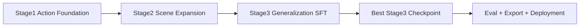

**图5-2 断点续训时序**

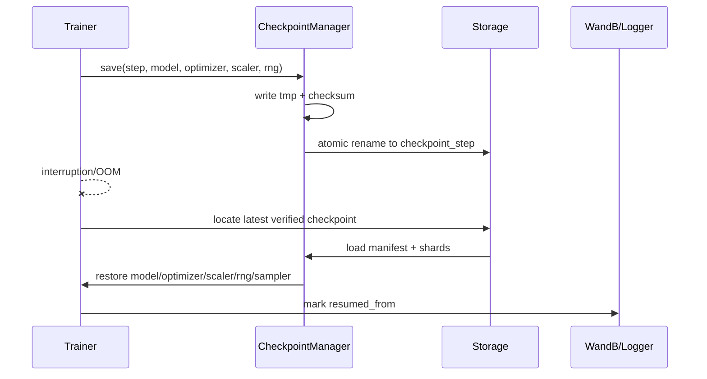

**图5-3 FSDP 参数分片同步**

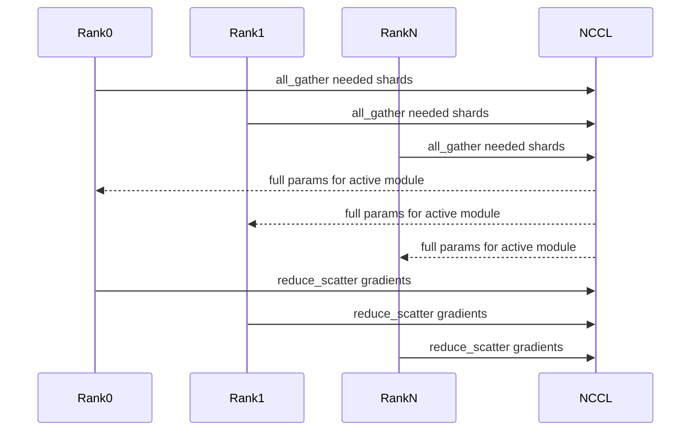

三阶段训练是本项目的工程主线。Stage1 建立基础动作能力，避免一开始被复杂场景和多数据分布拖垮；Stage2 引入 RoboCasa，提高复杂家庭/厨房场景中的视觉语言动作对齐；Stage3 引入 RoboTwin 和动态混训，专门面向 Cross Benchmark Generalization。若进入真实机器人，Stage4 作为少量示范增量适配阶段，必须启用历史回放，防止新任务过拟合。

训练阶段与 StarVLA-native 实现绑定：Stage1 跑通 `StarFlowVLA + QwenPI_v3 reuse + LayerwiseFM` 单臂闭环；Stage2 用 MLP/OFT/VLA_AdapterHeader baseline 形成 H2 对照；Stage3 通过 `future_tokens + cross-DiT` 和 `num_target_vision_tokens` 消融验证 Action Token / future token 路线；Stage3 advanced 才启用 PerceiverAdapter；Stage4 optional 才进入 7/14DoF mask 或真实机器人扩展。

| Stage | 目标 | StarVLA-native 实现 | 学习率建议 | Batch/资源 | 退出条件 |
| --- | --- | --- | --- | --- | --- |
| Stage1 | 跑通 Qwen3-VL + FM 单臂闭环 | `StarFlowVLA + QwenPI_v3 reuse + LayerwiseFM` | action head 1e-4 | 8×A100: global batch 64；5090: debug batch 2-4 | LIBERO val loss 稳定下降，smoke eval ≥60% |
| Stage2 | MLP baseline 对照 | `adapter_mode=mlp_baseline`，复用 MLP/OFT/VLA_AdapterHeader | lora 1e-5, head 1e-4 | 8×A100 FSDP；云环境优先 | MLP baseline 与 Stage1 可公平对照 |
| Stage3 | Action Token / future token 消融 | `num_target_vision_tokens=0/16/32/64` | lora 5e-6, head 5e-5 | 8×A100 或 Virtaicloud/Bita 长训 | H2 对照实验完成，完整 cross matrix 输出 |
| Stage3 advanced | Perceiver 可选扩展 | `perceiver_enabled=true` | perceiver 5e-5 | 8×A100 | 确认长 token/多视角瓶颈后启用 |
| Stage4 optional | 7/14DoF 或真实机器人扩展 | `max_action_dim=14 + action_mask` | adapter/head 1e-5 | 单机或少量 A100 | 真实机器人仿真回放和安全测试通过 |

| 阶段 | 关键配置 | StarVLA-native 路径 | 对应实验 | 进入下一阶段条件 |
| --- | --- | --- | --- | --- |
| Stage1 | `implementation_mode=starvla_native` | QwenPI_v3 reuse + LayerwiseFM | E01/E02 | shape/loss/overfit/eval smoke 全通过 |
| Stage2 | `adapter_mode=mlp_baseline` | MLP/OFT/VLA_AdapterHeader baseline | E11 | MLP 对照完成 |
| Stage3 | `adapter_mode=future_token_cross_dit` | future_tokens + cross-DiT | E13/E13-a | H2 对照实验完成 |
| Stage3 advanced | `perceiver_enabled=true` | 新增 Perceiver token compressor | E14 | N_token>512 或多视角瓶颈明确 |
| Stage4 optional | `action_mask=true` | masked loss / 7/14DoF bridge | E40 | 单臂原生路径不回退 |

## 5.2 资源预算与训练成本

资源预算用于训练排期和产业评审。下表给出默认预算，实际执行时由 Experiment Manager 根据真实 wall time、GPU 数、云平台单价和失败重跑次数生成最终成本报告。预算不是硬上限，但超过 20% 必须触发资源复盘。

| 阶段 | GPU 配置 | 预计 GPU Hours | 主要产物 | 存储增量 | 说明 |
| --- | --- | --- | --- | --- | --- |
| Stage1 | 8×A100 | 400 | LIBERO baseline checkpoint | 约 300GB | 含 smoke eval 和 2-3 次恢复测试 |
| Stage2 | 8×A100 | 600 | LIBERO+RoboCasa checkpoint | 约 500GB | 含混合比例初步搜索 |
| Stage3 | 8×A100 | 1000 | 三数据集最终 checkpoint | 约 800GB | 含 Cross Benchmark 主线评测 |
| Baseline ACT | 8×A100 | 300 | ACT 对照 checkpoint | 约 250GB | 只跑 P0 对照，不做大规模搜索 |
| Baseline DP | 8×A100 | 500 | Diffusion Policy 对照 checkpoint | 约 400GB | denoise steps 影响评测成本 |
| Eval Matrix | 1-4×A100/4090/5090 | 100-250 | 完整评测报告 | 约 200GB 视频/日志 | 按 episode 数浮动 |
| Stage4 Real Robot | 单卡 + 机器人 | 50-150 | 真实机器人适配 checkpoint | 约 100GB | 只在安全门通过后执行 |

| 成本项 | 估算公式 | 默认预算口径 | 备注 |
| --- | --- | --- | --- |
| 训练 GPU 成本 | gpu_hours × cloud_hourly_price | S1+S2+S3 ≈ 2000 GPU Hours | Virtaicloud/Bita/A100 单价以实际账单为准 |
| Baseline 成本 | ACT + DP + StarVLA/OpenVLA eval | 约 800-1000 GPU Hours | 用于论文对照，不能省略 |
| 存储成本 | (raw + processed + cache + ckpt + videos) TB-month | 初始 3-5TB | Checkpoint 保留数量影响最大 |
| 评测成本 | episodes × avg_episode_time × GPU/CPU 单价 | 完整矩阵至少 100 GPU Hours | 视频保存会显著增加存储 |
| 失败重跑缓冲 | 主预算 × 15%-25% | 默认 20% | 覆盖 OOM、NCCL、数据问题和云中断 |

## 5.3 训练配置模板
```yaml
global:
  project_name: starflow-vla
  seed: 42
  output_dir: outputs/${global.project_name}/stage${training.stage}

data:
  processed_root: data/processed/v1.0.0
  action_dim: auto
  max_action_dim: 14
  use_action_mask: true
  horizon: 8
  observation_window: 2
  image_size: 224
  mixture:
    stage1: {libero: 1.0, robocasa: 0.0, robotwin: 0.0}
    stage2: {libero: 0.5, robocasa: 0.5, robotwin: 0.0}
    stage3: {libero: 0.3, robocasa: 0.35, robotwin: 0.35}
  dataloader:
    batch_size_per_gpu: 8
    num_workers: 8
    pin_memory: true
    prefetch_factor: 2

framework:
  name: StarFlowVLA
  starflow:
    implementation_mode: starvla_native
    state_mode: discretized_instruction   # discretized_instruction | continuous_head | none
    adapter_mode: future_token_cross_dit  # mlp_baseline | future_token_cross_dit | perceiver_advanced
    flow_condition_runtime: false
    perceiver_enabled: false
  action_model:
    action_model_type: LayerwiseFM
    action_dim: 7
    state_dim: 7
    action_horizon: 16
    num_target_vision_tokens: 32
    num_inference_timesteps: 4

model:
  backbone:
    type: qwen3_vl
    pretrained_path: qwen/Qwen3-VL
    freeze_vision: true
    lora:
      enabled: true
      rank: 64
      alpha: 128
      target_modules: [q_proj, k_proj, v_proj, o_proj, up_proj, down_proj]
  adapter:
    cond_dim: 1024
    dropout: 0.1
  flow_head:
    action_dim: auto
    max_action_dim: 14
    hidden_dim: 1024
    layers: 4
    heads: 8
    solver: euler
    inference_steps: 10

training:
  stage: 1
  max_steps: 50000
  optimizer: adamw
  weight_decay: 0.01
  max_grad_norm: 1.0
  precision: bf16
  gradient_accumulation_steps: 1
  log_every: 20
  eval_every: 2000
  save_every: 5000

distributed:
  mode: fsdp
  backend: nccl
  activation_checkpointing: true
  cpu_offload: false

logging:
  wandb:
    enabled: true
    offline_fallback: true
```

## 5.4 分布式训练
| 环境 | 用途 | 推荐策略 | 注意事项 |
| --- | --- | --- | --- |
| 8×A100 | 主训练 | FSDP FULL_SHARD + bf16 + activation checkpointing | 确认 NCCL、共享存储、W&B 配置 |
| RTX 5090 | 本地调试/小样本 overfit | 单卡 bf16/fp16，小 batch | 用于功能验证，不作为最终性能结论 |
| Virtaicloud | 云端长训 | 容器固定依赖 + 挂载对象存储 | 网络抖动时启用本地日志缓存 |
| Bita | 备选云训练/评测 | 同 Virtaicloud | 保持镜像和配置一致 |

## 5.5 Checkpoint 结构
```text
outputs/starflow-vla/stage3/checkpoints/
├── checkpoint_00050000/
│   ├── manifest.json
│   ├── backbone/
│   │   ├── lora_adapter.safetensors
│   │   └── backbone_config.json
│   ├── adapter/
│   │   └── adapter.safetensors
│   ├── flow_head/
│   │   └── flow_head.safetensors
│   ├── optimizer/
│   │   ├── optimizer_rank*.pt
│   │   └── scheduler.pt
│   ├── scaler/
│   │   └── amp_scaler.pt
│   ├── rng/
│   │   ├── torch_rng.pt
│   │   ├── numpy_rng.pkl
│   │   └── sampler_state.json
│   ├── config/
│   │   ├── train_resolved.yaml
│   │   ├── model_resolved.yaml
│   │   └── data_version.yaml
│   └── metrics/
│       ├── validation.json
│       └── smoke_eval.json
├── best/
│   └── symlink_or_manifest_to_best_checkpoint
└── latest/
    └── symlink_or_manifest_to_latest_verified_checkpoint
```

Checkpoint 保存必须采用“先写临时目录、完成校验后原子重命名”的方式。`manifest.json` 至少包含 global_step、git_commit、data_version、config_hash、model_hash、optimizer_hash、rank_count、precision、best_metric 和 created_at。加载前先校验 manifest 与分片文件，校验失败时自动回退到上一个 verified checkpoint。

StarFlowVLA 每次训练必须保存抽象模块到 StarVLA-native 实现的映射，方便复现实验、评审代码改动和解释文档设计与代码实现之间的关系：

```yaml
starflow_mapping:
  framework_name: StarFlowVLA
  implementation_mode: starvla_native
  base_framework: QwenPI_v3
  action_head: LayerwiseFM
  state_mode: discretized_instruction
  adapter_mode: future_token_cross_dit
  flow_condition_runtime: false
  perceiver_enabled: false
  num_target_vision_tokens: 32
  solver: euler
  num_inference_timesteps: 4
  patch_manifest_hash: xxx
```

## 5.6 训练监控
| 指标 | 记录频率 | 用途 | 告警阈值 |
| --- | --- | --- | --- |
| loss_fm | 每 20 step | 训练收敛 | 连续 500 step NaN 或发散 |
| grad_norm | 每 20 step | 梯度稳定性 | > max_grad_norm × 5 |
| data_time | 每 20 step | DataLoader 瓶颈 | 占 step_time >40% |
| gpu_memory_allocated | 每 100 step | OOM 预警 | > GPU 显存 92% |
| samples_per_sec | 每 100 step | 吞吐 | 低于移动均值 30% |
| eval_success_rate | 每次 eval | 模型选择 | 低于基线需标注 |
| checkpoint_verify | 每次保存 | 恢复可靠性 | 失败立即告警 |

## 5.7 故障恢复
| 故障 | 检测方式 | 自动动作 | 人工动作 |
| --- | --- | --- | --- |
| OOM | 捕获 CUDA OOM 或显存阈值 | 清空缓存、降低 micro batch、启用 gradient checkpoint | 审查 image_size/horizon/batch |
| DataLoader 崩溃 | worker exit、timeout | 记录样本 id，跳过问题样本，重启 worker | 修复转换或质量规则 |
| Checkpoint 损坏 | manifest/checksum/load smoke test 失败 | 回退 latest_verified | 排查共享存储和写入中断 |
| W&B 断连 | log exception | 切换 offline log，后台重试 sync | 检查网络或 token |
| 多机通信失败 | NCCL timeout/heartbeat missing | 重启作业并 resume，必要时缩小 world size | 检查节点、IB/NVLink、容器版本 |
| Loss NaN | loss finite check | 跳过 step，降低 lr，恢复上一 checkpoint | 检查数据异常和 AMP scale |


# 6 评测设计

## 6.1 评测目标

评测系统必须回答三个问题：模型在训练数据同分布上是否能完成任务；模型跨 Benchmark 是否具备泛化能力；数据规模、混合比例和 Flow Matching 推理步数分别如何影响成功率和延迟。评测必须自动化、可复现、数据隔离，并生成可归档报告。

**图6-1 Benchmark Pipeline**

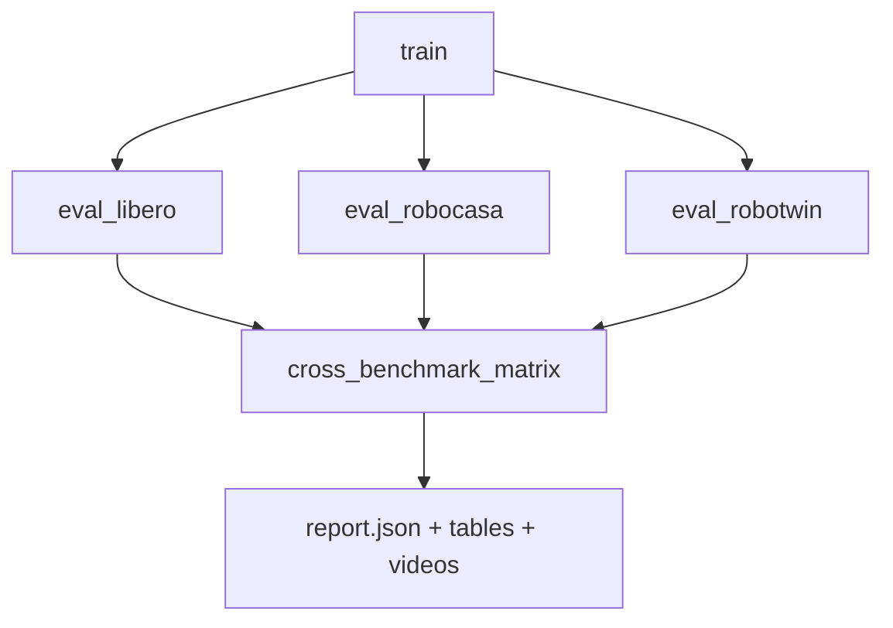

**图6-2 Cross Benchmark 评测矩阵**

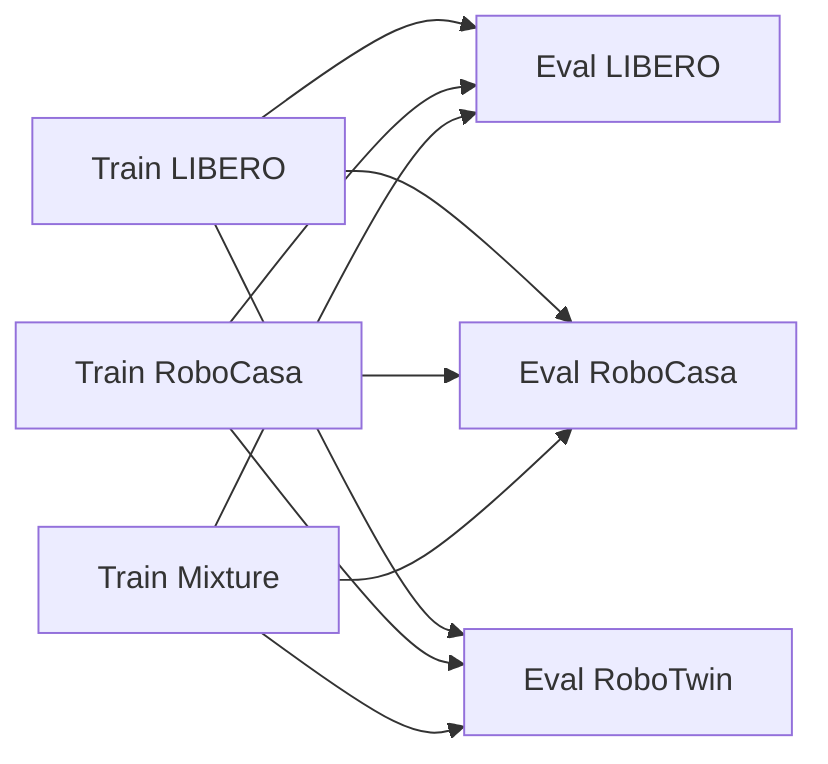

## 6.2 Benchmark Adapter 接口
```python
class BenchmarkAdapter(Protocol):
    name: str

    def list_tasks(self, split: str) -> list[str]: ...
    def reset(self, task_id: str, seed: int) -> Observation: ...
    def step(self, action: np.ndarray) -> tuple[Observation, float, bool, dict]: ...
    def is_success(self, info: dict) -> bool: ...
    def render_video(self, path: str) -> None: ...
```

## 6.3 评测矩阵
| 训练数据 | Eval LIBERO | Eval RoboCasa | Eval RoboTwin | 用途 |
| --- | --- | --- | --- | --- |
| LIBERO | 同域基础能力 | 跨场景泛化 | 跨环境泛化 | 基础 cross benchmark |
| RoboCasa | 回迁基础任务 | 同域复杂场景 | 跨环境泛化 | 场景迁移验证 |
| RoboTwin | 回迁基础任务 | 跨厨房场景 | 同域/双臂泛化 | RoboTwin 单独能力 |
| Mixture Stage3 | 最终同域 | 最终场景 | 最终泛化 | 最终模型验收 |

## 6.4 指标体系
| 指标 | 定义 | 计算方式 | 优先级 |
| --- | --- | --- | --- |
| success_rate | 任务成功率 | 成功 episode / 总 episode | P0 |
| completion_rate | 子目标完成比例 | 已达成子目标 / 总子目标 | P1 |
| action_l2 | 动作轨迹误差 | 预测动作与专家动作 L2 | P1 |
| smoothness | 轨迹平滑度 | 二阶差分均值 | P1 |
| inference_latency | 推理延迟 | p50/p95/p99 | P0 |
| safety_violation | 安全校验失败数 | 越界/速度/加速度/时间戳失败 | P0 |
| data_leak_check | 数据泄露状态 | train/eval hash intersection | P0 |
| cross_drop | 跨域性能下降 | 同域 SR - 跨域 SR | P1 |

## 6.5 Data Scaling 与 Data Mixture 实验
| 实验名 | 变量 | 固定项 | 输出 |
| --- | --- | --- | --- |
| Data Scaling | 25/50/75/100% 数据量 | 模型结构、训练步数归一、评测集 | scale-success 曲线 |
| Data Mixture | LIBERO/RoboCasa/RoboTwin 比例 | 总样本数、训练步数 | 最佳混合比例 |
| Solver Steps | Euler 1/4/8/10、RK2/RK4 | 同一 checkpoint | 延迟-成功率 Pareto 曲线 |
| LoRA Rank | r=16/32/64/128 | 数据和训练步数 | 参数-性能曲线 |
| Horizon | H=4/8/16 | 模型主干与数据 | 平滑度和成功率 |
| Adapter Ablation | DirectProj/MLP/ActionToken/Perceiver | 同数据、同训练预算 | H2 与模型复杂度收益 |
| Condition Injection | Additive/AdaLN/Cross Attention | 同 checkpoint 或同训练预算 | 条件注入方式对成功率和稳定性的影响 |
| 7DoF/14DoF Compatibility | single-arm/bimanual-ready batch | max_action_dim=14 + mask | 接口兼容性和 mask correctness |

## 6.6 自动评测命令
```bash
python scripts/eval_matrix.py   --checkpoint outputs/starflow-vla/stage3/best   --benchmarks libero robocasa robotwin   --seeds 0 1 2   --num-episodes 50   --output outputs/eval/stage3_cross_matrix
```

## 6.7 报告结构
```text
outputs/eval/stage3_cross_matrix/
├── report.md
├── report.json
├── metrics_by_task.csv
├── cross_benchmark_matrix.csv
├── latency_profile.json
├── safety_violations.json
├── videos/
└── artifacts_manifest.json
```

## 6.8 Baseline 体系

Baseline 不是可选展示项，而是验证研究假设的必要条件。本项目至少保留四类 Baseline：ACT、Diffusion Policy、OpenVLA、StarVLA 原版。Baseline 的作用不是改变主路线，而是在同一数据、同一评测、同一资源记录下回答 Flow Matching、Action Token Adapter 和 StarVLA 扩展是否真实带来收益。其中 ACT 是 H1 的核心对照；MLP Adapter 是 H2 的核心对照；Diffusion Policy 只作为连续动作生成和延迟 Pareto 参考，不再承担“FM 推理速度更快”这一已接近共识的问题。

| Baseline | 定位 | 接入方式 | 对照问题 | 约束 |
| --- | --- | --- | --- | --- |
| ACT | 长时序动作 chunk 基线 | 作为 StarVLA ActionHead 插件接入 | Flow Matching 是否优于行为克隆式 chunk 预测 | 不作为主策略，只做受控对照 |
| Diffusion Policy | 连续动作生成强基线 | 复用统一数据和 Benchmark Adapter | 延迟-成功率 Pareto 参考，不作为核心研究假设 | denoise steps 必须记录 |
| OpenVLA | 开源 VLA 基线 | 尽量通过统一评测接口评估 | Qwen3-VL + StarVLA + FM 相比开源 VLA 的收益 | 若动作空间不一致，必须记录转换差异 |
| StarVLA 原版 | 框架默认能力基线 | 使用原生 Action Head/配置 | 本项目扩展模块是否带来收益 | 同数据版本和同评测矩阵 |
| MLP/OFT/VLA_AdapterHeader + FM | 本项目内部低成本条件基线 | StarVLA-native `adapter_mode=mlp_baseline` | future_tokens + cross-DiT 是否提升泛化 | 作为 E11/E13 对照 |

Baseline 报告必须包含相同字段：`baseline_name`、`action_space`、`train_data_version`、`checkpoint_manifest`、`gpu_hours`、`solver_or_steps`、`success_rate`、`latency_p95`、`failure_category`。不同 Baseline 若因接口限制无法完全统一动作空间，必须在报告中标注为“非严格同构对照”，不得直接用于核心结论。

## 6.9 Cross Benchmark Generalization Methodology

Cross Benchmark Generalization 是本项目的核心研究问题，不只是“多跑几个评测集”。本项目把泛化拆成五类可执行实验：Train-A/Test-B、Train-AB/Test-C、Leave-One-Benchmark-Out、Mixture Transfer、Scaling Transfer。每类实验都必须固定数据版本、训练步数、模型结构和评测脚本，避免把训练预算差异误判为泛化能力差异。

| 方法 | 训练设置 | 测试设置 | 回答的问题 | 关键指标 |
| --- | --- | --- | --- | --- |
| Train-A Test-B | 只使用单一 Benchmark A | 在 B/C 上评测 | 单数据集学到的能力能否迁移 | cross_success_rate、cross_drop |
| Train-AB Test-C | 混合两个 Benchmark | 留出第三个 Benchmark | 多源训练是否产生组合泛化 | leave_out_success、failure_category |
| Leave-One-Benchmark-Out | 三选二训练 | 未见 Benchmark 测试 | 泛化是否依赖某一数据源 | LOBO 平均分、最差分 |
| Mixture Transfer | 固定总数据量，改变混合比例 | 三 Benchmark 完整矩阵 | 最优混合比例是否稳定 | mixture_pareto、negative_transfer |
| Scaling Transfer | 25/50/75/100% 数据规模 | 同域 + 跨域 | 数据规模收益能否迁移到未见分布 | scaling_slope、transfer_gap |
| Solver Transfer | 同一 checkpoint | 不同 solver steps/solver 类型 | 推理效率优化是否损伤泛化 | latency-success Pareto |

### 6.9.1 泛化报告的失败归因

每个失败 episode 不只记录失败与否，还要归到可分析类别。默认失败类别包括：目标物体识别失败、语言目标解析失败、接触点错误、抓取失败、放置失败、动作过慢、动作抖动、时序超时、安全门拦截、环境 reset 异常。失败归因先用规则和日志自动标注，再抽样人工复核。论文和项目报告中只使用经过复核的失败分布。

| 失败类别 | 自动判据 | 后续动作 |
| --- | --- | --- |
| 目标识别失败 | 视觉注意区域与目标物体无重叠或第一段动作方向错误 | 检查 Adapter/Cross Attention |
| 语言解析失败 | 同一视觉场景不同指令输出近似动作 | 增加语言模板和 VLM replay |
| 接触点错误 | 末端到目标距离下降但接触失败 | 增强 wrist view 和 action token |
| 抓取失败 | gripper 时机错误或闭合后物体未移动 | 调整 gripper loss 权重 |
| 放置失败 | 已抓取但目标区域偏差大 | 检查 horizon 和 chunk embedding |
| 安全拦截 | SafetyGate reject/clip 次数超阈值 | 检查动作归一化和 sim2real limits |

### 6.9.2 Cross Benchmark 统计规则

所有 Cross Benchmark 结论至少使用 3 个随机种子，每个 Benchmark 每个任务族至少 50 个 episode。报告中必须同时给均值、标准差、最差任务族和失败类别分布。若某实验均值提升但最差任务族下降超过 5 个百分点，不允许直接宣称泛化提升，必须标记为“平均提升但鲁棒性下降”。

## 6.10 Inference Scaling Law

Inference Scaling 研究 Flow Matching 推理步数、求解器类型、动作 horizon、动作成功率和延迟之间的 Pareto 关系。本节不是核心研究假设，不再用于证明“FM 推理速度优于 Diffusion”；它主要服务 H8，回答“FM 下最优 horizon 和最小可接受推理步数如何随部署预算变化”。该研究必须使用同一个 checkpoint，固定 observation、随机种子和安全后处理，避免把模型训练差异混入推理缩放结论。

| 变量 | 取值 | 固定项 | 输出 | 结论形式 |
| --- | --- | --- | --- | --- |
| Euler steps | 1/2/4/8/10/16 | 同一 checkpoint、同一 eval seeds | success_rate、latency_p50/p95、smoothness | Euler Pareto 曲线 |
| Solver type | Euler/RK2/RK4 | 相同有效函数调用预算 | 成功率与延迟 | 高阶求解器是否值得 |
| Horizon | 4/8/16 | solver steps 固定 | 成功率、漂移、重规划频率 | Horizon-Drift 曲线 |
| Rerank candidates | 1/3/5 | solver 固定 | 成功率、延迟、动作方差 | Rerank 收益曲线 |
| CUDA Graph/TensorRT | on/off | solver 固定 | latency、numerical error | 部署优化收益 |

推理缩放报告必须给出 `success_rate = f(latency_p95)` 图和 `success_rate = f(num_function_evals)` 图。若某步数在同域成功率可接受但跨 Benchmark 明显下降，部署默认不能采用该步数，只能作为低延迟模式保留。

## 6.11 Experiment Matrix

最终实验矩阵分为主线实验、模型消融、数据消融、推理效率和真实机器人预研五组。主线实验必须完整执行；消融实验可按资源情况分批执行，但至少覆盖 Adapter、Flow Solver、Data Mixture 三条关键轴。

Adapter 相关实验必须采用“双层映射”记录，避免把抽象研究变量误解成必须新增同名 runtime 类。P0 研究主线不以是否实现同名 Adapter 类为验收标准，而以是否能够形成有效受控实验为标准。MLP baseline 与 future-token/cross-DiT 机制即可支撑 H2 的核心实验；PerceiverAdapter 属于 advanced 扩展，不影响 P0 闭环。

| 实验 | 抽象研究变量 | StarVLA-native 实现 | 是否 P0 | 目的 |
| --- | --- | --- | --- | --- |
| E11 | MLPAdapter baseline | MLP/OFT/VLA_AdapterHeader baseline | 是 | 建立低成本对照 |
| E13 | ActionTokenAdapter | LayerwiseFM/GR00T future_tokens + cross-DiT | 是 | 验证 action-token/future-token 条件机制 |
| E13-a | Action token 数量 | `num_target_vision_tokens=0/16/32/64` | 是 | 分析 planning slot 数量影响 |
| E13-b | State path | `discretized_instruction` vs `continuous_head` | P1 | 比较状态文本化与连续 head state_encoder |
| E14 | PerceiverAdapter | 新增 Perceiver token compressor | 否，advanced | 长 token / 多视角压缩研究 |
| E15 | FlowCondition runtime | 显式 dataclass + wrapper | 否，P2/advanced | 统一 adapter/head 接口诊断 |
| E40 | 7/14DoF mask | max_action_dim=14 + action_mask | P1 | 单臂/双臂接口兼容 |

| Exp | Dataset | Adapter | FM/Solver | Horizon | 目标 |
| --- | --- | --- | --- | --- | --- |
| E01 | LIBERO | StarFlowVLA native | LayerwiseFM Euler10 | 8 | Stage1 基线 |
| E02 | LIBERO | StarFlowVLA native | LayerwiseFM Euler10 | 16 | Action Chunk 长度影响 |
| E03 | LIBERO | future_tokens + cross-DiT | LayerwiseFM Euler10 | 8 | future token 是否提升基础能力 |
| E04 | LIBERO | MLP | Euler4 | 8 | 少步推理下限 |
| E05 | LIBERO | MLP | RK2-5 | 8 | 求解器质量对比 |
| E06 | RoboCasa | MLP | Euler10 | 8 | 复杂场景单训 |
| E07 | RoboTwin | MLP | Euler10 | 8/14 | RoboTwin 单训 |
| E08 | LIBERO+RoboCasa 50/50 | MLP | Euler10 | 8 | Stage2 主线 |
| E09 | LIBERO+RoboCasa 70/30 | MLP | Euler10 | 8 | 混合比例偏 LIBERO |
| E10 | LIBERO+RoboCasa 30/70 | MLP | Euler10 | 8 | 混合比例偏 RoboCasa |
| E11 | LIBERO+RoboCasa+RoboTwin 30/35/35 | MLP/OFT/VLA_AdapterHeader | Euler10 | 8 | MLP baseline |
| E12 | 三数据集动态混合 | MLP | Euler10 | 8 | 动态权重策略 |
| E13 | 三数据集 | future_tokens + cross-DiT | Euler10 | 8 | H2 主线增强模型 |
| E14 | 三数据集 | Perceiver advanced | Euler10 | 8 | 多视角长 token 适配 |
| E15 | 三数据集 | FlowCondition runtime wrapper | Euler10 | 8 | 接口诊断，不作 P0 |
| E16 | 三数据集 | MLP | Euler1 | 8 | 极限低延迟 |
| E17 | 三数据集 | MLP | Euler4 | 8 | 部署折中 |
| E18 | 三数据集 | MLP | Euler8 | 8 | 部署折中 |
| E19 | 三数据集 | MLP | RK4-2 | 8 | 少步高阶求解 |
| E20 | 三数据集 | MLP | Euler10 | 4 | 短 horizon |
| E21 | 三数据集 | MLP | Euler10 | 16 | 长 horizon |
| E22 | 25% 三数据集 | MLP | Euler10 | 8 | Data Scaling 25% |
| E23 | 50% 三数据集 | MLP | Euler10 | 8 | Data Scaling 50% |
| E24 | 75% 三数据集 | MLP | Euler10 | 8 | Data Scaling 75% |
| E25 | 100% 三数据集 | MLP | Euler10 | 8 | Data Scaling 100% |
| E26 | Train LIBERO | MLP | Euler10 | 8 | Train-A Test-B |
| E27 | Train RoboCasa | MLP | Euler10 | 8 | Train-A Test-B |
| E28 | Train RoboTwin | MLP | Euler10 | 8 | Train-A Test-B |
| E29 | Train LIBERO+RoboCasa Test RoboTwin | MLP | Euler10 | 8 | Leave-One-Benchmark-Out |
| E30 | Train LIBERO+RoboTwin Test RoboCasa | MLP | Euler10 | 8 | Leave-One-Benchmark-Out |
| E31 | Train RoboCasa+RoboTwin Test LIBERO | MLP | Euler10 | 8 | Leave-One-Benchmark-Out |
| E32 | 三数据集 + Piper demos | ActionToken-XAttn | Euler10 | 8 | Sim2Real 预研 |
| E33 | 三数据集 + MOZ1 demos | ActionToken-XAttn | Euler10 | 8/14 | MOZ1 预研 |
| E34 | 三数据集 | ACT Head | N/A | 8/16 | ACT Baseline |
| E35 | 三数据集 | Diffusion Policy Head | DP-20/50 | 8 | Diffusion Policy Baseline |
| E36 | 三数据集 | OpenVLA Eval | native | native | OpenVLA Baseline |
| E37 | 三数据集 | StarVLA 原版 | native | native | StarVLA 原版 Baseline |
| E38 | 三数据集 Curriculum | MLP | Euler10 | 8 | H4 Curriculum Mixing vs Random Mixing |
| E39 | 三数据集 + Failure Replay | MLP | Euler10 | 8 | H5 Hard Example Replay vs Uniform Sampling |
| E40 | 三数据集 + Embodiment Token | ActionToken-XAttn | Euler10 | 8/14 | H6 Embodiment Token 消融 |

### 6.11.1 H2-a / H2-b Algorithm Optimization Matrix

本矩阵只定义实验设计和记录字段，不声明任何已完成指标。所有 `success_rate`、loss 曲线、显存、延迟和跨 Benchmark 结果在未完成 Stage B A100 复验前，必须写为 `[待 Stage B A100 复验]`、`[待 LIBERO eval]` 或 `[待 RoboCasa / RoboTwin eval]`，不得用本地 dry-run 结果替代。

| exp_id | hypothesis_id | config path | benchmark | state_mode | num_target_vision_tokens | action_dim | action_horizon | metrics | stage | status |
| --- | --- | --- | --- | --- | --- | --- | --- | --- | --- | --- |
> 说明：ft=8 曾为早期候选，当前 P0/P1 可执行矩阵已冻结为 0/16/32/64，不分配当前 E-H2a 编号；ft=8 仅可作为资源充足时的补充 dense-sweep，不进入当前执行矩阵。

| E-H2a-01 | H2-a | configs/starflow_vla/ablations/future_tokens_0.yaml | LIBERO small | discretized_instruction | 0 | 7 | 8 | overfit_steps/loss_finite/NaN/peak_memory/latency/action_smoothness | P0 Stage B | [待 Stage B A100 复验] |
| E-H2a-02 | H2-a | configs/starflow_vla/ablations/future_tokens_16.yaml | LIBERO full | discretized_instruction | 16 | 7 | 8 | success_rate/loss_curve/peak_memory/latency/task_length_success | P0/P1 | [待 Stage B A100 复验] |
| E-H2a-03 | H2-a | configs/starflow_vla/stage1_starflow_qwenpi_v3_native.yaml | LIBERO full | discretized_instruction | 32 | 7 | 8 | success_rate/loss_curve/peak_memory/latency/task_length_success | P0/P1 | P0-M5-Stage1 baseline 默认配置，长训进行中；run_id 命名标签误写为 E-H2a-04，实际对应 E-H2a-03 |
| E-H2a-04 | H2-a | configs/starflow_vla/ablations/future_tokens_64.yaml | LIBERO full（P1）/ RoboCasa/RoboTwin（P2） | discretized_instruction | 64 | 7/14 | 8/16 | cross_drop/worst_family/peak_memory/latency/task_length_success | P1/P2 | [待 LIBERO eval] / [待 RoboCasa / RoboTwin eval] |
| E-H2b-01 | H2-b | configs/starflow_vla/state/discretized_instruction.yaml | LIBERO small/full | discretized_instruction | 32 | 7 | 8 | success_rate/state_sensitive_success/overfit_steps/smoothness/noise_robustness | P0/P1 | P0-M5-Stage1 baseline 默认路径 |
| E-H2b-02 | H2-b | configs/starflow_vla/state/continuous_head.yaml | LIBERO full | continuous_head | 32 | 7 | 8 | success_rate/state_sensitive_success/loss_curve/smoothness/latency | P1 | [待 LIBERO eval] |
| E-H2b-03 | H2-b | configs/starflow_vla/state/hybrid_gated.yaml | LIBERO full | hybrid_gated | 32 | 7 | 8 | success_rate/state_sensitive_success/noise_robustness/missing_state_robustness/latency | P2 | [待 Stage B A100 复验] |
| E-H2b-04 | H2-b | configs/starflow_vla/state/hybrid_gated_cross.yaml | RoboCasa/RoboTwin/cross | hybrid_gated | 32 | 7/14 | 8/16 | cross_drop/long_horizon_success/noise_robustness/worst_family | P2 | [待 RoboCasa / RoboTwin eval] |

### 6.11.2 实验优先级

P0 实验为 StarFlowVLA framework registry smoke、QwenPI_v3 reuse、LayerwiseFM 单臂 7DoF 闭环、E01、E08-E13、E13-a、E-H2a-01、E-H2a-02、E-H2b-01（与 E-H2a-03 同一场 baseline 训练覆盖）、E26-E31、E34，以及 `starflow_mapping` manifest 和 MLP/OFT/VLA_AdapterHeader baseline 对照。P1 实验为 E-H2a-04、E-H2b-02、E13-b、E38-E40、`max_action_dim=14 + action_mask`、masked loss、`continuous_head` state path 和 solver manifest。P2/advanced 实验为 E-H2b-03、E-H2b-04、E14、E15、细粒度 condition injection ablation、bimanual coordination loss、E16-E21、E32-E33 和真实机器人预研，只有在 P0/P1 安全门和回放评测通过后进入。E22-E25 不再验证“Scaling Law 是否存在”，只用于分析 Scaling Transfer、收益递减和负迁移边界。

## 6.12 验收规则

评测任务启动前必须先运行数据泄露检查。评测输出必须包含配置快照、Checkpoint manifest、数据版本、任务列表、随机种子、指标统计和失败样例索引。任何缺失这些元信息的评测结果不得用于项目验收。


# 7 推理部署设计

## 7.1 部署目标

部署链路必须支持三种形态：离线批量评测、仿真在线推理、真实机器人在线推理。离线评测强调吞吐和可复现；仿真在线推理强调接口稳定和视频回放；真实机器人推理强调低延迟、安全门和热加载回滚。

**图7-1 部署拓扑**

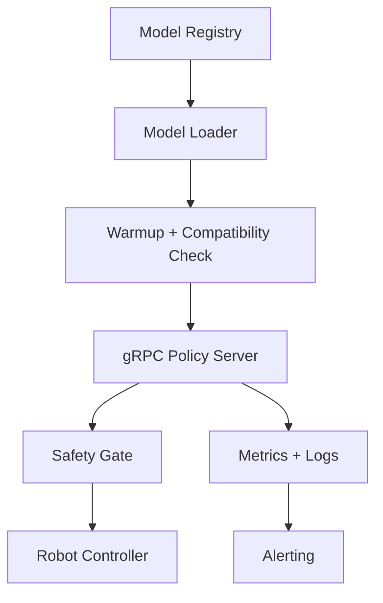

**图7-2 热加载安全锁**

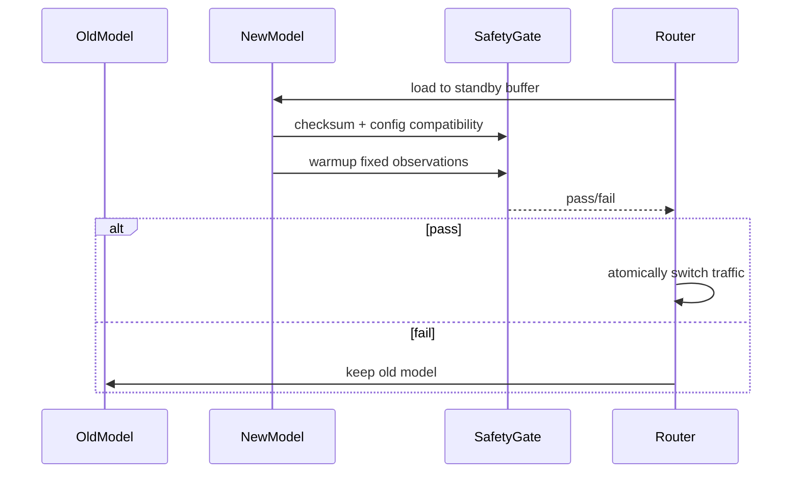

## 7.2 导出策略
| 组件 | 默认部署形态 | 优化路径 | 说明 |
| --- | --- | --- | --- |
| Qwen3-VL Backbone | PyTorch/HF + bf16 | vLLM 或编译优化视接口支持而定 | 视觉语言主干较复杂，优先保持正确性 |
| Action Adapter | PyTorch module | TorchScript/ONNX | 结构简单，易导出 |
| Flow Head | PyTorch module | ONNX/TensorRT/CUDA Graph | 部署优化重点 |
| SafetyGate | Python/C++ 均可 | C++/Rust 可选 | 真实机器人低延迟场景可下沉 |
| PolicyServer | gRPC | 共享内存/UDP for robot local | 按机器人控制器接口选择 |

## 7.3 延迟预算
| 阶段 | A100 目标 | 5090 目标 | 优化手段 |
| --- | --- | --- | --- |
| 图像预处理 | ≤10ms | ≤15ms | 异步解码、预分配 buffer |
| Qwen3-VL 编码 | ≤100ms | ≤150ms | bf16、KV/cache、torch compile |
| Adapter | ≤5ms | ≤8ms | 融合到计算图 |
| Flow Head Euler 10步 | ≤50ms | ≤80ms | CUDA Graph、TensorRT |
| 后处理+安全 | ≤5ms | ≤5ms | 向量化限位检查 |
| 总延迟 | ≤200ms | ≤300ms | 按控制频率决定 execute_steps |

## 7.4 推理服务接口
```protobuf
service PolicyService {
  rpc PredictAction(PredictActionRequest) returns (PredictActionResponse);
  rpc HealthCheck(HealthCheckRequest) returns (HealthCheckResponse);
  rpc LoadModel(LoadModelRequest) returns (LoadModelResponse);
}

message PredictActionRequest {
  string request_id = 1;
  bytes rgb_front = 2;
  optional bytes rgb_wrist = 3;
  string instruction = 4;
  repeated float robot_state = 5;
  double timestamp = 6;
}

message PredictActionResponse {
  string request_id = 1;
  repeated float action_chunk = 2;
  int32 horizon = 3;
  int32 action_dim = 4;
  bool safety_pass = 5;
  string safety_message = 6;
  double latency_ms = 7;
}
```

## 7.5 安全门
| 校验 | 规则 | 失败动作 |
| --- | --- | --- |
| 动作范围 | 归一化动作和物理动作均在限位内 | clip 或 reject |
| 速度/加速度 | 相邻动作变化低于机器人阈值 | 平滑或 reject |
| 关节限位 | IK 后关节位于官方 limits 内 | reject |
| 时间戳 | 请求和执行偏差 ≤10ms 或配置阈值 | reject and hold |
| 通信状态 | 机器人心跳正常 | stop |
| 热加载状态 | 新模型未完成 warmup 前不接流量 | keep old model |

## 7.6 部署配置模板
```yaml
deployment:
  mode: simulation_online
  checkpoint: outputs/starflow-vla/stage3/best
  device: cuda:0
  precision: bf16
  server:
    protocol: grpc
    host: 0.0.0.0
    port: 8080
    workers: 2
  inference:
    solver: euler
    solver_steps: 10
    execute_steps: 2
    use_cuda_graph: true
    use_tensorrt_flow_head: false
  safety:
    enabled: true
    max_delta_position: 0.05
    max_delta_rotation: 0.25
    max_velocity: 1.0
    max_acceleration: 2.0
    timestamp_tolerance_ms: 10
  hot_reload:
    enabled: true
    standby_buffer: true
    warmup_requests: 32
    rollback_on_failure: true
```

## 7.7 ONNX、TensorRT、vLLM 与 CUDA Graph 使用边界

ONNX/TensorRT 优先用于 Action Adapter 和 Flow Head，因为这两部分结构稳定、输入输出固定、收益明确。Qwen3-VL Backbone 是否接入 vLLM 或其他推理引擎，取决于当时对视觉语言输入、LoRA 合并和特征输出接口的支持情况；若支持不完整，宁可保留 PyTorch/HF 路径，避免为了吞吐破坏动作特征一致性。CUDA Graph 适合固定 batch、固定 image_size、固定 horizon 和固定 solver steps 的在线推理配置，启用前必须完成 golden input 一致性对比。

## 7.8 Sim2Real Design

真实机器人路线采用“仿真评测通过 → 回放验证 → 低速闭环 → 正常速度闭环”的四级门禁。Piper 和 MOZ1 不作为当前主训练数据源，但作为未来真实机器人迁移目标进入部署设计。Piper 主要用于单臂低成本验证，MOZ1 主要用于移动或双臂能力预研。所有真实机器人适配都必须通过 Robot Abstraction Layer，不能绕过 SafetyGate 直接消费模型输出。

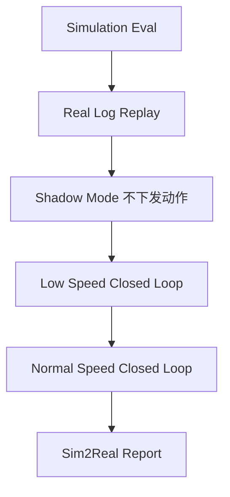

| 机器人 | 定位 | 动作空间 | 观测配置 | 接入要求 |
| --- | --- | --- | --- | --- |
| Piper | 单臂真实机器人验证 | 7DoF canonical action → Piper 控制接口 | front camera + optional wrist + proprio | 完成低速限位、急停、回放一致性 |
| MOZ1 | 双臂/移动操作预研 | 14DoF 或 mobile-base + arm 扩展 | 多视角 + 双臂 proprio + base state | 先在仿真和 shadow mode 验证 |
| Franka | 与三 Benchmark 对齐的基准实体 | 7DoF | front/wrist + joint/tcp | 优先用于 sim2real 对照 |

### 7.8.1 Observation Gap

Observation Gap 来自相机内参、视角高度、光照、背景纹理、物体外观和图像压缩差异。设计上通过三层处理降低差距：第一，训练和部署使用完全一致的 resize/normalize/crop；第二，评测加入光照、遮挡、视角扰动；第三，真实机器人进入前采集少量无动作 observation log，用 Qwen3-VL 特征分布和仿真分布做距离检查。若真实 observation 的特征分布偏移超过阈值，不能直接闭环执行，只能先做 shadow mode。

### 7.8.2 Dynamics Gap

Dynamics Gap 来自真实机械臂摩擦、控制器响应、末端负载和夹爪接触差异。Flow Matching 输出的是动作块，不直接解决动力学差异，因此部署侧必须执行动作限幅、低通平滑、低速试运行和轨迹偏差检测。对于 Piper/MOZ1，第一版只允许使用保守速度和加速度阈值，待回放与低速闭环通过后再提高控制频率。

### 7.8.3 Action Delay

真实机器人闭环中，图像采集、模型推理、网络传输和控制器执行都会引入延迟。部署请求必须携带 timestamp，Robot Adapter 在执行前计算动作年龄。若动作年龄超过阈值，直接丢弃并保持当前位置。Action Chunk 的 `execute_steps` 需要根据端到端 p95 延迟决定：延迟越高，单次执行步数越少，重规划越频繁。

| 延迟来源 | 测量方式 | 阈值建议 | 缓解 |
| --- | --- | --- | --- |
| 图像采集 | camera timestamp 到 server receive | ≤30ms | 本地相机进程、降低分辨率 |
| 模型推理 | server receive 到 action ready | ≤200ms | Flow Head TensorRT/CUDA Graph |
| 网络传输 | action ready 到 controller receive | ≤20ms | 本机部署或局域网 UDP/共享内存 |
| 控制执行 | controller receive 到 joint state change | ≤20ms | 控制器频率与 execute_steps 匹配 |

### 7.8.4 Safety Layer

真实机器人安全层分为模型前、模型后和硬件端三层。模型前检查 observation 是否过期、相机是否掉线、本体状态是否异常；模型后检查动作范围、速度、加速度、IK 可达性、夹爪时机和 timestamp；硬件端保留急停、力矩阈值和通信超时保护。任何一层失败都必须记录到 safety log，并阻止本次动作下发。

### 7.8.5 Domain Randomization 与扰动注入

Sim2Real 的核心不是最后临时调参，而是在训练和评测阶段提前暴露模型会遇到的真实分布偏移。默认扰动分为视觉扰动、传感器噪声、动力学扰动和延迟扰动四类。扰动必须在配置中显式记录，评测报告要区分 clean、mild、hard 三档结果。

| 扰动类别 | 参数 | 默认范围 | 目的 |
| --- | --- | --- | --- |
| Visual Perturbation | brightness/contrast/hue/blur/occlusion | 亮度 0.6-1.4，遮挡 0-30% | 模拟真实光照、反光、遮挡 |
| Camera Perturbation | extrinsic jitter/crop/resize | 角度 ±5°，平移 ±3cm | 模拟相机安装误差 |
| Sensor Noise | proprio noise/timestamp jitter/dropout | 关节噪声 0.5°，时间抖动 5-20ms | 模拟编码器与同步误差 |
| Latency Injection | observation delay/action delay/network delay | 10/30/50/100ms | 训练和评测延迟鲁棒性 |
| Dynamics Randomization | mass/friction/controller gain | 按仿真环境支持配置 | 模拟真实动力学差距 |
| Action Noise | small Gaussian + clipping | 位置 1-5mm，旋转 0.5-2° | 评估控制误差容忍度 |

### 7.8.6 Calibration

真实机器人接入前必须完成相机内参、相机外参、机器人基坐标、末端工具坐标、夹爪开合范围和控制频率标定。标定文件进入 deployment config，并参与 checkpoint/export manifest 记录。任何标定文件变化都必须触发 shadow mode 复测，不能沿用旧的真实机器人评测结论。

```yaml
calibration:
  robot: piper
  camera:
    front_intrinsic: configs/calib/piper/front_intrinsic.yaml
    front_extrinsic: configs/calib/piper/front_to_base.yaml
    wrist_intrinsic: configs/calib/piper/wrist_intrinsic.yaml
  tool:
    tcp_offset: [0.0, 0.0, 0.12, 0.0, 0.0, 0.0]
  gripper:
    open_width: 0.08
    close_width: 0.0
  timing:
    control_freq: 10
    timestamp_tolerance_ms: 10
```

### 7.8.7 Safety Envelope

Safety Envelope 是真实机器人执行空间的硬约束集合，优先级高于模型输出。它包括工作空间盒、关节限位、速度/加速度上限、力矩阈值、夹爪接触阈值和禁入区域。Piper/MOZ1 的第一阶段只允许在缩小工作空间内运行；扩大 envelope 需要单独评审。

| Envelope 项 | 示例 | 失败动作 |
| --- | --- | --- |
| workspace_box | x/y/z min-max | reject and hold |
| joint_limits | robot official lower/upper | reject |
| velocity_limit | per joint / tcp velocity | clip or reject |
| acceleration_limit | per joint / tcp acceleration | smooth or reject |
| force_limit | force/torque threshold | emergency stop |
| forbidden_zone | 桌面边缘、人体区域、线缆区域 | replan or stop |

### 7.8.8 Sim2Real 验收

Sim2Real 不以一次成功视频作为验收标准，而以可复现指标作为验收。进入真实闭环前，必须完成 100 条真实 observation 的 shadow mode 推理、10 条回放轨迹的动作误差检查、低速闭环 20 个 episode 无安全拦截异常，以及所有失败 episode 的根因记录。


# 8 工程实现与接口

## 8.1 开发任务拆分
**图8-1 代码模块依赖**

```mermaid
graph TD
  configs --> starvla_ext
  starvla_ext --> data
  starvla_ext --> models
  starvla_ext --> training
  starvla_ext --> evaluation
  starvla_ext --> deployment
  data --> tests
  models --> tests
  training --> tests
  evaluation --> tests
```

| 任务 | Owner | 输入 | 输出 | 测试 |
| --- | --- | --- | --- | --- |
| T0 StarVLA 源码审计 | 算法/平台 | 当前 StarVLA repo | starvla_capability_audit.md + patch_plan | 能力矩阵与扩展点确认 |
| T1 数据 Schema 与转换 | 数据工程 | raw datasets | processed v1.0.0 | schema/action mapping tests |
| T2 UnifiedDataLoader | 数据/训练平台 | manifest/cache | batch | throughput + shape tests |
| T3 Qwen3-VL Wrapper | 算法 | Qwen3-VL weights | features | feature shape/golden tests |
| T4 Adapter/Flow Head | 算法 | features/actions | loss/sample | finite loss/overfit tests |
| T5 StageTrainer | 训练平台 | model/config/data | checkpoint/logs | resume tests |
| T6 Benchmark Adapter | 评测 | policy/benchmarks | metrics/report | eval smoke tests |
| T7 Deployment Server | 部署 | checkpoint | gRPC action service | latency/safety tests |
| T8 Risk Automation | 平台/运维 | logs/metrics | alerts/recovery | fault injection |

## 8.2 StarFlowVLA 代码结构与 StarVLA-native 接入

StarFlowVLA 的代码新增必须集中、可追踪、最小侵入。不要复制 `QwenPI_v3.py` 形成一份大体重复的 `StarFlowVLA.py`；`StarFlowVLA.py` 应继承 `Qwen_PI_v3`，或者通过组合复用 QwenPI_v3 内部构建结果。只有新增 hook、mapping、advanced adapter、masked loss 和 manifest 相关逻辑才放在 StarFlowVLA 或 `starflow_vla/` 命名空间。

```text
starVLA/
  model/
    framework/
      VLM4A/
        QwenPI_v3.py
        StarFlowVLA.py              # 新增：继承 Qwen_PI_v3，不复制主体逻辑

    modules/
      starflow_vla/
        __init__.py
        mapping.py                  # 抽象设计到 StarVLA-native 的映射
        flow_condition.py            # 可选：文档抽象 / 日志协议
        state_bridge.py              # 可选：state path 管理
        perceiver_adapter.py         # advanced 新增
        masked_loss.py               # P1: action_mask / 7/14DoF
        action_mask_utils.py

configs/
  starflow_vla/
    stage1_starflow_qwenpi_v3_native.yaml
    stage2_mlp_baseline.yaml
    stage3_future_token_ablation.yaml
    stage3_perceiver_advanced.yaml
    stage4_action_mask_14d.yaml

docs/
  starflow_vla/
    MODULE_MAPPING.md
    PATCH_MANIFEST.md
    EXPERIMENT_MATRIX.md
```

StarFlowVLA 采用 facade + hook 方式接入 StarVLA：对外注册 `@FRAMEWORK_REGISTRY.register("StarFlowVLA")`；对内继承 `Qwen_PI_v3`，复用其 `qwen_vl_interface`、`project_layers`、`action_model`、forward/predict_action 主体逻辑；通过少量 hook 切换 `state_mode`、`adapter_mode`、`perceiver_enabled`，而不是复制整段 forward。P0 不强制 runtime FlowCondition；PerceiverAdapter 和 action_mask/masked_loss 作为可选扩展。

```python
@FRAMEWORK_REGISTRY.register("StarFlowVLA")
class StarFlowVLA(Qwen_PI_v3):
    def prepare_instruction_and_state(self, instructions, state, phase: str):
        mode = self.config.framework.starflow.get("state_mode", "discretized_instruction")

        if mode == "discretized_instruction":
            return super().prepare_instruction_and_state(instructions, state, phase)

        if mode == "continuous_head":
            return instructions, state

        if mode == "none":
            return instructions, None

        raise ValueError(f"Unknown state_mode: {mode}")

    def postprocess_vl_embs_for_action(self, vl_embs_list, attention_mask):
        if getattr(self, "perceiver_adapter", None) is not None:
            return self.perceiver_adapter(vl_embs_list, attention_mask)
        return vl_embs_list, attention_mask

    def describe_starflow_mapping(self):
        return {
            "abstract.StateEncoding": self.config.framework.starflow.state_mode,
            "abstract.Adapter": self.config.framework.starflow.adapter_mode,
            "abstract.ActionTokenAdapter": "LayerwiseFM.future_tokens + cross-DiT",
            "abstract.FlowCondition": "implicit StarVLA-native tensors",
            "abstract.FlowHead": type(self.action_model).__name__,
        }
```

该设计保持 StarFlowVLA 对外接口独立，同时避免重复构建 Qwen3-VL、project_layers 和 Flow Matching action head。

## 8.3 核心接口定义
以下接口是文档抽象层的统一解释接口，便于测试和评审理解。StarVLA-native P0 实现不要求逐字新增 `VLAFlowPolicy` 类；实际工程以 `StarFlowVLA` framework、QwenPI_v3 hook、LayerwiseFM/GR00T action head 和 `starflow_mapping` manifest 为准。

```python
@dataclass
class PolicyBatch:
    rgb_front: torch.Tensor
    rgb_wrist: torch.Tensor | None
    language_tokens: torch.Tensor
    robot_state: torch.Tensor
    action_chunk: torch.Tensor | None
    action_mask: torch.Tensor | None
    dataset_id: torch.Tensor
    timestamps: torch.Tensor

class VLAFlowPolicy(nn.Module):
    def forward(self, batch: PolicyBatch) -> dict[str, torch.Tensor]:
        features = self.backbone.forward_features(batch)
        condition = self.adapter(features, batch.robot_state[:, -1])
        loss = self.flow_head.loss(condition, batch.action_chunk, batch.action_mask)
        return {"loss": loss}

    @torch.no_grad()
    def predict_action(self, batch: PolicyBatch, solver_cfg: dict) -> torch.Tensor:
        features = self.backbone.forward_features(batch)
        condition = self.adapter(features, batch.robot_state[:, -1])
        return self.flow_head.sample(condition, solver_cfg)
```

## 8.4 CLI 约定
```bash
# 数据转换
python scripts/convert_all.py --raw-root data/raw --out data/processed/v1.0.0 --workers 16

# Stage 训练
torchrun --nproc_per_node 8 scripts/train_stage.py --config configs/train/stage1.yaml
torchrun --nproc_per_node 8 scripts/train_stage.py --config configs/train/stage2.yaml --resume outputs/.../stage1/best
torchrun --nproc_per_node 8 scripts/train_stage.py --config configs/train/stage3.yaml --resume outputs/.../stage2/best

# 评测
python scripts/eval_matrix.py --checkpoint outputs/.../stage3/best --config configs/eval/cross_matrix.yaml

# 导出与服务
python scripts/export_model.py --checkpoint outputs/.../stage3/best --format onnx --components adapter flow_head
python deployment/server.py --config configs/deployment/sim_online.yaml
```

## 8.5 测试策略
| 测试类型 | 覆盖内容 | 通过标准 |
| --- | --- | --- |
| 单元测试 | Schema、动作映射、Adapter、Flow loss | pytest 全通过 |
| 集成测试 | convert→load→train_step→checkpoint | 单机可跑通 |
| 小样本过拟合 | 固定 32 条样本训练 | loss 明显下降 |
| 断点恢复 | 训练中断后恢复 | loss/step/sampler 状态一致 |
| 评测 smoke | 每个 Benchmark 1-2 个任务 | 不崩溃，指标生成 |
| 部署 smoke | 固定 observation 请求 | 响应 shape 正确、安全门工作 |
| 故障注入 | OOM/W&B断连/ckpt损坏/通信失败 | 进入预期恢复路径 |

## 8.6 配置校验
**时序图8-1 配置校验**

```mermaid
sequenceDiagram
  participant CLI as train/eval CLI
  participant C as ConfigLoader
  participant V as ConfigValidator
  CLI->>C: load yaml stack
  C->>V: validate schema and mutual exclusions
  V-->>CLI: normalized config
  CLI->>CLI: start job
```

配置加载必须执行 schema validation 和互斥规则校验。例如 `distributed.mode=fsdp` 与某些 TensorRT 编译路径不能在同一训练进程启用；`action_dim=14` 时必须提供 action_mask；真实机器人部署必须启用 safety.enabled，不允许通过普通配置关闭。

## 8.7 Engineering Metrics

工程指标闭环用于回答项目是否“训练得起、跑得动、复现得了、部署得稳”。每次主线实验必须记录 GPU Hour、训练成本、存储成本、DataLoader 吞吐、samples/sec、Checkpoint 写入耗时、评测耗时和推理延迟。没有工程指标的实验不能进入最终对比表，因为它无法支撑企业研发决策。

| 指标 | 定义 | 采集位置 | 目标/告警 | 用途 |
| --- | --- | --- | --- | --- |
| gpu_hours | GPU 数 × 训练小时 | Trainer job summary | 主线实验必须记录 | 成本核算 |
| training_cost | gpu_hours × 单价 | Experiment Manager | 超预算需评审 | 资源决策 |
| storage_cost | raw/processed/cache/checkpoint 总存储 | Storage monitor | 月度增长需可解释 | 存储规划 |
| samples_per_sec | 每秒训练样本数 | Trainer loop | 低于基线 30% 告警 | 吞吐优化 |
| data_time_ratio | 数据加载耗时 / step 耗时 | Trainer loop | >40% 告警 | DataLoader 瓶颈定位 |
| checkpoint_write_time | 单次 checkpoint 写入耗时 | CheckpointManager | >300s 告警 | 存储瓶颈定位 |
| checkpoint_size | 单个 checkpoint 大小 | CheckpointManager | 异常增长告警 | 产物治理 |
| eval_wall_time | 完整矩阵评测耗时 | EvalOrchestrator | 超时需拆分队列 | 评测排期 |
| latency_p50/p95/p99 | 推理延迟分位数 | PolicyServer | p95 超阈值告警 | 部署验收 |
| safety_reject_rate | 安全门拒绝次数/请求数 | SafetyGate | 真实机器人 >0 需复盘 | 安全闭环 |

### 8.7.1 成本预算模板

| 项目 | 估算方式 | 默认记录字段 | 说明 |
| --- | --- | --- | --- |
| 训练 GPU 成本 | gpu_hours × hourly_price | gpu_type, gpu_count, duration, price | A100/5090/Virtaicloud/Bita 分别记录 |
| 存储成本 | TB_month × storage_price | raw_tb, processed_tb, checkpoint_tb | Checkpoint 保留策略直接影响成本 |
| 评测成本 | eval_gpu_hours + simulator_hours | benchmark, episode_count, duration | Cross Benchmark 完整矩阵需单独预算 |
| 部署成本 | online_gpu_hours + server_hours | replica_count, qps, latency | 用于真实机器人演示和长期服务 |

### 8.7.2 工程指标报告 Schema

```json
{
  "run_id": "stage3_e13_seed42",
  "checkpoint": "outputs/.../stage3/best",
  "gpu": {"type": "A100", "count": 8, "gpu_hours": 960},
  "cost": {"training_usd": 0, "storage_tb": 2.4, "eval_gpu_hours": 36},
  "throughput": {"samples_per_sec": 820, "data_time_ratio": 0.22},
  "checkpoint": {"size_gb": 18.6, "write_time_sec": 84, "verified": true},
  "latency": {"p50_ms": 142, "p95_ms": 188, "p99_ms": 231},
  "safety": {"reject_rate": 0.0, "clip_rate": 0.03}
}
```

## 8.8 StarVLA 源码审计与 Patch Plan

本设计已基于 StarVLA 官方代码仓库 [starVLA/starVLA.git](https://github.com/starVLA/starVLA.git) 完成初步源码审计，适配版本为 StarVLA `1.0.1`、branch `starVLA_dev`、commit `42170b2a4df3877ccf6581948e2198d37c363c7f`。后续正式实现前仍需把审计结论固化为仓库文件：`docs/engineering/starvla_capability_audit.md` 与 `docs/engineering/starvla_patch_plan.md`。审计目标不是重新评估是否使用 StarVLA，而是确认哪些能力可直接复用、哪些需要通过插件扩展、哪些需要最小侵入 patch。

| 审计项 | 检查问题 | 可能结论 | 后续动作 |
| --- | --- | --- | --- |
| Model Registry | 已存在 `FRAMEWORK_REGISTRY` 与 `build_framework(cfg)` | Native | 注册 `StarFlowVLA` 或继承 `QwenPI_v3` |
| Qwen3-VL | 已存在 `QWen3.py` 与 `get_vlm_model(config)` 路径 | Native + Thin Wrapper | 补标准 feature/token/mask 返回 |
| Action Head API | 已有 MLP、GR00T、LayerwiseFM 等 action head，但接口未完全等同本文 StandardActionHead | Native + Extension | 优先扩展 wrapper，不改 Trainer 主循环 |
| Data Pipeline | 已有 LeRobot/GR00T dataloader、registry、mixtures、state_action transform | Extension Required | 新增 RoboCasa/RoboTwin 转换、max_action_dim=14、action_mask、state_mask collator |
| Trainer | 已有 train_starvla/train_starvla_cotrain 与 config compat version_id=0.21 | Native + Metrics Extension | 只扩展 metrics schema，不改训练主循环 |
| Checkpoint | 已有 checkpoint 保存路径与恢复能力，manifest 字段需增强 | Extension Required | 扩展 action_schema/state_schema/solver_cfg/H_EV_id 字段 |
| Eval Adapter | 已有 LIBERO 指南与 client-server eval；Robocasa_tabletop eval 近期修复 | Extension Required | 新增 Cross Benchmark orchestrator、失败归因和统一报告 |
| Export/Deploy | 已有 deployment 目录和 model_server 路径 | Extension Required | 新增 adapter/flow_head export target 与 SafetyPostProcessor |

Patch 原则：第一，能用配置解决的，不改代码；第二，能用 registry/plugin 解决的，不改核心类；第三，必须改核心类时，修改点要小、可回滚、带单元测试；第四，所有 patch 必须保持 StarVLA 原版 baseline 可运行，确保 E37 StarVLA 原版 Baseline 不被项目扩展污染。

## 8.9 StarFlow-VLA Patch 管理规范

所有新增代码集中放入 `starflow_vla/` 命名空间；所有 StarFlowVLA 配置集中放入 `configs/starflow_vla/`；所有文档和映射集中放入 `docs/starflow_vla/`。不得随意改名 StarVLA 原始文件，不得复制原始 framework 大文件后形成并行版本。必须修改原文件时，使用 `STARFLOW_PATCH_BEGIN/END` 标记，并登记到 `PATCH_MANIFEST.md`。

```python
# STARFLOW_PATCH_BEGIN: optional masked flow loss for 7/14DoF mixed action
if action_mask is not None:
    loss = ((pred_actions - velocity) ** 2 * action_mask).sum() / action_mask.sum().clamp_min(1.0)
else:
    loss = ((pred_actions - velocity) ** 2).mean()
# STARFLOW_PATCH_END
```

`PATCH_MANIFEST.md` 必须至少包含以下字段：

| 类型 | 文件 | 改动原因 | 是否影响上游兼容 | 对应抽象设计 | 对应实验 |
| --- | --- | --- | --- | --- | --- |
| 新增 | `StarFlowVLA.py` | 新增 framework 入口 | 否 | 全局 | 全部 |
| 新增 | `mapping.py` | 抽象-实现映射 | 否 | 4.2.2 | 全部 |
| 新增 | `perceiver_adapter.py` | E14 advanced | 否 | 4.5 | E14 |
| patch | `LayerwiseFM_ActionHeader.py` | masked loss | 低 | 4.6.5 | E40 |
| config | `future_token_ablation.yaml` | Action token 数量消融 | 否 | 4.5 | E13 |

`MODULE_MAPPING.md` 记录抽象设计到 StarVLA-native 的实现路径；`PATCH_MANIFEST.md` 记录代码变更；checkpoint 中的 `starflow_mapping` 记录每次训练实际采用的映射。三者必须一致，否则该 checkpoint 不得作为论文实验或部署候选。

## 8.10 StarVLA 上游更新与兼容策略

StarFlow-VLA 的正式实验必须锁定 StarVLA 基线版本，包括 upstream commit、package version、config schema、dataset version、checkpoint manifest 和 evaluation script hash。论文主实验和项目验收实验不得直接使用滚动更新的 StarVLA 最新分支，避免实验结果随上游变化发生不可追踪漂移。

本项目采用“实验基线冻结，工程兼容跟进”的策略：

1. P0 / 论文主实验固定 StarVLA commit，例如本文档 0.4 中记录的适配基线；
2. StarVLA 上游更新后，不直接进入正式训练；
3. 先执行 compatibility audit；
4. 再进行 patch rebase；
5. 然后运行 smoke test、single-batch overfit、checkpoint load、predict_action、eval smoke 和 starflow_mapping manifest 检查；
6. 全部通过后，才能将新 commit 登记为新的 StarFlow-VLA 适配基线。

| 审计项 | 检查内容 | 阻断条件 |
| --- | --- | --- |
| Framework Registry | `StarFlowVLA` 是否仍能注册、build、被 config 调用 | registry 接口变化导致无法构建 |
| QwenPI_v3 | `__init__`、`forward`、`predict_action`、`_encode_vl_hidden_states` 是否发生破坏性变化 | hook / facade 无法复用 |
| LayerwiseFM / GR00T Action Head | `forward()`、`predict_action()`、`future_tokens`、`state_encoder`、action_dim 配置是否变化 | P0 loss 或推理 shape 失败 |
| VLA_AdapterHeader / MLP Baseline | baseline 是否仍可 dry-run | H2 MLP baseline 不可运行 |
| Config Schema | `version_id`、`framework.action_model`、`num_target_vision_tokens` 等字段是否变化 | StarFlowVLA config 无法解析 |
| Dataset / Collator | batch 字段、state/action 命名、mask 逻辑是否变化 | 训练 batch 无法进入模型 |
| Evaluation Adapter | LIBERO/RoboCasa/RoboTwin 评测入口是否兼容 | eval smoke 失败 |
| Checkpoint Format | save/load、manifest、state_dict key 是否变化 | checkpoint 无法恢复 |
| Deployment Path | predict service、safety gate、robot adapter 是否变化 | 部署 smoke 失败 |

`docs/starflow_vla/UPSTREAM_COMPATIBILITY.md` 必须记录每次上游更新审计结果：

| StarVLA commit | config schema | StarFlowVLA 状态 | 需要修改 | 测试结果 | 是否可作为基线 |
| --- | --- | --- | --- | --- | --- |
| 42170b2... | 0.21 | baseline | 无 | pass | 是 |
| new_commit_xxx | 待审计 | auditing | 待定 | pending | 否 |

StarFlow-VLA 不跟随 StarVLA 上游自动漂移，而是以固定 commit 作为实验基线，以 compatibility audit 方式选择性吸收上游更新。

## 8.11 Codex 本地执行环境、两段式服务器策略与实施记录规范

StarFlow-VLA 后续代码实现采用两段式环境策略：Stage A 与 Stage B 默认均使用 `1×A100 40G`，区别是验证强度，不是硬件差异。Stage A 是 lightweight validation，用于文档、代码构建、registry/config/import/mock 测试和轻量静态检查；Stage B 是 target smoke validation，用于真实模型 P0 smoke、single batch overfit、checkpoint save/load 和 eval smoke。除非进入 P1/P2 advanced 或正式训练，不以频繁切换硬件作为默认验证策略。

StarFlow-VLA 后续代码实现必须在每个任务完成后维护 `IMPLEMENTATION_LOG.md`，记录任务 ID、设计章节、修改文件、执行步骤、测试命令、测试结果、环境边界、偏离说明和回滚方式。Stage A 无法验证的训练、评测、部署结果不得写成已验证结论，必须标注为“未在 Stage B 目标模型 smoke 或正式训练/评测环境验证，需在对应目标环境验证”。

## 8.12 与《基于世界模型的移动操作规划与决策框架研究》的衔接

StarFlow-VLA 负责“如何从 observation 生成 action chunk”，《基于世界模型的移动操作规划与决策框架研究》负责“如何构建、预测并利用可供 policy 使用的 world state 完成移动操作规划与决策”。

因此，VGGT 不放入 StarFlow-VLA 主线，而放入《基于世界模型的移动操作规划与决策框架研究》主线。该研究可以使用 VGGT 从 RGB / multi-view observation 中提取 depth、point map、camera pose 和 3D point tracks，再将其 token 化为 world state，供 world model 预测未来几何状态、可交互区域、遮挡关系和策略条件表征。

StarFlow-VLA 仅预留 `observation_geometry` 接口，使未来《基于世界模型的移动操作规划与决策框架研究》输出的 world tokens 可以作为额外 condition 注入 StarFlow-VLA policy。`observation_geometry.enabled=false` 是 StarFlow-VLA 默认值；在该默认值下，P0/P1 完全沿用 RGB / language / state 到 action chunk 的 Qwen3-VL + StarVLA + Flow Matching 路径。


# 9 风险管理、里程碑与最终验收

## 9.1 风险闭环
**图9-1 风险闭环**

```mermaid
graph LR
  Detect[监测指标] --> Alert[告警]
  Alert --> Diagnose[定位类别]
  Diagnose --> Mitigate[缓解动作]
  Mitigate --> Verify[恢复验证]
  Verify --> Record[复盘记录]
  Record --> Rule[更新规则/配置]
```

**时序图5-1 W&B 断连降级**

```mermaid
sequenceDiagram
  participant T as Trainer
  participant W as WandB
  participant L as LocalLog
  T->>W: log metrics
  W--xT: network error
  T->>L: append offline metrics
  T->>T: continue training
  T->>W: retry sync
  W-->>T: synced
```

**时序图6-1 自动评测**

```mermaid
sequenceDiagram
  participant E as EvalOrchestrator
  participant B as BenchmarkAdapter
  participant P as Policy
  participant M as Metrics
  E->>B: reset task
  B->>P: observation
  P-->>B: action chunk
  B->>B: step environment
  B->>M: record success/latency/smoothness
  M-->>E: aggregate report
```

**时序图7-1 模型导出**

```mermaid
sequenceDiagram
  participant C as Checkpoint
  participant E as Exporter
  participant O as ONNX/TensorRT
  participant V as Verifier
  C->>E: load backbone adapter flow_head
  E->>E: merge LoRA or keep adapters
  E->>O: export selected subgraphs
  O->>V: run golden input comparison
  V-->>E: max error and latency report
```

**时序图7-2 安全止损**

```mermaid
sequenceDiagram
  participant P as Policy
  participant G as SafetyGate
  participant R as RobotController
  P->>G: action chunk
  G->>G: joint/velocity/acceleration/timestamp checks
  alt violation
    G->>R: emergency stop or hold
  else pass
    G->>R: execute action
  end
```

**时序图8-1 配置校验**

```mermaid
sequenceDiagram
  participant CLI as train/eval CLI
  participant C as ConfigLoader
  participant V as ConfigValidator
  CLI->>C: load yaml stack
  C->>V: validate schema and mutual exclusions
  V-->>CLI: normalized config
  CLI->>CLI: start job
```

**时序图9-1 多机通信失败恢复**

```mermaid
sequenceDiagram
  participant T as Trainer
  participant N as NCCL
  participant C as Checkpoint
  T->>N: collective op
  N--xT: timeout
  T->>C: save emergency state if possible
  T->>T: shrink world or restart job
  T->>C: resume latest verified checkpoint
```

## 9.2 风险矩阵
| ID | 风险 | 概率 | 影响 | 监控指标 | 缓解方案 | 回滚/止损 |
| --- | --- | --- | --- | --- | --- | --- |
| R1 | OOM | 中 | 高 | gpu_memory、OOM exception | 降低 micro batch、启用 checkpointing、减小 image_size/horizon | 恢复 latest_verified |
| R2 | DataLoader 崩溃 | 中 | 中 | worker exit、bad sample id | 样本隔离、worker 重启、质量规则修复 | 跳过问题样本并生成报告 |
| R3 | Checkpoint 损坏 | 低 | 高 | checksum/load smoke fail | 原子写入、manifest、分片校验 | 回退上一个 verified |
| R4 | W&B 断连 | 中 | 低 | log exception | offline fallback、本地 JSONL | 训练不中断，事后 sync |
| R5 | 多机通信失败 | 中 | 高 | NCCL timeout、heartbeat | 容器版本固定、通信超时配置、节点健康检查 | 重启并 resume，必要时缩小 world size |
| R6 | Flow 步数过少导致动作质量下降 | 中 | 中 | success_rate、action_l2 | 训练/评测 Pareto 选择步数 | 切回更高 solver steps |
| R7 | 评测数据泄露 | 低 | 高 | train/eval hash intersection | 物理路径隔离、权限隔离、哈希检查 | 评测作废并重跑 |
| R8 | 动作越界导致机器人风险 | 低 | 极高 | safety_violation | 三级安全门、仿真先验验证 | 急停/hold/回安全位 |
| R9 | LoRA 破坏 Backbone 表征 | 中 | 中 | VLM probe、val loss | 冻结主体、降低 lr、保留 VLM replay | 回退上一阶段 |
| R10 | 云环境中断 | 中 | 中 | job heartbeat | 频繁 verified checkpoint、本地日志 | 迁移到另一云或本地恢复 |
| R11 | Data Leakage 导致 Cross Benchmark 虚高 | 中 | 高 | hash/language/scene/trajectory overlap | 哈希、语言相似度、场景 ID、轨迹 embedding 四重检查 | 评测作废，重建隔离 split 后重跑 |
| R12 | Action Drift 导致长 Horizon 轨迹漂移 | 中 | 中 | chunk drift、smoothness、final pose error | 预留 trajectory consistency loss、receding horizon 重规划、漂移检测 | 降低 horizon 或执行步数，切回稳定 checkpoint |
| R13 | 多数据集负迁移 | 中 | 高 | dataset-specific success、negative_transfer_score | 按数据集分组指标、动态混合权重、梯度冲突监控 | 回退到两数据集模型或降低冲突数据权重 |
| R14 | 抽象设计与代码实现不一致 | 中 | 高 | MODULE_MAPPING/starflow_mapping 缺失或不一致 | 用 MODULE_MAPPING.md 和 starflow_mapping manifest 固化映射 | 缺映射的实验不得进入论文/部署候选 |
| R15 | 重复构建风险 | 中 | 高 | StarFlowVLA.py 与 QwenPI_v3 大段重复 | StarFlowVLA 继承/委托，不复制主体逻辑 | 重构为 facade + hook |
| R16 | Perceiver 过早承诺 | 中 | 中 | P0 配置依赖 perceiver_enabled=true | 标为 Stage3 advanced，不作为 P0 | 关闭 Perceiver，回到 future_tokens + cross-DiT |
| R17 | ActionToken 概念混淆 | 中 | 中 | 报告无法区分 ActionTokenAdapter 与 future_tokens | 明确 future_tokens + cross-DiT 是 P0 映射实现 | 修正文档、配置和报告术语 |
| R18 | 7/14DoF 改动扩大 | 中 | 高 | 原生 action_dim=7 路径性能回退 | P1 才启用 action_mask，默认 action_dim=7 保持原生路径 | 回退固定 7DoF 配置 |

### 9.2.1 Data Leakage 深化检查

Cross Benchmark 数据泄露不能只依赖文件哈希。V4.0 要求四层检查：第一，文件和 episode hash；第二，语言指令 overlap，使用归一化文本和 embedding 相似度检查；第三，scene/object overlap，检查场景、物体、任务模板是否穿透 split；第四，trajectory overlap，使用动作轨迹 embedding 或 DTW 距离识别近重复示范。任一层超过阈值，评测结果标记为 invalid。

### 9.2.2 Action Drift 缓解接口

Flow Matching 在长 horizon 下可能出现逐步漂移。默认先通过 receding horizon 控制缓解，即只执行前 K 步并频繁重规划；若 H=16 或更长 horizon 实验出现 drift，则启用 `trajectory_consistency_loss` 预留接口，使相邻重叠 action chunk 在重叠窗口内保持一致。

```text
L_total = L_fm
        + lambda_smooth * L_smooth(action_chunk)
        + lambda_consistency * L_consistency(chunk_t[1:K], chunk_t_plus_1[0:K-1])
```

### 9.2.3 Negative Transfer Detection

多数据集混训必须按数据集、任务族和失败类别记录指标。若加入某数据集后，另一个数据集同域成功率下降超过 5 个百分点，且该下降在 3 个随机种子上重复出现，则判定为负迁移。负迁移处理顺序为：降低冲突数据权重、启用 dataset token、启用分数据集 loss weight、引入 replay buffer；仍无法恢复时，回退到两数据集阶段模型。

## 9.3 里程碑
| 里程碑 | 时间建议 | 完成定义 |
| --- | --- | --- |
| M1 数据闭环 | 第1-2周 | 三数据集转换、质量报告、DataLoader shape/throughput 通过 |
| M2 模型单步闭环 | 第2-3周 | Qwen3-VL Wrapper + Adapter + Flow Head 单 batch loss 可跑 |
| M3 Stage1 基线 | 第3-5周 | LIBERO 训练完成并产出可评测 Checkpoint |
| M4 Stage2 场景扩展 | 第5-7周 | RoboCasa 混训完成，评测报告完整 |
| M5 Stage3 泛化 | 第7-10周 | 三数据集混训，Cross Benchmark 矩阵完整 |
| M6 部署闭环 | 第9-11周 | 推理服务、导出、安全门、热加载 smoke 通过 |
| M7 评审交付 | 第11-12周 | 文档、代码、模型、评测报告、风险演练记录齐全 |

## 9.4 最终验收清单
| 级别 | 验收项 | 必须产物 |
| --- | --- | --- |
| P0 | 数据统一 | processed 数据、versions.yaml、quality_report.json、schema/version hash |
| P0 | StarFlowVLA framework 注册 | `FRAMEWORK_REGISTRY.register("StarFlowVLA")`、import/config parse/build_framework dry-run；single batch forward/backward 由 P0-M4/P0-M5 在 Stage B 复验 |
| P0 | QwenPI_v3 复用闭环 | QwenPI_v3 / qwen_vl_interface / project_layers 复用记录，未复制主 forward 的 MODULE_MAPPING.md |
| P0 | LayerwiseFM 单臂 7DoF 训练闭环 | finite loss、single batch overfit、Euler sample smoke、Stage1 checkpoint |
| P0 | MLP/OFT/VLA_AdapterHeader baseline | E11 baseline 配置、日志、checkpoint、同域与跨 Benchmark 报告 |
| P0 | future_tokens + cross-DiT 消融 | `num_target_vision_tokens=0/16/32/64` 配置、loss 曲线、E13/E13-a 报告 |
| P0 | starflow_mapping manifest | checkpoint manifest 中包含 base_framework、action_head、adapter_mode、state_mode、solver、patch_manifest_hash |
| P0 | 评测矩阵与风险演练 | LIBERO/RoboCasa/RoboTwin 同域与跨域报告；OOM、DataLoader、Checkpoint、W&B、NCCL 演练记录 |
| P1 | 7DoF/14DoF action_mask | `max_action_dim=14 + action_mask + masked loss` 单元测试和混 batch smoke test |
| P1 | continuous_head state path | `state_mode=continuous_head` 配置、state_bridge 测试、与 discretized_instruction 对照报告 |
| P1 | solver manifest 与部署 profiling | Euler/RK 配置快照、latency profile、PolicyServer 安全门测试 |
| P2/Advanced | PerceiverAdapter | perceiver_adapter.py、advanced 配置 dry-run、长 token/multi-view 对照报告 |
| P2/Advanced | 显式 FlowCondition runtime | flow_condition.py / wrapper、日志诊断报告；明确不阻断 P0 |
| P2/Advanced | 细粒度 Condition Injection 与双臂协同 | Additive/AdaLN/Cross Attention ablation、bimanual coordination loss optional 报告 |
| P0-P2 | 文档一致性 | 配置、接口、目录、命令、代码仓版本锚点与本文档一致；PATCH_MANIFEST.md 可追溯 |

## 9.5 结论

本设计将项目固定在 Qwen3-VL + StarVLA + Flow Matching 主路线之内，并进一步明确 StarFlow-VLA 是 StarVLA-native 新 framework 路线，而不是外部 patch 集合。V4.6.2 作为 Implementation Trace Patch：P0 必须优先完成 StarFlowVLA framework 注册、QwenPI_v3 复用、LayerwiseFM 单臂 7DoF 闭环、MLP baseline、future_tokens/cross-DiT 消融和 starflow_mapping manifest；P1 再扩展 action_mask、continuous_head、solver manifest 和上游兼容审计；P2/advanced 再做 Perceiver、显式 FlowCondition runtime、细粒度 condition injection、双臂协同和 observation geometry adapter 接口预留。所有任务完成后必须维护 Implementation Record，明确 Stage A 1×A100 40G lightweight validation 与 Stage B 1×A100 40G target smoke validation 的验证强度边界。后续开发不需要再讨论“系统应该长什么样”，而应按这个分级顺序推进数据-训练-评测-部署闭环。


# 附录 A 配置与数据字典

## A.1 action_stats.json
```json
{
  "version": "v1.0.0",
  "action_dim_modes": [7, 14],
  "position_scale": 0.05,
  "rotation_scale": 0.25,
  "datasets": {
    "libero": {"mean": [0,0,0,0,0,0,0], "std": [1,1,1,1,1,1,1]},
    "robocasa": {"mean": [0,0,0,0,0,0,0], "std": [1,1,1,1,1,1,1]},
    "robotwin": {"mean": [0,0,0,0,0,0,0,0,0,0,0,0,0,0], "std": [1,1,1,1,1,1,1,1,1,1,1,1,1,1]}
  }
}
```

## A.2 Checkpoint manifest 示例
```json
{
  "global_step": 150000,
  "stage": 3,
  "git_commit": "replace_with_commit",
  "data_version": "v1.0.0",
  "config_hash": "sha256...",
  "rank_count": 8,
  "precision": "bf16",
  "components": {
    "backbone": "backbone/lora_adapter.safetensors",
    "adapter": "adapter/adapter.safetensors",
    "flow_head": "flow_head/flow_head.safetensors"
  },
  "starflow_mapping": {
    "framework_name": "StarFlowVLA",
    "implementation_mode": "starvla_native",
    "base_framework": "QwenPI_v3",
    "action_head": "LayerwiseFM",
    "state_mode": "discretized_instruction",
    "adapter_mode": "future_token_cross_dit",
    "flow_condition_runtime": false,
    "perceiver_enabled": false,
    "num_target_vision_tokens": 32,
    "solver": "euler",
    "num_inference_timesteps": 4,
    "patch_manifest_hash": "sha256..."
  },
  "best_metric": {"cross_benchmark_success_rate": 0.45},
  "verified": true
}
```

## A.3 术语表
| 术语 | 含义 |
| --- | --- |
| VLA | Vision-Language-Action，视觉语言动作模型 |
| Action Chunk | 一次推理生成的未来多步动作序列 |
| Canonical Action | 统一动作空间，屏蔽不同数据集动作格式差异 |
| Flow Matching | 通过速度场回归学习从噪声到动作分布的生成策略 |
| Cross Benchmark Generalization | 在训练 Benchmark 之外的 Benchmark 上评测泛化能力 |
| Data Mixture | 多数据集按比例或动态策略混合训练 |
| Data Scaling | 改变训练数据规模并观察性能变化 |
| SafetyGate | 部署阶段动作安全校验模块 |
| StarFlow-VLA | StarVLA-native 新 framework 路线 |
| StarFlowVLA | 代码中的 framework 类名，通过 StarVLA registry 注册 |
| StarVLA-native | 最大化复用 StarVLA 现有设计、接口和模块的实现方式 |
| Facade / Hook | StarFlowVLA 保持独立入口但不重复构建主体模块的实现方式 |
| FlowCondition | 文档抽象、日志协议和未来扩展接口；P0 不强制 runtime dataclass |
