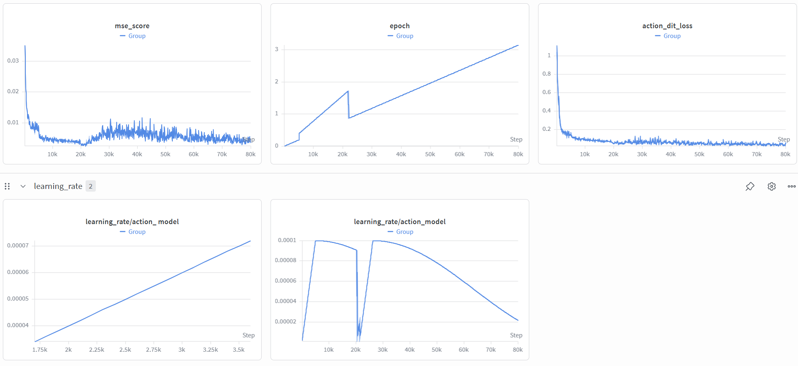
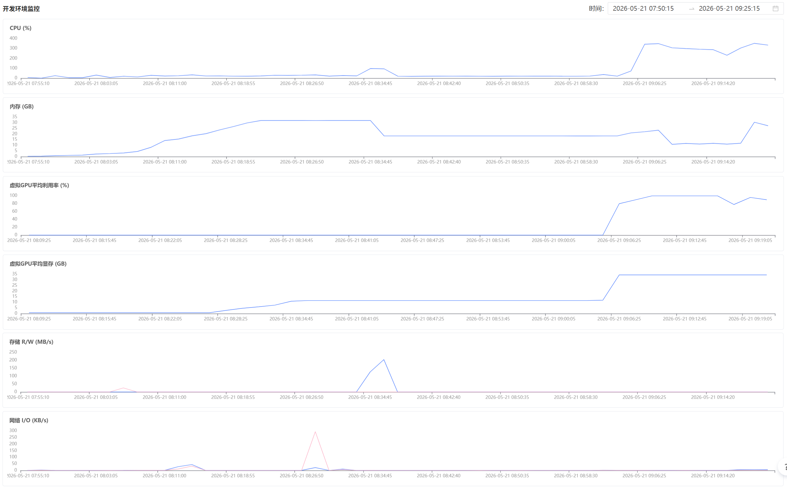

# LIBERO 训练记录：1229_libero4in1_qwen3oft

## 原理介绍

### 训练数据流（概念层面）

`train_starvla.py`（VLA only）只使用机器人动作数据：

```
┌─────────────────┐     ┌──────────────────┐     ┌─────────────────┐
│   机器人演示      │     │    VLM 骨干       │     │   流匹配动作头    │
│   (LeRobot 格式)  │     │  (Qwen3-VL 4B)    │     │  (Flow-Matching) │
│                 │     │                  │     │                 │
│  camera ──┐     │     │  图像 → 视觉编码   │     │  噪声 [B,8,7]   │
│           ├──►  │────►│  文本 → 语言编码   │────►│    ↓            │
│  lang ────┘     │     │    ↓ 交叉注意力    │     │  DiT 去噪       │
│                 │     │  多模态融合特征     │     │    ↓            │
│  action ────────│─────│──(监督信号)────────│────►│  预测动作序列    │
│   真值序列       │     │                  │     │    ↓            │
│                 │     │  VLM 冻结          │     │  Flow-Matching  │
│                 │     │  (不更新权重)       │     │  Loss           │
└─────────────────┘     └──────────────────┘     └───────┬─────────┘
                                                        │
                                                   action_loss
                                                        │
                                                   ┌────▼────┐
                                                   │  反向传播 │
                                                   │  更新动作头│
                                                   └─────────┘
```

**关键点**：
- Dataloader 返回原始 dict（`image`, `lang`, `action`, `state`），不做模型相关预处理
- VLM 负责"看懂"场景（图像 + 指令 → 语义特征），参数冻结不更新
- 动作头负责"学会做"（语义特征 → 动作序列），从头训练
- 当前步 + 未来步 = `action_horizon = 8`，同时预测 8 步动作，第 1 步执行、后续 7 步用于时序平滑

### 联合训练（VLA + VLM co-training）

`train_starvla_cotrain.py` 同时使用机器人数据和通用图文数据：

```
  LIBERO (VLA 数据)              COCO (VLM 数据)
  机器人操作演示                  通用图文问答
  ──────────────                ──────────────
  image: 机械臂工作台             image: 日常场景
  lang:  "拿起杯子"              lang:  "图片里有什么？"
  action: [T, 7] 关节动作        answer: "一个苹果、一杯水"
         │                              │
         │    ┌─────────────────────────┘
         │    │
         ▼    ▼
  ┌─────────────────────────────────────────────┐
  │              VLM 骨干 (Qwen3-VL)              │
  │                                              │
  │   LIBERO 路径    │     COCO 路径              │
  │   ─────────────  │     ─────────              │
  │   图像+指令       │     图像+问答               │
  │     ↓            │       ↓                    │
  │   多模态特征      │     LM head                │
  │     │            │       ↓                    │
  │     ▼            │     vlm_loss               │
  │   动作头          │     (语言建模损失)           │
  │     ↓            │     权重 × 0.1             │
  │   action_loss    │       │                    │
  │   权重 × 1.0     │       │                    │
  └──────┬───────────┴───────┴────────────────────┘
         │                  │
         └────────┬─────────┘
                  │
            总损失 = action_loss × 1.0 + vlm_loss × 0.1
                  │
             ┌────▼────┐
             │  反向传播 │
             │  更新参数 │
             └─────────┘
```

**为什么需要 COCO 数据**：防止 VLM 遗忘（维持通用视觉理解能力）、动作-语言联合表征（泛化到新物体/场景）、正则化效果（避免动作头过拟合）。

### 两个关键设计

**模型内部精度分离**

```
VLM forward (bfloat16)          动作头 forward (float32)
─────────────────────          ─────────────────────────
  对精度不敏感                    流匹配/扩散过程数值敏感
  省显存 + 速度快                 需要 float32 保证稳定性
```

**Dataloader 不做预处理**

```
Dataloader                 Framework.forward()
─────────                 ────────────────────
返回原始数据                接受原始 dict 自行处理
{
  image: [PIL.Image],      → qwen_vl_interface.build_qwenvl_inputs()
  lang:  str,              → tokenizer, image processor
  action: np.ndarray,      → torch.tensor, 切分 action_horizon
  state: np.ndarray
}
```

这样 dataloader 与模型完全解耦——换框架只需换 forward 实现，dataloader 不用动。

### 训练与推理的差异

| | 训练 | 推理 |
|---|---|---|
| **动作头输入** | 真值动作 + 噪声 | 纯噪声 |
| **动作头输出** | 预测的噪声/速度场 | 去噪后的动作序列 |
| **损失计算** | 预测噪声 vs 真实噪声 | 无（直接输出动作） |
| **去噪步数** | 单步（随机时间步） | 多步迭代（默认 4 步 ODE） |

### QwenGR00T 架构

QwenGR00T 是 StarVLA 中的双系统 VLA 架构，设计灵感来自 GR00T N1.5：

```
┌────────────────────────────────────────────────────────────┐
│                    QwenGR00T 架构                           │
│                                                            │
│  ┌──────────────────────────┐    ┌──────────────────────┐  │
│  │   System 2: VLM (慢系统)   │    │  System 1: Action (快系统) │
│  │                          │    │                      │  │
│  │  Qwen3-VL-4B-Instruct    │    │  FlowmatchingActionHead│  │
│  │  ┌────────────────────┐  │    │                      │  │
│  │  │ Vision Encoder     │  │    │  ┌────────────────┐  │  │
│  │  │  (ViT, frozen)     │  │    │  │ ActionEncoder  │  │  │
│  │  └────────┬───────────┘  │    │  │ (noisy action   │  │  │
│  │           │              │    │  │  → embedding)   │  │  │
│  │  ┌────────▼───────────┐  │    │  └───────┬────────┘  │  │
│  │  │ Qwen3 LM + Cross   │  │    │          │           │  │
│  │  │ Attn (frozen)      │  │    │  ┌───────▼────────┐  │  │
│  │  │ hidden_size=2560   │──┼────┼──►  DiT-B (16层)  │  │  │
│  │  └────────────────────┘  │    │  │ cross_attn_dim  │  │  │
│  │                          │    │  │ = 2560          │  │  │
│  └──────────────────────────┘    │  │ inner_dim=768   │  │  │
│                                  │  │ 12 heads × 64   │  │  │
│                                  │  └───────┬────────┘  │  │
│                                  │          │           │  │
│                                  │  ┌───────▼────────┐  │  │
│                                  │  │ ActionDecoder  │  │  │
│                                  │  │ (MLP → 7-dim)  │  │  │
│                                  │  └───────┬────────┘  │  │
│                                  │          │           │  │
│                                  │  ┌───────▼────────┐  │  │
│                                  │  │ Flow-Matching  │  │  │
│                                  │  │ Loss (velocity)│  │  │
│                                  │  └────────────────┘  │  │
│                                  └──────────────────────┘  │
└────────────────────────────────────────────────────────────┘
```

**组件详解**：

| 组件 | 规格 | 说明 |
|------|------|------|
| **VLM 骨干** | Qwen3-VL-4B-Instruct | 视觉+语言多模态编码器，参数冻结 |
| **VLM hidden_size** | 2560 | 作为 DiT 交叉注意力的 key/value 维度 |
| **动作头类型** | FlowmatchingActionHead | 基于流匹配的连续动作扩散模型 |
| **DiT backbone** | DiT-B | 16 层交叉注意力 Transformer |
| **注意力模式** | interleaved（交错） | 偶数层 cross-attn (2560)，奇数层 self-attn (768) |
| **动作表示** | delta_qpos | 7 维 (xyz + rpy + gripper)，相对位移 |
| **动作块长度** | action_horizon=8 | 同时预测当前步 + 未来 7 步 |
| **推理去噪步数** | 4 步 ODE | Flow-matching 支持少步推理 |
| **噪声调度** | Beta(1.5, 1.0)，上界 s=0.999 | 偏向低噪声区域的采样分布 |
| **未来 token** | 32 个 learnable query | 作为 DiT 的"规划槽位"，预置在动作序列前 |

### DiT 规模推算

本实验使用 **DiT-B**（Base 规模），配置参数来自 `DiTConfig["DiT-B"]` 与 `diffusion_model_cfg` 合并：

**DiT Transformer 部分（~156M）**

| 模块 | 数量 | 每模块参数量 | 小计 |
|------|------|-------------|------|
| Cross-attn 层 (idx=0,2,4,...,14) | 8 | ~11.0M | ~88.1M |
| Self-attn 层 (idx=1,3,5,...,13,15) | 8 | ~8.3M | ~66.1M |
| Output projection (norm + 2×Linear) | 1 | ~2.0M | ~2.0M |
| Timestep encoder | 1 | ~0.5M | ~0.5M |

每层 cross-attn 块 (Q 768×768, K 2560×768, V 2560×768, O 768×768, FF 768→3072→768, AdaLayerNorm 768→1536) 约 11.0M。每层 self-attn 块 (QKV 各 768×768, O 768×768, FF 768→3072→768, AdaLayerNorm 768→1536) 约 8.3M。

**动作头附件（~9M）**

| 模块 | 规格 | 参数量 |
|------|------|--------|
| action_encoder | ActionEncoder (7→768, 含 timestep 调制) | ~2.5M |
| action_decoder | MLP (1024→1024→7) | ~1.1M |
| state_encoder | MLP (7→1024→768) | ~0.8M |
| future_tokens | Embedding(32, 768) | ~25K |
| position_embedding | Embedding(1024, 768) | ~0.8M |
| 其他 (noise_beta 等) | — | ~3.7M |

**总计：DiT-B 完整动作头约 165M 可训练参数**

> **对比参考**：DiT-L 的 inner_dim=1536（32 heads × 48），参数量约为 DiT-B 的 4 倍（~600M+）。DiT-B 在单卡 A100 上可完整训练，DiT-L 通常需要多卡或 ZeRO-3。

**架构细节**：

```
DiT-B 结构
├── TimestepEncoder: Timesteps(256) + TimestepEmbedding(256→768)
├── TransformerBlocks × 16
│   ├── [0]  CrossAttn: Q(768), KV(2560) + FF(768→3072→768) + AdaLN
│   ├── [1]  SelfAttn:  QKV(768)          + FF(768→3072→768) + AdaLN
│   ├── [2]  CrossAttn: ...
│   ├── ...
│   ├── [14] CrossAttn: ...
│   └── [15] SelfAttn:  ...
├── norm_out: LayerNorm(768)
├── proj_out_1: 768 → 1536
└── proj_out_2: 768 → 1024 (output_dim, 送入 action_decoder)
```

---

## 实验概况

| 项目 | 值 |
|------|-----|
| 启动时间 | 2026-05-17 20:35 |
| 训练完成步数 | 80000 / 80000 (100%) |
| 训练总 epoch（估算） | ~9.17（前 3000 步有效 batch=16，后 77000 步有效 batch=32） |
| 框架 | StarVLA-GR00T (QwenGR00T) |
| 基础 VLM | Qwen3-VL-4B-Instruct |
| 动作模型 | DiT-B (16层, 768 inner_dim, 2560 cross_attn, ~165M 参数) |
| 冻结模块 | qwen_vl_interface (VLM 骨干冻结) |
| 数据集 | LIBERO 4合1 (libero_all) + LLaVA-OneVision-COCO |
| 环境 | Orion 云容器, Python 3.10, CUDA 12.4；单卡阶段为 `1× A100 40GB`，后期稳定阶段为 `2× A100 40GB` |
| 最终保留 checkpoint | `1000/2000/5000/10000/15000/20000/40000/70000/80000` |


## 训练过程

### 阶段 1：第一轮训练（5.17 20:35 — 5.18 02:05）

per_device_batch_size=16，gradient_accumulation_steps=4。由于 DeepSpeed 覆盖 gradient_accumulation_steps=1，实际有效 batch=16。训练到 3000 步后因显存或中断停止。

### 阶段 2：第二轮训练 — 恢复失败（5.18 08:55）

尝试 resume，但 `--trainer.is_resume True` 因 shell 续行符位置错误未生效，从 0 重新开始。此时仍为 batch=16（尚未修改配置）。覆盖了第一轮的 steps_1000 checkpoint 后停止。

### 阶段 3：第三轮训练 — 单卡恢复成功并切换 batch=32（5.18 09:45 — `steps_20000`）

| 日期 | 事件 |
|------|------|
| 5.18 09:45 | 修复续行符位置，正确从 steps_3000 resume（仍为 batch=16） |
| 5.18 10:00 | 优化 batch 配置：per_device_batch_size 16→32。gradient_accumulation_steps 保持被 DeepSpeed 覆盖为 1，实际有效 batch=32 |
| 5.18 10:34 | 到达 steps_5000 |
| 5.18 ~ 5.19 | 继续单卡训练，生成 `steps_5000/10000/15000/20000` |

> **单卡阶段总结**：`steps_3000 -> steps_20000` 可视为连续训练阶段，是后续分析 `steps_20000` 的主要背景。

### 阶段 4：切换到 2 卡训练（`steps_20000 -> steps_40000`）

| 事件 | 说明 |
|------|------|
| 切换到 2 卡训练 | 用户确认从这一步开始改为 2 卡训练，后续一直保持 2 卡 |
| checkpoint 保存方式切换 | 从旧式 DeepSpeed 完整训练态逐步切到轻量目录式 checkpoint |
| optimizer 状态问题 | 切到 2 卡时发生 optimizer 丢失 / 恢复不连续，导致这一阶段不能按“自然续训”理解 |
| 代表 checkpoint | `steps_40000` |

> **2 卡切换阶段总结**：`steps_20000 -> steps_40000` 的表现需要和 optimizer 不连续一起分析，不能只按 step 增长解释。

### 阶段 5：2 卡稳定训练阶段（`steps_40000 -> steps_80000`）

| 事件 | 说明 |
|------|------|
| 训练配置稳定 | `num_processes=2`，`per_device_batch_size=8`，`gradient_accumulation_steps=2`，有效全局 batch=`32` |
| optimizer 恢复方式稳定 | checkpoint 中有 `optimizer_rank_00000.pt`、`optimizer_rank_00001.pt`，`trainer_state.json` 声明 `rank_sharded` |
| 关键 checkpoint | `steps_40000`、`steps_70000`、`steps_80000` |
| 最终完成 | 训练跑满 `80000 step` |

> **batch size / 训练连续性历史**：
> - 阶段 1 和阶段 2：单卡，实际有效 batch=`16`
> - 阶段 3：单卡，`5.18 10:00` 起实际有效 batch=`32`
> - 阶段 4 和阶段 5：2 卡训练，目标有效全局 batch=`32`
> - 其中阶段 4 存在 optimizer 不连续，阶段 5 才进入稳定恢复阶段

### resume 踩坑记录

原脚本第 69-71 行存在 shell 续行符错误：
```bash
# 错误写法 —— --trainer.is_resume True 不在 accelerate 命令内
  --wandb_entity silencewx-harbin-institute-of-technology \
  # --is_debug True
  --trainer.is_resume True

# 正确写法 —— 放在续行符链中
  --wandb_entity silencewx-harbin-institute-of-technology \
  --trainer.is_resume True \
  # --is_debug True
```

表现为 `summary.jsonl` 中出现重复 steps_1000 记录，训练从 0 开始而非从 checkpoint 恢复。详见 `docs_zh/issues.md` 问题记录。

## 最终稳定配置

### 历史关键配置变化

| 阶段 | 训练卡数 | `per_device_batch_size` | `gradient_accumulation_steps` | 实际有效 batch | checkpoint / optimizer 状态 |
|------|----------|--------------------------|-------------------------------|----------------|------------------------------|
| 阶段 1 / 2 | 1 卡 | `16` | 目标 `4`，实际被覆盖为 `1` | `16` | 单文件 `pt`，resume 曾失败 |
| 阶段 3 | 1 卡 | `16 -> 32` | 目标 `2`，实际被覆盖为 `1` | `16 -> 32` | 单卡连续训练，到 `steps_20000` |
| 阶段 4 | 2 卡 | 未作为稳定配置固化记录 | 2 卡切换期 | 目标保持 `32` | 切到 2 卡时发生 optimizer 丢失 / 恢复不连续；已知是 2 卡训练，但该过渡段未保留成可稳定复现的最终配置 |
| 阶段 5 | 2 卡 | `8` | `2` | `8 x 2 x 2 = 32` | `rank_sharded` optimizer，恢复重新稳定 |

```yaml
framework:
  name: QwenGR00T
  qwenvl:
    base_vlm: playground/Pretrained_models/Qwen3-VL-4B-Instruct
    attn_implementation: flash_attention_2
  action_model:
    action_model_type: DiT-B
    hidden_size: 1024
    num_layers: 16
    cross_attention_dim: 2560
    action_dim: 7
    action_horizon: 8
    num_inference_timesteps: 4
    repeated_diffusion_steps: 8

trainer:
  max_train_steps: 80000
  num_warmup_steps: 5000
  save_interval: 500
  eval_interval: 100
  gradient_accumulation_steps: 2
  gradient_checkpointing: true
  learning_rate:
    base: 2.5e-05
    qwen_vl_interface: 1.0e-05
    action_model: 0.0001
  lr_scheduler_type: cosine_with_min_lr
  min_lr: 1.0e-06
  freeze_modules: qwen_vl_interface
  loss_scale:
    vla: 1.0
    vlm: 0.1

datasets:
  vla_data:
    per_device_batch_size: 8
    data_mix: libero_all
    video_backend: torchvision_av
  vlm_data:
    per_device_batch_size: 4
```

## 数据集统计

| 指标 | 值 |
|------|-----|
| 总 episode 数 | 1,693 |
| 总 transition 数 | 273,465 |
| action 维度 | 7 (xyz + rpy + gripper) |
| state 维度 | 8 (含 pad) |
| action 类型 | delta_qpos (相对位移) |

## 性能优化记录

| 优化项 | 改前 | 改后 | 效果 |
|--------|------|------|------|
| per_device_batch_size | 16 | 32（单卡阶段）/ 8×2 卡（稳定阶段） | 提升吞吐并适配后期 2 卡 |
| 有效 batch size | 16 | 32 | 维持相同全局 batch，减少配置切换带来的 batch 扰动 |
| GPU 显存占用 | 61% (24.8 GB) | 89% (36.2 GB，单卡 batch=32 时) | 单卡阶段利用率明显提升 |
| flash_attn vs SDPA | — | 1.61× 加速 | 已启用 flash-attn 2.7.4 |

程序启动系统监控


单卡运行稳定状态


### 历史耗时测算（单卡阶段）

基于 steps_4000 → steps_5000（连续 1000 步，batch=32 + grad_accum=1，1× A100 40GB）：

| 指标 | 值 |
|------|-----|
| 单步耗时 | ~1.5 sec |
| 每分钟步数 | ~40 steps/min |
| 每步有效样本 | 32（DeepSpeed 覆盖 grad_accum=1） |
| 单实例耗时 | ~47 ms |
| 说明 | 该表仅反映单卡阶段历史吞吐，不代表后期 2 卡阶段最终 wall time |

### W&B Step-Epoch / 等效 Epoch 说明

训练代码中的 W&B epoch 公式（`train_starvla.py:272`）是：`epoch = completed_steps / len(vla_dataloader)`。

但由于本实验中途发生了单卡/2 卡切换、`per_device_batch_size` 变化，以及有效 batch 变化，下面这张表不再把 epoch 当作“严格等价于某一个固定 dataloader 长度下的训练轮数”，而是作为**按已消费有效样本量估算的等效 epoch**来使用，便于横向比较不同训练阶段的进度。

估算时采用：
- 数据集 transition 数：`273,465`
- 单卡 batch=16 阶段：前 `3000` 步
- 有效 batch=32 阶段：后 `77000` 步
- 每样本包含 `8` 步连续动作（`action_indices = range(8)`）

| 推算项 | 值 | 推导过程 |
|--------|-----|----------|
| 每样本 action 帧数 | 8 | `Libero4in1DataConfig.action_indices = range(8)` |
| len(dataloader) @ batch=16 | 17,092 | 273,465 / 16 |
| len(dataloader) @ batch=32 | 8,546 | 273,465 / 32 |
| step=5000 epoch（混合 batch） | 0.409 | (3000×16 + 2000×32) / 273,465 |
| step=19000 epoch（混合 batch） | 2.05 | (3000×16 + 16000×32) / 273,465 |
| step=80000 epoch（混合 batch） | 9.17 | (3000×16 + 77000×32) / 273,465 |

## 学习率曲线

- **0 → 5000 步**：线性 warmup，LR 从 0 升至 base_lr
  - VLM (qwen_vl_interface): 0 → 1.0e-05
  - base: 0 → 2.5e-05
  - action_model: 0 → 1.0e-04
- **5000 → 80000 步**：余弦衰减至 min_lr=1.0e-06

Resume 后 LR scheduler 通过 `_adjust_lr_scheduler_for_resume()` 追赶 3000 步，与训练步数同步。

## 已知问题

1. `steps_1000` checkpoint 被非 resume 重跑覆盖（5.18 09:19），原始 steps_1000 丢失
2. `summary.jsonl` 末尾两条 `{"steps": 1000}` 为异常记录，不影响 checkpoint 恢复
3. 从单卡切到 2 卡训练时发生过 optimizer 丢失 / 恢复不连续，因此 `steps_20000 -> steps_40000` 不能视为完全连续的优化轨迹
4. 轻量目录式 checkpoint 在 2 卡稳定阶段已切到 `rank_sharded` optimizer 恢复方式，但这一机制不适用于更早的 2 卡切换过渡段

## 仿真评测记录

### 评测设置

- 评测任务集：`libero_goal`
- 任务数：`10`
- 每任务 episode 数：`50`
- 总 episode 数：`500`
- 统计口径：以 `playground/eval_results/libero_goal/...` 下 rollout 视频文件名中的 `success/failure` 计数为准
- 异常口径：若 EGL / `libGLU.so.0` 清理报错发生在 `500` 个 episode 完成之后，不计入评测失败

### 训练阶段与恢复连续性

| 阶段 | step 范围 | 训练配置 | scheduler 区间 | checkpoint 形态 | optimizer 连续性 | 说明 |
|------|-----------|----------|----------------|-----------------|------------------|------|
| A | `0 -> 3000` | 单卡，`per_device_batch_size=16`，实际有效 batch=`16` | warmup 前段 | 单文件 `*.pt` | 连续 | 第一轮训练，后续从 `steps_3000` 成功 resume |
| B | `3000 -> 20000` | 单卡，先 batch=`16`，`5.18 10:00` 后切到 batch=`32`；DeepSpeed 覆盖 `grad_accum=1` | `0->5000` warmup，`5000->20000` cosine | 单文件 `*.pt` 到 DeepSpeed 完整训练态目录 | 连续 | `steps_1000` 曾被恢复失败的重跑覆盖，因此更适合作为“能力萌芽”参考点，不适合作为严格连续训练证据 |
| C | `20000 -> 40000` | 已切到 2 卡训练，后续保持 2 卡 | cosine 中段 | 从旧式训练态切到轻量目录式 | 不连续风险高 | 用户确认切到 2 卡时发生 optimizer 丢失；这一段不能只按 step 增长解释 |
| D | `40000 -> 80000` | 2 卡，`per_device_batch_size=8`，`gradient_accumulation_steps=2`，有效全局 batch=`32` | cosine 后段 | 轻量目录式分片目录 | 连续恢复重新稳定 | `steps_40000/70000/80000` 已有 `optimizer_rank_*.pt` 与 `trainer_state.json` 中的 `rank_sharded` 声明 |

### Checkpoint 总览

| checkpoint | 所属阶段 | 文件形态 | 总成功数/500 | overall success rate | 结论 |
|------------|----------|----------|---------------|----------------------|------|
| `steps_1000` | A/B 早期 | 单文件 `pt` | `0/500` | `0.0%` | 能力未形成 |
| `steps_2000` | A/B 早期 | 单文件 `pt` | `5/500` | `1.0%` | 仅有极少量偶发成功 |
| `steps_5000` | B | 单文件 `pt` | `22/500` | `4.4%` | 早期能力开始冒头 |
| `steps_10000` | B | 单文件 `pt` | `167/500` | `33.4%` | 第一次明显跃迁 |
| `steps_15000` | B | 单文件 `pt` | `182/500` | `36.4%` | 能力扩展，但出现任务权衡 |
| `steps_20000` | B 末段 | DeepSpeed 完整训练态目录 | `230/500` | `46.0%` | 单卡连续训练阶段的最佳点 |
| `steps_40000` | D 起点 | 轻量目录式分片目录 | `184/500` | `36.8%` | 低于 `20000`，不能视为简单的“多训更好” |
| `steps_70000` | D | 轻量目录式分片目录 | `370/500` | `74.0%` | 当前 overall 最优 |
| `steps_80000` | D | 轻量目录式分片目录 | `357/500` | `71.4%` | overall 次优，但部分长尾任务更强 |


### 关键结论

1. 训练过程至少存在两次明显能力跃迁：第一次在 `steps_10000`，第二次在 `steps_70000`。
2. `steps_20000 -> steps_40000` 的回退不能只解释为 step 效应，还必须联动考虑 2 卡训练切换与 optimizer 恢复不连续。
3. 如果只看 average，当前最佳 checkpoint 是 `steps_70000`；如果更重视部分长尾任务覆盖，`steps_80000` 仍有保留价值。
4. 最稳定的长尾短板直到 `steps_80000` 仍然是：
   - `put_the_wine_bottle_on_the_rack`
   - `open_the_top_drawer_and_put_the_bowl_inside`

### 任务演化总表

| task | 1000 | 2000 | 5000 | 10000 | 15000 | 20000 | 40000 | 70000 | 80000 | 趋势判断 |
|------|------|------|------|-------|-------|-------|-------|-------|-------|----------|
| `open_the_middle_drawer_of_the_cabinet` | 0 | 0 | 4 | 0 | 26 | 64 | 50 | 50 | 64 | 中期起量，后期稳定中等水平 |
| `open_the_top_drawer_and_put_the_bowl_inside` | 0 | 0 | 0 | 0 | 14 | 16 | 12 | 38 | 34 | 始终偏弱，后期有提升但仍是短板 |
| `push_the_plate_to_the_front_of_the_stove` | 0 | 0 | 4 | 10 | 26 | 42 | 2 | 82 | 56 | 对训练阶段最敏感，`40000` 明显回退，`70000` 大幅补齐 |
| `put_the_bowl_on_the_plate` | 0 | 0 | 2 | 62 | 8 | 38 | 64 | 90 | 86 | 早起量但中期波动大，后期再次拉高 |
| `put_the_bowl_on_the_stove` | 0 | 4 | 0 | 52 | 66 | 80 | 38 | 96 | 92 | 中期已很强，`40000` 回退，后期逼近饱和 |
| `put_the_bowl_on_top_of_the_cabinet` | 0 | 0 | 6 | 86 | 60 | 90 | 76 | 98 | 92 | 放置类代表任务，较早学会，后期接近饱和 |
| `put_the_cream_cheese_in_the_bowl` | 0 | 0 | 0 | 8 | 12 | 10 | 20 | 74 | 80 | 长尾任务，主要在后期提升 |
| `put_the_wine_bottle_on_the_rack` | 0 | 0 | 0 | 0 | 2 | 8 | 2 | 18 | 28 | 全程最难，直到 `80000` 仍明显偏低 |
| `put_the_wine_bottle_on_top_of_the_cabinet` | 0 | 0 | 2 | 58 | 56 | 32 | 6 | 96 | 86 | 中期波动极大，后期强势恢复 |
| `turn_on_the_stove` | 0 | 6 | 26 | 58 | 94 | 80 | 98 | 98 | 96 | 最早学会且始终强，是最稳定主力项 |

### 训练-测评联动分析

#### 1. 单卡连续训练阶段：`steps_1000 -> steps_20000`

- 这一阶段整体可以视为同一优化轨迹上的自然演化。
- `steps_1000/2000/5000` 基本属于能力萌芽期，只有 `turn_on_the_stove` 和少量简单放置任务开始偶发成功。
- `steps_10000` 是第一次真正意义上的跃迁点，说明 warmup 结束并进入 cosine 初段后，模型开始稳定学会一批“直接到位/放置类”任务。
- `steps_15000` 继续提升 overall，但不是所有任务一起变好，而是开始出现任务权衡。
- `steps_20000` 是单卡连续训练阶段的最佳点：不仅 overall 到 `46.0%`，而且复杂接触任务覆盖更均衡。

#### 2. 2 卡切换与 optimizer 不连续阶段：`steps_20000 -> steps_40000`

- 用户确认：切到 2 卡训练时发生了 optimizer 丢失，后续一直保持 2 卡训练。
- 因此 `steps_20000 -> steps_40000` 之间不能按“训练 20000 步后自然演化”理解，更准确地说，这是“模型权重延续，但优化器状态可能断裂后的再训练阶段”。
- 这能解释为什么 `steps_40000` 的 overall success rate 只有 `36.8%`，低于 `steps_20000` 的 `46.0%`。
- 任务层面也符合这种“重新适应”特征：
  - 更强：`turn_on_the_stove`、`put_the_bowl_on_the_plate`
  - 更弱：`push_the_plate_to_the_front_of_the_stove`、`put_the_wine_bottle_on_top_of_the_cabinet`、`put_the_wine_bottle_on_the_rack`
- 结论：`steps_40000` 不是单纯的退化点，更像 2 卡训练切换和 optimizer 不连续带来的能力重分配点。

#### 3. 2 卡稳定恢复阶段：`steps_40000 -> steps_80000`

- 到 `steps_40000` 时，checkpoint 已经具备 `optimizer_rank_00000.pt`、`optimizer_rank_00001.pt` 和 `trainer_state.json` 中的 `rank_sharded` 声明，训练恢复连续性重新稳定。
- `steps_70000` 出现第二次大跃迁，overall success rate 直接到 `74.0%`，说明 2 卡稳定训练后，大量中高难度任务被重新补齐。
- `steps_80000` 没有再刷新 overall 最优，但在部分长尾任务上强于 `70000`：
  - `open_the_middle_drawer_of_the_cabinet`: `64%` vs `50%`
  - `put_the_cream_cheese_in_the_bowl`: `80%` vs `74%`
  - `put_the_wine_bottle_on_the_rack`: `28%` vs `18%`
- 结论：后期 2 卡稳定训练确实有效，但 `70000` 与 `80000` 的差异已经不再是“会不会”，而是“主力项更强还是长尾项更稳”。

### 任务类型分析

#### 1. 直接到位/放置类

- 代表任务：
  - `put_the_bowl_on_the_plate`
  - `put_the_bowl_on_the_stove`
  - `put_the_bowl_on_top_of_the_cabinet`
  - `put_the_wine_bottle_on_top_of_the_cabinet`
- 特征：最早在 `steps_10000` 左右起量，后期普遍达到 `86%+`
- 判断：这是模型最先学会、也是最终最强的一类任务

#### 2. 简单功能交互类

- 代表任务：`turn_on_the_stove`
- 特征：最早起量、全程最稳定，`15000` 后基本维持在高位
- 判断：最适合当作“早期是否学会基础交互”的晴雨表

#### 3. 接触/推动类

- 代表任务：`push_the_plate_to_the_front_of_the_stove`
- 特征：中期能上升到 `42%`，`40000` 掉到 `2%`，后期又拉到 `82%`
- 判断：对训练阶段和 optimizer 连续性最敏感，是识别训练 regime 变化的关键任务

#### 4. 复合时序类

- 代表任务：`open_the_top_drawer_and_put_the_bowl_inside`
- 特征：长期低迷，直到 `70000/80000` 也只有 `38%/34%`
- 判断：这是当前最稳定的复合任务短板之一

#### 5. 狭窄目标高精度类

- 代表任务：`put_the_wine_bottle_on_the_rack`
- 特征：直到 `80000` 也只有 `28%`
- 判断：这是当前整体最难任务，也是后续最适合定向优化的指标

### Checkpoint 选择建议

| 目标 | 推荐 checkpoint | 原因 |
|------|-----------------|------|
| overall 最优 | `steps_70000` | `74.0%`，当前平均成功率最高 |
| 长尾任务对照 | `steps_80000` | `rack`、`drawer`、`cream_cheese_in_bowl` 等任务更强 |
| 单卡训练代表点 | `steps_20000` | 单卡连续训练阶段最佳，适合和后期 2 卡阶段对比 |
| 2 卡切换后再适应观察点 | `steps_40000` | 能反映 optimizer 不连续后的能力重分配 |

### 附录：各 checkpoint 详细结果

#### `steps_1000`

| task | success rate |
|------|--------------|
| `open_the_middle_drawer_of_the_cabinet` | `0.0%` |
| `open_the_top_drawer_and_put_the_bowl_inside` | `0.0%` |
| `push_the_plate_to_the_front_of_the_stove` | `0.0%` |
| `put_the_bowl_on_the_plate` | `0.0%` |
| `put_the_bowl_on_the_stove` | `0.0%` |
| `put_the_bowl_on_top_of_the_cabinet` | `0.0%` |
| `put_the_cream_cheese_in_the_bowl` | `0.0%` |
| `put_the_wine_bottle_on_the_rack` | `0.0%` |
| `put_the_wine_bottle_on_top_of_the_cabinet` | `0.0%` |
| `turn_on_the_stove` | `0.0%` |

#### `steps_2000`

| task | success rate |
|------|--------------|
| `turn_on_the_stove` | `6.0%` |
| `put_the_bowl_on_the_stove` | `4.0%` |
| 其余 8 个任务 | `0.0%` |

#### `steps_5000`

| task | success rate |
|------|--------------|
| `turn_on_the_stove` | `26.0%` |
| `put_the_bowl_on_top_of_the_cabinet` | `6.0%` |
| `open_the_middle_drawer_of_the_cabinet` | `4.0%` |
| `push_the_plate_to_the_front_of_the_stove` | `4.0%` |
| `put_the_bowl_on_the_plate` | `2.0%` |
| `put_the_wine_bottle_on_top_of_the_cabinet` | `2.0%` |
| 其余 4 个任务 | `0.0%` |

#### `steps_10000`

| task | success rate |
|------|--------------|
| `put_the_bowl_on_top_of_the_cabinet` | `86.0%` |
| `put_the_bowl_on_the_plate` | `62.0%` |
| `put_the_wine_bottle_on_top_of_the_cabinet` | `58.0%` |
| `turn_on_the_stove` | `58.0%` |
| `put_the_bowl_on_the_stove` | `52.0%` |
| `push_the_plate_to_the_front_of_the_stove` | `10.0%` |
| `put_the_cream_cheese_in_the_bowl` | `8.0%` |
| `open_the_middle_drawer_of_the_cabinet` | `0.0%` |
| `open_the_top_drawer_and_put_the_bowl_inside` | `0.0%` |
| `put_the_wine_bottle_on_the_rack` | `0.0%` |

#### `steps_15000`

| task | success rate |
|------|--------------|
| `turn_on_the_stove` | `94.0%` |
| `put_the_bowl_on_the_stove` | `66.0%` |
| `put_the_bowl_on_top_of_the_cabinet` | `60.0%` |
| `put_the_wine_bottle_on_top_of_the_cabinet` | `56.0%` |
| `open_the_middle_drawer_of_the_cabinet` | `26.0%` |
| `push_the_plate_to_the_front_of_the_stove` | `26.0%` |
| `open_the_top_drawer_and_put_the_bowl_inside` | `14.0%` |
| `put_the_cream_cheese_in_the_bowl` | `12.0%` |
| `put_the_bowl_on_the_plate` | `8.0%` |
| `put_the_wine_bottle_on_the_rack` | `2.0%` |

#### `steps_20000`

| task | success rate |
|------|--------------|
| `put_the_bowl_on_top_of_the_cabinet` | `90.0%` |
| `put_the_bowl_on_the_stove` | `80.0%` |
| `turn_on_the_stove` | `80.0%` |
| `open_the_middle_drawer_of_the_cabinet` | `64.0%` |
| `push_the_plate_to_the_front_of_the_stove` | `42.0%` |
| `put_the_bowl_on_the_plate` | `38.0%` |
| `put_the_wine_bottle_on_top_of_the_cabinet` | `32.0%` |
| `open_the_top_drawer_and_put_the_bowl_inside` | `16.0%` |
| `put_the_cream_cheese_in_the_bowl` | `10.0%` |
| `put_the_wine_bottle_on_the_rack` | `8.0%` |

#### `steps_40000`

| task | success rate |
|------|--------------|
| `turn_on_the_stove` | `98.0%` |
| `put_the_bowl_on_top_of_the_cabinet` | `76.0%` |
| `put_the_bowl_on_the_plate` | `64.0%` |
| `open_the_middle_drawer_of_the_cabinet` | `50.0%` |
| `put_the_bowl_on_the_stove` | `38.0%` |
| `put_the_cream_cheese_in_the_bowl` | `20.0%` |
| `open_the_top_drawer_and_put_the_bowl_inside` | `12.0%` |
| `put_the_wine_bottle_on_top_of_the_cabinet` | `6.0%` |
| `push_the_plate_to_the_front_of_the_stove` | `2.0%` |
| `put_the_wine_bottle_on_the_rack` | `2.0%` |

#### `steps_70000`

| task | success rate |
|------|--------------|
| `put_the_bowl_on_top_of_the_cabinet` | `98.0%` |
| `turn_on_the_stove` | `98.0%` |
| `put_the_bowl_on_the_stove` | `96.0%` |
| `put_the_wine_bottle_on_top_of_the_cabinet` | `96.0%` |
| `put_the_bowl_on_the_plate` | `90.0%` |
| `push_the_plate_to_the_front_of_the_stove` | `82.0%` |
| `put_the_cream_cheese_in_the_bowl` | `74.0%` |
| `open_the_middle_drawer_of_the_cabinet` | `50.0%` |
| `open_the_top_drawer_and_put_the_bowl_inside` | `38.0%` |
| `put_the_wine_bottle_on_the_rack` | `18.0%` |

#### `steps_80000`

| task | success rate |
|------|--------------|
| `turn_on_the_stove` | `96.0%` |
| `put_the_bowl_on_the_stove` | `92.0%` |
| `put_the_bowl_on_top_of_the_cabinet` | `92.0%` |
| `put_the_bowl_on_the_plate` | `86.0%` |
| `put_the_wine_bottle_on_top_of_the_cabinet` | `86.0%` |
| `put_the_cream_cheese_in_the_bowl` | `80.0%` |
| `open_the_middle_drawer_of_the_cabinet` | `64.0%` |
| `push_the_plate_to_the_front_of_the_stove` | `56.0%` |
| `open_the_top_drawer_and_put_the_bowl_inside` | `34.0%` |
| `put_the_wine_bottle_on_the_rack` | `28.0%` |

## 对齐当前 LIBERO SOTA 与不足分析

### 可比性边界

- 当前日志中的仿真评测只覆盖 `LIBERO-Goal`
- 因此本节只能回答：
  - 在 `LIBERO-Goal` 单套件上，本实验和公开方法相比处于什么水平
  - 当前短板主要在哪里
- 还不能直接回答：
  - 是否已经“对齐当前整个 LIBERO benchmark 的 SOTA”
- 原因是当前公开工作通常至少同时报告：
  - `LIBERO-Spatial`
  - `LIBERO-Object`
  - `LIBERO-Goal`
  - `LIBERO-Long`

### 对齐基线

本节采用两层公开参考：

1. **已发表、较稳定的公开强基线**
   - `TraceVLA`（ICLR 2025）
   - `OpenVLA` fine-tuned

2. **更前沿但可视为上界参考的公开结果**
   - `PixelVLA`（ICLR 2026 在审）

参考来源：
- TraceVLA / OpenVLA 的 `LIBERO-Goal` 结果可见：
  - https://openreview.net/forum?id=b1CVu9l5GO
  - 以及 SpatialVLA 项目页整理表：
    https://github.com/SpatialVLA
- PixelVLA 的四套件结果可见：
  - https://openreview.net/forum?id=7M6ryCABIc
  - https://wenqiliang.github.io/PixelVLA/
- 对 LIBERO 鲁棒性局限的讨论可见：
  - LIBERO-PRO: https://arxiv.org/abs/2510.03827
  - LIBERO-Plus: https://sylvestf.github.io/LIBERO-plus/

### `LIBERO-Goal` 单套件对齐结果

| 方法 / checkpoint | `LIBERO-Goal` |
|-------------------|---------------|
| PixelVLA | `85.8%` |
| OpenVLA (FT) | `70.4%` ~ `79.2%`（不同公开表略有差异） |
| TraceVLA (FT) | `75.1%` |
| **本实验 `steps_70000`** | **`74.0%`** |
| **本实验 `steps_80000`** | **`71.4%`** |

### 结论

- 如果只和已发表的 `TraceVLA / OpenVLA` 对齐：
  - `steps_70000 = 74.0%` 已经接近已发表强基线
  - 相比 `OpenVLA` 属于同一量级，优于部分公开表中的 OpenVLA 结果
  - 距离 `TraceVLA 75.1%` 只差约 `1.1` 个点
- 但如果和更前沿的公开上界对齐：
  - `steps_70000` 相比 `PixelVLA 85.8%` 仍有约 `11.8` 个点差距
  - 说明当前结果还不能算“对齐最新公开前沿”

### 当前不足

#### 1. 评测范围不足

- 目前只测了 `LIBERO-Goal`
- 这足以说明模型在 goal-oriented 任务上已经接近已发表强基线
- 但还不足以声明“对齐当前 LIBERO SOTA”
- 若要和当前公开结果严格对齐，至少还需要补齐：
  - `LIBERO-Spatial`
  - `LIBERO-Object`
  - `LIBERO-Long`

#### 2. 长尾任务短板仍然明显

在当前 `steps_70000/80000` 中，最稳定的弱项仍然是：
- `put_the_wine_bottle_on_the_rack`
- `open_the_top_drawer_and_put_the_bowl_inside`

这说明平均分虽然已经很高，但模型在以下能力上仍然不足：
- 狭窄目标高精度放置
- 多阶段复合时序控制
- 细长物体姿态稳定性

#### 3. 训练过程存在可比性弱点

- 单卡到 2 卡训练切换
- 中途 batch 配置变化
- 切到 2 卡时 optimizer 恢复不连续

因此：
- `steps_70000` 虽然是当前最佳 checkpoint
- 但它不是在完全平滑、完全一致的训练协议下得到的
- 和论文里那些“训练配置稳定、恢复轨迹清晰”的结果相比，当前实验的可复现性和可比性仍偏弱

#### 4. 还没有验证鲁棒性

当前社区对 LIBERO 的讨论已经不只看标准 success rate。

LIBERO-PRO 和 LIBERO-Plus 都指出：
- 很多模型在标准 LIBERO 设置下分数很高
- 但在 camera、初始状态、语言扰动等更合理的泛化设定下会明显退化

因此当前实验还缺少：
- camera / viewpoint 扰动鲁棒性
- 初始状态偏移鲁棒性
- 语言扰动鲁棒性

### 下一步建议

| 优先级 | 建议 | 目的 |
|--------|------|------|
| 1 | 补齐 `Spatial/Object/Long` | 判断是否真的接近完整 LIBERO SOTA |
| 2 | 单独盯 `rack` 与 `drawer+place` 两类任务 | 补长尾短板 |
| 3 | 固定训练协议，避免再混入 optimizer 不连续因素 | 增强可比性与可复现性 |
| 4 | 若要对齐更前沿讨论语境，再补鲁棒性评测 | 判断是否只是标准 LIBERO 高分 |
