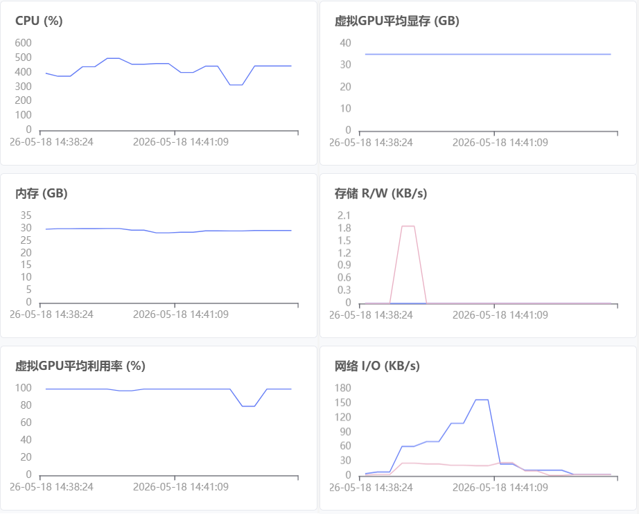

# LIBERO 训练记录：1229_libero4in1_qwen3oft

## 原理介绍

### 训练数据流（概念层面）

`train_starvla.py`（VLA only）只使用机器人动作数据：

```
┌─────────────────┐     ┌──────────────────┐     ┌─────────────────┐
│   机器人演示      │     │    VLM 骨干       │     │   流匹配动作头    │
│   (LeRobot 格式)  │     │  (Qwen3-VL 4B)    │     │  (Flow-Matching) │
│                 │     │                  │     │                 │
│  camera ──┐     │     │  图像 → 视觉编码   │     │  噪声 [B,8,7]   │
│           ├──►  │────►│  文本 → 语言编码   │────►│    ↓            │
│  lang ────┘     │     │    ↓ 交叉注意力    │     │  DiT 去噪       │
│                 │     │  多模态融合特征     │     │    ↓            │
│  action ────────│─────│──(监督信号)────────│────►│  预测动作序列    │
│   真值序列       │     │                  │     │    ↓            │
│                 │     │  VLM 冻结          │     │  Flow-Matching  │
│                 │     │  (不更新权重)       │     │  Loss           │
└─────────────────┘     └──────────────────┘     └───────┬─────────┘
                                                        │
                                                   action_loss
                                                        │
                                                   ┌────▼────┐
                                                   │  反向传播 │
                                                   │  更新动作头│
                                                   └─────────┘
```

**关键点**：
- Dataloader 返回原始 dict（`image`, `lang`, `action`, `state`），不做模型相关预处理
- VLM 负责"看懂"场景（图像 + 指令 → 语义特征），参数冻结不更新
- 动作头负责"学会做"（语义特征 → 动作序列），从头训练
- 当前步 + 未来步 = `action_horizon = 8`，同时预测 8 步动作，第 1 步执行、后续 7 步用于时序平滑

### 联合训练（VLA + VLM co-training）

`train_starvla_cotrain.py` 同时使用机器人数据和通用图文数据：

```
  LIBERO (VLA 数据)              COCO (VLM 数据)
  机器人操作演示                  通用图文问答
  ──────────────                ──────────────
  image: 机械臂工作台             image: 日常场景
  lang:  "拿起杯子"              lang:  "图片里有什么？"
  action: [T, 7] 关节动作        answer: "一个苹果、一杯水"
         │                              │
         │    ┌─────────────────────────┘
         │    │
         ▼    ▼
  ┌─────────────────────────────────────────────┐
  │              VLM 骨干 (Qwen3-VL)              │
  │                                              │
  │   LIBERO 路径    │     COCO 路径              │
  │   ─────────────  │     ─────────              │
  │   图像+指令       │     图像+问答               │
  │     ↓            │       ↓                    │
  │   多模态特征      │     LM head                │
  │     │            │       ↓                    │
  │     ▼            │     vlm_loss               │
  │   动作头          │     (语言建模损失)           │
  │     ↓            │     权重 × 0.1             │
  │   action_loss    │       │                    │
  │   权重 × 1.0     │       │                    │
  └──────┬───────────┴───────┴────────────────────┘
         │                  │
         └────────┬─────────┘
                  │
            总损失 = action_loss × 1.0 + vlm_loss × 0.1
                  │
             ┌────▼────┐
             │  反向传播 │
             │  更新参数 │
             └─────────┘
```

**为什么需要 COCO 数据**：防止 VLM 遗忘（维持通用视觉理解能力）、动作-语言联合表征（泛化到新物体/场景）、正则化效果（避免动作头过拟合）。

### 两个关键设计

**模型内部精度分离**

```
VLM forward (bfloat16)          动作头 forward (float32)
─────────────────────          ─────────────────────────
  对精度不敏感                    流匹配/扩散过程数值敏感
  省显存 + 速度快                 需要 float32 保证稳定性
```

**Dataloader 不做预处理**

```
Dataloader                 Framework.forward()
─────────                 ────────────────────
返回原始数据                接受原始 dict 自行处理
{
  image: [PIL.Image],      → qwen_vl_interface.build_qwenvl_inputs()
  lang:  str,              → tokenizer, image processor
  action: np.ndarray,      → torch.tensor, 切分 action_horizon
  state: np.ndarray
}
```

这样 dataloader 与模型完全解耦——换框架只需换 forward 实现，dataloader 不用动。

### 训练与推理的差异

| | 训练 | 推理 |
|---|---|---|
| **动作头输入** | 真值动作 + 噪声 | 纯噪声 |
| **动作头输出** | 预测的噪声/速度场 | 去噪后的动作序列 |
| **损失计算** | 预测噪声 vs 真实噪声 | 无（直接输出动作） |
| **去噪步数** | 单步（随机时间步） | 多步迭代（默认 4 步 ODE） |

### QwenGR00T 架构

QwenGR00T 是 StarVLA 中的双系统 VLA 架构，设计灵感来自 GR00T N1.5：

```
┌────────────────────────────────────────────────────────────┐
│                    QwenGR00T 架构                           │
│                                                            │
│  ┌──────────────────────────┐    ┌──────────────────────┐  │
│  │   System 2: VLM (慢系统)   │    │  System 1: Action (快系统) │
│  │                          │    │                      │  │
│  │  Qwen3-VL-4B-Instruct    │    │  FlowmatchingActionHead│  │
│  │  ┌────────────────────┐  │    │                      │  │
│  │  │ Vision Encoder     │  │    │  ┌────────────────┐  │  │
│  │  │  (ViT, frozen)     │  │    │  │ ActionEncoder  │  │  │
│  │  └────────┬───────────┘  │    │  │ (noisy action   │  │  │
│  │           │              │    │  │  → embedding)   │  │  │
│  │  ┌────────▼───────────┐  │    │  └───────┬────────┘  │  │
│  │  │ Qwen3 LM + Cross   │  │    │          │           │  │
│  │  │ Attn (frozen)      │  │    │  ┌───────▼────────┐  │  │
│  │  │ hidden_size=2560   │──┼────┼──►  DiT-B (16层)  │  │  │
│  │  └────────────────────┘  │    │  │ cross_attn_dim  │  │  │
│  │                          │    │  │ = 2560          │  │  │
│  └──────────────────────────┘    │  │ inner_dim=768   │  │  │
│                                  │  │ 12 heads × 64   │  │  │
│                                  │  └───────┬────────┘  │  │
│                                  │          │           │  │
│                                  │  ┌───────▼────────┐  │  │
│                                  │  │ ActionDecoder  │  │  │
│                                  │  │ (MLP → 7-dim)  │  │  │
│                                  │  └───────┬────────┘  │  │
│                                  │          │           │  │
│                                  │  ┌───────▼────────┐  │  │
│                                  │  │ Flow-Matching  │  │  │
│                                  │  │ Loss (velocity)│  │  │
│                                  │  └────────────────┘  │  │
│                                  └──────────────────────┘  │
└────────────────────────────────────────────────────────────┘
```

**组件详解**：

| 组件 | 规格 | 说明 |
|------|------|------|
| **VLM 骨干** | Qwen3-VL-4B-Instruct | 视觉+语言多模态编码器，参数冻结 |
| **VLM hidden_size** | 2560 | 作为 DiT 交叉注意力的 key/value 维度 |
| **动作头类型** | FlowmatchingActionHead | 基于流匹配的连续动作扩散模型 |
| **DiT backbone** | DiT-B | 16 层交叉注意力 Transformer |
| **注意力模式** | interleaved（交错） | 偶数层 cross-attn (2560)，奇数层 self-attn (768) |
| **动作表示** | delta_qpos | 7 维 (xyz + rpy + gripper)，相对位移 |
| **动作块长度** | action_horizon=8 | 同时预测当前步 + 未来 7 步 |
| **推理去噪步数** | 4 步 ODE | Flow-matching 支持少步推理 |
| **噪声调度** | Beta(1.5, 1.0)，上界 s=0.999 | 偏向低噪声区域的采样分布 |
| **未来 token** | 32 个 learnable query | 作为 DiT 的"规划槽位"，预置在动作序列前 |

### DiT 规模推算

本实验使用 **DiT-B**（Base 规模），配置参数来自 `DiTConfig["DiT-B"]` 与 `diffusion_model_cfg` 合并：

**DiT Transformer 部分（~156M）**

| 模块 | 数量 | 每模块参数量 | 小计 |
|------|------|-------------|------|
| Cross-attn 层 (idx=0,2,4,...,14) | 8 | ~11.0M | ~88.1M |
| Self-attn 层 (idx=1,3,5,...,13,15) | 8 | ~8.3M | ~66.1M |
| Output projection (norm + 2×Linear) | 1 | ~2.0M | ~2.0M |
| Timestep encoder | 1 | ~0.5M | ~0.5M |

每层 cross-attn 块 (Q 768×768, K 2560×768, V 2560×768, O 768×768, FF 768→3072→768, AdaLayerNorm 768→1536) 约 11.0M。每层 self-attn 块 (QKV 各 768×768, O 768×768, FF 768→3072→768, AdaLayerNorm 768→1536) 约 8.3M。

**动作头附件（~9M）**

| 模块 | 规格 | 参数量 |
|------|------|--------|
| action_encoder | ActionEncoder (7→768, 含 timestep 调制) | ~2.5M |
| action_decoder | MLP (1024→1024→7) | ~1.1M |
| state_encoder | MLP (7→1024→768) | ~0.8M |
| future_tokens | Embedding(32, 768) | ~25K |
| position_embedding | Embedding(1024, 768) | ~0.8M |
| 其他 (noise_beta 等) | — | ~3.7M |

**总计：DiT-B 完整动作头约 165M 可训练参数**

> **对比参考**：DiT-L 的 inner_dim=1536（32 heads × 48），参数量约为 DiT-B 的 4 倍（~600M+）。DiT-B 在单卡 A100 上可完整训练，DiT-L 通常需要多卡或 ZeRO-3。

**架构细节**：

```
DiT-B 结构
├── TimestepEncoder: Timesteps(256) + TimestepEmbedding(256→768)
├── TransformerBlocks × 16
│   ├── [0]  CrossAttn: Q(768), KV(2560) + FF(768→3072→768) + AdaLN
│   ├── [1]  SelfAttn:  QKV(768)          + FF(768→3072→768) + AdaLN
│   ├── [2]  CrossAttn: ...
│   ├── ...
│   ├── [14] CrossAttn: ...
│   └── [15] SelfAttn:  ...
├── norm_out: LayerNorm(768)
├── proj_out_1: 768 → 1536
└── proj_out_2: 768 → 1024 (output_dim, 送入 action_decoder)
```

---

## 实验概况

| 项目 | 值 |
|------|-----|
| 启动时间 | 2026-05-17 20:35 |
| 当前步数 | 8000 / 80000 (10.0%) |
| 当前 epoch | ~0.32（估算，基于 W&B step-epoch 曲线） |
| 框架 | StarVLA-GR00T (QwenGR00T) |
| 基础 VLM | Qwen3-VL-4B-Instruct |
| 动作模型 | DiT-B (16层, 768 inner_dim, 2560 cross_attn, ~165M 参数) |
| 冻结模块 | qwen_vl_interface (VLM 骨干冻结) |
| 数据集 | LIBERO 4合1 (libero_all) + LLaVA-OneVision-COCO |
| 环境 | Orion 云容器, Python 3.10, CUDA 12.4, A100 40GB |

## 训练过程

### 阶段 1：初始运行（5.17 20:35 — 5.18 02:05）

初始运行，per_device_batch_size=16，gradient_accumulation_steps=4。由于 DeepSpeed 覆盖 gradient_accumulation_steps=1，实际有效 batch=16。训练到 3000 步后因显存或中断停止。

### 阶段 2：恢复与优化（5.18 08:55 — 进行中）

| 日期 | 事件 |
|------|------|
| 5.18 08:55 | 尝试 resume，但 `--trainer.is_resume True` 因 shell 续行符位置错误未生效，从 0 重新开始覆盖 steps_1000 |
| 5.18 09:45 | 修复续行符位置，正确从 steps_3000 resume |
| 5.18 10:00 | 优化 batch 配置：per_device_batch_size 16→32。gradient_accumulation_steps 保持被 DeepSpeed 覆盖为 1，实际有效 batch=32 |
| 5.18 10:34 | 到达 steps_5000，训练进行中 |
| 5.18  | 到达 steps_8000，训练进行中 |

### resume 踩坑记录

原脚本第 69-71 行存在 shell 续行符错误：
```bash
# 错误写法 —— --trainer.is_resume True 不在 accelerate 命令内
  --wandb_entity silencewx-harbin-institute-of-technology \
  # --is_debug True
  --trainer.is_resume True

# 正确写法 —— 放在续行符链中
  --wandb_entity silencewx-harbin-institute-of-technology \
  --trainer.is_resume True \
  # --is_debug True
```

表现为 `summary.jsonl` 中出现重复 steps_1000 记录，训练从 0 开始而非从 checkpoint 恢复。详见 `docs_zh/issues.md` 问题记录。

## 训练配置

```yaml
framework:
  name: QwenGR00T
  qwenvl:
    base_vlm: playground/Pretrained_models/Qwen3-VL-4B-Instruct
    attn_implementation: flash_attention_2
  action_model:
    action_model_type: DiT-B
    hidden_size: 1024
    num_layers: 16
    cross_attention_dim: 2560
    action_dim: 7
    action_horizon: 8
    num_inference_timesteps: 4
    repeated_diffusion_steps: 8

trainer:
  max_train_steps: 80000
  num_warmup_steps: 5000
  save_interval: 1000
  eval_interval: 100
  gradient_accumulation_steps: 2
  gradient_checkpointing: true
  learning_rate:
    base: 2.5e-05
    qwen_vl_interface: 1.0e-05
    action_model: 0.0001
  lr_scheduler_type: cosine_with_min_lr
  min_lr: 1.0e-06
  freeze_modules: qwen_vl_interface
  loss_scale:
    vla: 1.0
    vlm: 0.1

datasets:
  vla_data:
    per_device_batch_size: 32
    data_mix: libero_all
    video_backend: torchvision_av
  vlm_data:
    per_device_batch_size: 4
```

## 数据集统计

| 指标 | 值 |
|------|-----|
| 总 episode 数 | 1,693 |
| 总 transition 数 | 273,465 |
| action 维度 | 7 (xyz + rpy + gripper) |
| state 维度 | 8 (含 pad) |
| action 类型 | delta_qpos (相对位移) |

## 性能优化记录

| 优化项 | 改前 | 改后 | 效果 |
|--------|------|------|------|
| per_device_batch_size | 16 | 32 | GPU 计算密度提升 |
| 有效 batch size | 16 | 32 | DeepSpeed 覆盖 grad_accum=1，无法达到 64 |
| GPU 显存占用 | 61% (24.8 GB) | 89% (36.2 GB) | 高效利用 |
| flash_attn vs SDPA | — | 1.61× 加速 | 已启用 flash-attn 2.7.4 |


### 优化后训练耗时

基于 steps_4000 → steps_5000（连续 1000 步，batch=32 + grad_accum=1，1× A100 40GB）：

| 指标 | 值 |
|------|-----|
| 单步耗时 | ~1.5 sec |
| 每分钟步数 | ~40 steps/min |
| 每步有效样本 | 32（DeepSpeed 覆盖 grad_accum=1） |
| 单实例耗时 | ~47 ms |
| 剩余 75000 步预计 | ~31 小时 |

### W&B Step-Epoch 曲线分析

Epoch 计算公式（`train_starvla.py:272`）：`epoch = completed_steps / len(vla_dataloader)`。

`len(dataloader)` = 273,465 / per_device_batch_size，每样本包含 1 张图像 + 1 条指令 + 8 步连续动作（`action_indices = range(8)`）。

| 推算项 | 值 | 推导过程 |
|--------|-----|----------|
| 每样本 action 帧数 | 8 | `Libero4in1DataConfig.action_indices = range(8)` |
| len(dataloader) @ batch=16 | 17,092 | 273,465 / 16 |
| step=5000 epoch @ batch=16 | 0.293 | 5000 / 17,092（若全程 batch=16） |
| len(dataloader) @ batch=32 | 8,546 | 273,465 / 32 |
| step=5000 epoch @ batch=32 | 0.585 | 5000 / 8,546（若全程 batch=32） |
| 混合情景 epoch | 0.409 | (3000×16 + 2000×32) / 273,465 |
| 80,000 步覆盖 epoch | 4.7~9.4 | 取决于 batch size |

## 学习率曲线

- **0 → 5000 步**：线性 warmup，LR 从 0 升至 base_lr
  - VLM (qwen_vl_interface): 0 → 1.0e-05
  - base: 0 → 2.5e-05
  - action_model: 0 → 1.0e-04
- **5000 → 80000 步**：余弦衰减至 min_lr=1.0e-06

Resume 后 LR scheduler 通过 `_adjust_lr_scheduler_for_resume()` 追赶 3000 步，与训练步数同步。

## 已知问题

1. `steps_1000` checkpoint 被非 resume 重跑覆盖（5.18 09:19），原始 steps_1000 丢失
2. `summary.jsonl` 末尾两条 `{"steps": 1000}` 为异常记录，不影响 checkpoint 恢复
3. `gradient_accumulation_steps=2` 实际上被 DeepSpeed 的 `ds_config.yaml` 覆盖为 1，导致有效 batch=32，每步时间从 1.5s 变为 3.1s（均摊后单实例时间不变）
